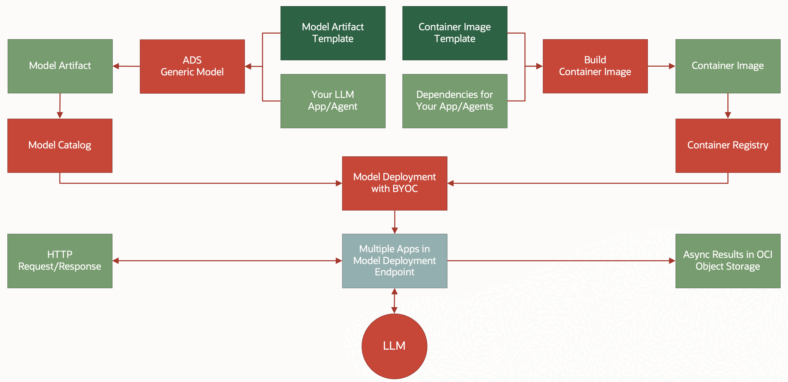

# Deploy LLM Apps and Agents with OCI Data Science

The integration of Large Language Models (LLMs) into various applications and agents has been a transformative step in AI. With the ability to process and understand vast amounts of data from APIs, LLMs are revolutionizing the way we interact with technology. Oracle Cloud Infrastructure (OCI) Data Science provides a robust platform for deploying these sophisticated models, making it easier for developers and data scientists to bring their LLM-powered applications to life.

The process of deploying LLM apps and agents involves:
1. Prepare your applications as model artifact
2. Register the model artifact with OCI Data Science Model Catalog
3. Build container image with dependencies, and push the image to OCI Container Registry
4. Deploy the model artifact using the container image with OCI Data Science Model Deployment



## IAM Policies

Make sure you have the [Model Deployment Policies](https://docs.oracle.com/en-us/iaas/data-science/using/model-dep-policies-auth.htm) configured. In addition, you may need the following policies:
* `manage generative-ai-family` for using the LLM from generative AI service.
* `manage objects` for saving results to object storage.

## Prepare Model Artifact

You can use Oracle ADS to prepare the model artifact.

First, create a template folder locally with the [`score.py`](model_artifacts/score.py) file. For example, we can call it `llm_apps_template`.
```
llm_apps_template
 ├── score.py
```
The `score.py` serves as an agent for invoking your application with JSON payload.

Next, you can use ADS to create a [`generic model`](https://accelerated-data-science.readthedocs.io/en/latest/user_guide/model_registration/frameworks/genericmodel.html) and save a copy of the template to `my_apps` folder:
```python
from ads.model.generic_model import GenericModel

generic_model = GenericModel.from_model_artifact(
    uri="llm_apps_template", # Contains the model artifact templates
    artifact_dir="my_apps",  # Location for the new model artifacts
    model_input_serializer="cloudpickle"
)
generic_model.reload_runtime_info()
```

Then, you can add your own applications to the `my_apps` folder. Here are some requirements:
* Each application should be a Python module.
* Each module should have an `invoke()` function as the entrypoint.
* The `invoke()` function should take a dictionary and return another dictionary.

You can find a few example applications in the [model_artifacts](model_artifacts).

Once you added your application, you can call the `verify()` function to test it locally:
```python
generic_model.verify({
    "inputs": "How much is $80 USD in yen?",
    "module": "exchange_rate.py"
})
```

Note that with the default `score.py` template, you will invoke your application with two keys:
* `module`: The module in the model artifact (`my_apps` folder) containing the application to be invoked. Here we are using the [exchange_rate.py](model_artifacts/exchange_rate.py) example. You can specify a default module using the `DEFAULT_MODULE` environment variables.
* `inputs`: the value should be the payload for your application module. This example uses a string. However, you can use list or other JSON payload for your application.

The response will have the following format:
```json
{
    "outputs": "The outputs returned by invoking your app/agent",
    "error": "Error message, if any.",
    "traceback": "Traceback, if any.",
    "id": "The ID for identifying the request.",
}
```

If there is an error when invoking your app/agent, the error message along with the traceback will be returned in the response.

## Register the Model Artifact

Once your apps and agents are ready, you need save it to OCI Data Science Model Catalog before deployment:
```python
generic_model.save(display_name="LLM Apps", ignore_introspection=True)
```

## Build Container Image

Before deploying the model, you will need to build a container image with the dependencies for your apps and agents.

To configure your environment for pushing image to OCI container registry (OCIR). Please refer to the OCIR documentation for [Pushing Images Using the Docker CLI](https://docs.oracle.com/en-us/iaas/Content/Registry/Tasks/registrypushingimagesusingthedockercli.htm).

The [container](container) directory contains files for building a container image for OCI Data Model Deployment service. You can add your dependencies into the [`requirement.txt`](container/requirements.txt) file. You may also modify the [`Dockerfile`](container/Dockerfile) if you need to add system libraries.

```bash
docker build -t <image-name:tag> .
```

Once the image is built, you can push it to OCI container registry.
```bash
docker push <image-name:tag>
```

## Deploy as Model Deployment

To deploy the model, simply call the `deploy()` function with your settings:
* For most application, a CPU shape would be sufficient.
* Specify log group and log OCID to enable logging for the deployment.
* [Custom networking](https://docs.oracle.com/en-us/iaas/data-science/using/model-dep-create-cus-net.htm) with internet access is required for accessing external APIs or OCI Generative AI APIs in a different region.
* Add environments variables as needed by your application, including any API keys or endpoints.
* You may set the `DEFAULT_MODULE` for invoking the default app

```python
import os

generic_model.deploy(
    display_name="LLM Apps",
    deployment_instance_shape="VM.Standard.E4.Flex",
    deployment_log_group_id="<log_group_ocid>",
    deployment_predict_log_id="<log_ocid>",
    deployment_access_log_id="<log_ocid>",
    deployment_image="<image-name:tag>",
    # Custom networking with internet access is needed for external API calls.
    deployment_instance_subnet_id="<subnet_ocid>",
    # Add environments variables as needed by your application.
    # Following are just examples
    environment_variables={
        "TAVILY_API_KEY": os.environ["TAVILY_API_KEY"],
        "PROJECT_COMPARTMENT_OCID": os.environ["PROJECT_COMPARTMENT_OCID"],
        "LLM_ENDPOINT": os.environ["LLM_ENDPOINT"],
        "DEFAULT_MODULE": "app.py",
    }
)
```

## Invoking the Model Deployment

Once the deployment is active, you can invoke the application with HTTP requests. For example, with the [exchange_rate.py](model_artifacts/exchange_rate.py) agent:
```python
import oci
import requests

response = requests.post(
    endpoint,
    json={
        "inputs": "How much is $50 USD in yen?.",
        "module": "exchange_rate.py"
    },
    auth=oci.auth.signers.get_resource_principals_signer()
)
response.json()
```

The response will be similar to the following:
```python
{
    'error': None,
    'id': 'fa3d7111-326f-4736-a8f4-ed5b21654534',
    'outputs': {
        'input': 'How much is $50 USD in yen?.',
        'output': ' The exchange rate for USD to JPY is 151.000203. So, $50 USD is approximately 7550.01 JPY.'
    },
    'traceback': None
}
```

Note that the model deployment has a timeout limit of 1 minute for the HTTP requests.
The [`score.py`](model_artifacts/score.py) allows you to specify an `async` argument to save the results to an OCI object storage location.
For example:
```python
import oci
import requests

response = requests.post(
    endpoint,
    json={
        "inputs": "",
        "module": "long_running.py",
        # Use async argument to specify a location for saving the response as JSON
        "async": "oci://bucket@namespace/prefix"
    },
    auth=oci.auth.signers.get_resource_principals_signer()
)
# The response here will have an ID and a URI for the output JSON file.
async_data = response.json()
async_data
```

When the `async` argument is specified, the endpoint will return a response without waiting for the app/agent to complete running the task.
```python
{
    'id': 'bd67c258-69d0-4857-a3aa-6bc2836ba99d',
    'outputs': 'oci://bucket@namespace/prefix/bd67c258-69d0-4857-a3aa-6bc2836ba99d.json'
}
```
The app/agent will continue work until it finishes, and then save the response as a JSON file into the URI in the `outputs`.

You can use [fsspec](https://filesystem-spec.readthedocs.io/en/latest/) with [ocifs](https://ocifs.readthedocs.io/en/latest/) to check the object storage location and load it once the file is ready.
```python
import json
import time
import fsspec

fs = fsspec.filesystem("oci")
while not fs.exists(async_data.get("outputs")):
    time.sleep(10)
    
with fsspec.open(async_data.get("outputs")) as f:
    results = json.load(f)

# results will contain the final response.
results
```
