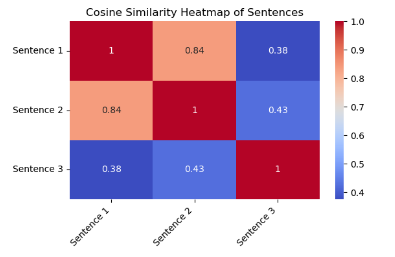

# Deploying embedding models with Text Embedding Inference on OCI MD

Hugging Face's [text-embeddings-inference](https://github.com/huggingface/text-embeddings-inference) (TEI) allows us to serve embedding models, and supports OpenAI spec for inference. 
TEI supports Nomic, BERT, CamemBERT, XLM-RoBERTa models with absolute positions, JinaBERT model with Alibi positions and 
Mistral, Alibaba GTE and Qwen2 models with Rope positions. TEI also supports sequence classification and re-ranking models, 
but the scope of this example is limited to deploying embedding models. 


TEI can serve more than 10k embedding models available on Hugging Face Hub, 
with support for most popular models. Currently, users can deploy any embedding model on OCI Data Science platform 
supported by TEI. While TEI offers `/embed` endpoint as default method to get embeddings, the following example
will use the OpenAI compatible route, i.e. `/v1/embeddings`. For more details, check the list of endpoints available 
[here](https://huggingface.github.io/text-embeddings-inference/#/). 


## Overview
This guide demonstrates how to deploy and perform inference of embedding models with Oracle Data Science Service 
through a Bring Your Own Container (BYOC) approach. In this example, we will use a model downloaded from 
Hugging Face—specifically, `BAAI/bge-base-en-v1.5`, and the container is powered by Text Embedding Inference (TEI).


## Pre-Requisites
To be able to run the example on this page, ensure you have access to Oracle Data Science notebook in your tenancy. 

### Required IAM Policies

Add these [policies](https://github.com/oracle-samples/oci-data-science-ai-samples/tree/main/model-deployment/containers/llama2#required-iam-policies) 
to grant access to OCI services.

### Install Desktop Container Management

This example requires a desktop tool to build, run, launch and push the containers. We support:

* [Docker Desktop](https://docs.docker.com/get-docker)
* [Rancher Desktop](https://rancherdesktop.io/)


## Prepare Inference Container
TEI ships with multiple docker images that we can use to deploy an embedding model in OCI Data Science platform. 
For more details on images, visit the official Github repository section 
[here](https://github.com/huggingface/text-embeddings-inference/tree/main?tab=readme-ov-file#docker-images). 
Here, we show an example with one of the images. Run the following in the desktop when docker is installed.

```
docker pull ghcr.io/huggingface/text-embeddings-inference:1.5.0
```

Currently, OCI Data Science Model Deployment only supports container images residing in the OCI Registry. 
Before we can push the pulled TEI container, make sure you have created a repository in your tenancy. 

* Go to your tenancy Container Registry
* Click on the Create repository button
* Select Private under Access types
* Set a name for Repository name. We are using "text-embeddings-inference" in the example.
* Click on Create button

You may need to docker login to the Oracle Cloud Container Registry (OCIR) first, if you haven't done so before in 
order to push the image. To login, you have to use your API Auth Token that can be created under your 
Oracle Cloud Account->Auth Token. You need to login only once. Replace with the OCI region you are using.

```
docker login -u '<tenant-namespace>/<username>' <region>.ocir.io
```

If your tenancy is federated with Oracle Identity Cloud Service, use the format /oracleidentitycloudservice/. 
You can then push the container image to the OCI Registry.

```
docker tag ghcr.io/huggingface/text-embeddings-inference:1.5.0 <region>.ocir.io/<tenancy>/text-embeddings-inference:1.5.0
docker push <region>.ocir.io/<tenancy>/text-embeddings-inference:1.5.0
```

## Setup

Install dependencies in the notebook session. This is needed to prepare the artifacts, create a model
and deploy it in OCI Data Science.

Run this in the terminal in a notebook session:
```
# install and/or update required python packages
 pip install oracle-ads oci huggingface_hub -U
```

## Prepare the model artifacts

To prepare model artifacts for deployment:

* Download the model files from Hugging Face to local directory using a valid Hugging Face token (only needed for gated models). If you don't have a Hugging Face Token, refer [this](https://huggingface.co/docs/hub/en/security-tokens) to generate one.
* Upload the model folder to a [versioned bucket](https://docs.oracle.com/en-us/iaas/Content/Object/Tasks/usingversioning.htm) in Oracle Object Storage. If you don’t have an Object Storage bucket, create one using the OCI SDK or the Console. Make a note of the namespace, compartment, and bucketname. Configure the policies to allow the Data Science service to read and write the model artifact to the Object Storage bucket in your tenancy. An administrator must configure the policies in IAM in the Console.
* Create model catalog entry for the model using the Object storage path.

## Downloading model from Hugging Face Hub

You can refer to [HuggingFace Hub documentation](https://huggingface.co/docs/hub/en/index) for details. Here, we'll deploy one of the most popular embedding models from the hub that is supported by TEI.

Run this in the terminal in a notebook session:
```
# Login to huggingface
huggingface-cli login --token "<your-huggingface-token>"
 
# download the model to local folder. Here, BAAI/bge-base-en-v1.5 can be replaced by other models available on Hugging Face Hub.
huggingface-cli download BAAI/bge-base-en-v1.5 --local-dir BAAI/bge-base-en-v1.5
```

## Upload Model to OCI Object Storage

Once models are downloaded, use the terminal to upload the artifacts to object storage. Make sure that the bucket is versioned as mentioned above.

Run this in the terminal in a notebook session:
```
oci os object bulk-upload -bn <bucket> -ns <namespace> --auth resource_principal --prefix BAAI/bge-base-en-v1.5/ --src-dir BAAI/bge-base-en-v1.5/ --no-overwrite
```

## Create Model by reference using ADS

Create a notebook using the default Python kernel with the Python library specified in the setup section. 

We first set up the variables needed for creating and deploying the model.
```
import ads
ads.set_auth("resource_principal")
 
# Extract region information from the Notebook environment variables and signer.
region = ads.common.utils.extract_region()
 
hf_model_name = "BAAI/bge-base-en-v1.5"
artifact_path = f"oci://<bucket>@<namespace>/{hf_model_name}"
project_id="<project_ocid>"
compartment_id = "<compartment_ocid>"
 
log_group_id = "ocid1.loggroup.oc1.xxx.xxxxx"
log_id = "cid1.log.oc1.xxx.xxxxx"
 
instance_shape = "VM.GPU.A10.1"
container_image = "<region>.ocir.io/<tenancy>/text-embeddings-inference:1.5.0"
```

Next, create a model catalog entry with the artifact in the object storage bucket where it was uploaded.
```
from ads.model.datascience_model import DataScienceModel
 
model = (DataScienceModel()
        .with_compartment_id(compartment_id)
        .with_project_id(project_id)
        .with_display_name(hf_model_name)
        .with_artifact(artifact_path)
        ).create(model_by_reference=True)
```

## Deploy embedding model

In order to deploy the model we just created, we set up the infrastructure and container runtime first.

### Import Model Deployment Modules

```
from ads.model.deployment import (
    ModelDeployment,
    ModelDeploymentContainerRuntime,
    ModelDeploymentInfrastructure,
    ModelDeploymentMode,
)
```

### Setup Model Deployment Infrastructure

```
infrastructure = (
    ModelDeploymentInfrastructure()
    .with_project_id(project_id)
    .with_compartment_id(compartment_id)
    .with_shape_name(instance_shape)
    .with_bandwidth_mbps(10)
    .with_replica(1)
    .with_web_concurrency(10)
    .with_access_log(
        log_group_id=log_group_id,
        log_id=log_id,
    )
    .with_predict_log(
        log_group_id=log_group_id,
        log_id=log_id,
    )
)
```

### Configure Model Deployment Runtime

We set the `MODEL_DEPLOY_PREDICT_ENDPOINT` endpoint environment variable with `/v1/embeddings` so that we can 
access the corresponding endpoint from the TEI container. One additional configuration we need to add is `cmd_var`, which
specifies the location of artifacts that will be downloaded within model deployment. For models created by reference, the 
default artifact location is `/opt/ds/model/deployed_model/` and we need to append the object storage bucket prefix to this path.

```
env_var = {
    'MODEL_DEPLOY_PREDICT_ENDPOINT': '/v1/embeddings'
}
# note that the model path inside the container will have the format /opt/ds/model/deployed_model/{artifact_path_prefix}
cmd_var = ["--model-id", "/opt/ds/model/deployed_model/BAAI/bge-base-en-v1.5/", "--port", "8080", "--hostname", "0.0.0.0"]
 
container_runtime = (
    ModelDeploymentContainerRuntime()
    .with_image(container_image)
    .with_server_port(8080)
    .with_health_check_port(8080)
    .with_env(env_var)
    .with_cmd(cmd_var)
    .with_deployment_mode(ModelDeploymentMode.HTTPS)
    .with_model_uri(model.id)
    .with_region(region)
)
```

### Deploy Model Using Container Runtime

Once the infrastructure and runtime is configured, we can deploy the model. 
```
deployment = (
    ModelDeployment()
    .with_display_name(f"{hf_model_name} with TEI docker container")
    .with_description(f"Deployment of {hf_model_name} MD with text-embeddings-inference:1.5.0 container")
    .with_infrastructure(infrastructure)
    .with_runtime(container_runtime)
).deploy(wait_for_completion=False)
```

## Inference

Once the model deployment has reached the Active state, we can invoke the model deployment endpoint to interact with the LLM. 
More details on different ways for accessing MD endpoints is documented [here](https://github.com/oracle-samples/oci-data-science-ai-samples/blob/main/ai-quick-actions/model-deployment-tips.md#inferencing-model).

```
import requests
 
sentences = ["The car sped down the highway at an incredible speed.", "A vehicle raced along the freeway, moving very fast.", "The child was playing in the park with a ball."]
endpoint = f"https://modeldeployment.{region}.oci.customer-oci.com/{deployment.model_deployment_id}/predict"
 
response = requests.post(
    endpoint,
    json={
        "input":sentences
    },
    auth=ads.common.auth.default_signer()["signer"],
    headers={},
).json()
```

The raw output (response) has an array of three lists with embedding for the above three sentences.  

```
{'object': 'list',
 'data': [{'object': 'embedding',
   'embedding': [-0.00735207,
    -0.045759525,
    0.061242294,
    0.013910536,
    0.048454784,
    -0.0059445454,
    0.007921069,
    0.029093834,
    0.04836494,
    ...
    ...
    ...
    -0.005862751,
    0.055649005],
   'index': 2}],
 'model': '/opt/ds/model/deployed_model/BAAI/bge-base-en-v1.5/',
 'usage': {'prompt_tokens': 39, 'total_tokens': 39}}
```

## Testing Embeddings generated by the model

Here, we have 3 sentences - two of which have similar meaning, and the third one is distinct. We'll run a simple test to 
find how similar or dissimilar these sentences are, using cosine similarity as a comparison metric.

```
from sklearn.metrics.pairwise import cosine_similarity
import matplotlib.pyplot as plt
import seaborn as sns
 
embeddings = [sentence['embedding'] for sentence  in response['data']]
similarity_matrix = cosine_similarity(embeddings)
 
labels = [f"Sentence {i+1}" for i in range(len(sentences))]
 
# visualize the similarity matrix using a heatmap
plt.figure(figsize=(6, 4))
sns.heatmap(similarity_matrix, annot=True, cmap='coolwarm', xticklabels=labels, yticklabels=labels)
 
# add title and labels for better clarity
plt.title('Cosine Similarity Heatmap of Sentences')
plt.xticks(rotation=45, ha='right')
plt.yticks(rotation=0)
plt.tight_layout()
plt.show()
```




The above heatmap shows that the embedding model captures the semantic similarity between the first two sentences while distinguishing the third as different.
