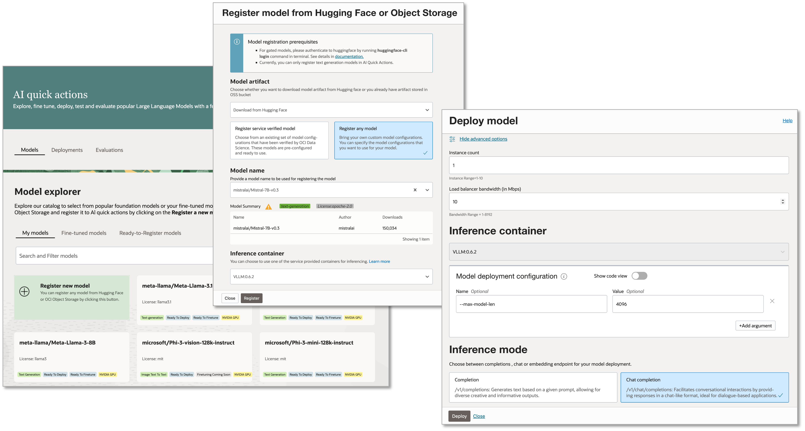

# Building Chatbot with LangGraph on OCI AI Platform

The integration of Large Language Models (LLMs) into various applications has revolutionized the way businesses interact with their customers. With the advent of chat models in [Data Science AI Quick Actions](https://www.oracle.com/artificial-intelligence/data-science/features/#ai-quick) and [integration with LangChain](https://accelerated-data-science.readthedocs.io/en/latest/user_guide/large_language_model/langchain_models.html), you can combine the power of Oracle Cloud Infrastructure (OCI) AI Platform and the open-source components from the [LangChain](https://www.langchain.com/) ecosystem to build AI-powered applications more effectively. [LangGraph](https://www.langchain.com/langgraph) is a sophisticated framework within the LangChain ecosystem, designed to enhance the precision and control in building agents capable of handling complex tasks. It offers a flexible API that supports various control flows and ensures reliability through moderation and quality loops. This tutorial guide you through the [LangChain chat models integration](https://accelerated-data-science.readthedocs.io/en/latest/user_guide/large_language_model/langchain_models.html#chat-models), including asynchronous call and streaming response, by building a Chatbot with LangGraph. The process involves leveraging the power of LLM deployed with AI Quick Actions and the conversational management capabilities of LangChain to create a seamless user experience.

## Register and Deploy a Chat Model

To get started, you will first register and [deploy a chat model](https://github.com/oracle-samples/oci-data-science-ai-samples/blob/main/ai-quick-actions/model-deployment-tips.md) like the [meta-llama/Llama-3.1-8B](https://huggingface.co/meta-llama/Llama-3.1-8B) or [mistralai/Mistral-7B-Instruct-v0.3](https://huggingface.co/mistralai/Mistral-7B-Instruct-v0.3) with OCI Data Science AI Quick Actions, which offers a streamlined way to deploy LLM models on the OCI. With just a few clicks, you can have your model up and running, taking advantage of the robust infrastructure and advanced capabilities of OCI. This quick deployment process allows you to focus on developing your application rather than managing the underlying infrastructure.



Check out the [AI Quick Actions](https://github.com/oracle-samples/oci-data-science-ai-samples/tree/main/ai-quick-actions) for step by step examples on [registering](https://github.com/oracle-samples/oci-data-science-ai-samples/blob/main/ai-quick-actions/register-tips.md) and [deploying](https://github.com/oracle-samples/oci-data-science-ai-samples/blob/main/ai-quick-actions/model-deployment-tips.md) a chat model. Make sure you select the "Chat Completion" in the inference mode (under advanced options) when deploying the model.

## Setup the Python Environment

The chat model integration requires **Python 3.9** or newer. In addition, you need to install the following dependencies:
```bash
pip install langgraph "langchain>=0.3" "langchain-community>=0.3" "langchain-openai>=0.2.3" "oracle-ads>2.12"
```

These tools will provide the foundational capabilities needed to build and deploy your AI-powered chat applications seamlessly.

## Initialize the Chat Model

[Oracle ADS](https://accelerated-data-science.readthedocs.io/en/latest/) provides the LangChain compatible components for building applications and agents, you can find the basic usage in the [documentation](https://accelerated-data-science.readthedocs.io/en/latest/user_guide/large_language_model/langchain_models.html#chat-models). With the LangChain compatible chat model components, you can build applications following the LangChain [Tutorials](https://python.langchain.com/docs/tutorials/) and [How-to Guides](https://python.langchain.com/docs/how_to/) and simply switch the LLM or Chat Model in the examples with the [ones provided by Oracle ADS](https://accelerated-data-science.readthedocs.io/en/latest/user_guide/large_language_model/langchain_models.html).

The chat model provides asynchronous and streaming capabilities, which are significant milestones for enhancing the interactivity and responsiveness of chat applications:
* Asynchronous invoke allow for non-blocking operations, meaning that your application can process other tasks while waiting for a chat response. This is particularly beneficial in scenarios where multiple users are interacting with the application simultaneously, ensuring a smooth and efficient user experience.
* Streaming, on the other hand, refers to the ability to send and receive chat messages in real-time, as they are being generated. This feature is crucial for applications that require immediate feedback, such as live customer support or interactive gaming.

The follow code initializes the chat model and uses resource principal as authentication method:
```python
import ads
from ads.llm import ChatOCIModelDeployment
 
# Use resource principals for authentication
ads.set_auth(auth="resource_principal")
 
# Initialize the chat model with streaming support
llm = ChatOCIModelDeployment(
    model="odsc-llm",
    endpoint="OCI_MODEL_DEPLOYMENT_URL",
    # Optionally you can specify additional keyword arguments for the model.
    max_tokens=1024,
    # Enable streaming
    streaming=True
)
```

Make sure you replace the OCI_MODEL_DEPLOYMENT_URL with the actual model deployment URL. The integration supports several authentication methods equivalent to those used with other OCI services, including API Key, session token, instance principal, and resource principal. For more details on authentication options, check out the documentation [here](https://accelerated-data-science.readthedocs.io/en/latest/user_guide/cli/authentication.html).

# Building a Chatbot

Following the the [LangChain tutorial](https://python.langchain.com/docs/tutorials/chatbot/), you can build a LangGraph chatbot with memory, which can handle conversations with many different users and answer questions based on the chat history:
```python
# Chatbot with memory handling conversation with many users
 
from langgraph.checkpoint.memory import MemorySaver
from langgraph.graph import START, MessagesState, StateGraph
from langchain_core.runnables import RunnableConfig
 
 
# Define the function for invoking the model
async def invoke_model(state: MessagesState, config: RunnableConfig):
    response = await llm.ainvoke(state["messages"], config=config)
    return {"messages": response}
 
# Define the graph
workflow = StateGraph(state_schema=MessagesState)
workflow.add_edge(START, "model")
workflow.add_node("model", invoke_model)
 
# Compile the model with memory
memory = MemorySaver()
app = workflow.compile(checkpointer=memory)
```

To invoke this app, let's simulate independent conversations from two users:
1. Bob, who lives in San Francisco
2. Mary, who lives in Manhattan

We will use the user's name as the session ID for identifying the conversations.
```python
# User messages to start the conversation
user_messages = [
    ("bob", "Hi! I'am Bob. I live in San Francisco."),
    ("mary", "Hello! I am Mary. My home is in downtown Manhattan.")
]
```

The following code starts the independent conversations by sending the above messages to the chatbot app. Since the chatbot is invoked asynchronously, you can do some other work in the application while waiting for the response from the chatbot.
```python
# Send the messages and save the conversation tasks
conversations = []
for session_id, user_message in user_messages:
    config = {"configurable": {"thread_id": session_id}}
    conversations.append(app.ainvoke({"messages": user_message}, config=config))
 
# You can do some other work while the LLM is generating the response.
 
# Print the responses from the chatbot
for conversation in conversations:
    output = await conversation
    output["messages"][-1].pretty_print()
```

Here are some example outputs from the Mistral model:
```
================================== Ai Message ==================================
 
 Hello Bob! It's nice to meet you. San Francisco is a beautiful city with a lot to offer. Is there anything specific you'd like to know or discuss? I'm here to help with questions, provide information, or just chat if you'd like.
================================== Ai Message ==================================
 
 Hello Mary! It's nice to meet you. I hope you're enjoying life in downtown Manhattan. If you ever need recommendations for local attractions, restaurants, or events, feel free to ask!
```

Now the chatbot knows both users, we can ask the same question with different session config so that the chatbot can answer the question based on the user's location. Before we ask the question, to better demonstrate the asynchronous invoking and streaming feature, we can write a simple function in Jupyter notebook to stream the response from the chatbot asynchronously.
```python
import asyncio
import time
 
# Use the event loop to run two async tasks in separate cells in the same time
loop = asyncio.get_event_loop()
 
async def stream_response(session_id, message):
    # For demo purpose, wait 2 seconds before calling LLM
    time.sleep(2)
    # Setup config with session_id
    config = {"configurable": {"thread_id": session_id}}
    # Stream the LLM output async
    async for msg, _ in app.astream({"messages": message}, config=config, stream_mode="messages"):
        if msg.content and not isinstance(msg, HumanMessage):
            print(msg.content, end="", flush=True)
```

Let's simulate Bob and Mary both asking the chatbot about driving to the Oracle headquarters, Austin, at the same time:


We can see that even though we did not mention anything about the users in the question, the chatbot is able to give answers based on the chat history. The asynchronous invocation allows multiple conversations happening at the same time and the streaming feature makes the application feel responsive. For more details and advanced configurations, see the LangChain tutorial: [Build a Chatbot](https://python.langchain.com/docs/tutorials/chatbot/).
