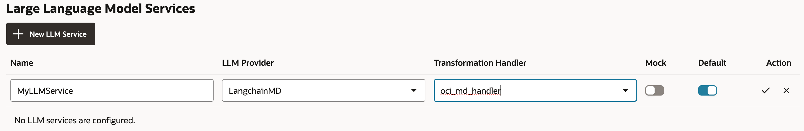
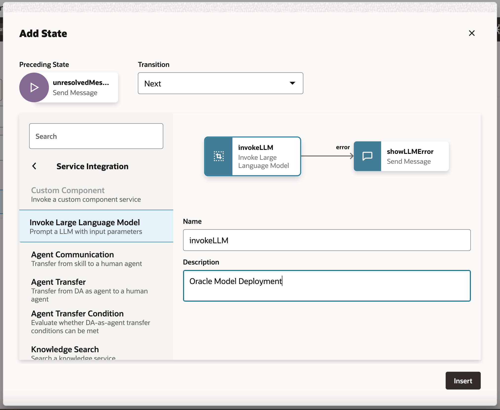
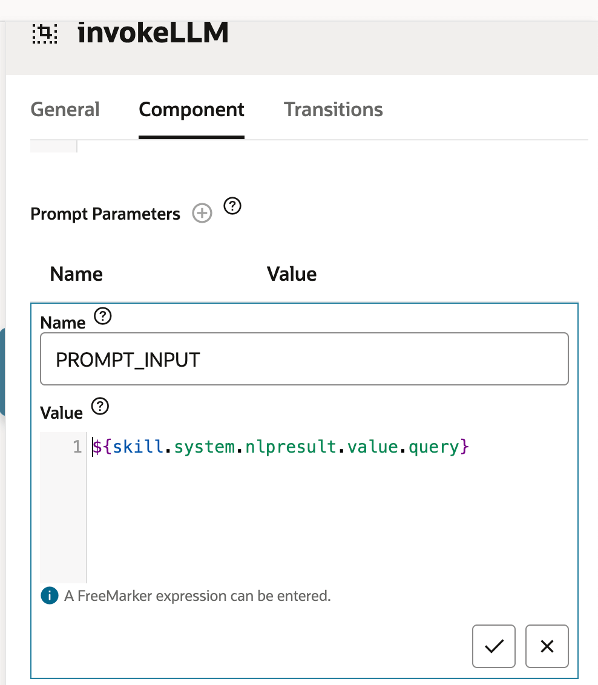
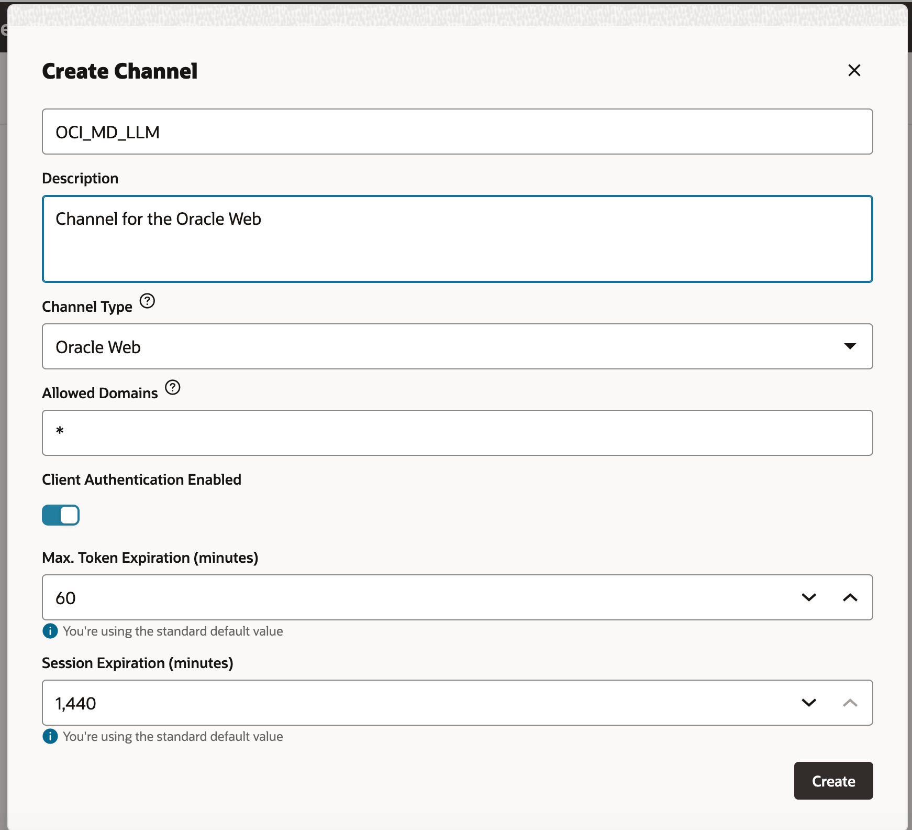

## Introduction

In today's digital landscape, chatbots are evolving to become more intelligent, responsive, and capable of handling complex interactions. In this blog, we delve into the creation of a next-generation chatbot by harnessing the power of Oracle Data Science capabilities like AI Quick Actions and Model Deployment, Mistral-7B-Instruct-v0.2, Oracle Database 23ai, LangChain, and Oracle Digital Assistant. Each of these technologies brings unique strengths to the table, enabling us to build a chatbot that not only understands and responds to user queries with remarkable accuracy but also offers a seamless and engaging conversational experience.

One of the standout features of Oracle Database 23ai is its advanced vector search capabilities. This technology allows for efficient retrieval of information by converting text into high-dimensional vectors, which are then compared for relevance. When integrated into the RAG pipeline, Oracle Database 23ai's vector search enhances the chatbot's ability to access and deliver the most pertinent information from vast datasets. This ensures that the responses generated are not only contextually accurate but also highly relevant to the user's query.

Oracle Digital Assistant further elevates the chatbot's functionality by providing a robust platform for building, deploying, and managing conversational AI solutions. It offers pre-built connectors, natural language understanding (NLU), and dialogue management, which streamline the development process and ensure a smooth user experience. The combination of Oracle Digital Assistant with the RAG pipeline enables the chatbot to handle complex interactions and maintain a natural flow of conversation, thereby improving user engagement and satisfaction.

By leveraging the synergy of Oracle Database 23ai and Oracle Digital Assistant within the RAG pipeline, developers can create a chatbot that excels in both retrieval accuracy and conversational fluidity. This integrated approach not only reduces the time and effort required to build sophisticated chatbots but also results in a solution that is scalable, efficient, and capable of delivering superior user experiences. Whether you're a developer, a tech enthusiast, or a business leader looking to enhance customer engagement, this guide will equip you with the knowledge and tools to build an advanced chatbot that stands out in the crowded digital arena.

### Use Cases
Here are few sample use cases where this can be useful for example.
* Personalized customer support - querying both guide books as well as customer history can create a better view of the customer's issues and help diagnose and solve the problem faster.
* Supply chain optimization - querying vendor data with internal business ordering/shipping data can result in better decision making and faster response to changes in the supply chain.
* Optimize Sales - query CRM data to identify high-potential leads and suggest strategies to increase deal closing probability.

### Benefits of Oracle AI Vector Search
Oracle Database is a leading repository of operational and enterprise data. Enterprise applications usually need to search a combination of business data and unstructured data.  For example, a retail website could feature searches based on a natural language product description and a target product image, along with other filters, such as price, store location, manufacturer, and current availability. This search requires simultaneously searching unstructured catalog data (product description and image), structured catalog data (price, store location and manufacturer) as well as real time transactional data (such as current inventory).

## High Level Solution Overview

High Level Architecture


Figure: A High Level Architecture of RAG Pipeline

### Steps
The above diagram illustrates the architecture and workflow of building an advanced chatbot using Mistral-7B-Instruct-v0.2, Oracle Database 23ai, RAG, LangChain, and Oracle Digital Assistant. Here are the detailed steps involved based on the diagram:

1.  **User Interaction** - The user sends a request to the chatbot via the Oracle Digital Assistant interface.
2.  **Request Handling** - The Digital Assistant receives the request and forwards it to the OCI Data Science infrastructure.
3.  **Query processing**  - There are 2 steps that are involved. These are:
    *   Within OCI Data Science, the request is routed to LangChain, which acts as the orchestrator for managing the interaction between various model deployments.
    *   LangChain processes the request and identifies the need for information retrieval from external documents and enterprise data
4.  **Vectorization** - In this process there are following sub-process involved:
    *   The request is sent to an embedding model deployment, which transforms the query into a high-dimensional vector representation.
    *   This vectorized query is then sent to Oracle Database 23ai for vector search
5.  **Data Retrieval**  - This step involves the following sub-processes
    *   Oracle Database 23ai performs a vector search against both enterprise data and external document vectors (HTML/PDF).
    *   Relevant documents and data vectors are retrieved and sent back to OCI Data Science.
6.  **Re-ranking**
    *   The generated response may be further refined by a rerank model deployment.
    *   The rerank model evaluates and ranks the responses to ensure the most relevant and accurate response is selected.
7.  **Querying the External Models** - In this step the data is retrieved and generates a response. 
    *   The retrieved information is used to generate a query for the Mistral-7B-Instruct-v0.2 model deployment provisioned using AI Quick Actions features in OCI Data Science.
    *   The  Mistral-7B-Instruct-v0.2 model processes the query and generates a response based on its training and the retrieved context.
8.  **Response Generation** - The refined response is sent back to LangChain, which consolidates the final output.
9.  **Returning the Response to the user**
    *   The final response is returned to the Digital Assistant.
    *   The Digital Assistant then delivers the response to the user.


Lets get started with the next steps .

## Getting Started

### Pre-requisites

The key prerequisites that you would need to setup before you can proceed to run the distributed fine-tuning process on Oracle Cloud Infrastructure Data Science Service.

*   Policies - the following policies are needed
    *   [Data science Policies](https://docs.oracle.com/en-us/iaas/data-science/using/policies.htm)
    *   [Model catalog policies](https://docs.oracle.com/en-us/iaas/data-science/using/models-about.htm)
*   [Configure custom subnet](https://github.com/oracle-samples/oci-data-science-ai-samples/tree/main/distributed_training#1-networking) \- with security list to allow ingress into any port from the IPs originating within the CIDR block of the subnet. This is to ensure that the hosts on the subnet can connect to each other during distributed training.
*   [Set the policies](https://github.com/oracle-samples/oci-data-science-ai-samples/tree/main/distributed_training#3-oci-policies) \- to allow the OCI Data Science Service resources to access object storage buckets, networking and others
*   [Access token from HuggingFace](https://huggingface.co/docs/hub/security-tokens) to download Mistral-7B-Instruct-v0.2 model. To fine-tune the model, you will first need to access the pre-trained model. The pre-trained model can be obtained from [Meta](https://ai.meta.com/resources/models-and-libraries/llama-downloads/) or [HuggingFace](https://huggingface.co/models?sort=trending&search=meta-llama%2Fllama-2). In this example, we will use the [HuggingFace access token](https://huggingface.co/docs/hub/security-tokens) to download the pre-trained model from HuggingFace (by setting the **HUGGING\_FACE\_HUB\_TOKEN** environment variable).
*   Log group and log from logging service. This will be used to monitor the progress of the training
    *   Go to the [OCI Logging Service](https://cloud.oracle.com/logging/log-groups) and select `Log Groups`
    *   Either select one of the existing Log Groups or create a new one
    *   In the log group create _**two**_ `Log`, one predict log and one access log, like:
        *   Click on the `Create custom log`
        *   Specify a name (predict|access) and select the log group you want to use
        *   Under `Create agent configuration` select `Add configuration later`
        *   Then click `Create agent configuration`
*   [Notebook session](https://docs.oracle.com/en-us/iaas/data-science/using/manage-notebook-sessions.htm) - used to initiate the distributed training and to access the fine-tuned model
*   Install the latest version of [oracle-ads](https://accelerated-data-science.readthedocs.io/en/latest/index.html) \- `pip install oracle-ads[opctl] -U`

### Step 1: Deploying Required Models

#### Deploying the Mistral-7B-Instruct-v0.2 Model

We would be leveraging [AI quick actions Model deployment feature](https://docs.oracle.com/en-us/iaas/data-science/using/ai-quick-actions-model-deploy.htm), to deploy Mistral-7B-Instruct-v0.2 with a few clicks.  The AI Quick actions model deployment would aid users to deploy the Mistral-7B-Instruct-v0.2 with a few clicks and provide users with an endpoint.


#### Deploying Jina Embedding Model

* In Notebook copy Jine Embedding model files from [https://huggingface.co/jinaai/jina-embeddings-v2-base-en/tree/main](https://huggingface.co/jinaai/jina-embeddings-v2-base-en/tree/main) to ads\_embedding\_model\_dir directory.
* Upload [score.py](images/score.py) this to current directory (e.g. /home/datascience/)
* Execute below code

```py
import tempfile
import ads
from ads.model.generic_model import GenericModel
from config import CONDA_PACK_PATH, LOG_GROUP_ID, EMBEDDING_MODEL_ACCESS_LOG_LOG_ID, EMBEDDING_MODEL_PREDICT_LOG_LOG_ID
ads.set_auth("resource_principal")
embedding_model = GenericModel( model_file_name="model-w-mean-pooling.onnx" ,artifact_dir="ads-embedding_test",estimator=None, serialize=False)
embedding_model.summary_status()

embedding_model.prepare(
        inference_conda_env=CONDA_PACK_PATH,
        inference_python_version = "3.9",
        model_file_name="model.onnx",
        score_py_uri= "score.py",
        force_overwrite=True
     )
op=embedding_model.verify(['Can you please give some overview on Oracle Database 23.4'])
print(op['embeddings']);

embedding_model.save(display_name="jina-embedding")
embedding_md = embedding_model.deploy(
    display_name = "Jina Embedding Model Deployment",
    deployment_log_group_id = LOG_GROUP_ID,
    deployment_access_log_id = EMBEDDING_MODEL_ACCESS_LOG_LOG_ID,
    deployment_predict_log_id = EMBEDDING_MODEL_PREDICT_LOG_LOG_ID,
)
output = embedding_md.predict(['Can you please give some overview on Oracle Database 23.4'])
print(output['embeddings']);
```

#### Deploying Bge-Reranker Model

```py
import ads
from FlagEmbedding import FlagReranker
from ads.model.generic_model import GenericModel
from ads.model.model_metadata import MetadataCustomCategory
from config import CONDA_PACK_PATH, LOG_GROUP_ID, RERANKER_MODEL_ACCESS_LOG_LOG_ID, RERANKER_MODEL_PREDICT_LOG_LOG_ID

#
# This custom class wrap the reranker model
#
class Reranker:
    def __init__(self, model_id):
        self.model_id = model_id
        self.reranker = FlagReranker(self.model_id, use_fp16=True)

    def predict(self, x):
        # x is expected as a list of list of str
        # [["x1", "x2"]] -> y = [score12]
        scores = self.reranker.compute_score(x)

        return scores
reranker_model = Reranker(model_id="BAAI/bge-reranker-large")
reranker_payload = [
    ["what is panda?", "It is an animal living in China. In the future model input will be serialized by.In the future model input will be serialized by.In the future model input will be serialized by"],
    ["what is panda?", "The giant panda is a bear species endemic to China.In the future model input will be serialized by.In the future model input will be serialized by.In the future model input will be serialized by.In the future model input will be serialized by"],
]
reranker_model.predict(reranker_payload)

reranker_generic_model = GenericModel(estimator=reranker_model, artifact_dir="./reranker_dir")
reranker_generic_model.summary_status()
reranker_generic_model.prepare(
    reload=False,
    inference_conda_env=CONDA_PACK_PATH,
    inference_python_version="3.9",
    model_file_name="reranker.pkl",
    force_overwrite=True
)

reranker_generic_model.save(
    display_name="reranker2-baai-large",
    bucket_uri="oci://reranker_bucket@bigdatadatasciencelarge/reranker/",
    ignore_introspection=True
)

reranker_md = reranker_generic_model.deploy(
    display_name = "reranker2-baai-large",
    deployment_log_group_id = LOG_GROUP_ID,
    deployment_access_log_id = RERANKER_MODEL_ACCESS_LOG_LOG_ID,
    deployment_predict_log_id = RERANKER_MODEL_PREDICT_LOG_LOG_ID,
    deployment_instance_shape="VM.Standard2.4",
)
```

### Step 2: Setting up the Oracle Database 23ai

We will be utilizing the latest features of Oracle Database 23ai, specifically the AI Vector Search, for our use case. In this scenario, we will import the embeddings generated from the dataset into Oracle Database 23ai. When a user queries using the RAG, the response will be enhanced by supplying the LLMs with additional context. the below diagram shows some of benefits of using Oracle Database 23ai:


Figure: A illustration of Oracle Database 23ai Search Feature (source)

This will augment their knowledge, leading to responses that are more accurate and pertinent to the customer's inquiries To setup Oracle Database 23ai you can following the options mentioned below:

*   Using a container instance as mentioned [here](https://docs.oracle.com/en-us/iaas/autonomous-database-serverless/doc/autonomous-docker-container.html)
*   using a python client

We will be using a hosted instance of Oracle Database 23ai to demonstrate the powerful features of Vector search.

### Step 3: Parsing, Chunking and Store Embedding In Oracle Database 23ai

Below snippet give high level overview how document gets parsed, how document gets converted into chunks and then how embedding will be stored in Oracle Database 23ai.

For detailed implementation, please refer [github repo](https://github.com/shekharchavan1990/oci-data-science-ai-samples/tree/oda_rag_poc/oda_examples/oda-oci-data-science-oracledb-23ai-llm).


**Initialize Oracle Database 23ai**

```py
def load_documents(embedding_model):
    # connect to db
    # Configure logging
    logging.basicConfig(
        level=logging.INFO, format="%(asctime)s - %(levelname)s - %(message)s"
    )
    logging.info("Connecting to Oracle DB...")

    DSN = f"{DB_HOST_IP}/{DB_SERVICE}"

    with oracledb.connect(user=DB_USER, password=DB_PWD, dsn=DSN) as connection:
        logging.info("Successfully connected to Oracle Database...")

        num_pages = []
        for book in INPUT_FILES:
            logging.info(f"Processing book: {book}...")

            if ENABLE_CHUNKING is False:
                # chunks are pages
                logging.info("Chunks are pages of the book...")
                nodes_text, nodes_id, pages_num = read_and_split_in_pages([book])
                num_pages.append(len(nodes_text))
            else:
                logging.info(f"Enabled chunking, chunck_size: {MAX_CHUNK_SIZE}...")
                nodes_text, nodes_id, pages_num = read_and_split_in_chunks([book])

                # create embeddings
                # process in batch (max 96 for batch, chosen BATCH_SIZE, see above)
                logging.info("Computing embeddings...")
                embeddings = compute_embeddings(embedding_model, nodes_text)

                # determine book_id and save in table BOOKS
                logging.info("Registering document...")
                book_id = register_document(book, connection)

                # store embeddings
                # here we save in DB
                save_embeddings_in_db(embeddings, nodes_id, connection)

                # store text chunks (pages for now)
                save_chunks_in_db(nodes_text, nodes_id, pages_num, book_id, connection)

                # a txn is a book
                connection.commit()
```


### Step 4: Connect to Mistral-7B-Instruct-v0.2 AI Quick Actions LLM

Create a Model deployment with AI Quick actions and get the model deployment endpoint from there. 

**Connect to LLM**

```py
import ads
ads.set_auth("resource_principal")

command_md = OCIModelDeploymentVLLM(
    endpoint="https://modeldeployment.eu-frankfurt-1.oci.customer-oci.com/ocid1.datasciencemodeldeployment.oc1.<ocid>/predict",
    model="odsc-llm"
)
```

### Step 5: Setting up RAG

The following RAG architecture, would consist of the following steps:

**Upload to 23ai Vector Database**

```py
class CustomRetriever(BaseRetriever):
    def _get_relevant_documents(
        self, query: str, *, run_manager: CallbackManagerForRetrieverRun
    ) -> List[Document]:
        matching_documents = []

        #Embedding model
        rps = oci.auth.signers.get_resource_principals_signer()
        prediction = requests.post(EMBEDDING_MD_ENDPOINT, data=f'["{query}"]', auth=rps)

        #Search in DB
        q_result = test_oracle_query(prediction.json()['embeddings'][0], TOP_K, True, False)
        text_list = []
        for n, id, sim in zip(q_result.nodes, q_result.ids, q_result.similarities):
            text_list.append(n.text)
        paired_list = [[query, text] for text in text_list]

        print(f'Reranker payload: {paired_list}')

        #ReRanker model
        reranker_results = requests.post(RERANKER_MD_ENDPOINT, data=json.dumps(paired_list), auth=rps)  # make a prediction request
        max_value = max(reranker_results.json()['prediction'])
        if max_value < -3:
            return matching_documents;
        # Find the index of the maximum value
        max_index = reranker_results.json()['prediction'].index(max_value)
        print(f"The maximum value is: {max_value}")
        print(f"The index of the maximum value is: {max_index}")
        doc =  Document(page_content=paired_list[max_index][1], metadata={"source": "local"})
        matching_documents.append(doc)
        return matching_documents

customRetriever = CustomRetriever()
chain = RetrievalQA.from_chain_type(
    llm=command_md,
    retriever=customRetriever
)

prompt = "Can you please give some overview on Oracle Database 23.4?"
res = chain(prompt)
print('Output::')
print(res['result'])
```

We use the prompt template and QA chain provided by Langchain to make the chatbot, this helps in passing the context and question directly to the LLM.

#### LangChain Model Deployment

```py
import tempfile
import ads
from ads.model.generic_model import GenericModel
from config import CONDA_PACK_PATH, LOG_GROUP_ID, LANGCHAIN_MODEL_ACCESS_LOG_LOG_ID, LANGCHAIN_MODEL_PREDICT_LOG_LOG_ID

ads.set_auth("resource_principal")

langchain_model = GenericModel( artifact_dir="langchain_model",estimator=None, serialize=False)
langchain_model.summary_status()
#Copy required python scripts to artifact dir
langchain_model.prepare(
        inference_conda_env=CONDA_PACK_PATH,
        inference_python_version = "3.9",
        model_file_name="test",
        score_py_uri= "score_langchain_final.py",
        force_overwrite=True
     )
op=langchain_model.verify('Can you please give some overview on Oracle Database 23.4?')
model_id = langchain_model.save(display_name="langchain-model")
deploy = langchain_model.deploy(
    display_name="Langchain Model Deployment",
    deployment_log_group_id = LOG_GROUP_ID,
    deployment_access_log_id = LANGCHAIN_MODEL_ACCESS_LOG_LOG_ID,
    deployment_predict_log_id = LANGCHAIN_MODEL_PREDICT_LOG_LOG_ID,
    environment_variables={"CRYPTOGRAPHY_OPENSSL_NO_LEGACY":"1"},
    deployment_instance_shape="VM.Standard2.4",
)
deploy.predict('Can you please give some overview on Oracle Database 23.4?')
```

### Step 6: Creating a Digital Assistant using ODA for chatbot app to host RAG

#### Get Model Deployment endpoint and add policy

Add a REST service to instance that calls the model's provider. We're using Oracle Model Deployment as an example, but we can you use a REST service for any LLM.


Add policy, so that Digital Assistant can access Model deployment predict endpoint.
Go to **Navigation menu** on top left corner --> **Identity & Security** --> **Policies** --> **Create Policy**


**Policies for dynamic group**

```py
Allow any-user to {DATA_SCIENCE_MODEL_DEPLOYMENT_PREDICT} in compartment Demo where request.principal.id='ocid1.odainstance.oc1.iad.<ocid>'
```

Once policy gets created, we can launch to Digital Assistant and open it in a browser.

### Create the LLM Provider REST Service

1.  With the Oracle Digital Assistant UI opened in browser. Go to **Navigation menu** on top left corner --> **Settings** \--> **API Services** 
2.  Open the **LLM Services** tab.
3.  Click **+Add LLM Service**.
4.  Complete the LLM Service Service dialog to create a POST operation to the provider's endpoint:
    *   **Name**: Enter an easily identifiable name for the service. You'll reference this name later on.
    *   **Endpoint**: Copy and and paste the Model Deployment endpoint.
    *   **Methods**: Select **POST**.
5.  Click **Create**.
    
6.  Complete the service by adding the API key, and the request and response payload samples:
    *   **Authentication Type**: Select **OCI Resource Principal**..
    *   POST request: Select **application/json** as the **Content Type**.
    *   **Body**: Add the payload sent to the request. For example:
        {
            "query": "Can you please give some overview on Oracle Database 23.4?"
        }

        
7.  Click **Test Request** to check for a 200 response.

    
    ------------------------------------------


### Create a Skill

With the LLM Provider REST Service added to the instance, now we need to create a skill that can call this service and connect users to it through its dialog flow definition.

To create this skill:

1.  With the Oracle Digital Assistant UI opened in browser. Go to **Navigation menu** on top left corner --> **Development** --> **\+Skills**
2.  Click the **\+ New Skill** button.

The Create Skill dialog appears.

1.  Add a name in the **Display Name** field.
2.  For the other fields, leave the default values. Note that the Dialog Mode is **Visual**.
3.  Click **Create**.
    

### Connect the Skill to the Model

We're now going to enable the skill to access the LLM REST service by creating a custom component with an event handler that transforms the REST payloads into formats that are accepted by both the LLM provider and Oracle Digital Assistant.

1.  Click **Components**  in the left nav-bar.

    

1.  Click **Add Service**.
2.  In the Create Service dialog:
    *   Enter a name that describes the service.
    *   Accept the default setting, **Embedded Container**.
    *   Select **New Component**.
    *   Select **LLM Transformation** from the Component Type drop down list.
    *   Enter a descriptive name in the Component Name field.
    *   Select **Custom** (located under **other**) from the Template drop down list.
3.  Click **Create**
    
4.  The completed component displays in the Components page.
    
5.  Select the component in the component page to check its deployment status. When Ready displays, you can move on to the next step.
    

    Ensure that **Service Enabled** (the default setting) is switched on.

    

### Map the LLM Service Provider and Oracle Digital Assistant Requests and Responses

The skill's requests to the model's service provider need to be transformed from the interface used by Oracle Digital Assistant, which is known as Common LLM Interface (CLMI) into the format that's accepted by the service provider. Likewise, the results returned from the service provider also need to be transformed into CLMI. To enable this mapping, the following REST service event handler methods must have provider-specific code:

*   `transformRequestPayload`
*   `transformResponsePayload`
*   `transformErrorResponsePayload`

To open the event handler code editor and update the transformation code (in this case, for Azure OpenAI):

1.  Expand the service. Then select the event handler.

    

2.  Click **Edit**  (located at the upper right) to open the editor.
    
3.  Code Editor
    
4.  Replace the \``` transformRequestPayload` `` handler event method code (around Lines 24-26) with the following:

    **transformRequestPayload**

    ```py
    transformRequestPayload: async (event, context) => {
          return { "query": event.payload.messages[event.payload.messages.length - 1].content };
        },
    ```

    Every request we just have to pass last user input to LLM prompt.
5.  Replace the \`transformResponsePayload`` ` `` handler event method code (around Lines 35-37) with the following:

    **transformRequestPayload**

    ```py
    transformResponsePayload: async (event, context) => {
         return { candidates: [ { "content": event.payload.prediction || "" }]};
       },
    ```

6.  Replace the \`transformErrorResponsePayload`` ` `` handler event method code (around Lines 47-49) with the following:

    **transformRequestPayload**

    ```py
    transformErrorResponsePayload: async (event, context) => {
    	let errorCode = 'unknown';
    	if (event.payload.error) {
    		if ( 'context_length_exceeded' === event.payload.error.code) {
    			errorCode = 'modelLengthExceeded'; }
    		else if ('content_filter' === event.payload.error.code) {
    			errorCode = 'flagged';
    		}
    		return {"errorCode" : errorCode, "errorMessage": event.payload.error.message};
    	}
    	return {"errorCode" : errorCode, "errorMessage": JSON.stringify(event.payload)};
    }
    ```

7.  Check the code syntax by clicking **Validate**. Use it to replace the code in the editor if you're encountering syntax errors that you can't fix.
    


8.  Click **Save**, then **Close**. Wait for the deployment to complete. When Ready displays, you can move on to the next step.

### Define the LLM Service for the Skill

To enable the skill to connect users to the model through the dialog flow, you need to create an LLM service that combines the instance-wide LLM service that calls the model with the transformation event handler (which in this case is for Oracle Model Deployment).

1.  Click **Settings**  in the left nav-bar.

    


2.  Open the Configuration page.

    


3.  In the Large Language Models Services section (located near the bottom of the page), click **+New LLM Service**.
    


4.  Complete the following fields:
    *   **Name**: Enter an easily identifiable name for the LLM service. You'll reference this name when you build the dialog flow in the next step.
    *   **LLM Service**: Select the name of the instance-wide LLM service that you created in [Task 1: Create the LLM Service for the Model](https://docs.oracle.com/en/cloud/paas/digital-assistant/tutorial-large-language-model/#task_one).
    *   **Transformation Handler**: Select the name of the event handler component that you created as part of the REST service in [Task 3: Connect the Skill to the Model](https://docs.oracle.com/en/cloud/paas/digital-assistant/tutorial-large-language-model/#task_three).
    *   Leave the remaining properties in their default settings. Note that **Default** is switched on (`true`) if this is the only service that you've created so far for this tutorial.
        

5.  Click **Save** (located at the right).

    

6.  Switch off Feedback and other default on switches.
    

### Integrate the Service

Now that the skill is connected to the LLM, we're now going to connect skill's users to the model by creating a dialog flow component that can call the model and tell it what to do.
The component conveys these instructions using a prompt, which is a block of human-readable text.
In this step, we'll provide this prompt, which instructs the model on evaluating user feedback as positive or negative, or neutral.

1.  Click **Flows**  in the left nav-bar.

    

2.  Select **unresolvedIntent**.

    

3.  In the unresolvedMessage state, click  and then select **Add State** from the menu.

    

4.  Select **Service Integration**.

5.  Select **Invoke Large Language Model**.

6.  Enter a description like Sentiment analysis. Then click **Insert**.

    

    The dialog flow now includes the unresolvedMessage (Send Message) state, invokeLLM state and the showLLMError state.

    

7.  In the unresolvedMessage state, click  and then select **Delete** from the menu. as we don't want to show error message for **UnresolvedIntent**
    

    The dialog flow now includes the invokeLLM state and the showLLMError state only.
    

8.  Open the invokeLLM state. In the Component page, select the LLM service that we have created from the last step.
    

9.  Add prompt that sends instructions to the LLM service by pasting the following into the Prompt field. Here we want all user conversation should get passed as Prompt Input.

    

10.  We need to create PROMPT\_INPUT variable. So, click on Prompt Parameters + sign, to add a new parameter and its value.
    

11.  Set **Use Streaming** is set to **False** so that the message is delivered in its entirety, not incrementally. 
    
12.  Test the Prompt with the **Prompt Builder.** Click on **Build Prompt**
    

13.  Add **Prompt Parameter Mock Value** and Click on **Generate Output.** This way we can validate LLM integration.
    

### Test the Prompt with the Skill Tester

1.  Open the Skill Tester by clicking **Preview** (located at the upper right).
    

2.  Enter the following request:
    _"Can you please give some overview on Oracle Database 23.4?"_

    The output may look something like this.
    

    Ask next query to LLM:
    _"latest oracle database"_

    The output may look something like this.
    


### Set Up the Oracle Web User Channel

We'll create a Digital Assistant user channel that enables an Oracle Web client to access skill. To ensure that only our web clients can use this channel, we'll configure it to require client authentication.

1.  With the Oracle Digital Assistant UI opened in browser. Go to **Navigation menu** on top left corner --> **Development** --> **Channels**
2.  Click **+Add Channel**.
3.  Complete the Channel dialog to create a POST operation to the provider's endpoint:
    *   **Name**: A unique name that begins with a letter and contains only letters, numbers, periods, and underscores (`_`). For example: OCI`_MD_LLM`.
    *   **Description (Optional)**: What the channel is used for.
    *   **Channel Type**: Select **Oracle Web**.
    *   **Allowed Domains:**
    *   **Client Authentication Enabled:** Switch off
4.  Click **Create**.
    
5.  Switch off **Client Authentication Enabled,** If not already. In above screenshot, I forgot to switch it of.
6.  In the **Route** To **drop-down list**, select the skill that we want to use. We have selected current skill i.e **LLM-MD-Skill**
7.  Switch **Channel** **Enabled** to On.
8.  Noted the **Channel Id** and **ODA Domain URI** without https, that are shown for this channel. 
    Later, we'll use these values in your web app and the token generator's routing configuration.

### Install the SDK

Download this ZIP and extract it to your local system. This ZIP includes a user guide that describes the SDK's classes and a sample app that demonstrates many of its features.

1.  Go to [ODA and OMC download page](https://www.oracle.com/downloads/cloud/amce-downloads.html)
2.  Go to **Oracle Native Client SDKs (for OCI Native environments) Web SDK** Section
3.  Click first row, 2nd column download icon. Current Version i.e [ODA Web SDK 24.06](https://www.oracle.com/downloads/cloud/amce-downloads.html).
4.  In **Platforms** column Select **GENRIC** from dropdown.
5.  Click to download latest oda js sdk i.e \`oda-native-client-sdk-js-24\_06 for (GENERIC (All Platforms)\`
     
6.  Extract the downloaded zip file.

### Test Oracle Web App

1.  Go to extracted ZIP folder of the downloaded Oracle Web SDK
2.  Go to `samples/web/settings.js`  file and Replace <URI> and <channelId> with actual value.
    Sample URI → oda-xxxxxxxxxxxxxxxxxxxxxxxxxxxxxxx-dax.data.digitalassistant.oci.oraclecloud.com
    Sample channelId → xxxxxxxx-xxxx-xxxx-xxxx-xxxxxxxxxxxx
3.  Also, make sure Client Authentication Enabled false.
    `let isClientAuthEnabled = false;` 
4.  Run `samples/web/index.html file on any browser.`
5.  Ignore the Index file contents. Directly click on chat icon.
    
6.  It will show **Oracle Assistant CONNECTED** status.
7.  We can start out conversation, like we did earlier with the Skill Tester
      
    

### Release on Oracle Compute Instance

1.  Create Oracle Compute Instance. Please refer [https://docs.oracle.com/en-us/iaas/Content/Compute/Tasks/launchinginstance.htm](https://docs.oracle.com/en-us/iaas/Content/Compute/Tasks/launchinginstance.htm)
2.  Make sure you have below ingress rules.
    
3.  Copy all  web folder to newly created instance.
4.  Install NGINX [https://docs.oracle.com/en/learn/ol-nginx/index.html#background](https://docs.oracle.com/en/learn/ol-nginx/index.html#background)
5.  Open a browser and navigate to `http://<IP_address>/`
6.  You may have self signed certificate then you can navigate to https://<IP\_address>/

### Want to Learn More?

*   [Configure the Oracle Web Channel](http://www.oracle.com/pls/topic/lookup?ctx=en/cloud/paas/digital-assistant&id=DACUA-GUID-33102578-2776-474D-AD48-9029D8EE6480) in _Using Oracle Digital Assistant_.
*   [Configure Client Authentication](http://www.oracle.com/pls/topic/lookup?ctx=en/cloud/paas/digital-assistant&id=DACUA-GUID-672865F8-5883-461C-B6AD-47191EBC89DA) in _Using Oracle Digital Assistant_.
*   [Customize-chat-widget](https://docs.oracle.com/en/cloud/paas/digital-assistant/use-chatbot/customize-chat-widget.html#GUID-45FA259F-4558-4C0F-A3AD-0BB7586EA595)

## Benchmarking Results
Let's compare the outputs from directly asking the LLM vs using RAG with LLM:

**Response from LLM**


**Response from RAG**


**Comparison:** Add a response on how the RAG response is better than when compared from LLM Response. If you have any other areas please add them here.  

## Conclusion
In conclusion, building an advanced chatbot using Llama3, Oracle Database 23ai, RAG, LangChain, and Oracle Digital Assistant showcases the power of integrating cutting-edge technologies to create a highly responsive and intelligent conversational agent. The detailed workflow, from request handling to response generation, ensures that the chatbot can efficiently retrieve and process vast amounts of information, delivering accurate and contextually relevant answers to users. By leveraging Oracle Database 23ai's vector search capabilities and the robust platform provided by Oracle Digital Assistant, developers can significantly enhance the chatbot's performance and user engagement. This integrated approach not only streamlines the development process but also results in a scalable, efficient, and highly effective AI solution that stands out in the competitive landscape of digital assistants. Whether for customer service, information retrieval, or interactive support, this advanced chatbot architecture paves the way for creating sophisticated conversational experiences that meet the demands of modern users.

Try [Oracle Cloud Free Trial](https://www.oracle.com/cloud/free/)! A 30-day trial with US$300 in free credits gives you access to Oracle Cloud Infrastructure Data Science service. For more information, see the following resources:

* Full sample, including all files in [OCI Data Science sample repository on GitHub](https://github.com/shekharchavan1990/oci-data-science-ai-samples/tree/oda_rag_poc/oda_examples/oda-oci-data-science-oracledb-23ai-llm).
* Visit our [service documentation](https://docs.oracle.com/en-us/iaas/data-science/using/ai-quick-actions.htm).
* Watch [our tutorials on our YouTube playlist](https://www.youtube.com/playlist?list=PLKCk3OyNwIzv6CWMhvqSB_8MLJIZdO80L).
* Try one of our [LiveLabs](https://apexapps.oracle.com/pls/apex/dbpm/r/livelabs/livelabs-workshop-cards?session=108343633199478). Search for “data science.”
* Got questions? Reach out to us at [ask-oci-data-science\_grp@oracle.com](mailto:ask-oci-data-science_grp@oracle.com?subject=Follow%20up%20questions%20on%20%22Deploy%20Llama%202%20in%20OCI%20Data%20Science%22%20blog%20post)

If you want to suggest specific models to add to AI Quick Actions email [the OCI Data Science group](mailto:ask-oci-data-science_grp@oracle.com). For more information on how to use AI Quick Actions, go to the Oracle Cloud Infrastructure Data Science [YouTube playlist](https://www.youtube.com/playlist?list=PLKCk3OyNwIzv6CWMhvqSB_8MLJIZdO80L) to see a demo video of AI Quick Actions, and find [our technical documentation](https://docs.oracle.com/en-us/iaas/data-science/using/ai-quick-actions.htm), and see our [Github repository](https://github.com/oracle-samples/oci-data-science-ai-samples/tree/main/ai-quick-actions) with tips and examples


## References
Try [Oracle Cloud Free Trial](https://www.oracle.com/cloud/free/)! A 30-day trial with US$300 in free credits gives you access to Oracle Cloud Infrastructure Data Science service. For more information, see the following resources:

Full sample including all files in [OCI Data Science sample repository on Github](https://github.com/shekharchavan1990/oci-data-science-ai-samples/tree/oda_rag_poc/LLM/oda_examples/oda-oci-data-science-oracledb-23ai-llm).

Visit our [datascience service documentation](http://docs.oracle.com/iaas/data-science/using/data-science.htm).

Configure your OCI tenancy with these [setup instructions](https://docs.oracle.com/en-us/iaas/data-science/using/orm-configure-tenancy.htm) and start using OCI Data Science.

Star and clone our new [GitHub repo](https://github.com/oracle-samples/oci-data-science-ai-samples)! We included notebook tutorials and code samples.

Watch our tutorials on our [YouTube playlist](https://www.youtube.com/playlist?list=PLKCk3OyNwIzv6CWMhvqSB_8MLJIZdO80L)

Try one of our [LiveLabs](https://apexapps.oracle.com/pls/apex/dbpm/r/livelabs/livelabs-workshop-cards?session=108343633199478). Search for “data science.”

## Acknowledgements
*   Announcing AI Quick Actions : [https://blogs.oracle.com/ai-and-datascience/post/ai-quick-actions-in-oci-data-science](https://blogs.oracle.com/ai-and-datascience/post/ai-quick-actions-in-oci-data-science)
*   Announcing Oracle Database 23ai : General Availability :  [https://blogs.oracle.com/database/post/oracle-23ai-now-generally-available](https://blogs.oracle.com/database/post/oracle-23ai-now-generally-available)
