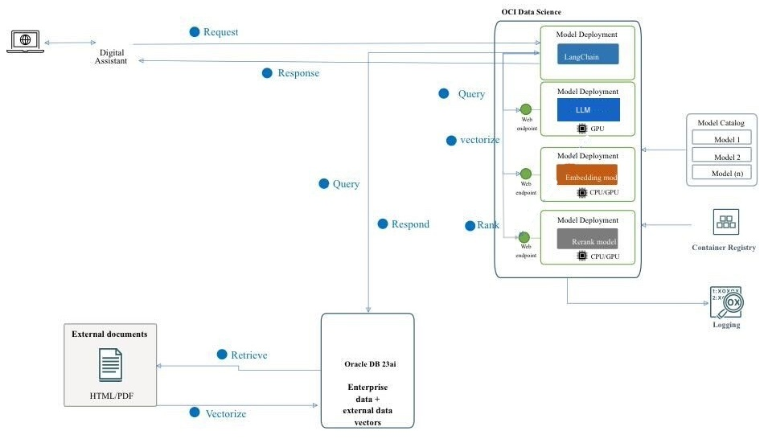
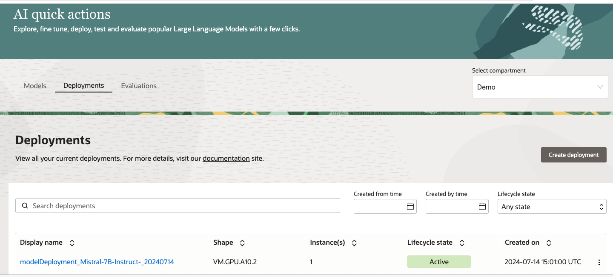
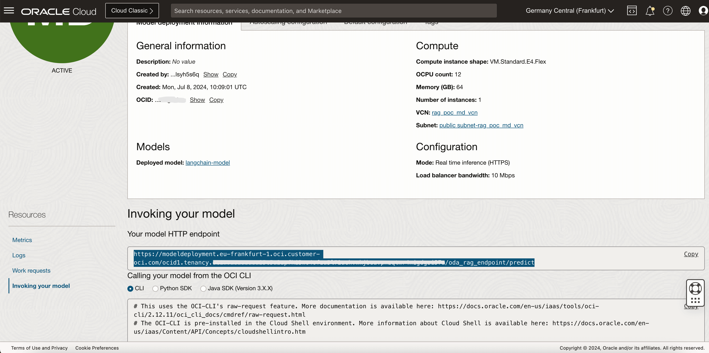
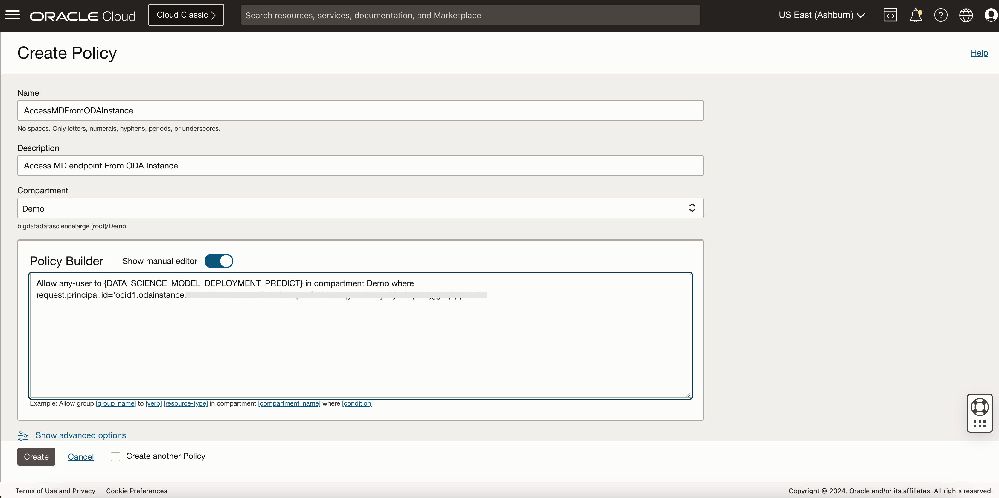
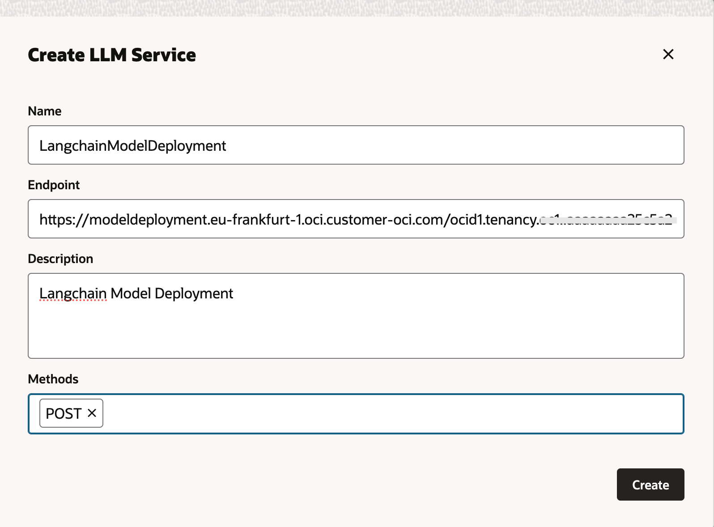
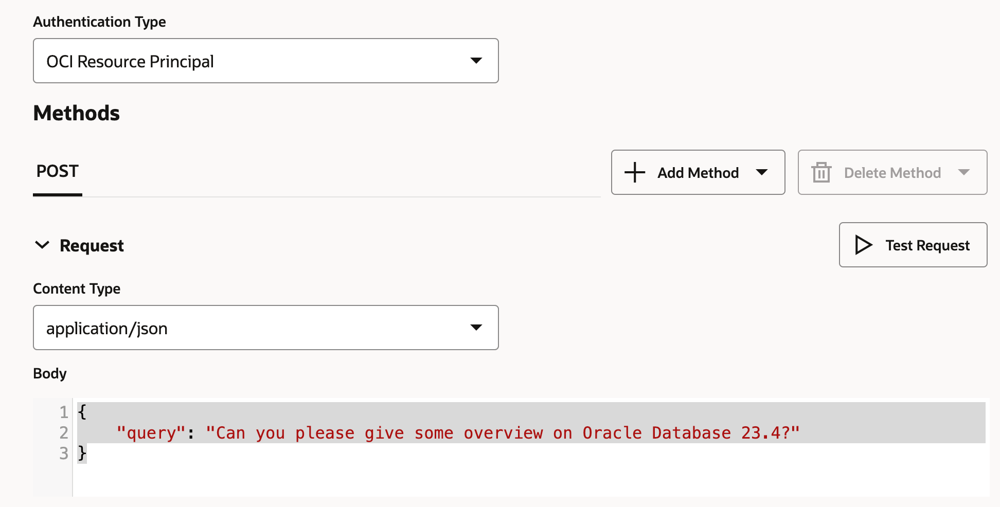
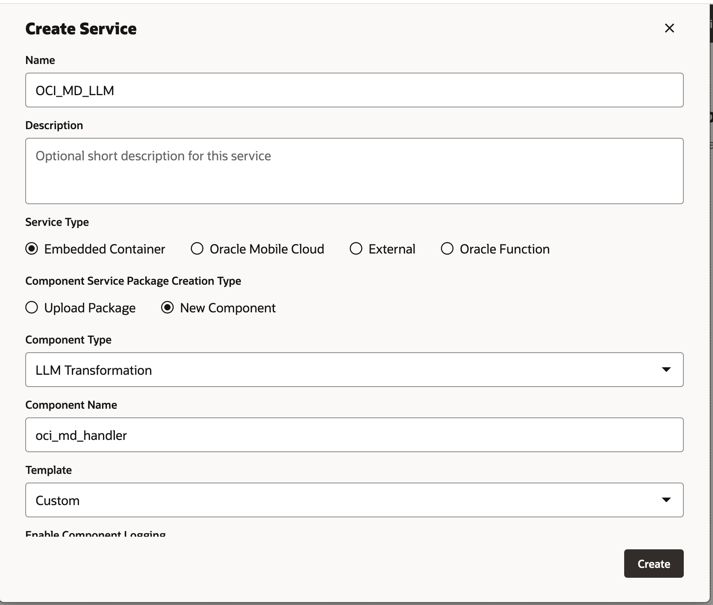
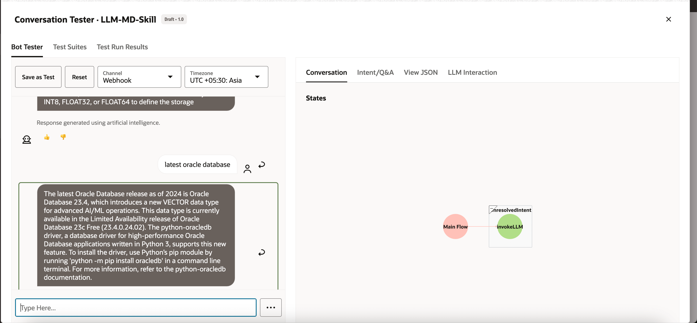
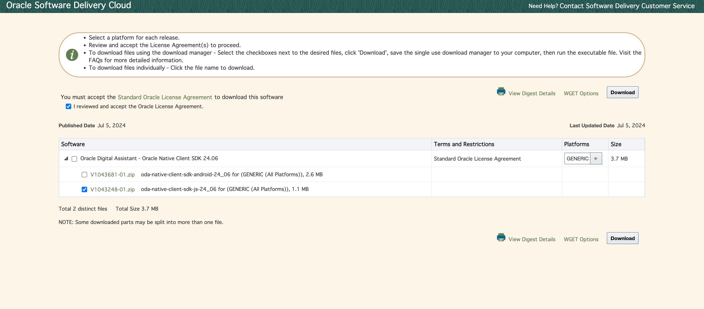
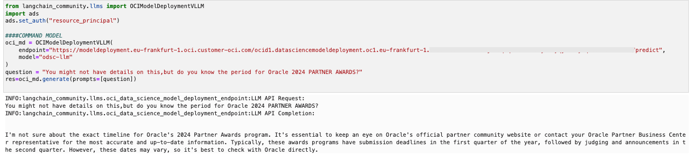

# Build an Enterprise Chatbot with Oracle Digital Assistant, OCI Data Science, LangChain and Oracle Database 23ai

## Introduction

In today's digital landscape, chatbots are evolving to become more intelligent, responsive, and capable of handling complex interactions. In this tutorial, we delve into the creation of a next-generation chatbot by harnessing the power of Oracle Cloud Infrastructure (OCI) Data Science capabilities like AI Quick Actions and Model Deployment, Mistral-7B-Instruct-v0.2, Oracle Database 23ai, LangChain, and Oracle Digital Assistant. Each of these technologies brings unique strengths to the table, enabling us to build a chatbot that not only understands and responds to user queries with remarkable accuracy but also offers a seamless and engaging conversational experience.

One of the standout features of Oracle Database 23ai is its advanced vector search capabilities. This technology allows for efficient retrieval of information by converting text into high-dimensional vectors, which are then compared for relevance. When integrated into the retrieval-augmented generation (RAG) pipeline, Oracle Database 23ai's vector search enhances the chatbot's ability to access and deliver the most pertinent information from vast datasets. This ensures that the responses generated are not only contextually accurate but also highly relevant to the user's query.

Oracle Digital Assistant further elevates the chatbot's functionality by providing a robust platform for building, deploying, and managing conversational AI solutions. It offers pre-built connectors, natural language understanding (NLU), and dialogue management, which streamline the development process and ensure a smooth user experience. The combination of Oracle Digital Assistant with the RAG pipeline enables the chatbot to handle complex interactions and maintain a natural flow of conversation, thereby improving user engagement and satisfaction.

By leveraging the synergy of Oracle Database 23ai and Oracle Digital Assistant within the RAG pipeline, developers can create a chatbot that excels in both retrieval accuracy and conversational fluidity. This integrated approach not only reduces the time and effort required to build sophisticated chatbots but also results in a solution that is scalable, efficient, and capable of delivering superior user experiences. Whether you are a developer, a tech enthusiast, or a business leader looking to enhance customer engagement, this tutorial will equip you with the knowledge and tools to build an advanced chatbot that stands out in the crowded digital arena.

For detailed steps showcasing how to implement this, [visit our tutorial](https://docs.oracle.com/en/learn/enterprise-chatbot-oda-datascience-langchain-23ai/).

**Use Cases**

Here are few sample use cases where this can be useful:

- **Personalized Customer Support:** Querying both guide books as well as customer history can create a better view of the customer's issues and help diagnose and solve the problem faster.

- **Supply Chain Optimization:** Querying vendor data with internal business ordering or shipping data can result in better decision making and faster response to changes in the supply chain.

- **Optimize Sales:** Query CRM data to identify high-potential leads and suggest strategies to increase deal closing probability.

**Benefits of Oracle AI Vector Search**

Oracle Database is a leading repository of operational and enterprise data. Enterprise applications usually need to search a combination of business data and unstructured data. For example, a retail website could feature searches based on a natural language product description and a target product image, along with other filters, such as price, store location, manufacturer, and current availability. This search requires simultaneously searching unstructured catalog data (product description and image), structured catalog data (price, store location and manufacturer) as well as real time transactional data (such as current inventory).

### Overview of High Level Architecture Solution



Figure: A High Level Architecture of RAG Pipeline

The following diagram illustrates the architecture and workflow of building an advanced chatbot using Mistral-7B-Instruct-v0.2, Oracle Database 23ai, RAG, LangChain, and Oracle Digital Assistant. Here are the detailed steps involved in the following architecture.

1. **User Interaction:** The user sends a request to the chatbot through the Oracle Digital Assistant interface.

2. **Request Handling:** The Oracle Digital Assistant receives the request and forwards it to the OCI Data Science infrastructure.

3. **Query Processing:** There are 2 steps that are involved.

   - Within OCI Data Science, the request is routed to LangChain, which acts as the orchestrator for managing the interaction between various model deployments.
   - LangChain processes the request and identifies the need for information retrieval from external documents and enterprise data.

4. **Vectorization:** This step involves the following sub-processes:

   - The request is sent to an embedding model deployment, which transforms the query into a high-dimensional vector representation.
   - This vectorized query is then sent to Oracle Database 23ai for vector search.

5. **Data Retrieval:** This step involves the following sub-processes:

   - Oracle Database 23ai performs a similarity search on unstructured data in the form of documents in PDF and HTML format and combines that search with regular search on other business data in the database.
   - Relevant documents or chunks are retrieved and will be sent to the next step for further processing.

6. **Re-ranking:**

   - The generated response may be further refined by a rerank model deployment.
   - The rerank model evaluates and ranks the responses to ensure the most relevant and accurate response is selected.

7. **Querying the External Models:** In this step the data is retrieved and generates a response.

   - The retrieved information is used to generate a query for the Mistral-7B-Instruct-v0.2 model deployment provisioned using AI Quick Actions features in OCI Data Science.
   - The Mistral-7B-Instruct-v0.2 model processes the query and generates a response based on its training and the retrieved context.

8. **Response Generation:** The refined response is sent back to LangChain, which consolidates the final output.

9. **Returning the Response to the user:**
   - The final response is returned to the Digital Assistant.
   - The Oracle Digital Assistant then delivers the response to the user.

### Objectives

- Build a chatbot by leveraging the latest technologies like OCI Data Science capabilities like AI Quick Actions and Model Deployment, Mistral-7B-Instruct-v0.2, Oracle Database 23ai, LangChain, and Oracle Digital Assistant. We will guide you through each step, from setting up the foundational AI models to integrating them into a seamless conversational experience. By the end of this tutorial, you will have a comprehensive understanding of how to utilize these advanced tools to create an intelligent, responsive, and highly effective chatbot capable of understanding and interacting with users in a natural and engaging manner.

### Prerequisites

The key prerequisites that you would need to set up before you can proceed to run the distributed fine-tuning process on OCI Data Science Service.

- The following policies are needed:

  - [Data science policies](https://docs.oracle.com/en-us/iaas/data-science/using/policies.htm).
  - [Model catalog policies](https://docs.oracle.com/en-us/iaas/data-science/using/models-about.htm).

- Configure custom subnet with security list to allow ingress into any port from the IPs originating within the CIDR block of the subnet. This is to ensure that the hosts on the subnet can connect to each other during distributed training. For more information, see [Networking](https://github.com/oracle-samples/oci-data-science-ai-samples/tree/main/distributed_training#1-networking).

- Set the policies to allow the OCI Data Science service resources to access OCI Object Storage buckets, networking and others. For more information, see [OCI Policies](https://github.com/oracle-samples/oci-data-science-ai-samples/tree/main/distributed_training#3-oci-policies).

- Access token from HuggingFace to download Mistral-7B-Instruct-v0.2 model. To fine-tune the model, you will first need to access the pre-trained model. The pre-trained model can be obtained from [HuggingFace](https://huggingface.co/models?sort=trending&search=meta-llama%2Fllama-2). In this tutorial, we will use the [HuggingFace access token](https://huggingface.co/docs/hub/security-tokens) to download the pre-trained model from HuggingFace (by setting the `HUGGING_FACE_HUB_TOKEN` environment variable).

- Log group and log from OCI Logging service. This will be used to monitor the progress of the training.

  1. Go to the [OCI Logging Service](https://cloud.oracle.com/logging/log-groups) and select **Log Groups**.

  2. Either select one of the existing log groups or create a new one.

  3. In the log group, create two logs: one predict log and one access log.
     1. Click **Create custom log**.
     2. Specify a name (predict|access) and select the log group you want to use.
     3. Under **Create agent configuration**, select **Add configuration later**.
     4. Click **Create agent configuration**.

- Notebook session used to initiate the distributed training and to access the fine-tuned model. For more information, see [Notebook session](https://docs.oracle.com/en-us/iaas/data-science/using/manage-notebook-sessions.htm).

- Install "PyTorch 2.0 for GPU on Python 3.9" conda and install required dependencies mentioned in requirements.txt

  ```
  pip install -r requirements.txt
  ```

## Task 1: Deploy Required Models

### Task 1.1: Deploy the Mistral-7B-Instruct-v0.2 Model

We will be leveraging [AI Quick Actions Model deployment feature](https://docs.oracle.com/en-us/iaas/data-science/using/ai-quick-actions-model-deploy.htm), to deploy Mistral-7B-Instruct-v0.2 with a few clicks. The AI Quick Actions model deployment aids users to deploy the Mistral-7B-Instruct-v0.2 with a few clicks and provide users with an endpoint.




### Task 1.2: Deploy Jina Embedding Model

1. In Notebook, copy Jine Embedding model files from [https://huggingface.co/jinaai/jina-embeddings-v2-base-en/tree/main](https://huggingface.co/jinaai/jina-embeddings-v2-base-en/tree/main) to the `ads_embedding_model_dir` directory.

2. Upload the [`score.py`](https://github.com/oracle-samples/oci-data-science-ai-samples/blob/main/LLM/oda_examples/oda-oci-data-science-oracledb-23ai-llm/embedding_model_score.py) file to the current directory (for example, `/home/datascience/`).

3. Run the following code.

   ```py
   import tempfile
   import ads
   from ads.model.generic_model import GenericModel
   from config import CONDA_PACK_PATH, LOG_GROUP_ID, EMBEDDING_MODEL_ACCESS_LOG_LOG_ID, EMBEDDING_MODEL_PREDICT_LOG_LOG_ID
   ads.set_auth("resource_principal")
   embedding_model = GenericModel( model_file_name="model-w-mean-pooling.onnx" ,artifact_dir="ads_embedding_model_dir",estimator=None, serialize=False)
   embedding_model.summary_status()

   embedding_model.prepare(
           inference_conda_env=CONDA_PACK_PATH,
           inference_python_version = "3.9",
           model_file_name="model.onnx",
           score_py_uri= "score.py",
           force_overwrite=True
       )
   op=embedding_model.verify(['Can you please give some overview on Oracle Database 23.4'])
   print(op['embeddings']);

   embedding_model.save(display_name="jina-embedding")
   embedding_md = embedding_model.deploy(
       display_name = "Jina Embedding Model Deployment",
       deployment_log_group_id = LOG_GROUP_ID,
       deployment_access_log_id = EMBEDDING_MODEL_ACCESS_LOG_LOG_ID,
       deployment_predict_log_id = EMBEDDING_MODEL_PREDICT_LOG_LOG_ID,
   )
   output = embedding_md.predict(['Can you please give some overview on Oracle Database 23.4'])
   print(output['embeddings']);
   ```

### Task 1.3: Deploy Bge-Reranker Model

Run the following code.

```py
import ads
from FlagEmbedding import FlagReranker
from ads.model.generic_model import GenericModel
from ads.model.model_metadata import MetadataCustomCategory
from config import CONDA_PACK_PATH, LOG_GROUP_ID, RERANKER_MODEL_ACCESS_LOG_LOG_ID, RERANKER_MODEL_PREDICT_LOG_LOG_ID

#
# This custom class wrap the reranker model
#
class Reranker:
    def __init__(self, model_id):
        self.model_id = model_id
        self.reranker = FlagReranker(self.model_id, use_fp16=True)

    def predict(self, x):
        # x is expected as a list of list of str
        # [["x1", "x2"]] -> y = [score12]
        scores = self.reranker.compute_score(x)

        return scores
reranker_model = Reranker(model_id="BAAI/bge-reranker-large")
reranker_payload = [
    ["what is panda?", "It is an animal living in China. In the future model input will be serialized by.In the future model input will be serialized by.In the future model input will be serialized by"],
    ["what is panda?", "The giant panda is a bear species endemic to China.In the future model input will be serialized by.In the future model input will be serialized by.In the future model input will be serialized by.In the future model input will be serialized by"],
]
reranker_model.predict(reranker_payload)

reranker_generic_model = GenericModel(estimator=reranker_model, artifact_dir="./reranker_dir")
reranker_generic_model.summary_status()
reranker_generic_model.prepare(
    reload=False,
    inference_conda_env=CONDA_PACK_PATH,
    inference_python_version="3.9",
    model_file_name="reranker.pkl",
    force_overwrite=True
)

reranker_generic_model.save(
    display_name="reranker2-baai-large",
    bucket_uri="oci://reranker_bucket@bigdatadatasciencelarge/reranker/",
    ignore_introspection=True
)

reranker_md = reranker_generic_model.deploy(
    display_name = "reranker2-baai-large",
    deployment_log_group_id = LOG_GROUP_ID,
    deployment_access_log_id = RERANKER_MODEL_ACCESS_LOG_LOG_ID,
    deployment_predict_log_id = RERANKER_MODEL_PREDICT_LOG_LOG_ID,
    deployment_instance_shape="VM.Standard2.4",
)
```

## Task 2: Set up Oracle Database 23ai

We will be utilizing the latest features of Oracle Database 23ai, specifically the Oracle AI Vector Search, for our use case. In this scenario, we will import the embeddings generated from the dataset into Oracle Database 23ai. When a user queries using the RAG, the response will be enhanced by supplying the LLMs with additional context. The following diagram shows some of benefits of using Oracle Database 23ai.


Figure: A illustration of Oracle Database 23ai Search Feature (source)

This will augment their knowledge, leading to responses that are more accurate and pertinent to the customer's inquiries. To set up Oracle Database 23ai follow the mentioned options.

- Using a container instance. For more information, see [Use the Oracle Autonomous Database Free Container Image](https://docs.oracle.com/en-us/iaas/autonomous-database-serverless/doc/autonomous-docker-container.html).

- Using a Python client.

We will be using a hosted instance of Oracle Database 23ai to demonstrate the powerful features of Oracle AI Vector Search.

## Task 3: Parsing, Chunking and Store Embedding In Oracle Database 23ai

The following code snippet gives high level overview of how document gets parsed, how document gets converted into chunks and then how embedding will be stored in Oracle Database 23ai. For more information, see [oda-oci-data-science-oracledb-23ai-llm](https://github.com/oracle-samples/oci-data-science-ai-samples/tree/main/LLM/oda_examples/oda-oci-data-science-oracledb-23ai-llm).

**Initialize Oracle Database 23ai**

```py
def load_documents(embedding_model):
    # connect to db
    # Configure logging
    logging.basicConfig(
        level=logging.INFO, format="%(asctime)s - %(levelname)s - %(message)s"
    )
    logging.info("Connecting to Oracle DB...")

    DSN = f"{DB_HOST_IP}/{DB_SERVICE}"

    with oracledb.connect(user=DB_USER, password=DB_PWD, dsn=DSN) as connection:
        logging.info("Successfully connected to Oracle Database...")

        num_pages = []
        for book in INPUT_FILES:
            logging.info(f"Processing book: {book}...")

            if ENABLE_CHUNKING is False:
                # chunks are pages
                logging.info("Chunks are pages of the book...")
                nodes_text, nodes_id, pages_num = read_and_split_in_pages([book])
                num_pages.append(len(nodes_text))
            else:
                logging.info(f"Enabled chunking, chunck_size: {MAX_CHUNK_SIZE}...")
                nodes_text, nodes_id, pages_num = read_and_split_in_chunks([book])

                # create embeddings
                # process in batch (max 96 for batch, chosen BATCH_SIZE, see above)
                logging.info("Computing embeddings...")
                embeddings = compute_embeddings(embedding_model, nodes_text)

                # determine book_id and save in table BOOKS
                logging.info("Registering document...")
                book_id = register_document(book, connection)

                # store embeddings
                # here we save in DB
                save_embeddings_in_db(embeddings, nodes_id, connection)

                # store text chunks (pages for now)
                save_chunks_in_db(nodes_text, nodes_id, pages_num, book_id, connection)

                # a txn is a book
                connection.commit()
```

## Task 4: Connect to Mistral-7B-Instruct-v0.2 AI Quick Actions LLM

Create a model deployment with AI Quick Actions and get the model deployment endpoint from there. Run the following code to connect to LLM.

```py
import ads
ads.set_auth("resource_principal")

command_md = OCIModelDeploymentVLLM(
    endpoint="https://modeldeployment.eu-frankfurt-1.oci.customer-oci.com/ocid1.datasciencemodeldeployment.oc1.<ocid>/predict",
    model="odsc-llm"
)
```

## Task 5: Set up RAG

The following RAG architecture, will consist of the following steps:

### Task 5.1: Upload to 23ai Vector Database

```py
class CustomRetriever(BaseRetriever):
    def _get_relevant_documents(
        self, query: str, *, run_manager: CallbackManagerForRetrieverRun
    ) -> List[Document]:
        matching_documents = []

        #Embedding model
        rps = oci.auth.signers.get_resource_principals_signer()
        prediction = requests.post(EMBEDDING_MD_ENDPOINT, data=f'["{query}"]', auth=rps)

        #Search in DB
        q_result = test_oracle_query(prediction.json()['embeddings'][0], TOP_K, True, False)
        text_list = []
        for n, id, sim in zip(q_result.nodes, q_result.ids, q_result.similarities):
            text_list.append(n.text)
        paired_list = [[query, text] for text in text_list]

        print(f'Reranker payload: {paired_list}')

        #ReRanker model
        reranker_results = requests.post(RERANKER_MD_ENDPOINT, data=json.dumps(paired_list), auth=rps)  # make a prediction request
        max_value = max(reranker_results.json()['prediction'])
        if max_value < -3:
            return matching_documents;
        # Find the index of the maximum value
        max_index = reranker_results.json()['prediction'].index(max_value)
        print(f"The maximum value is: {max_value}")
        print(f"The index of the maximum value is: {max_index}")
        doc =  Document(page_content=paired_list[max_index][1], metadata={"source": "local"})
        matching_documents.append(doc)
        return matching_documents

customRetriever = CustomRetriever()
chain = RetrievalQA.from_chain_type(
    llm=command_md,
    retriever=customRetriever
)

prompt = "Can you please give some overview on Oracle Database 23.4?"
res = chain(prompt)
print('Output::')
print(res['result'])
```

We use the prompt template and QA chain provided by Langchain to make the chatbot, this helps in passing the context and question directly to the LLM.

### Task 5.2: Deploy LangChain Model

```py
import tempfile
import ads
from ads.model.generic_model import GenericModel
from config import CONDA_PACK_PATH, LOG_GROUP_ID, LANGCHAIN_MODEL_ACCESS_LOG_LOG_ID, LANGCHAIN_MODEL_PREDICT_LOG_LOG_ID

ads.set_auth("resource_principal")

langchain_model = GenericModel( artifact_dir="langchain_model",estimator=None, serialize=False)
langchain_model.summary_status()
#Copy required python scripts to artifact dir
langchain_model.prepare(
        inference_conda_env=CONDA_PACK_PATH,
        inference_python_version = "3.9",
        model_file_name="test",
        score_py_uri= "score_langchain_final.py",
        force_overwrite=True
    )
op=langchain_model.verify('Can you please give some overview on Oracle Database 23.4?')
model_id = langchain_model.save(display_name="langchain-model")
deploy = langchain_model.deploy(
    display_name="Langchain Model Deployment",
    deployment_log_group_id = LOG_GROUP_ID,
    deployment_access_log_id = LANGCHAIN_MODEL_ACCESS_LOG_LOG_ID,
    deployment_predict_log_id = LANGCHAIN_MODEL_PREDICT_LOG_LOG_ID,
    environment_variables={"CRYPTOGRAPHY_OPENSSL_NO_LEGACY":"1"},
    deployment_instance_shape="VM.Standard2.4",
)
deploy.predict('Can you please give some overview on Oracle Database 23.4?')
```

## Task 6: Create a Digital Assistant using Oracle Digital Assistant for Chatbot Application to Host RAG

### Task 6.1: Get Model Deployment Endpoint and Add Policy

Add a REST service to instance that calls the model's provider. We are using Oracle model deployment as an example, but we can you use a REST service for any LLM.



Add policy, so that Oracle Digital Assistant can access model deployment predict endpoint. Go to **Identity & Security**, **Policies** and click **Create Policy**.



**Policies for dynamic group**

```py
Allow any-user to {DATA_SCIENCE_MODEL_DEPLOYMENT_PREDICT} in compartment Demo where request.principal.id='ocid1.odainstance.oc1.iad.<ocid>'
```

Once policy gets created, we can launch to Oracle Digital Assistant and open it in a browser.

### Task 6.2: Create the LLM Provider REST Service

1. Go to the Oracle Digital Assistant, navigate to **Settings**, **API Services**, **LLM Services** and click **+Add LLM Service**.

2. In the **Create LLM Service** page, enter the following information to create a Post operation to the provider's endpoint and click **Create**.

   - **Name:** Enter an easily identifiable name for the service. You will reference this name later on.
   - **Endpoint:** Copy and and paste the model deployment endpoint.
   - **Methods:** Select **POST**.

   

3. Complete the service by adding the API key, and the request and response payload samples.

   - **Authentication Type:** Select **OCI Resource Principal**.
   - **Content Type:** Select **application/json**.
   - **Body:** Add the payload sent to the request. For example:

     ```
     {
         "query": "Can you please give some overview on Oracle Database 23.4?"
     }
     ```

   

4. Click **Test Request** to check for a `200` response.

   

### Task 6.3: Create a Skill

With the LLM provider REST service added to the instance, now we need to create a skill that can call this service and connect users to it through its dialog flow definition. To create this skill, follow the steps:

1. Go to the Oracle Digital Assistant, navigate to **Development** and **+Skills**.
2. Click **+ New Skill**.
3. In the **Create Skill** page, enter the following information and click **Create**.

   - **Display Name:** Add a name.
   - **Dialog Mode:** Select **Visual**.
   - For the other fields, leave the default values.

   

### Task 6.4: Connect the Skill to the Model

We are now going to enable the skill to access the LLM REST service by creating a custom component with an event handler that transforms the REST payloads into formats that are accepted by both the LLM provider and Oracle Digital Assistant.

1. Click **Components** icon from the left navbar and **Add Service**.

   

2. In the **Create Service** page, enter the following information and click **Create**.

   - **Name:** Enter a name that describes the service.
   - **Service Type:** Accept the default setting, select **Embedded Container**.
   - **Component Service Package Creation Type:** Select **New Component**.
   - **Component Type:** Select **LLM Transformation**.
   - **Component Name:** Enter a descriptive name.
   - **Template:** Select **Custom** (located under **other**).

   

3. The completed component displays in the **Components** page.

   

4. Select the component from the **Components** page to check its deployment status. When **Ready** displays, you can move on to the next step.

   

   Ensure that **Service Enabled** (the default setting) is enabled.

   

### Task 6.5: Map the LLM Service Provider and Oracle Digital Assistant Requests and Responses

The skill's requests to the model's service provider need to be transformed from the interface used by Oracle Digital Assistant, which is known as Common LLM Interface (CLMI) into the format that is accepted by the service provider. Likewise, the results returned from the service provider also need to be transformed into CLMI. To enable this mapping, the following REST service event handler methods must have provider-specific code.

- `transformRequestPayload`.
- `transformResponsePayload`.
- `transformErrorResponsePayload`.

To open the event handler code editor and update the transformation code (in this case, for Azure OpenAI), follow the steps:

1. Expand the service and select the event handler.

   

2. Click **Edit** icon to open the editor.

   

   

3. Replace the `transformRequestPayload` handler event method code (around lines 24-26) with the following code.

   - **`transformRequestPayload`:**

     ```py
     transformRequestPayload: async (event, context) => {
         return { "query": event.payload.messages[event.payload.messages.length - 1].content };
         },
     ```

     Every request we just have to pass last user input to LLM prompt.

4. Replace the `transformResponsePayload` handler event method code (around lines 35-37) with the following code.

   - **`transformRequestPayload`:**

     ```py
     transformResponsePayload: async (event, context) => {
         return { candidates: [ { "content": event.payload.prediction || "" }]};
     },
     ```

5. Replace the `transformErrorResponsePayload` handler event method code (around lines 47-49) with the following code.

   - **`transformRequestPayload`:**

     ```py
     transformErrorResponsePayload: async (event, context) => {
         let errorCode = 'unknown';
         if (event.payload.error) {
             if ( 'context_length_exceeded' === event.payload.error.code) {
                 errorCode = 'modelLengthExceeded'; }
             else if ('content_filter' === event.payload.error.code) {
                 errorCode = 'flagged';
             }
             return {"errorCode" : errorCode, "errorMessage": event.payload.error.message};
         }
         return {"errorCode" : errorCode, "errorMessage": JSON.stringify(event.payload)};
     }
     ```

6. Click **Validate** to check the code syntax. Use it to replace the code in the editor if you are encountering syntax errors that you cannot fix.

   

7. Click **Save** and **Close**. Wait for the deployment to complete. When **Ready** displays, you can move on to the next step.

### Task 6.6: Define the LLM Service for the Skill

To enable the skill to connect users to the model through the dialog flow, you need to create an LLM service that combines the instance-wide LLM service that calls the model with the transformation event handler (which in this case is for Oracle model deployment).

1. Click **Settings** icon from the left navbar.

   

2. Click **Configuration**.

   

3. In the **Large Language Models Services** page, click **+New LLM Service**.

   

4. Enter the following information

   - **Name:** Enter an easily identifiable name for the LLM service. You will reference this name when you build the dialog flow in the next step.
   - **LLM Service:** Select the name of the instance-wide LLM service that you created in [Task 1: Create the REST Service to the Model](https://docs.oracle.com/en/cloud/paas/digital-assistant/tutorial-large-language-model/#task_one).
   - **Transformation Handler:** Select the name of the event handler component that you created as part of the REST service in [Task 3: Connect the Skill to the Model](https://docs.oracle.com/en/cloud/paas/digital-assistant/tutorial-large-language-model/#task_three).
   - Leave the remaining properties in their default settings. Note that **Default** is enabled, if this is the only service that you have created so far for this tutorial.

     

5. Click **Save**.

   

6. De-select **Feedback** and other default on switches.

   

### Task 6.7: Integrate the Service

Now that the skill is connected to the LLM, connect skill's users to the model by creating a dialog flow component that can call the model and tell it what to do. The component conveys these instructions using a prompt, which is a block of human-readable text.
In this task, we will provide this prompt, which instructs the model on evaluating user feedback as positive or negative, or neutral.

1. Click **Flows** icon from the left navbar.

   

2. Select **unresolvedIntent**.

   

3. In the **unresolvedMessage** state, click **ellipsis(...)** icon and select **Add State** from the menu.

   

4. Select **Service Integration** and **Invoke Large Language Model**.

5. Enter a **Description** like sentiment analysis and click **Insert**.

   

   The dialog flow now includes the `unresolvedMessage` (Send Message) state, `invokeLLM` state and the `showLLMError` state.

   

6. In the `unresolvedMessage` state, click **ellipsis(...)** icon and select **Delete** from the menu as we do not want to show error message for **UnresolvedIntent**.

   

   The dialog flow now includes the `invokeLLM` state and the `showLLMError` state only.

   

7. Open the `invokeLLM` state. In the **Component** page, select the LLM service that we have created in Task 6.6.

   

8. Add a prompt that sends instructions to the LLM service by pasting the following in the **Prompt**. All user conversation should get passed as Prompt Input.

   

9. Create the `PROMPT_INPUT` variable. Click **Prompt Parameters +** to add a new parameter and its value.

   

10. Set **Use Streaming** to **False** so that the message is delivered in its entirety, not incrementally.

    

11. Test the prompt with the **Prompt Builder** and click **Build Prompt**

    

12. Add **Prompt Parameter Mock Value** and click **Generate Output**. This way we can validate LLM integration.

    

### Task 6.8: Test the Prompt with the Skill Tester

1. Click **Preview** to open the skill tester.

   

2. Enter the following request: **Can you please give some overview on Oracle Database 23.4?**.

   The output should look like this:

   

3. Ask next query to LLM: **latest oracle database**.

   The output should look like this:

   

### Task 6.9: Set Up the Oracle Web User Channel

We will create an Oracle Digital Assistant user channel that enables an Oracle web client to access skill. To ensure that only our web clients can use this channel, we will configure it to require client authentication.

1. Open the Oracle Digital Assistant, navigate to **Development**, **Channels** and click **+Add Channel**.

2. In **Create Channel**, enter the following information to create a POST operation to the provider's endpoint and click **Create**.

   - **Name:** A unique name that begins with a letter and contains only letters, numbers, periods, and underscores. For example, `OCI_MD_LLM`.
   - **Description (Optional):** What the channel is used for.
   - **Channel Type:** Select **Oracle Web**.
   - **Allowed Domains:** Enter `*`.
   - **Client Authentication Enabled:** De-select.

   

3. Deselect **Client Authentication Enabled,** if not already disabled.

4. In **Route**, select the skill that we want to use. We have selected current skill that is **LLM-MD-Skill**.

5. Enable **Channel Enabled**.

6. Note the **Channel Id** and **ODA Domain URI** without https, that are shown for this channel.

We will use these values in our web app and the token generator's routing configuration.

### Task 6.10: Install the SDK

Download the zip and extract it to your local system. This zip includes a user guide that describes the SDK's classes and a sample app that demonstrates many of its features.

1. Go to [Oracle Digital Assistant (ODA) and Oracle Mobile Cloud (OMC) Downloads](https://www.oracle.com/downloads/cloud/amce-downloads.html) and **Oracle Native Client SDKs (for OCI Native environments) Web SDK** section.

2. Download [ODA Web SDK 24.06](https://www.oracle.com/downloads/cloud/amce-downloads.html).

3. In **Platforms**, select **GENERIC**.

4. Click to download latest ODA Js SDK that is `oda-native-client-sdk-js-24_06 for (GENERIC (All Platforms)`.

   

5. Extract the downloaded zip file.

### Task 6.11: Test Oracle Web App

1. Go to extracted zip folder of the downloaded Oracle web SDK.

2. Open the `samples/web/settings.js` file and replace `<URI>` and `<channelId>` with actual value.

   For example:

   - URI: `oda-xxxxxxxxxxxxxxxxxxxxxxxxxxxxxxx-dax.data.digitalassistant.oci.oraclecloud.com`.
   - ChannelId: `xxxxxxxx-xxxx-xxxx-xxxx-xxxxxxxxxxxx`.

3. Also, make sure `isClientAuthEnabled` is false.

    ```
    let isClientAuthEnabled = false;
    ```

4. Run the `samples/web/index.html` file on any browser.

5. Ignore the index file contents. Click chat icon, it will show **Oracle Assistant CONNECTED** status.

   

6. This is how our website looks with chat icon in bottom-right corner. We can start a conversation, like we did earlier with the skill tester.

   

   

### Task 6.12: Release on OCI Compute Instance

1. Create OCI Compute instance. For more information, see [Creating an Instance](https://docs.oracle.com/en-us/iaas/Content/Compute/Tasks/launchinginstance.htm)

2. Make sure you have following ingress rules.

   

3. Copy all web folders to newly created instance.

4. Install NGINX. For more information, see [Install the NGINX Web Server and Proxy on Oracle Linux](https://docs.oracle.com/en/learn/ol-nginx/index.html#background).

5. Open a browser and navigate to `http://<IP_address>/`. If you have a self signed certificate then you can navigate to `https://<IP_address>/`.

## Results

Let us compare the outputs from directly asking the LLM vs using RAG with LLM:

- **Response from LLM**

  

- **Response from RAG**

  

## Next Steps

Building an advanced chatbot using Oracle Database 23ai, RAG, LangChain, Mistral-7B-Instruct-v0.2, and Oracle Digital Assistant showcases the power of integrating cutting-edge technologies to create a highly responsive and intelligent conversational agent. The detailed workflow, from request handling to response generation, ensures that the chatbot can efficiently retrieve and process vast amounts of information, delivering accurate and contextually relevant answers to users. By leveraging Oracle Database 23ai's vector search capabilities and the robust platform provided by Oracle Digital Assistant, developers can significantly enhance the chatbot's performance and user engagement. This integrated approach not only streamlines the development process but also results in a scalable, efficient, and highly effective AI solution that stands out in the competitive landscape of digital assistants. Whether for customer service, information retrieval, or interactive support, this advanced chatbot architecture paves the way for creating sophisticated conversational experiences that meet the demands of modern users.

For more information on how to use AI Quick Actions, go to the Oracle Cloud Infrastructure Data Science [YouTube playlist](https://www.youtube.com/playlist?list=PLKCk3OyNwIzv6CWMhvqSB_8MLJIZdO80L) to see a demo video of AI Quick Actions, and find [our technical documentation](https://docs.oracle.com/en-us/iaas/data-science/using/ai-quick-actions.htm), and see our [Github repository](https://github.com/oracle-samples/oci-data-science-ai-samples/tree/main/ai-quick-actions) with tips and examples.

If you want to suggest specific models to add to AI Quick Actions or have any questions, email to the OCI Data Science group: [ask-oci-data-science_grp@oracle.com](mailto:ask-oci-data-science_grp@oracle.com).

## Related Links

- [Configure the Oracle Web Channel](http://www.oracle.com/pls/topic/lookup?ctx=en/cloud/paas/digital-assistant&id=DACUA-GUID-33102578-2776-474D-AD48-9029D8EE6480)

- [Configure Client Authentication](http://www.oracle.com/pls/topic/lookup?ctx=en/cloud/paas/digital-assistant&id=DACUA-GUID-672865F8-5883-461C-B6AD-47191EBC89DA)

- [Customize the Chat Widget](https://docs.oracle.com/en/cloud/paas/digital-assistant/use-chatbot/customize-chat-widget.html#GUID-45FA259F-4558-4C0F-A3AD-0BB7586EA595)

- Try [Oracle Cloud Free Trial](https://www.oracle.com/cloud/free/)! A 30-day trial with US$300 in free credits gives you access to Oracle Cloud Infrastructure Data Science service. For more information, see the following resources:

  - [OCI Data Science sample repository on Github](https://github.com/oracle-samples/oci-data-science-ai-samples/tree/main/LLM/oda_examples/oda-oci-data-science-oracledb-23ai-llm).

  - [Oracle Data Science service](http://docs.oracle.com/iaas/data-science/using/data-science.htm).

- [Using the Oracle Resource Manager to Configure Your Tenancy for Data Science](https://docs.oracle.com/en-us/iaas/data-science/using/orm-configure-tenancy.htm)

- Star and clone our new [GitHub repo](https://github.com/oracle-samples/oci-data-science-ai-samples)! We included notebook tutorials and code samples.

- Watch our tutorials on [YouTube](https://www.youtube.com/playlist?list=PLKCk3OyNwIzv6CWMhvqSB_8MLJIZdO80L)

- Search for Oracle Data Science and try [LiveLabs](https://apexapps.oracle.com/pls/apex/dbpm/r/livelabs/livelabs-workshop-cards?session=108343633199478).

- [Introducing AI Quick Actions in OCI Data Science](https://blogs.oracle.com/ai-and-datascience/post/ai-quick-actions-in-oci-data-science)

- [Announcing Oracle Database 23ai : General Availability](https://blogs.oracle.com/database/post/oracle-23ai-now-generally-available)
