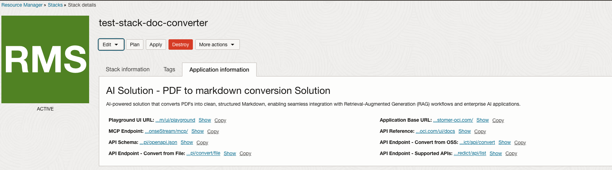

# AI Document Converter App

## Overview

AI Document Converter is an AI-powered solution designed to transform complex PDF documents into clean, structured Markdown. It goes beyond simple text extraction by preserving headings, tables, lists, images, and semantic structure, making documents immediately usable for downstream applications.

With its ability to generate high-quality, machine-readable outputs, the converter seamlessly integrates into Retrieval-Augmented Generation (RAG) pipelines, enterprise knowledge bases, and AI-driven document processing systems. This enables organizations to improve search, question-answering, summarization, and analytics workflows without manual reformatting.

Key capabilities include:

- **Accurate PDF-to-Markdown conversion** with layout and hierarchy preservation.
- **Support for forms, tables, and figures**, ensuring data-rich documents remain structured.
- **Optimized outputs for RAG and LLM applications**, reducing preprocessing overhead.
- **Scalability for enterprise use**, handling bulk conversions efficiently.

In short, the AI Document Converter helps enterprises unlock the full value of their documents by making them searchable, analyzable, and AI-ready.


## Deployment
This application can be  deployed using an [Oracle Resource Manager](https://docs.oracle.com/en-us/iaas/Content/ResourceManager/Concepts/resourcemanager.htm) (ORM) stack as a solution on AI Hub.  To create and deploy the solution, click the button below:

[![Deploy to Oracle Cloud][magic_button]][magic_stack]


## APIs

### URLs
Once the stack is successfully deployed, you can find the URLs for accessing the APIs in the Application Information section.



The APIs include:
* Converting a PDF from object storage to Markdown - Copy `API Endpoint - Convert from OSS` URL.
* Converting a PDF file uploaded as file object to Markdown - Copy `API Endpoint - Convert from File` URL
* MCP supported endpoint - Copy `MCP Endpoint` URL

Please see the API reference available in the `Playground UI URL` for more details and try them out.


### Invoking Endpoints

To invoke the endpoints, you can use the following code. 

#### Set up auth

```python
import requests
from pathlib import Path
import oci

config = oci.config.from_file(
    "~/.oci/config"
)
token_file = config["security_token_file"]

with open(token_file, "r") as f:
    token = f.read()

private_key = oci.signer.load_private_key_from_file(config["key_file"])
auth = oci.auth.signers.SecurityTokenSigner(token, private_key)

```

#### Converting PDF to Markdown from object storage

```python

# copy this URL from the Application information in the stack for this API
url = "<api_endpoint_url>"

payload = {
    "document": "oci://bucket-name@namespace/prefix/file.pdf",
    "format": "markdown",
    "page": 1 # remove this param to process all pages of PDF
}
response = requests.post(url, json=payload, auth=auth,)
print("Status:", response.status_code)
print("Response:", response.json())

```

#### Converting PDF to Markdown using file upload

```python

# Load PDF into memory
file_path = Path("~/Documents/dataset/file.pdf").expanduser()
file_content = file_path.read_bytes()

# Compose request
files = {
    "file": (file_path.name, file_content, "application/pdf")
}
params = {
    "page": 1
}
# set params to empty if you want to process all pages
#params = {}
headers = {}

# copy this URL from the Application information in the stack for this API
url = "<api_endpoint_url>"
response = requests.post(
    url=url,
    data=file_content,
    auth=auth,
    params=params,
    headers=headers
)

```

#### MCP example using Accelerated Data Science

You can use ADS package to connect with the MCP endpoints. Follow instructions [here](https://accelerated-data-science.readthedocs.io/en/latest/user_guide/cli/quickstart.html) on how to install ADS.


```python
import asyncio

import ads
from ads.aqua import HttpxOCIAuth
from fastmcp import Client
from fastmcp.client.transports import StreamableHttpTransport

# change profile accordingly
ads.set_auth("security_token", profile="DEFAULT")

# copy this URL from the Application information in the stack for this endpoint
server_url =  "mcp_endpoint_url"

transport = StreamableHttpTransport(
    server_url, auth=HttpxOCIAuth(ads.auth.default_signer().get("signer"))
)
client = Client(
    transport=transport,
)

async def main():
    async with client:
        tools = await client.list_tools()
        print("Available tools:")
        for tool in tools:
            print("-" * 30)
            print(tool.name)

        print("=" * 30)
        
        # will print the following tool names:
        # convert_route_convert_post : object storage api tool
        # list_apis_list_get : list avaiable endpoints api tool
        # convert_from_file_convert_file_post : file upload api tool, currently not supported
        
        # call specific tool
        payload = {
            "document": "oci://bucket-name@namespace/prefix/file.pdf",
            "format": "markdown",
            "page": 1 # remove this param to process all pages of PDF
        }

        print("Calling tool: convert_route_convert_post")
        result = await client.call_tool(
            "convert_route_convert_post", payload
        )
        print(result.data)


asyncio.run(main())
```

Note: File upload option is not supported due to the limitation of the current MCP server.


[magic_button]: https://oci-resourcemanager-plugin.plugins.oci.oraclecloud.com/latest/deploy-to-oracle-cloud.svg
[magic_stack]: https://cloud.oracle.com/resourcemanager/stacks/create?zipUrl=https://github.com/oracle-samples/oci-data-science-ai-samples/releases/latest/download/ai-document-converter.zip
