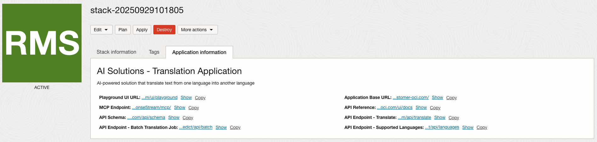

# AI Translation

## Overview

The AI Text Translation Solution delivers fast, accurate language translation powered by state-of-the-art Large Language Models (LLM). By default, it leverages the powerful meta.llama-3.3-70b-instruct model from the OCI Generative AI Service , but you can specify alternative LLMs or connect any OpenAI-compatible model endpoint.

The solution includes REST APIs and Playground UI for experimentation.

## Features

🌐 APIs for translation and language management  
🎛️ Playground UI for rapid hands-on exploration  
📝 Single & Batch Translation support  
🚀 Streaming & Async translation modes  
🔗 Flexible model selection: supports OCI Generative AI and any OpenAI-compatible API

## Deployment
This application can be  deployed using an [Oracle Resource Manager](https://docs.oracle.com/en-us/iaas/Content/ResourceManager/Concepts/resourcemanager.htm) (ORM) stack as a solution on AI Hub.  To create and deploy the solution, click the button below:

[![Deploy to Oracle Cloud][magic_button]][magic_stack]

## APIs

### URLs
Once the stack is successfully deployed, you can find the URLs for accessing the APIs in the Application Information section.




The APIs include:
* Listing the supported languages - Copy `API Endpoint - Supported Languages` URL.
* Text translation supporting streaming and async operations - Copy `API Endpoint - Translate` URL.
* Start batch Translation Job - Copy `API Endpoint - Batch Translation Job` URL.
* MCP supported endpoint - Copy `MCP Endpoint` URL

Please see the API reference available in the `Playground UI URL` for more details and try them out.

### Invoking Endpoints

To invoke the endpoints, you can use the following code. 

#### Set up auth

```python
import requests
from pathlib import Path
import oci

config = oci.config.from_file(
    "~/.oci/config"
)
token_file = config["security_token_file"]

with open(token_file, "r") as f:
    token = f.read()

private_key = oci.signer.load_private_key_from_file(config["key_file"])
auth = oci.auth.signers.SecurityTokenSigner(token, private_key)

```

#### Listing the supported languages

```python

# copy this URL from the Application information in the stack for this API
url = "<api_endpoint_url_languages>"

response = requests.get(url, auth=auth)

print("Status:", response.status_code)
print("Response:", response.json())

```

#### Text translation supporting streaming and async operations

For non-streaming case:
```python

# copy this URL from the Application information in the stack for this API
url = "<api_endpoint_url_translate>"

payload = {"text": "hello", "language": "French"}
response = requests.post(url, json=payload, auth=auth, stream=True)
print("Status:", response.status_code)
print("Response:", response.json())
```

For streaming response:

```python
text = "The twilight shimmered over the quiet town as the last train whistled in the distance. A lone cat perched atop a fence, its eyes reflecting the amber glow of a streetlamp. Inside a nearby café, the faint hum of jazz blended with the gentle clinking of cups. Somewhere, a typewriter clicked — each keystroke a heartbeat in the rhythm of a sleepless night. Outside, rain began to fall, soft and steady, painting the cobblestones with fleeting constellations of light."

payload = {
    "text": text,
    "language": "French",
    "stream": True
}

with requests.post(url, json=payload, auth=auth, stream=True) as r:
    print("Status:", r.status_code)
    r.raise_for_status()

    for line in r.iter_lines(decode_unicode=True):
        if line:
            print(line)
```

#### MCP example using Accelerated Data Science

You can use ADS package to connect with the MCP endpoints. Follow instructions [here](https://accelerated-data-science.readthedocs.io/en/latest/user_guide/cli/quickstart.html) on how to install ADS.


```python
import asyncio

import ads
from ads.aqua import HttpxOCIAuth
from fastmcp import Client
from fastmcp.client.transports import StreamableHttpTransport


ads.set_auth("security_token", profile="DEV")

# copy this URL from the Application information in the stack for this endpoint
server_url =  "mcp_endpoint_url"

transport = StreamableHttpTransport(
    server_url, auth=HttpxOCIAuth(ads.auth.default_signer().get("signer"))
)
client = Client(
    transport=transport,
)


async def main():
    async with client:
        tools = await client.list_tools()
        print("Available tools:")
        for tool in tools:
            print("-" * 30)
            print(tool.name)

        print("=" * 30)
        print("Calling tool")
        result = await client.call_tool(
            "api_text_translate_translate_post", {"text": "hello", "language": "French"}
        )
        print(result.data)


asyncio.run(main())
```

[magic_button]: https://oci-resourcemanager-plugin.plugins.oci.oraclecloud.com/latest/deploy-to-oracle-cloud.svg
[magic_stack]: https://cloud.oracle.com/resourcemanager/stacks/create?zipUrl=https://github.com/oracle-samples/oci-data-science-ai-samples/releases/latest/download/ai-translation.zip
