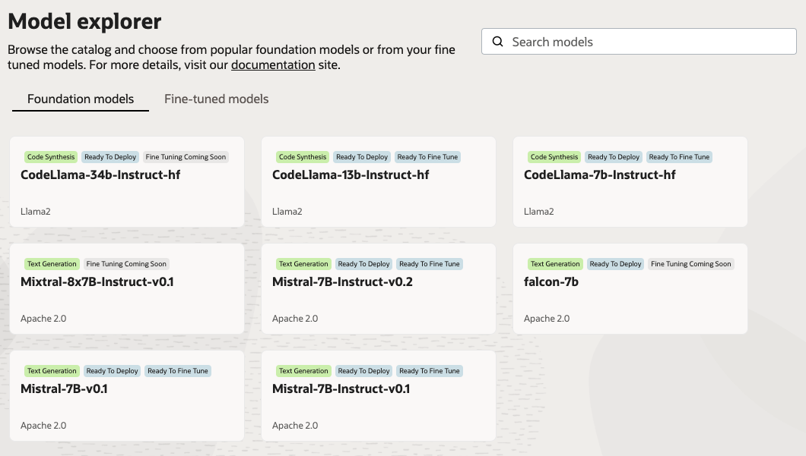

# AI Quick Actions - Overview

> **Note:** To Enable the AI Quick Actions features either begin a new Notebook session, or deactivate and
> reactivate any existing Notebook sessions.

Table of Contents:

- [Policies](policies/README.md)
- [Model Deployment](model-deployment-tips.md)
- [Model evaluation](evaluation-tips.md)
- [Model Fine Tuning](fine-tuning-tips.md)

AI Quick actions are a feature of the Data Science Cloud Service, they can be used within the Notebook environment which ensures all the right access control policies are respected.

Before you can use AI Quick Actions (referred to as AQUA) you will need to apply the policies using the Oracle Resource
Manager. For further information see [Policies](policies/README.md).

AI Quick Actions for LLMs is a suite of actions that together can be used to deploy, evaluate and fine tune open source
language models. Over time new models, and new features will be added. The target user is someone who's skilled in a
domain and wants to leverage the power of AI, but doesn't know the technical information necessary. For those who are
skilled in `pytorch` and the suite of libraries/techniques they will still mostly rely on the Notebook resource and
enjoy having full control.

## Use Case Example

Looking at a general use case, this is how AQUA would help. You're a marketing executive and you need to write
success stories for your company blog. Right now you interview customers and from the transcripts create blog posts
that showcase a particular style and narrative that supports your business goals. For example you may want to
emphasize the cost savings, or the competitive advantage, or some aspect. You may also want to generate blogs in
other languages.

### Where do you start?

AQUA first introduces you to a model catalog. The models found here are ones that Oracle have tested, remember
these are open source models - unmodified by Oracle - each will have strengths and weaknesses and suitability for
different tasks. As of Spring 2024 the model that covers a reasonable selection of languages, works well for a
variety of tasks, is capable of being responsible, and responds well to instructions is 
the [Mistral model](https://mistral.ai/technology/#models) - this comes in different flavors/sizes.

### Step One would be to deploy a model using the Model Explorer

After reading the model cards (by clicking on a model in the explorer) there is some more information that can help you
select a suitable model. One common need is to evaluate a few models against a small set of examples. Then see which model
best aligns with the use case. To do this you will need to create an evaluation dataset. See [here](evaluation-tips.md) for
more information and tips.

It could be that after evaluating a few service models either they work great for your use case, or none of them work
well enough. If you find none of them work as expected you have a number of options available to you.

- explore better prompt templates
- fine tune a model

Prompt templates are easy to play with, fine tuning is a more advanced topic, to make use of fine tuning you teach the model
how you want it to respond through a set of examples. 

For example rather than a simple prompt template like:

> You are a helpful assistant

try something task-specific. Watch for future capabilities in AQUA that help with this and provide pre-created prompts. For our
use case you could re-run the evaluation with a template like:

> Please respond to me as a marketing writer. My company makes \<insert\>, You will help me writing a customer success story. 
> Avoid jargon, be objective, incorporate quotations, give background information, keep it short, be accurate.

Prompt templates are very powerful, models respond well to being instructed to follow direction. For example a prompt that
does well to minimize bias and hallucinations try something like:

> 
> \<s\>[INST] \<\<SYS\>\>
> You are an expert, give helpful, detailed, accurate responses, don't use fluffy phrases like "thank you", "Certainly", or "Hello!". Your answers > > should not include any harmful, unethical, racist, sexist, toxic, dangerous, or illegal content. Please ensure that your responses are socially > > unbiased and positive in nature.
> 
> Format any code or configuration properly with appropriate indentation and surround with markdown code blocks.

> Do not write sign-off messages, do not say hello, do not say thank you, do not say goodbye, do not say anything that is not directly related to the question.
> 
> If a question does not make any sense, or is not factually coherent, explain why instead of answering something not correct. If you don't know the > answer to a question, please don't share false information.
> 
> \<\</SYS\>\>
> 
> \<my question/promp\>t [/INST]

Once the model is working as expected, note this iterative process is helped by using the "Test Your Model" feature in AQUA.

The full parameters you can tune are beyond the scope of this introduction.

- *temperature* is very important. It is a parameter that influences the language model's output, determining
whether the output is more random and creative or more predictable. A higher temperature will result 
in lower probability, i.e more creative outputs.

- *max_tokens* The maximum size of the output. Increase to get longer responses from the model. 

Closing the cycle, once the model is selected and evaluated you can begin to use it. In some cases a more
sophisticated solution is needed which will include [fine tuning.](fine-tuning-tips.md)

