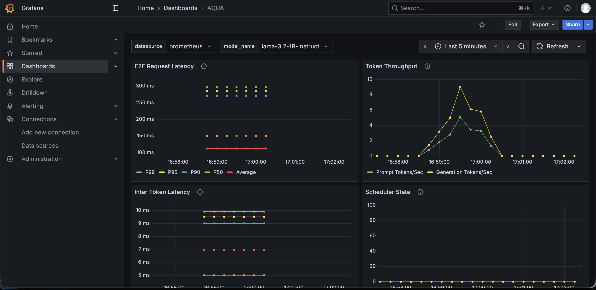

# AQUA Deployment Metrics Mornitoring (Local)

To set up local Prometheus and Grafana for monitoring OCI Data Science model deployment metrics, you will need a custom authentication proxy to fetch the metrics from OCI and expose them in a Prometheus-compatible format, which your local Prometheus instance can then scrape. 

Here is an end-to-end guide using Docker for the local components:

## Step 1: Deploy an AQUA Model

- Ensure you have appropriate [OCI policies](https://github.com/oracle-samples/oci-data-science-ai-samples/tree/main/ai-quick-actions/policies) to read endpoint from your local instance.
- [Deploy an AQUA Model Deployment](https://github.com/oracle-samples/oci-data-science-ai-samples/blob/main/ai-quick-actions/model-deployment-tips.md).

## Step 2: Run Authentication Proxy

Download the repo `oci-data-science-ai-samples` and navigate to `oci-data-science-ai-samples/ai-quick-actions/aqua_metrics/local` folder.

```
git clone https://github.com/oracle-samples/oci-data-science-ai-samples.git
cd oci-data-science-ai-samples/ai-quick-actions/aqua_metrics/local
```

Install the required libraries and start the authentication proxy. Replace the `<model-deployment-url>` with the target model deployment url that you want to scrape metrics from.

```bash
pip install --no-cache-dir fastapi uvicorn requests httpx oracle-ads
export TARGET=<model-deployment-url>/predict/metrics
uvicorn signing_proxy_local:app --host 0.0.0.0 --port 8080
```

## Step 3: Set Up Local Prometheus and Grafana with Docker

Open another terminal in the same folder, start the Prometheus and Grafana using Docker Compose.

```bash
docker compose up -d
```

## Step 4: Visualize Metrics in Grafana

- **Access Grafana**: Once the Prometheus and Grafana are running, access the Grafana UI using: `http://localhost:3000`.

- **Log In**: Log in with your credentials (default is `admin/admin` if not changed via environment variables).

- **Add Prometheus Data Source**:

  - Go to `Configuration` -> `Data Sources`.
  - Click `Add data source` and select `Prometheus`.
  - Set the URL to the internal Prometheus service address: `http://host.docker.internal:9090`.
  - Click `Save & Test`. You should see `"Data source is working"`.

- **Create Dashboards**: Use the Prometheus query language (PromQL) to build dashboards and panels that display your model's metrics. For more information, see [build grafana dashboard](https://grafana.com/docs/grafana/latest/getting-started/build-first-dashboard/).

By following these steps, you will have a self-contained, monitored system for your OCI Data Science model.


