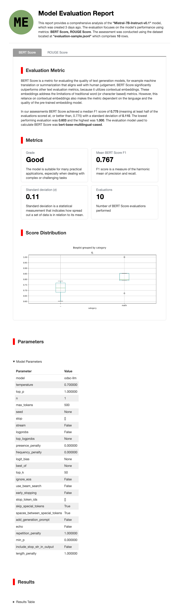

# LLM Evaluation

Table of Contents:

- [Home](README.md)
- [CLI](cli-tips.md)
- [Policies](policies/README.md)
- [Model Deployment](model-deployment-tips.md)
- [Model Fine Tuning](fine-tuning-tips.md)
- [Model Registration](register-tips.md)

## Introduction

Machine learning enables the use of established metrics such as Precision, Recall, and F1 Score for evaluating classification models. However, evaluating large language models (LLMs), which generate natural language, code, or any style of output, presents a challenge due to the unstructured nature of their output.

There are various metrics to assess specific aspects of language model performance, yet no single metric captures overall effectiveness comprehensively. Commonly used metrics are ROUGE, which focus on precision and recall, and embedding-based metrics like BERTScore.

ROUGE is a set of metrics for evaluating text generation models (summarization or machine translation). ROUGE is based on measuring the overlap between the model prediction and the human-produced reference. This overlap relies on terminology being
the same, which is sometimes desirable, other times semantics is more important, in which case BERT is a better metric.

AI Quick Actions is progressively introducing more evaluation metrics tailored to the task at hand. For instance, coding models utilize very different metrics compared to those used for summarization or language translation.

It's crucial to recognize the limitations of metrics and to define a dataset that reflects what's important to you and your business needs. For example, a patent attorney might measure model efficacy differently than a development team fine-tuning a model for SQL generation.

Within supervised model evaluation, there are two main types: metrics that compare the model's response with a reference dataset to produce a similarity measure, such as BLEU and ROUGE, which examine the overlap in wording between the model's output and the reference output; and embedding-based evaluations, where a secondary model with linguistic knowledge generates a similarity score.

### Alignment

The primary evaluation metric used by AI Quick Actions is BERTScore. This embedding-based metric assesses the semantic similarity between words in the model's response and the reference, rather than focusing on token-level syntactic similarity. 

BERTScore aligns closely with human judgement. A model targeting text generation will likely score highly on BERTScore if it produces results that humans deem high-quality. For example, the following sentences are considered semantically similar:

*"The cat quickly climbed up the tall tree to escape the pursuing dog."* and *"In an effort to evade the chasing canine, the feline ascended the lofty arboreal structure with speed."* these sentences would receive low scores using BLEU or ROUGE due to the minimal overlap in words and phrases.


### To run a model evaluation

Most importantly you need a dataset.

- must be in [jsonl](https://jsonlines.org/) format
- each row should contain keys: `prompt`, `completion`, and **optionally**, `category`

For example:

```
{"prompt": "Summarize this dialog:\nAmanda: I baked  cookies. Do you want some?\r\nJerry: Sure!\r\nAmanda: I'll bring you some tomorrow :-)\n---\nSummary:\n", "completion": "Amanda baked cookies and will bring some for Jerry tomorrow."}
{"prompt": "Summarize this dialog:\nOlivia: Who are you voting for in this election? \r\nOliver: Liberals as always.\r\nOlivia: Me too!!\r\nOliver: Great\n---\nSummary:\n", "completion": "Olivia and Olivier are voting for liberals in this election. "}
```

In the above example there's no category, that's an optional field to help make sense of the evaluation metrics because the report produced following the evaluation job will show metrics dimensioned around the categories. Categories like "logic", "math", "translation", etc are all useful ways to group an evaluation dataset, but are not required. When not specified the category will be assigned the value "`_`" (for unknown)

### To configure an Evaluation the UI presents a set of options


### Interpretation of results

The evaluation job will create a new Model Catalog entry, you can browse these and see examples of the metrics summary in the AI Quick Actions screens and can download a more detailed report in html. The report will explain both the evaluation(s) performed along with how to interpret the results. 

#### BERTScore

The report for BERTScore will show the `precision` and 'recall` for the similarity between what's generated by the model (from the prompt) and the reference completion.

Precision in the context of BERTScore refers to the degree to which the tokens in the candidate text (e.g., a generated summary or translation) are accurately represented or aligned with the tokens in the reference text. A high precision score indicates that most of the tokens in the candidate text have close counterparts in the reference text, suggesting a high level of detail or specificity retention. It essentially measures the quality of what is present in the generated text, focusing on its relevance and accuracy in reflecting the reference content.

Recall, on the other hand, measures the extent to which tokens in the reference text are captured or covered by the tokens in the candidate text. A high recall score indicates that the candidate text does an excellent job of encompassing the content or ideas present in the reference text, effectively capturing its breadth. It assesses the comprehensiveness of the generated text, evaluating whether it sufficiently represents the reference's scope.

In essence, precision in BERTScore evaluates the accuracy and relevance of the generated text's content against the reference, while recall assesses the extent to which the generated text encompasses the reference text's content. Together, these metrics provide a nuanced view of the similarity between the generated and reference texts, accounting for both detail and coverage. High scores in both metrics are indicative of generated text that is both detailed and comprehensive, closely mirroring the reference text in terms of content and meaning.

The report will show a box plot which allows viewing the distribution of the BERTScores across the evaluation dataset (optionally per category). Higher scores are better, and scores clustered around the mean are better. The box plot lets you view any outlier scores, for example a model may perform very well, but have a weakness for translation tasks for which there was little data available, being able to identify these outliers let's you take action to address the issues (for example use a foundation model with better language coverage)


##### Limitations and potential biases associated with using BERTScore for evaluating text generation models :

- BERTScore may exhibit a predisposition towards models that mirror its own architecture, stemming from its metrics' tendency to favor outputs closely resembling its design. This bias is a characteristic challenge of all reference-free metrics, positioning BERTScore's limitation within a broader context common to similar evaluation tools.

- The lack of consideration for sentence syntax in BERTScore evaluations might result in inaccuracies, especially in instances where differing syntactic structures deliver equivalent meanings. This oversight underscores a critical evaluation gap in assessing linguistic nuances.

- BERTScore's effectiveness diminishes in tasks demanding an appreciation for context beyond mere word-level analysis, such as the interpretation of idioms or cultural nuances. This limitation highlights the metric's potential shortfall in capturing the full spectrum of language's complexity.

- Utilizing BERTScore to evaluate coding models on programming tasks is inadvisable. This recommendation stems from the metric's design, which is not tailored to appreciate the unique demands and structures inherent in coding tasks.

### Example Report




Table of Contents:

- [Home](README.md)
- [Policies](policies/README.md)
- [CLI](cli-tips.md)
- [Model Deployment](model-deployment-tips.md)
- [Model Fine Tuning](fine-tuning-tips.md)
- [Model Registration](register-tips.md)
