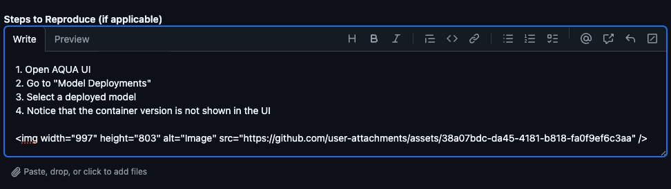

# Feedback/Feature Request Submission

The **AI Quick Actions (AQUA)** interface provides a simple way to offer feedback directly from the UI. If you’ve spotted a bug or want to suggest a feature, you can easily submit it through GitHub.

This guide shows you how to do that step-by-step, using the example:
> **"AQUA UI doesn't show container version for model deployment"**

---

## Table of Contents

- [Where to Find the Feedback Link](#where-to-find-the-feedback-link)
- [Filling Out the Feedback Form](#filling-out-the-feedback-form)
    - [1. Add a title](#1-add-a-title)
    - [2. Feedback Type](#2-feedback-type)
    - [3. Summary](#3-summary)
    - [4. Steps to Reproduce](#4-steps-to-reproduce)
    - [5. Expected Behavior](#5-expected-behavior)
    - [6. Actual Behavior](#6-actual-behavior)
    - [7. Version or AI Quick Actions](#7-version-or-ai-quick-actions)
    - [8. Suggestions or Additional Notes](#8-suggestions-or-additional-notes)
- [Submitting the Feedback](#submitting-the-feedback)

## Where to Find the Feedback Link

At the bottom of the **AI quick actions** banner, you’ll see:

> **"Have ideas or feedback? Let us know!"**

Clicking this link opens a pre-filled GitHub issue template:
[Submit AQUA Feedback](https://github.com/oracle-samples/oci-data-science-ai-samples/issues/new?template=feedback_aqua.yml)

AQUA UI with feedback link


---

## Filling Out the Feedback Form

Clicking the link will open a GitHub issue template with several fields. Below is how to fill it using our example: **Container Version Visibility**

> **Tip:** You can attach screenshots, logs, or any other relevant files to most section of the form to make your feedback clearer and more actionable.
---

### 1. Add a title

Select the type of issue you want to report. For this example, it will be a:

> **Container Version Visibility**


_Feedback type dropdown_  


---

### 2. Feedback Type

Select the type of issue you want to report. For this example, it will be a:

> **Feature Request**


_Feedback type dropdown_  


---

### 3. Summary

Use a concise title that clearly states the issue or feature request.

> `AQUA UI doesn't show container version for model deployment`

_Summary_

---

### 4. Steps to Reproduce
Describe the exact steps you took that led you to notice the issue or missing feature. This helps others reproduce the scenario and understand where it occurs in the UI. For this example, it will be:
```text
1. Open AQUA UI
2. Go to "Model Deployments"
3. Select a deployed model
4. Notice that the container version is not shown in the UI
```

_Deployment details view with missing container version:_ 


_Steps to Reproduce_


---

### 5. Expected Behavior
This helps the team understand what the user expects to see.
```text
The model deployment page should show:
Container Version: v1.8.5
```
_Expected Behavior_


---

### 6. Actual Behavior
Describe what you observed in the UI or behavior that was unexpected or incorrect. This helps the team understand the problem from the user's perspective.
```text
The container version field is not visible. Users cannot confirm which version of the container is deployed.
```
_Actual Behavior_


---

### 7. Version or AI QUick Actions

Provide details about your environment.

```text
AQUA Version: v1.0.7
```
_Version or AI QUick Actions_

---

### 8. Suggestions or Additional Notes
This optional section lets you suggest improvements, explain why the feature is important, or attach helpful context like screenshots or logs.
```text
Add a new field labeled “Container Version” in the model deployment details card.  
This helps with debugging and auditability.
```

_Suggestions or Additional Notes_


---

## Submitting the Feedback

After filling out all fields:

- Review your inputs for clarity
- Click **Create** button

---


