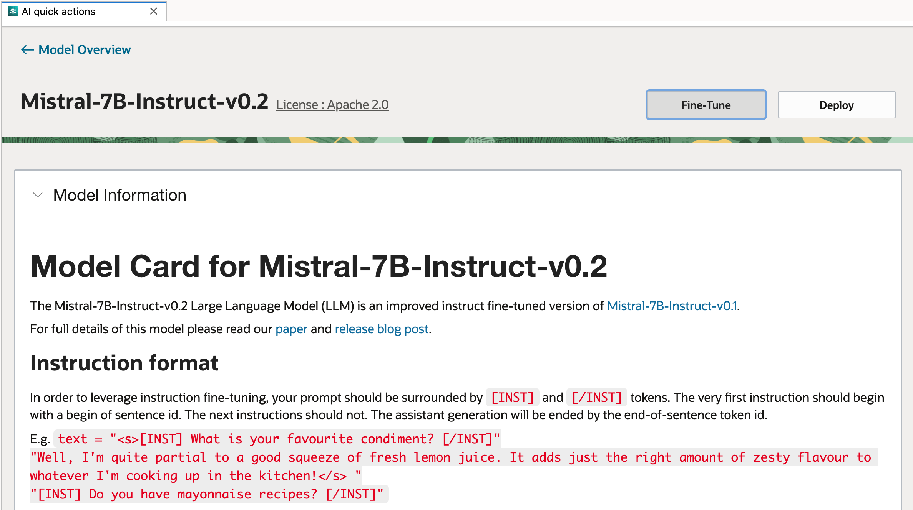
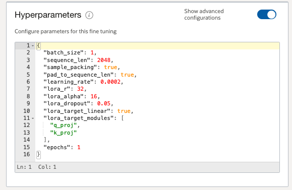
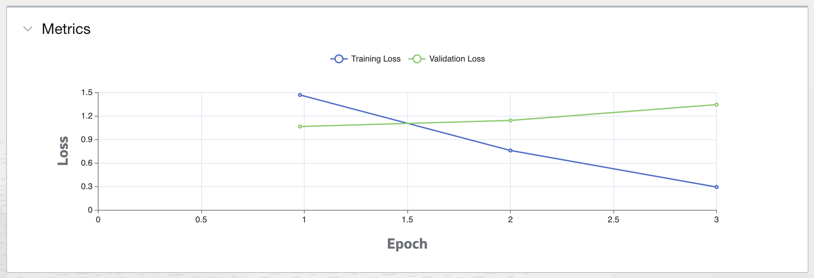

# LLM Fine-Tuning

Table of Contents:

- [Home](README.md)
- [Policies](policies/README.md)
- [CLI](cli-tips.md)
- [Model Deployment](model-deployment-tips.md)
- [Model Evaluation](evaluation-tips.md)
- [Model Registration](register-tips.md)

## Introduction

Powerful large language models (LLMs), such as Llama2 and Mistral, have been pre-trained on vast amounts of text data, enabling them to understand and generate human-like text. However, more potential of LLMs can be unlocked through fine-tuning.

Fine-tuning is the art of tailoring a pre-trained model to excel in specific tasks or domains. This customization is crucial because, despite their general proficiency, LLMs may not perform optimally on specialized tasks without further training. By fine-tuning an LLM on a domain-specific dataset, we can enhance its performance, making it more adept at understanding and responding to the nuances of that domain.

During fine-tuning, the model is trained on a new dataset containing examples that are representative of the tasks it will perform. Through fine-tuning, the model's parameters are adjusted, effectively teaching it the finer details of the task at hand. This results in a model that is not only proficient in general language skills but also fine-tuned for specific applications.

One of the most significant benefits of fine-tuning is the reduction in resources required. Training an LLM from scratch is a resource-intensive endeavor, both in terms of computational power and time. Fine-tuning, on the other hand, leverages the heavy lifting already done during the pre-training phase, requiring only a fraction of the resources to specialize the model.

The practical applications of fine-tuned LLMs are vast. From enhancing customer service ChatBots to providing more accurate healthcare suggestions, the implications are profound. In the realm of software development, fine-tuned LLMs can assist developers by providing contextually relevant code suggestions, thereby streamlining the development process.

AI Quick Actions is progressively introducing fine-tuning capabilities to more LLMs. In the model explorer, models supporting fine-tuning are displayed with the label **"Ready to Fine Tune"**.


### Method

The primary method used by AI Quick Action for fine-tuning is Low-Rank Adaptation ([LoRA](https://huggingface.co/docs/peft/main/en/conceptual_guides/lora)). LoRA stands out as a parameter-efficient fine-tuning method that allows for the adaptation of pre-trained models to specific tasks without the need to retrain the entire model. This technique is particularly beneficial for those who wish to leverage the power of LLMs while operating within the constraints of limited computational resources.

The essence of LoRA lies in its ability to freeze the pre-trained weights of a model and introduce trainable matrices at each layer of the transformer architecture. These matrices are designed to have a lower rank compared to the original weight matrices, which significantly reduces the number of parameters that need to be updated during the fine-tuning process. As a result, LoRA not only curtails the computational burden but also mitigates the risk of catastrophic forgetting—a phenomenon where a model loses its previously acquired knowledge during the fine-tuning phase.

In AI Quick Actions, the following [LoRA config parameters](https://huggingface.co/docs/peft/main/en/conceptual_guides/lora#common-lora-parameters-in-peft) are used for fine-tuning the model:

```json
{
    "r": 32,
    "lora_alpha": 16,
    "lora_dropout": 0.05,
}
```

All linear modules in the model are used as the `target_modules` for LoRA fine-tuning.

### Dataset

The success of fine-tuning LLMs heavily relies on the quality and diversity of the training dataset. Preparing a dataset for fine-tuning involves several critical steps to ensure the model can effectively learn and adapt to the specific domain or task at hand. The process begins with collecting or creating a dataset that is representative of the domain or task, ensuring it covers the necessary variations and nuances. Once the dataset is assembled, it must be preprocessed, which includes cleaning the data by removing irrelevant information, normalizing text, and possibly anonymizing sensitive information to adhere to privacy standards.

Fine-tuning with AI Quick Actions requires dataset in JSONL format. Each row in the JSONL file must be a valid JSON, and all rows in the file must have the same JSON format.

The following JSON formats are supported:

**Instruction format**:

Instruction format is mainly for fine-tuning completion model. Each JSON should contain a `prompt` and a `completion`:
```
{"prompt": "Where's the headquarter of Oracle?", "completion": "Austin, TX"}
{"prompt": "Who's Shakespeare?", "completion": "William Shakespeare was ..."}
{"prompt": "How far is New York from Boston?", "completion": "215 miles via I-95N"}
```

The `prompt` is the input to the LLM and the `completion` is the expected output from the LLM. You may want to format the `prompt` with a specific template depending on your task. For chat model, training data in instruction format will be converted to conversational format automatically, if the `chat_template` is available from the tokenizer.

**Conversational format**:

Conversational format is mainly for fine-tuning chat model. Each JSON should contain a list of `messages`, each `message` may have different `role` and `content`.
```
{"messages": [{"role": "system", "content": "You are helpful assistant."}, {"role": "user", "content": "Where's the headquarter of Oracle?"}, {"role": "assistant", "content": "Austin, TX"}]}
{"messages": [{"role": "system", "content": "You are helpful assistant."}, {"role": "user", "content": "Who's Shakespeare?"}, {"role": "assistant", "content": "William Shakespeare was ..."}]}
{"messages": [{"role": "system", "content": "You are helpful assistant."}, {"role": "user", "content": "How far is New York from Boston?"}, {"role": "assistant", "content": "215 miles via I-95N"}]}
```

Note that conversational format cannot be used for fine-tuning completion model (while `chat_template` is not available from the tokenizer).

**Dataset for Mllama Model**:

For fine-tuning [Mllama](https://huggingface.co/docs/transformers/main/model_doc/mllama) models, the images should be stored under the same directory of the JSONL file. The relative path of the image file should be specified with `file_name` in the dataset. For example:

* Instruction format:
```
{"prompt": "what is the brand of this camera?", "completion": "dakota", "file_name": "images/5566811_bc00d504a6_o.jpg"}
{"prompt": "what does the small white text spell?", "completion": "copenhagen", "file_name": "images/4920614800_0f04f8f0a4_o.jpg"}
{"prompt": "what kind of beer is this?", "completion": "ale", "file_name": "images/5721283932_bc1e954b5c_o.jpg"}
```

We support two variants of the conversational format:
```
{"conversations": [{"role": "user", "content": "what is the brand of this camera?"}, {"role": "assistant", "content": "dakota"}], "file_name": "images/5566811_bc00d504a6_o.jpg"}
{"conversations": [{"role": "user", "content": "what does the small white text spell?"}, {"role": "assistant", "content": "copenhagen"}], "file_name": "images/4920614800_0f04f8f0a4_o.jpg"}
{"conversations": [{"role": "user", "content": "what kind of beer is this?"}, {"role": "assistant", "content": "ale"}], "file_name": "images/5721283932_bc1e954b5c_o.jpg"}
```

or

```
{"conversations": [{"user": "what is the brand of this camera?", "assistant": "dakota"}], "file_name": "images/5566811_bc00d504a6_o.jpg"}
{"conversations": [{"user": "what does the small white text spell?", "assistant": "copenhagen"}], "file_name": "images/4920614800_0f04f8f0a4_o.jpg"}
{"conversations": [{"user": "what kind of beer is this?", "assistant": "ale"}], "file_name": "images/5721283932_bc1e954b5c_o.jpg"}
```

**Tokenized Data**

Alternatively, you can also use tokenized data for fine-tuning your model. For example:
```
{"input_ids":[1,733,16289,28793,995,622,347,2078,264,7526,302,...]}
{"input_ids":[1,733,16289,28793,995,460,396,16107,13892,28723,...]}
```

During fine-tuning, no formatting or tokenization will be done on tokenized data.


### Fine-Tune a Model

By clicking on one of the "Ready to Fine Tune" models, you will see more details of the model. You can initiate a fine-tuning job to create a fine-tuned model by clicking on the "Fine Tune" button.



There are a few configurations for fine-tuning the model:

- **Model Information** Here you may customize the name and description of the model.
- **Dataset** You may choose a dataset file from object storage location or select a new dataset from your notebook session. Here you will also specify the percentage of the dataset you would like to split for training/validation (evaluation).
- **Model Version Set** You may group the fine-tuned models with model version sets.
- **Results** Here you specify the object storage location for saving the outputs of the fine-tuned model. 

> **Important:** To save fine-tuned models, [versioning](https://docs.oracle.com/en-us/iaas/Content/Object/Tasks/usingversioning.htm) must be enabled on the selected bucket.

In addition, you will need to specify the infrastructure and parameters for fine-tuning job:

- **Shape** A GPU shape is required for fine-tuning. You may use either a [VM shape](https://docs.oracle.com/en-us/iaas/Content/Compute/References/computeshapes.htm#vm-gpu) or [BM shape](https://docs.oracle.com/en-us/iaas/Content/Compute/References/computeshapes.htm#bm-gpu) for larger models. Fine-tuning requires substantial computational resources, particularly memory, to store model weights, optimizer states, gradients, and the data being processed. Adequate GPU memory ensures that larger batches of data can be processed simultaneously, which can lead to more efficient fine-tuning. 
- **Replica** This is the number of nodes to be used for the fine-tuning job. Distributed training will be configured automatically when multiple GPUs are available. We recommend using single replica when possible to avoid the communication overhead between nodes, which adversely impacts the fine-tuning performance. AI Quick Actions will gradually roll out the multi-node distributed training support for larger models.
- **Networking** VCN and subnet are needed for distributed training (replica > 1). For single replica, default networking will be used automatically.
- **Logging** Logging is required for distributed training as the nodes will coordinate using logging. For single replica, logging is optional but highly recommended for debugging purpose.
- **Parameters** You can specify the number of epochs and learning rate for the fine-tuning.

### Distributed Training

Distributed training leverage multiple GPUs to parallelize the fine-tuning. Recent advancements in distributed training frameworks have made it possible to train models with billions of parameters. Frameworks like [DeepSpeed](https://www.deepspeed.ai/) and [FSDP](https://pytorch.org/blog/introducing-pytorch-fully-sharded-data-parallel-api/) have been developed to optimize distributed training. AI Quick Actions will configure the distributed training automatically when multiple GPUs are available. It is important to note that the communication between multiple nodes incurs significant overhead comparing to the communication between multiple GPUs within a single node. Therefore, it is highly recommended that single replica is used when possible. Multi-node fine-tuning may not have better performance than single node fine-tuning when the number of replica is less than 5.

### Advanced Finetuning Options

The service allows overriding default hyperparameters when creating a fine-tuned model. The basic configuration shows `epochs` and `learning rate`,
whereas the advanced configuration includes additional parameters:

- epochs: Number of times the model goes through the entire training dataset. This is a required hyperparameter.
- learning_rate: Rate at which the model updates its parameters during training to minimize loss. This is a required hyperparameter.
- sample_packing: Technique for efficient data loading in training, especially with variable-length sequences.
- batch_size: Number of training examples processed together in one iteration.
- sequence_len: Length of input sequences fed into the model during training.
- pad_to_sequence_len: Method to pad sequences to a specified length for uniformity.
- lora_r, lora_alpha, lora_dropout, lora_target_linear, lora_target_modules: Hyperparameters specific to the [LoRA](https://github.com/microsoft/LoRA) technique that significantly reduces the number of trainable parameters.

If defaults are already present for the selected Aqua model, it will show up in the advanced configuration section. If not, the additional supported hyperparameters 
can be modified and set prior to creation of the fine-tuning job.



### Training Metrics

Once the fine-tuning job is successfully submitted, a fine-tuned model will be created in the model catalog. The model details page will be displayed and the lifecycle state will be "In progress" as the job is running. At the end of each epoch, the loss and accuracy will be calculated and updated in the metrics panel.



The accuracy metric reflects the proportion of correct completions made by the model on a given dataset. A higher accuracy indicates that the model is performing well in terms of making correct completions. On the other hand, the loss metric represents the model's error. It quantifies how far the model's completions are from the actual target completions. The goal during training is to minimize this loss function, which typically involves optimizing the model's weights to reduce the error on the training data.

As the training progresses, monitoring both accuracy and loss provides insights into the model's learning dynamics. A decreasing loss alongside increasing accuracy suggests that the model is learning effectively. However, it's important to watch for signs of over-fitting, where the model performs exceptionally well on the training data but fails to generalize to new, unseen data. This can be detected if the validation loss stops decreasing or starts increasing, even as training loss continues to decline.

### Advanced Configuration Update Options

The available shapes for models in AI Quick Actions are pre-configured for fine-tuning for the models available in the Fine-Tuned model tab. 
However, if you need to add more shapes to the list of 
available options, you can do so by updating the relevant configuration file. Currently, this 
update option is only available for models that users can register.

#### For Custom Models:
To add shapes for custom models, follow these steps:

1. **Register the model**: Ensure the model is registered via AI Quick Actions UI or CLI.

2. **Navigate to the model's artifact directory**: After registration, locate the directory where the model's artifacts are stored in the object storage. 

3. **Create a configuration folder**: Inside the artifact directory, create a new folder named config. For example, if the model path is `oci://<bucket>@namespace/path/to/model/`
then create a folder `oci://<bucket>@namespace/path/to/model/config`.

4. **Add a fine-tuning configuration file**: Within the config folder, create a file named `ft_config.json` with the following content:


```
{
    "shape":
    {
        "VM.GPU.A10.1":
        {
            "batch_size": 1,
            "replica": "1-10"
        },
        "VM.GPU.A10.2":
        {
            "batch_size": 1,
            "replica": "1-10"
        },
        "BM.GPU.A10.4":
        {
            "batch_size": 1,
            "replica": 1
        },
        "BM.GPU4.8":
        {
            "batch_size": 4,
            "replica": 1
        },
        "BM.GPU.L40S-NC.4":
        {
            "batch_size": 4,
            "replica": 1
        },
        "BM.GPU.A100-v2.8":
        {
            "batch_size": 6,
            "replica": 1
        },
        "BM.GPU.H100.8":
        {
            "batch_size": 6,
            "replica": 1
        }
    },
    "finetuning_params": "--trust_remote_code True"
}
```
This JSON file lists all available shapes that can be used to fine-tune a model via AI Quick Actions. It also has additional
configuration that can be set via the configuration field.

5. Modify shapes or configuration as needed: If you want to add or remove any 
[shapes supported](https://docs.oracle.com/en-us/iaas/data-science/using/supported-shapes.htm) by 
the OCI Data Science platform, you can directly edit this `ft_config.json` file. 
6. In addition to the shapes list, you can also use other configuration listed in the above json.  Another field called 
`finetuning_params` is available if you want to explicitly pass additional parameters to the launch of the fine-tuning container. 
For example, the field `"finetuning_params": "--trust_remote_code True"` might be required if the model
needs to execute the code that resides on the Hugging Face Hub rather than natively in the Transformers library.  


Table of Contents:

- [Home](README.md)
- [Policies](policies/README.md)
- [CLI](cli-tips.md)
- [Model Deployment](model-deployment-tips.md)
- [Model Evaluation](evaluation-tips.md)
- [Model Registration](register-tips.md)
