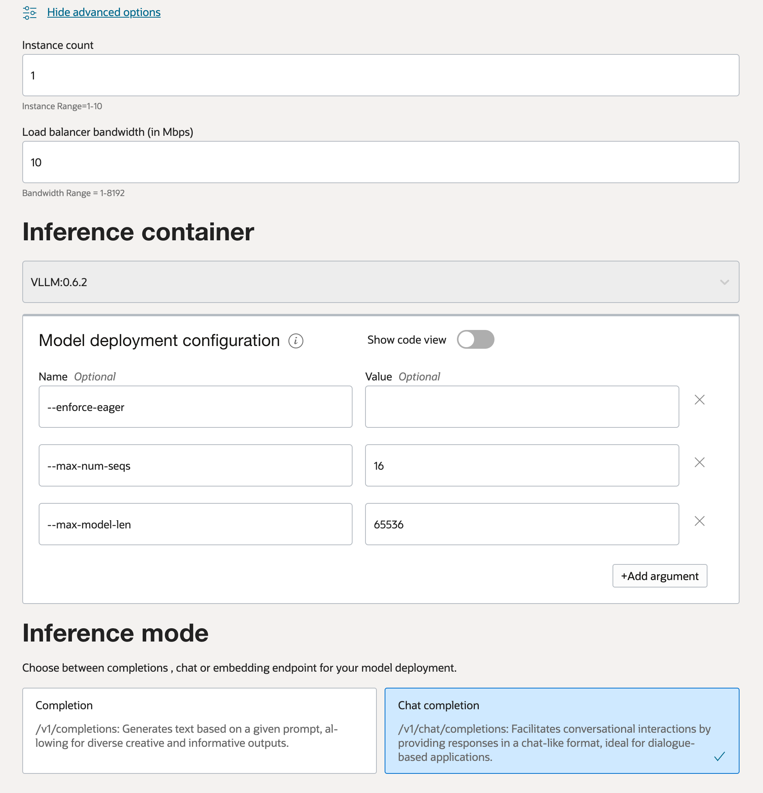

# Choosing the Right GPU Shape for Causal LLMs

## Overview

Deploying a large language model (LLM) on AI QUick Actions using the VLLM container requires careful planning of GPUs, memory, and configuration. This guide provides a step-by-step walkthrough for **decoder-only models (causal LLMs)** from Hugging Face, covering how to estimate a model’s parameter count, how different precisions (FP16, FP8, INT8, INT4) affect memory usage, how to choose an appropriate context length (`max_model_len`), and how to match these requirements to Oracle Cloud Infrastructure (OCI) GPU shapes (e.g. NVIDIA H100, A100, L40S). We also compare performance-optimized vs cost-optimized setups and provide example AI QUick Actions configuration (environment variables) for VLLM.

**Note:** This guide is focused on *decoder-only* LLMs (causal models). The guidance may not directly apply to encoder-decoder models or non-Hugging Face frameworks.


## Estimating Model Parameters and Memory Requirements

Before choosing hardware, start by determining **how large the model is** in terms of parameters, and how much GPU memory it will need under different precision levels.


### Getting the Model’s Parameter Count

The number of parameters (**param count**) is usually given in the model’s description on Hugging Face. For example, LLaMA 3 comes in sizes like 8B, 70B, and 405B parameters (8 billion, 70 billion, 405 billion parameters). Often the model name itself or the README will mention this. If it’s not obvious, here are ways to find it:

* **Check the Hugging Face model card:** Many model cards include a line about the number of parameters. For instance, a Llama 2 13B model’s card might mention *“This model has 13 billion parameters.”* If the model is a well-known size (7B, 13B, etc.), you can trust that as the param count.

* **Use the Hugging Face Transformers library:** If the model card doesn’t specify the parameter count, you can programmatically load the model’s configuration or weights to calculate it. Be cautious with very large models, as loading them fully will require substantial memory. For a rough count, you can do something like:

  ```python
  from transformers import AutoModelForCausalLM
  model = AutoModelForCausalLM.from_pretrained("<huggingface-model-id>", trust_remote_code=True)
  print(f"Number of parameters: {model.num_parameters():,}")
  ```

  This will print out the total number of parameters. For extremely large models, consider using just the configuration or a smaller variant to infer the size.

* **Estimate parameter count by summing model file sizes from the Hugging Face Hub:** This method assumes FP16 precision, where each parameter occupies 2 bytes.

  ```python
  from huggingface_hub import model_info

  model_name = "<huggingface-model-id>"
  info = model_info(model_name, files_metadata=True)
  weight_files = [
      f for f in info.siblings if f.rfilename.endswith((".bin", ".safetensors"))
  ]
  total_bytes = sum(f.size for f in weight_files if f.size)

  if total_bytes == 0:
      raise ValueError("No model weight files found or sizes missing.")

  # Assume FP16 (2 bytes per parameter)
  estimated_params = total_bytes // 2
  print(f"Estimated number of parameters: {estimated_params:,}")
  ```

  This approach provides an estimate based on the total size of the model's weight files.


* **Look up known architectures:** If the model is an implementation of a known architecture, you can often find parameter counts in documentation or community resources. For example, LLaMA 3 models are available in sizes like 8B, 70B, and 405B parameters, while Mistral 7B has approximately 7.3B parameters. Often, the model name itself or the README will mention this. If it’s not obvious, the methods above can help you determine the parameter count.

### Calculating Memory Usage at Different Precisions

Model weights can be loaded at different precision levels, which directly affects memory footprint. Here’s how to estimate memory usage from the parameter count:

* **FP32 (32-bit floating point):** *Typically used for training, rarely for inference.* Each parameter uses 4 bytes. Memory required ≈ 4 × (number of parameters). For a 13B model, FP32 would be roughly 52 GB (which is often impractical for inference).
* **FP16 or BF16 (16-bit floating point):** Common for inference. Each parameter uses 2 bytes. Memory ≈ 2 × (number of params). A 13B model in FP16 is about **26 GB**. (7B → \~14 GB, 70B → \~140 GB, etc.)
* **FP8 (8-bit floating point) or INT8 (8-bit integer):** These use 1 byte per parameter (with some minor overhead for scales, depending on method). Memory ≈ 1 × (number of params). A 13B model at 8-bit is about **13 GB**. Similarly, a 70B model int8 is \~70 GB. *(Note: FP8 is a newer format supported on latest GPUs like H100/L40S. INT8 is more widely supported via libraries like bitsandbytes. Both give \~50% memory savings vs FP16.)*
* **INT4 (4-bit integer):** Uses 0.5 bytes per parameter (2 parameters per byte). Memory ≈ 0.5 × (number of params). A 13B model 4-bit is \~6.5 GB; a 70B model 4-bit is \~35 GB. This drastically reduces memory, albeit with some loss in model fidelity.

In general, **halving the bit-width roughly halves the memory**. For example, a 70B model requires \~140 GB in FP16, \~70 GB in 8-bit, and \~35 GB in 4-bit. Those translate to hardware requirements of roughly **two 80 GB GPUs for FP16, one 80 GB GPU for INT8, or one 40 GB GPU for INT4** in that example.

**Keep some overhead in mind:**
The calculations above estimate memory usage based solely on the model’s weights. However, in practice, additional memory will be used at runtime for several reasons:

* **Model metadata and optimizer structures:** These typically add only a small overhead during inference—usually a few hundred megabytes or less.
* **Activation memory and GPU buffers:** This varies depending on the framework. For example, VLLM aims to maximize GPU utilization by default, pre-allocating buffers and using up to 90% of available GPU memory for efficiency.
* **Safety margin:** It's important not to target 100% GPU usage. For example, on a 40 GB GPU, it’s safer to aim for around 36–38 GB (90–95%) to prevent out-of-memory errors. VLLM’s default `--gpu-memory-utilization` is set to `0.9` (90%) to leave appropriate headroom.


So, if your model weights are calculated at 40 GB, one 40 GB GPU *might* be tight – consider a slightly larger GPU or a lower precision to be safe. For example, a 13B model (\~26 GB in FP16) fits comfortably on a 40 GB GPU with room to spare, but a 70B model (\~70 GB in INT8) would not fit on a 64 GB GPU if fully utilized (70 > 64). Always choose hardware with a bit more memory than the raw model size.

**Memory vs Precision Summary:** *(approximate per number of parameters)*

* 1 billion params ≈ 2 GB in FP16, 1 GB in INT8, 0.5 GB in INT4.
* 7B params ≈ 14 GB (FP16), 7 GB (INT8), 3.5 GB (INT4).
* 13B params ≈ 26 GB (FP16), 13 GB (INT8), 6.5 GB (INT4).
* 70B params ≈ 140 GB (FP16), 70 GB (INT8), 35 GB (INT4).

Using this, you can estimate how many GPUs or which GPU memory size you’ll need (we’ll match to specific OCI shapes in a later section).


---

### Choosing an Appropriate Context Length (`max_model_len`)

**`max_model_len`** in VLLM defines the maximum *context length* (in tokens) that the model will support for prompts + generated output. This typically corresponds to the model’s context window (max tokens in input + output). Choosing this value is a balance between your application needs and resource usage:

* **Model default vs custom setting:** By default, VLLM will use the max context length from the model’s config (for example, many Llama 2 models default to 4096 tokens). If your use case doesn’t require longer input or output, it’s best to stick with the default. If you need to handle longer text (say summarizing long documents or chats with long histories), you may want to increase `max_model_len` to 8k, 16k, or more.

* **Impact on GPU memory:** A larger context window primarily affects the memory used for the model’s **KV cache** (the attention key/value tensors stored for each token). The KV cache size scales linearly with `max_model_len`. In technical terms, memory for KV cache ≈ `hidden_size * 2 * max_model_len * bytes_per_value`. This grows with the number of tokens. For example, a model with hidden size \~5120 (like Llama-2 13B) in FP16 uses about 20 KB per token of context. So:

  * 2048 tokens \~ 40 MB for KV.
  * 4096 tokens \~ 80 MB.
  * 8192 tokens \~ 160 MB.
  * 32,000 tokens (if you attempt very long) \~ 640 MB.

  For a larger model with hidden size \~8192 (Llama-2 70B), 4096 tokens is \~128 MB and 32k tokens is on the order of 1 GB. So, **very long context can consume multiple gigabytes** if you push to extremes. VLLM will **pre-allocate the memory for the maximum sequence length** to ensure it can handle the worst case without OOM during runtime. This means if you set an extremely high `max_model_len`, you’ll see higher base memory usage even if your actual prompts are shorter.

* **Impact on performance:** Longer context not only uses more memory but can also *slow down inference* for long sequences. The attention mechanism in standard transformers scales roughly O(N^2) with the sequence length for each output token. So generation is a bit slower if the context is very large. If your use-case doesn’t require long prompts or outputs, keeping `max_model_len` smaller (e.g. 2048 or 4096) will be more efficient.

Choose `max_model_len` to cover your anticipated prompt + response length. If unsure, stick with the model’s default (often 2048 or 4096 tokens for many HuggingFace LLMs). Only increase it if you know you need longer texts, and then pick a sensible limit (e.g. 8192) rather than the maximum possible, to conserve memory. Always set `VLLM_ALLOW_LONG_MAX_MODEL_LEN=1` if you go beyond the default, and ensure your GPU has the memory headroom for the larger cache.

---

## Selecting OCI GPU Shapes to Meet Requirements

Once you know roughly how much memory you need for your model (from parameter count and chosen precision) and your context window, you can decide **how many GPUs and which type of GPU** you’ll need. OCI offers various GPU instance shapes with different GPU models and memory sizes.
For detailed pricing, availability, and region support, refer to the [OCI GPU documentation](https://docs.oracle.com/en-us/iaas/Content/Compute/References/computeshapes.htm).


| Shape Name       | GPU Count | Total GPU Memory (GB) | GPU Type |
| ---------------- | --------- | --------------- | -------- |
| BM.GPU.A10.4     | 4         | 96              | A10      |
| BM.GPU.A100-V2.8 | 8         | 640             | A100     |
| BM.GPU.B4.8      | 8         | 320             | A100     |
| BM.GPU.H100.8    | 8         | 640             | H100     |
| BM.GPU.H200.8    | 8         | 1128            | H200     |
| BM.GPU.L40S-NC.4 | 4         | 192             | L40S     |
| BM.GPU.L40S.4    | 4         | 192             | L40S     |
| BM.GPU.MI300X.8  | 8         | 1536            | MI300X   |
| BM.GPU2.2        | 2         | 32              | P100     |
| BM.GPU3.8        | 8         | 128             | V100     |
| BM.GPU4.8        | 8         | 320             | A100     |
| VM.GPU.A10.1     | 1         | 24              | A10      |
| VM.GPU.A10.2     | 2         | 48              | A10      |
| VM.GPU.A10.4     | 4         | 96              | A10      |
| VM.GPU2.1        | 1         | 16              | P100     |
| VM.GPU3.1        | 1         | 16              | V100     |
| VM.GPU3.2        | 2         | 32              | V100     |
| VM.GPU3.4        | 4         | 64              | V100     |

**OCI Shape examples:**

* **NVIDIA H100 (80 GB HBM per GPU):** OCI offers shapes with H100 GPUs (e.g., a bare-metal shape `BM.GPU.H100.8` has 8× H100 GPUs, each 80 GB). H100s are top-of-the-line for performance and have large memory. A single H100 (80 GB) can handle models up to \~80 GB in 16-bit – for instance, one 80 GB H100 can host a \~70B model in 8-bit (\~70 GB) or even a 70B in 4-bit (\~35 GB) comfortably. With 8 H100s (640 GB total), you can handle extremely large models or multiple models. H100 also supports FP8 precision for extra speed if using that.
* **NVIDIA A100 (40 GB or 80 GB):** OCI’s older GPU shapes include A100s. For example, `BM.GPU4.8` is 8× A100 40 GB (total 320 GB), and `BM.GPU.A100-V2.8` is 8× A100 80 GB (total 640 GB). A single 40 GB A100 can handle up to \~20B in FP16 or \~40B in 8-bit. The 80 GB version doubles that capacity. If your model is slightly above 40 GB, the 80 GB A100 or using two 40 GB A100s in parallel are options.
* **NVIDIA L40S (48 GB each):** OCI’s `BM.GPU.L40S.4` shape has 4× L40S GPUs, each with 48 GB of GDDR6 memory (total 192 GB). The L40S (based on Ada Lovelace architecture) sits between A100 and H100 in capability. 48 GB is slightly larger than the 40 GB A100, making it a great target for models that need a bit more than 40 GB but not as much as 80 GB. For example, a 70B model quantized to 4-bit (\~35 GB) fits on one L40S GPU, and a 70B int8 (\~70 GB) could span two L40S GPUs (2×48=96 GB, which covers 70 GB with room to spare). All 4 L40S (192 GB total) could comfortably host a 70B in FP16 (140 GB) across them, with VLLM splitting layers among the 4 GPUs. L40S also supports FP8 acceleration, so you could run FP8 inference for speed if the model is loaded in 8-bit.
* **Other GPUs (V100, A10, etc.):** OCI also has smaller GPUs like V100 (16 GB) or A10 (24 GB) in some shapes. These can only handle smaller or heavily quantized models:

  * A single 16 GB V100 might run a 7B model in FP16 (14 GB – slightly under the limit, might need int8 to fit safely) or a 13B model in 4-bit (\~6.5 GB, which fits easily).
  * A 24 GB A10 can handle a 13B model in 8-bit (\~13 GB) or possibly 20B in 4-bit (\~10 GB).
  * These older GPUs lack Tensor cores for INT4/FP8 acceleration, so int4 might run slower. When possible, use Ampere or newer (A100/L40S/H100) for better quantized performance.


---

## Performance-Optimized vs Cost-Optimized Configurations

There is often a trade-off between **maximum performance** and **lower cost**. Here are considerations for tuning your deployment either way:

* **Performance-Optimized Setup:**

  * Use FP16 or BF16 weights. This maximizes the model’s accuracy and avoids any loss from quantization. It may also be slightly faster per token generation in some cases, since no de-quantization overhead is needed (though well-optimized int8/int4 kernels can actually be *faster* due to memory savings, as we’ll see).
  * Choose the latest GPUs (H100 or L40S) which offer greater throughput. H100 has faster Tensor Cores and new features like FP8 support, yielding higher token generation rates. For example, an L40S using FP8 can generate about **1.4× more tokens per second** than an A100 on FP16 for the same model.
  * Over-provision memory so that you’re not at the limit. This might mean using multiple GPUs in parallel even if one could barely fit the model. The extra memory can be used for larger batch sizes or longer contexts without performance degradation.
  * You might still use bfloat16 (BF16) or TF32 or other slight optimizations, but generally avoid 4-bit quantization in a perf-oriented setup. (An exception is if a quantized model actually speeds up decoding due to lower memory bandwidth – e.g., some int4 implementations improve speed since the model size is smaller in GPU memory, reducing memory bottlenecks. If you have an int4 method that maintains accuracy, you might get both speed and memory benefits.)


* **Cost-Optimized Setup:**

  * Use int8 or int4 quantization to drastically cut memory needs. Modern techniques like GPTQ or AWQ (Activation-Aware Quantization) preserve most of the model’s accuracy even at 4 bits. There might be a slight drop in text generation quality or consistency, but often it’s minor for many tasks. Quantization can *also* improve speed for large models, because the reduced model size means less data to move from GPU memory each token (LLM inference is often memory-bandwidth-bound).
  * If you don’t need very large context windows, keep `max_model_len` moderate to save memory. Also, serving one request at a time (smaller batch size) will use less memory for temporary activations than trying to serve many queries simultaneously – VLLM is quite efficient with multiple sequences, but concurrency still uses more memory.
  * If cutting-edge performance isn’t required, you might use previous-gen GPUs that are cheaper. For example, A10 24GB GPUs are less expensive than A100s. Four A10 GPUs (96 GB total) could run a 70B int4 model for a lower price than a single H100, albeit slower. Keep in mind older GPUs might not support features like FP8 or have slower memory, which can reduce throughput.


---

## Configuring VLLM Parameters in AI QUick Actions

After finalizing your model selection and hardware configuration, the last step is to configure the deployment.

In **AI Quick Actions**, you’ll specify the container image and provide a set of environment variables to customize its runtime behavior. These variables are passed directly into the container and interpreted by the VLLM backend to control performance, memory usage, and model behavior.

Here are some of the key parameters and their effects:

* **Context Length (`--max-model-len`)**
  This flag controls the maximum sequence length (in tokens) the model can process in a single request. Increasing this value allows for longer prompts and completions but increases memory usage. You should balance this against your GPU memory constraints.

* **GPU Memory Utilization (`--gpu-memory-utilization`)**
  By default, VLLM is configured to utilize up to 90% of available GPU memory. You can override this value to be more conservative (e.g., `0.85`) or more aggressive (e.g., `0.95`) depending on your use case. This flag helps prevent out-of-memory (OOM) errors by leaving a safety buffer for system overhead and activation memory.

* **Maximum Concurrent Sequences (`--max-num-seqs`)**
  This parameter limits the number of sequences (i.e., requests) that can be processed concurrently by a single worker. Reducing this value may improve latency for individual requests, while increasing it can improve overall throughput, assuming sufficient GPU resources.

* **Quantization Mode (`--quantization`)**
Enables model quantization to reduce memory footprint and potentially improve inference speed. For example, setting --quantization fp8 uses 8-bit floating point weights. This can be helpful when deploying larger models on limited GPU memory, though it may impact model accuracy slightly depending on the model architecture.

To set these values in AI Quick Actions, go to the **"Model Deployment Configuration"** section under **Advanced Options**, where you can define custom VLLM parameters.

For more tuning options, refer to the [VLLM documentation](https://vllm.readthedocs.io/).



---


## Full Deployment Examples: Deploying LLaMA 3 Models with vLLM on OCI

This section provides comprehensive deployment configurations for LLaMA 3 models using vLLM on OCI. Each example includes detailed estimations for GPU requirements, considerations for the `max-model-len` parameter, and specific vLLM configurations.

### Example 1: Deploying LLaMA 3 70B with FP16 Precision on BM.GPU.H100.8

**Model Specifications**:

* **Model**: LLaMA 3 70B
* **Precision**: FP16 (16-bit floating point)
* **Number of Parameters**: 70 billion
* **Maximum Sequence Length**: Configurable via `--max-model-len` (e.g., 8192 tokens)

**Resource Estimations**:

* **Model Weights Memory**: 70B parameters × 2 bytes = 140 GB
* **KV Cache Memory** (for 8k tokens): Approximately 5 GB
* **Additional Overhead**: ~10-15 GB
* **Total Estimated GPU Memory**: ~160 GB

**Recommended OCI Shape**:

* **Shape**: BM.GPU.H100.8
* **GPU**: 8 × NVIDIA H100 (80 GB each)
* **Total GPU Memory**: 640 GB


### Example 2: Deploying LLaMA 3 70B with FP8 Quantization on BM.GPU.A10.4

**Model Specifications**:

* **Model**: LLaMA 3 70B
* **Precision**: FP8 (8-bit floating point)
* **Quantization**: Weight-only FP8 (W8A16)
* **Maximum Sequence Length**: 8192 tokens

**Resource Estimations**:

* **Model Weights Memory**: Approximately 70B parameters × 1 byte = 70 GB
* **KV Cache Memory** (for 8k tokens): Approximately 5 GB
* **Additional Overhead**: ~10-15 GB
* **Total Estimated GPU Memory**: ~85-90 GB

**Recommended OCI Shape**:

* **Shape**: BM.GPU.A10.4
* **GPU**: 4 × NVIDIA A10 (24 GB each)
* **Total GPU Memory**: ~96 GB

**Additional VLLM Parameters**
* `--quantization fp8`
* `--gpu-memory-utilization 0.98`
* `--max-num-seqs 2`
* `--max_model_len 8192`

**Considerations**:

* While FP8 quantization significantly reduces memory requirements, deploying a 70B model on A10 GPUs is challenging due to limited memory.
* CPU offloading helps manage memory usage by transferring part of the model to CPU memory.
* Limiting the number of concurrent sequences (`--max-num-seqs`) helps maintain performance stability.