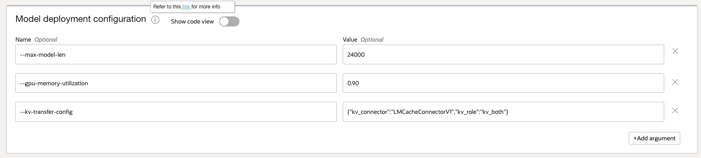
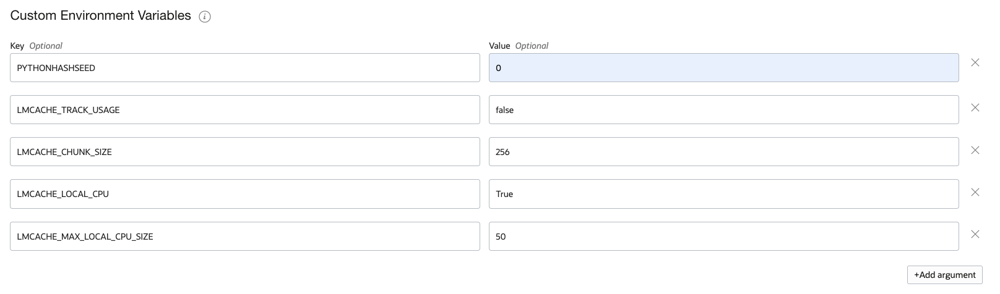

# Enable LMCache for an LLM Deployment (AI Quick Actions)

This guide shows how to deploy an LLM with **LMCache** enabled using **AI Quick Actions** (AQUA) in the OCI Console. Currently, AI Quick Actions supports configuring LMCache with CPU RAM as backend.

## Deploy LLM with LMCache Enabled

1. In the OCI Console, navigate to **Data Science** -> **Notebook sessions**.
2. Open your notebook session, then go to **Launcher** -> **AI Quick Actions**.
3. Search for and select the model. This example uses the granite model as an example.

   - `ibm-granite/granite-3.3-8b-instruct`

4. Click **Deploy** and configure the following settings:

   - **Model name**: change to `ibm-granite/granite-3.3-8b-instruct`
   - **GPU shape**: select **VM.GPU.A10.1** (or larger). This shape (or larger) is recommended for this model.
   - **Logging**: select your **Log Group** and **Log** for monitoring.

5. Under **Show Advanced Options**, add the following to the **Model deployment configuration**.

   > **Important:** Ensure there are **no spaces** in the value provided for the `kv-transfer-config` key.

   ```text
   --max-model-len 24000 --gpu-memory-utilization 0.90 --kv-transfer-config {"kv_connector":"LMCacheConnectorV1","kv_role":"kv_both"}
   ```
   
    In the UI, these model deployment configuration parameters will be added as:
    

6. In **Environment Variables**, add the following LMCache parameters:

   | Name | Value | Purpose |
   |---|---:|---|
   | `PYTHONHASHSEED` | `0` | Ensures deterministic hashing for cache key generation |
   | `LMCACHE_TRACK_USAGE` | `false` | Disables usage tracking |
   | `LMCACHE_CHUNK_SIZE` | `256` | Size of KV cache chunks in tokens |
   | `LMCACHE_LOCAL_CPU` | `True` | Enables CPU memory as the cache storage backend |
   | `LMCACHE_MAX_LOCAL_CPU_SIZE` | `50` | Maximum CPU cache size in GB |

    In the UI, these model deployment configuration parameters will be added as: 
    

    
7. Click **Deploy** and wait for the deployment to complete (approximately **15–20 minutes**).
8. Monitor the deployment by clicking **Open logs in terminal**.


## Practical Considerations

By default, LMCache sets 5.0 GB as the CPU cache size. A practical way is to size LMCACHE_MAX_LOCAL_CPU_SIZE so it comfortably holds the typical KV "working set" for your model plus overhead, then refine it with metrics. For large models (e.g., 70B) for multi-turn workloads with many concurrent sessions, start with a base of 50-100GB, and for smaller models (e.g., 7B/13B), 20–50GB is often more than sufficient for significant context caching.

