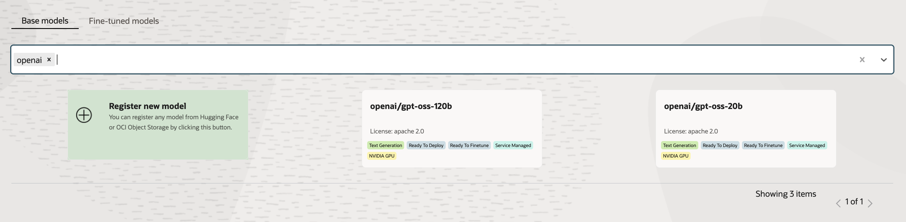
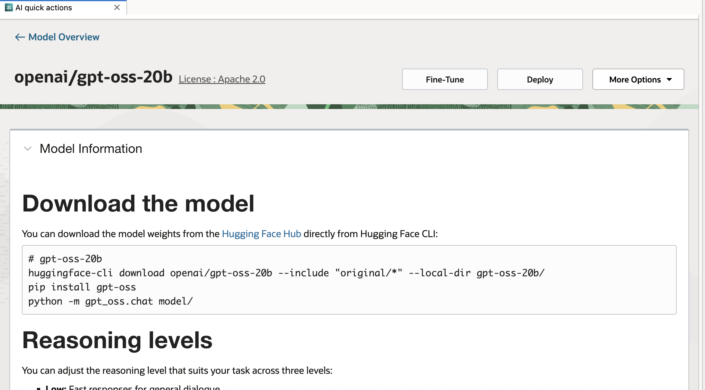
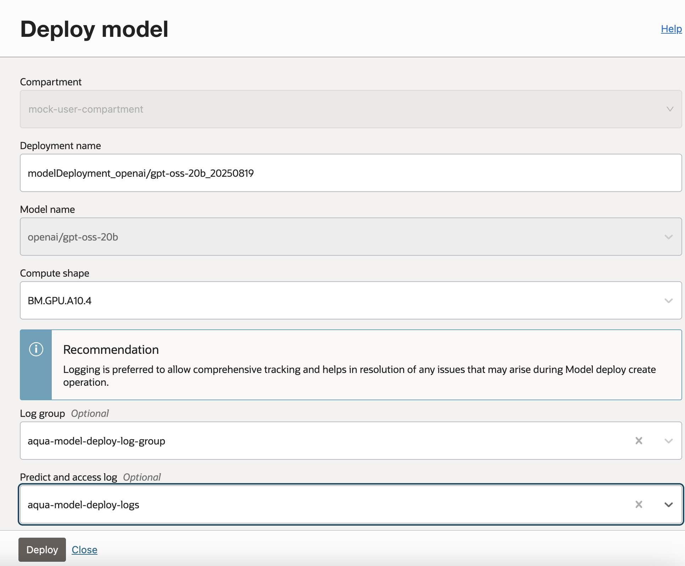

# Model Deployment - GPT-OSS

OpenAI has announced the release of [two open weight models](https://openai.com/index/introducing-gpt-oss/), gpt-oss-120b and gpt-oss-20b, their first open-weight language models since GPT‑2.  According to OpenAI, their performance are on par or exceed OpenAI's internal models, and both models perform strongly on tool use, few-shot function calling, CoT reasoning and HealthBench. 

Here are the new OpenAI open weight models: 

* gpt-oss-120b — designed for production, general-purpose and high-reasoning use cases. The model has 117B parameters with 5.1B active parameters
* gpt-oss-20b — designed for lower latency and local or specialized use cases. The model has 21B parameters with 3.6B active parameters

Both models are now available in OCI Data Science AI Quick Actions.  The models are cached in our service and readily available to be deployed and fine tuned, without the need for customers to bring in the model artifacts from external sites. By using AI Quick Actions, customers can leverage our service managed container with the latest vllm version that supports both of the models, eliminating the need to build or bring your own container for working with the models. 

## Deploying an LLM

After picking a model from the model explorer, if the "Deploy Model" is enabled you can use this
form to quickly deploy the model:

To know more on model deployments you can refer [Model Deployment Tips](model-deployment-tips.md) page.