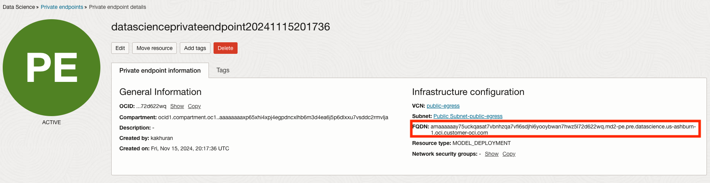

## Introduction to Model Deployment Private Endpoints
OCI Data Science Model Deployment service now supports a way for customers to access their Model Deployments via a private network.Enterprise customers, in some use cases, require that their Model Deployment traffic does not traverse the public internet. With model deployment private endpoint support, these private endpoints ensure that the inference traffic remains within the customer's private network and all other traffic is rejected, enhancing security and compliance.
Please refer to [OCI DataScience Private Endpoints](https://docs.oracle.com/en-us/iaas/data-science/using/pe-network.htm) document for more details.

## PREREQUISITE

Before you begin, ensure that you complete the following steps in this order.
- Create a private endpoint for model deployment resource
- Crate a model deployment with private endpoint created in the previous step.

## Creating a Private Endpoint for Model Deployment
* Log into OCI console.
* Under Data Science, click Private endpoints.
* Click Create private endpoint.
* (Optional) In the Create private endpoint panel, enter a name to identify the private endpoint.
* (Optional) Enter a description.
* Select the VCN that's created to provide private access.
* Select the subnet that has the private endpoint you want to use.
* (Optional) Enter a subdomain for the private endpoint up to 60 characters.
  * For Resource Type, select **MODEL_DEPLOYMENT** from the drop-down menu.
* Click Create to create the private endpoint.

## Configuring a Private Endpoint for a Model Deployment
* Go to AI Quick Actions
* Click on Deployments
* Click on Create deployment
* Under model name select the desired vision model
* (Optional) Select Shape
* (Optional) Select log group and log
* Click Show advanced options
* (Required) Under `Inference mode`, select `v1/chat/completions` from the dropdown
* (Optional) Under Private endpoint, select a private endpoint from the drop-down.
  * **PREREQUISITE**  Private Endpoint for a model deployment resource must be created.
* Click on Deploy

## Test Your Model

### Using oci-cli
When making an inference request for a private model deployment, the model_deployment_url should be a FQDN. 
This is FQDN is defined in private endpoint information page on the console as shown below



```bash
oci raw-request --http-method POST --target-uri <FQDN>/<md-ocid>/predict --request-body '{
        "model": "odsc-llm",
        "prompt":"what are activation functions?",
        "max_tokens":250,
        "temperature": 0.7,
        "top_p":0.8,
    }' --auth <auth_method>
```