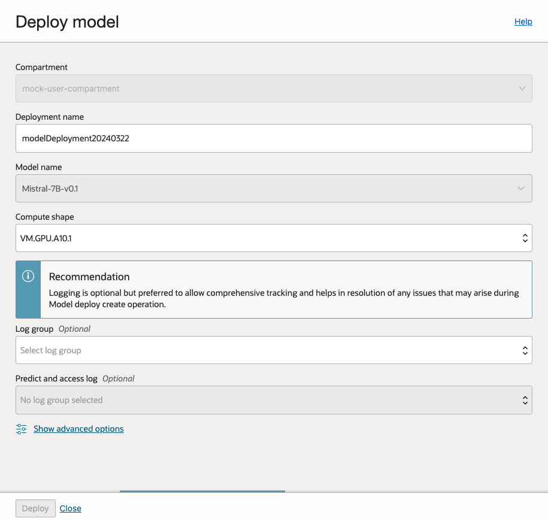
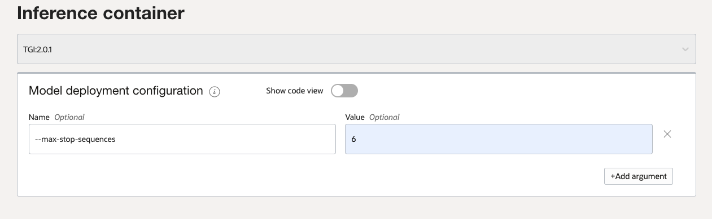
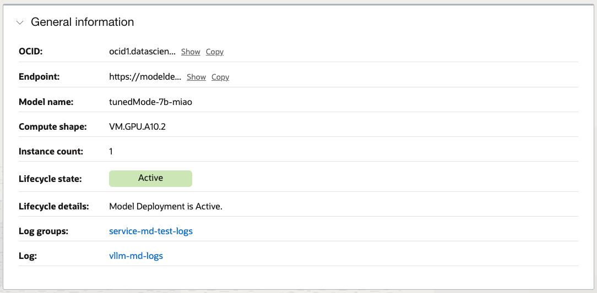

# Model Deployment

Table of Contents:

- [Home](README.md)
- [Policies](policies/README.md)
- [CLI](cli-tips.md)
- [Model Fine Tuning](fine-tuning-tips.md)
- [Model Evaluation](evaluation-tips.md)
- [Model Registration](register-tips.md)

## Introduction to Model Inference and Serving

The Data Science server has prebuilt service containers that make deploying and serving a large 
language model very easy. Either one of [vLLM](https://github.com/vllm-project/vllm) (a high-throughput and memory-efficient inference and serving
engine for LLMs) or [TGI](https://github.com/huggingface/text-generation-inference) (a high-performance text generation server for the popular open-source LLMs) is used in the service container to host the model, the end point created
supports the OpenAI API protocol.  This allows the model deployment to be used as a drop-in
replacement for applications using OpenAI API. Model deployments are a managed resource in 
the OCI Data Science service. For more details about Model Deployment and managing it through 
the OCI console please see the [OCI docs](https://docs.oracle.com/en-us/iaas/data-science/using/model-dep-about.htm).

### Prerequisites
1. Ensure that the necessary [policies](policies/README.md) are enacted.
2. Create an OCI Object Storage Bucket with Object Versioning.


### Deploying an LLM

After picking a model from the model explorer, if the "Deploy Model" is enabled you can use this
form to quickly deploy the model:



The compute shape selection is critical, the list available is selected to be suitable for the 
chosen model.

- VM.GPU.A10.1 has 24GB of GPU memory and 240GB of CPU memory. The limiting factor is usually the
GPU memory which needs to be big enough to hold the model.
- VM.GPU.A10.2 has 48GB GPU memory
- BM.GPU.A10.4 has 96GB GPU memory and runs on a bare metal machine, rather than a VM.

For a full list of shapes and their definitions see the [compute shape docs](https://docs.oracle.com/en-us/iaas/Content/Compute/References/computeshapes.htm)

The relationship between model parameter size and GPU memory is roughly 2x parameter count in GB, so for example a model that has 7B parameters will need a minimum of 14 GB for inference. At runtime the
memory is used for both holding the weights, along with the concurrent contexts for the user's requests.

The model will spin up and become available after some time, then you're able to try out the model 
from the deployments tab using the test model, or programmatically.


### Advanced Deployment Options

The service allows for model deployment configuration to be overridden when creating a model deployment. Depending on 
the type of inference container used for deployment, i.e. vLLM or TGI, the parameters vary and need to be passed with the format 
`(--param-name, param-value)`.

For more details, please visit [vLLM](https://docs.vllm.ai/en/latest/serving/openai_compatible_server.html#command-line-arguments-for-the-server) or 
[TGI](https://huggingface.co/docs/text-generation-inference/en/basic_tutorials/launcher) documentation to know more about the parameters accepted by the respective containers. 




### Inferencing Model

#### Using oci-cli

```bash
oci raw-request --http-method POST --target-uri https://modeldeployment.us-ashburn-1.oci.oc-test.com/ocid1.datasciencemodeldeployment.oc1.iad.xxxxxxxxx/predict --request-body '{
        "model": "odsc-llm",
        "prompt":"what are activation functions?",
        "max_tokens":250,
        "temperature": 0.7,
        "top_p":0.8,
    }' --auth <auth_method>
```

Note: Currently `oci-cli` does not support streaming response, use Python or Java SDK instead.


#### Using Python SDK (without streaming)

```python
# The OCI SDK must be installed for this example to function properly.
# Installation instructions can be found here: https://docs.oracle.com/en-us/iaas/Content/API/SDKDocs/pythonsdk.htm
 
import requests
import oci
from oci.signer import Signer
from oci.config import from_file

config = from_file('~/.oci/config')
auth = Signer(
    tenancy=config['tenancy'],
    user=config['user'],
    fingerprint=config['fingerprint'],
    private_key_file_location=config['key_file'],
    pass_phrase=config['pass_phrase']
)

# For security token based authentication
# token_file = config['security_token_file']
# token = None
# with open(token_file, 'r') as f:
#     token = f.read()
# private_key = oci.signer.load_private_key_from_file(config['key_file'])
# auth = oci.auth.signers.SecurityTokenSigner(token, private_key)

endpoint = "https://modeldeployment.us-ashburn-1.oci.oc-test.com/ocid1.datasciencemodeldeployment.oc1.iad.xxxxxxxxx/predict"
body = {
    "model": "odsc-llm", # this is a constant
    "prompt": "what are activation functions?",
    "max_tokens": 250,
    "temperature": 0.7,
    "top_p": 0.8,
}

res = requests.post(endpoint, json=body, auth=auth, headers={}).json()

print(res)
```

#### Using Python SDK (with streaming)

To consume streaming Server-sent Events (SSE), install [sseclient-py](https://pypi.org/project/sseclient-py/) using `pip install sseclient-py`.

```python
# The OCI SDK must be installed for this example to function properly.
# Installation instructions can be found here: https://docs.oracle.com/en-us/iaas/Content/API/SDKDocs/pythonsdk.htm
 
import requests
import oci
from oci.signer import Signer
from oci.config import from_file
import sseclient # pip install sseclient-py

config = from_file('~/.oci/config')
auth = Signer(
    tenancy=config['tenancy'],
    user=config['user'],
    fingerprint=config['fingerprint'],
    private_key_file_location=config['key_file'],
    pass_phrase=config['pass_phrase']
)

# For security token based authentication
# token_file = config['security_token_file']
# token = None
# with open(token_file, 'r') as f:
#     token = f.read()
# private_key = oci.signer.load_private_key_from_file(config['key_file'])
# auth = oci.auth.signers.SecurityTokenSigner(token, private_key)

endpoint = "https://modeldeployment.us-ashburn-1.oci.oc-test.com/ocid1.datasciencemodeldeployment.oc1.iad.xxxxxxxxx/predict"
body = {
    "model": "odsc-llm", # this is a constant
    "prompt": "what are activation functions?",
    "max_tokens": 250,
    "temperature": 0.7,
    "top_p": 0.8,
    "stream": True,
}

headers={'Content-Type':'application/json','enable-streaming':'true', 'Accept': 'text/event-stream'}
response = requests.post(endpoint, json=body, auth=auth, stream=True, headers=headers)

print(response.headers)

client = sseclient.SSEClient(response)
for event in client.events():
    print(event.data)

# Alternatively, we can use the below code to print the response.
# for line in response.iter_lines():
#    if line:
#        print(line)
```

#### Using Java (with streaming)

```java
/**
 * The OCI SDK must be installed for this example to function properly.
 * Installation instructions can be found here: https://docs.oracle.com/en-us/iaas/Content/API/SDKDocs/javasdk.htm
 */
package org.example;

import com.oracle.bmc.auth.AuthenticationDetailsProvider;
import com.oracle.bmc.auth.SessionTokenAuthenticationDetailsProvider;
import com.oracle.bmc.http.ClientConfigurator;
import com.oracle.bmc.http.Priorities;
import com.oracle.bmc.http.client.HttpClient;
import com.oracle.bmc.http.client.HttpClientBuilder;
import com.oracle.bmc.http.client.HttpRequest;
import com.oracle.bmc.http.client.HttpResponse;
import com.oracle.bmc.http.client.Method;
import com.oracle.bmc.http.client.jersey.JerseyHttpProvider;
import com.oracle.bmc.http.client.jersey.sse.SseSupport;
import com.oracle.bmc.http.internal.ParamEncoder;
import com.oracle.bmc.http.signing.RequestSigningFilter;

import javax.ws.rs.core.MediaType;
import java.io.BufferedReader;
import java.io.InputStream;
import java.io.InputStreamReader;
import java.net.URI;
import java.nio.charset.StandardCharsets;
import java.util.ArrayList;
import java.util.List;
import java.util.Map;
import java.util.function.Function;

public class RestExample {

    public static void main(String[] args) throws Exception {
        String configurationFilePath = "~/.oci/config";
        String profile = "DEFAULT";

        // Pre-Requirement: Allow setting of restricted headers. This is required to allow the SigningFilter
        // to set the host header that gets computed during signing of the request.
        System.setProperty("sun.net.http.allowRestrictedHeaders", "true");

        final AuthenticationDetailsProvider provider =
                new SessionTokenAuthenticationDetailsProvider(configurationFilePath, profile);

        // 1) Create a request signing filter instance using SessionTokenAuth Provider.
        RequestSigningFilter requestSigningFilter = RequestSigningFilter.fromAuthProvider(
                provider);

      //  1) Alternatively, RequestSigningFilter can be created from a config file.
      //  RequestSigningFilter requestSigningFilter = RequestSigningFilter.fromConfigFile(configurationFilePath, profile);

        // 2) Create a Jersey client and register the request signing filter.
        // Refer to this page https://docs.oracle.com/en-us/iaas/Content/API/SDKDocs/javasdkexamples.htm for information regarding the compatibility of the HTTP client(s) with OCI SDK version.

        HttpClientBuilder builder = JerseyHttpProvider.getInstance()
                .newBuilder()
                .registerRequestInterceptor(Priorities.AUTHENTICATION, requestSigningFilter)
                .baseUri(
                        URI.create(
                                "${modelDeployment.modelDeploymentUrl}/")
                                + ParamEncoder.encodePathParam("predict"));
        // 3) Create a request and set the expected type header.

        String jsonPayload = "{}";  // Add payload here with respect to your model example shown in next line:

        // 4) Setup Streaming request
        Function<InputStream, List<String>> generateTextResultReader = getInputStreamListFunction();
        SseSupport sseSupport = new SseSupport(generateTextResultReader);
        ClientConfigurator clientConfigurator = sseSupport.getClientConfigurator();
        clientConfigurator.customizeClient(builder);

        try (HttpClient client = builder.build()) {
            HttpRequest request = client
                    .createRequest(Method.POST)
                    .header("accepts", MediaType.APPLICATION_JSON)
                    .header("content-type", MediaType.APPLICATION_JSON)
                    .header("enable-streaming", "true")
                    .body(jsonPayload);

            // 5) Invoke the call and get the response.
            HttpResponse response = request.execute().toCompletableFuture().get();

            // 6) Print the response headers and body
            Map<String, List<String>> responseHeaders = response.headers();
            System.out.println("HTTP Headers " + responseHeaders);

            InputStream responseBody = response.streamBody().toCompletableFuture().get();
            try (
                    final BufferedReader reader = new BufferedReader(
                            new InputStreamReader(responseBody, StandardCharsets.UTF_8)
                    )
            ) {
                String line;
                while ((line = reader.readLine()) != null) {
                    System.out.println(line);
                }
            }
        } catch (Exception ex) {
            throw ex;
        }
    }

    private static Function<InputStream, List<String>> getInputStreamListFunction() {
        Function<InputStream, List<String>> generateTextResultReader = entityStream -> {
            try (BufferedReader reader =
                         new BufferedReader(new InputStreamReader(entityStream))) {
                String line;
                List<String> generatedTextList = new ArrayList<>();
                while ((line = reader.readLine()) != null) {
                    if (line.isEmpty() || line.startsWith(":")) {
                        continue;
                    }
                    generatedTextList.add(line);
                }
                return generatedTextList;
            } catch (Exception ex) {
                throw new RuntimeException(ex);
            }
        };
        return generateTextResultReader;
    }
}

```


### Troubleshooting

If the model should fail to deploy, reasons might include lack of GPU availability, or policy permissions.

The logs are a good place to start to diagnose the issue. The logs can be accessed from the UI, or you can
use the ADS Log watcher, see [here](https://accelerated-data-science.readthedocs.io/en/latest/user_guide/cli/opctl/_template/monitoring.html) for more details.

From the **General Information** section the **Log Groups** and **Log** sections are clickable links to 
begin the diagnosis.



Table of Contents:

- [Home](README.md)
- [Policies](policies/README.md)
- [CLI](cli-tips.md)
- [Model Fine Tuning](fine-tuning-tips.md)
- [Model Evaluation](evaluation-tips.md)
- [Model Registration](register-tips.md)
