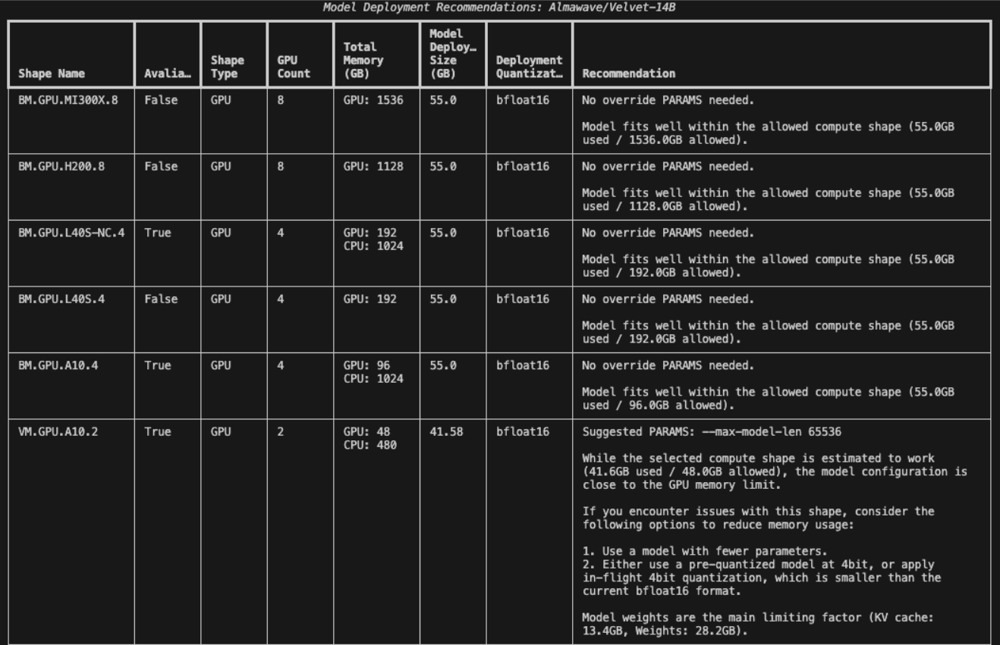

# AQUA Shape Recommendation Tool

The AQUA Shape Recommendation Tool pairs OCI Compute Shapes with Generative AI Models.
  
By analyzing the model's configuration file, the AQUA Shape Recommendation Tool can accurately estimate the memory footprint of Safetensor-format models from HuggingFace and recommend both cost-effective (memory-efficient) and high-performance (optimal) OCI compute shapes.

Large Language Model Deployments have two significant drivers of memory usage:
- size of the model (1B-120B+ parameters)
- size of the KV Cache (enables model to efficiently remember the context of the user's input)

The AQUA Shape Recommendation Tool is able to estimate the size of the model and KV Cache with varying context lengths. This allows users to correctly pair compute shapes with specific model deployment runtime parameters such as:
- context length
- in-flight quantization (4bit)
- necessary model-specific flags (ex. trust-remote-code)
  
This automation approach reduces the knowledge barrier and minimizes manual estimation to fit models onto compute shapes seen [here](./llm_gpu_shape_tips.md).

 # Table of Contents
- [AQUA Shape Recommendation Tool](#aqua-shape-recommendation-tool)
- [Table of Contents](#table-of-contents)
  - [recommend\_shape](#recommend_shape)
    - [Useage](#useage)
    - [Required Parameters](#required-parameters)
    - [Optional Parameters](#optional-parameters)
  - [Troubleshooting Errors](#troubleshooting-errors)


 ##  recommend_shape

 Users can quickly generate shape recommendations for a specific Safetensor-format model on HuggingFace using the recommend_shape CLI command.

### Useage

```bash
ads aqua deployment recommend_shape --model_id [OPTIONS]
```

### Required Parameters

`--model_id [str]`

Users can provide either:

1. OCID of the LLM registered as a model on OCI Data Science 
   
```bash
ads aqua deployment recommend_shape --model_id  'ocid1.datasciencemodel.oc1.<ocid>' 
```
2. Official HuggingFace name of the LLM (ex. meta-llama/Llama-3.3-70B-Instruct)


```bash
ads aqua deployment recommend_shape --model-id meta-llama/Llama-3.3-70B-Instruct
```


### Optional Parameters
`--generate_table [bool]`


By default `generate_table=True`, which returns a table of shape recommendations. 

Recommended for CLI use due to user-friendly display.



`generate_table=False`, returns a JSON structured recommendation report. 

Recommended for API/ programmatic use.


**Below is a sample response:**
 ```json
 {
  "recommendations": [
    {
      "shape_details": {
        "core_count": null,
        "memory_in_gbs": null,
        "name": "BM.GPU.MI300X.8",
        "shape_series": "GPU",
        "gpu_specs": {
          "gpu_memory_in_gbs": 1536,
          "gpu_count": 8,
          "gpu_type": "MI300X",
          "quantization": [
            "fp8",
            "gguf"
          ],
          "ranking": {
            "cost": 90,
            "performance": 90
          }
        }
      },
      "configurations": [
        {
          "model_details": {
            "model_size_gb": 28.16,
            "kv_cache_size_gb": 26.844,
            "total_model_gb": 55.003
          },
          "deployment_params": {
            "quantization": "bfloat16",
            "max_model_len": 131072,
            "batch_size": 1
          },
          "recommendation": "Model fits well within the allowed compute shape (55.0GB used / 1536.0GB allowed).\n(Batch size: 1, seq len: 131072, quantization/weight size: bfloat16)."
        }
      ]
    },
    {
      "shape_details": {
        "core_count": null,
        "memory_in_gbs": null,
        "name": "BM.GPU.H200.8",
        "shape_series": "GPU",
        "gpu_specs": {
          "gpu_memory_in_gbs": 1128,
          "gpu_count": 8,
          "gpu_type": "H200",
          "quantization": [
            "awq",
            "gptq",
            "marlin",
            "fp8",
            "int8",
            "bitblas",
            "aqlm",
            "bitsandbytes",
            "deepspeedfp",
            "gguf"
          ],
          "ranking": {
            "cost": 100,
            "performance": 110
          }
        }
      },
      "configurations": [
        {
          "model_details": {
            "model_size_gb": 28.16,
            "kv_cache_size_gb": 26.844,
            "total_model_gb": 55.003
          },
          "deployment_params": {
            "quantization": "bfloat16",
            "max_model_len": 131072,
            "batch_size": 1
          },
          "recommendation": "Model fits well within the allowed compute shape (55.0GB used / 1128.0GB allowed).\n(Batch size: 1, seq len: 131072, quantization/weight size: bfloat16)."
        }
      ]
    },
    {
      "shape_details": {
        "core_count": null,
        "memory_in_gbs": null,
        "name": "BM.GPU.L40S-NC.4",
        "shape_series": "GPU",
        "gpu_specs": {
          "gpu_memory_in_gbs": 192,
          "gpu_count": 4,
          "gpu_type": "L40S",
          "quantization": [
            "awq",
            "gptq",
            "marlin",
            "fp8",
            "int8",
            "bitblas",
            "aqlm",
            "bitsandbytes",
            "deepspeedfp",
            "gguf"
          ],
          "ranking": {
            "cost": 60,
            "performance": 80
          }
        }
      },
      "configurations": [
        {
          "model_details": {
            "model_size_gb": 28.16,
            "kv_cache_size_gb": 26.844,
            "total_model_gb": 55.003
          },
          "deployment_params": {
            "quantization": "bfloat16",
            "max_model_len": 131072,
            "batch_size": 1
          },
          "recommendation": "Model fits well within the allowed compute shape (55.0GB used / 192.0GB allowed).\n(Batch size: 1, seq len: 131072, quantization/weight size: bfloat16)."
        }
      ]
    },
    {
      "shape_details": {
        "core_count": null,
        "memory_in_gbs": null,
        "name": "BM.GPU.L40S.4",
        "shape_series": "GPU",
        "gpu_specs": {
          "gpu_memory_in_gbs": 192,
          "gpu_count": 4,
          "gpu_type": "L40S",
          "quantization": [
            "awq",
            "gptq",
            "marlin",
            "fp8",
            "int8",
            "bitblas",
            "aqlm",
            "bitsandbytes",
            "deepspeedfp",
            "gguf"
          ],
          "ranking": {
            "cost": 60,
            "performance": 80
          }
        }
      },
      "configurations": [
        {
          "model_details": {
            "model_size_gb": 28.16,
            "kv_cache_size_gb": 26.844,
            "total_model_gb": 55.003
          },
          "deployment_params": {
            "quantization": "bfloat16",
            "max_model_len": 131072,
            "batch_size": 1
          },
          "recommendation": "Model fits well within the allowed compute shape (55.0GB used / 192.0GB allowed).\n(Batch size: 1, seq len: 131072, quantization/weight size: bfloat16)."
        }
      ]
    },
    {
      "shape_details": {
        "core_count": null,
        "memory_in_gbs": null,
        "name": "BM.GPU.A10.4",
        "shape_series": "GPU",
        "gpu_specs": {
          "gpu_memory_in_gbs": 96,
          "gpu_count": 4,
          "gpu_type": "A10",
          "quantization": [
            "awq",
            "gptq",
            "marlin",
            "int8",
            "bitblas",
            "aqlm",
            "bitsandbytes",
            "deepspeedfp",
            "gguf"
          ],
          "ranking": {
            "cost": 50,
            "performance": 50
          }
        }
      },
      "configurations": [
        {
          "model_details": {
            "model_size_gb": 28.16,
            "kv_cache_size_gb": 26.844,
            "total_model_gb": 55.003
          },
          "deployment_params": {
            "quantization": "bfloat16",
            "max_model_len": 131072,
            "batch_size": 1
          },
          "recommendation": "Model fits well within the allowed compute shape (55.0GB used / 96.0GB allowed).\n(Batch size: 1, seq len: 131072, quantization/weight size: bfloat16)."
        }
      ]
    },
    {
      "shape_details": {
        "core_count": null,
        "memory_in_gbs": null,
        "name": "VM.GPU.A10.2",
        "shape_series": "GPU",
        "gpu_specs": {
          "gpu_memory_in_gbs": 48,
          "gpu_count": 2,
          "gpu_type": "A10",
          "quantization": [
            "awq",
            "gptq",
            "marlin",
            "int8",
            "bitblas",
            "aqlm",
            "bitsandbytes",
            "deepspeedfp",
            "gguf"
          ],
          "ranking": {
            "cost": 40,
            "performance": 40
          }
        }
      },
      "configurations": [
        {
          "model_details": {
            "model_size_gb": 28.16,
            "kv_cache_size_gb": 13.422,
            "total_model_gb": 41.581
          },
          "deployment_params": {
            "quantization": "bfloat16",
            "max_model_len": 65536,
            "batch_size": 1
          },
          "recommendation": "While the selected compute shape is estimated to work (41.6GB used / 48.0GB allowed), the model configuration is close to the GPU memory limit. This estimation is theoretical; actual memory usage may vary at runtime.\n\nIf you encounter issues with this shape, consider the following options to reduce memory usage:\n\nModel weights are the main limiting factor. (KV cache: 13.4GB, Weights: 28.2GB).\nTo reduce model size:\n1. Use a model with fewer parameters.\n2. Use the same model with 8bit, 4bit quantization, which is smaller than the current quantization/weight size: bfloat16."
        }
      ]
    },
    {
      "shape_details": {
        "core_count": null,
        "memory_in_gbs": null,
        "name": "BM.GPU2.2",
        "shape_series": "GPU",
        "gpu_specs": {
          "gpu_memory_in_gbs": 32,
          "gpu_count": 2,
          "gpu_type": "P100",
          "quantization": [
            "fp16"
          ],
          "ranking": {
            "cost": 30,
            "performance": 20
          }
        }
      },
      "configurations": [
        {
          "model_details": {
            "model_size_gb": 28.16,
            "kv_cache_size_gb": 0.419,
            "total_model_gb": 28.579
          },
          "deployment_params": {
            "quantization": "bfloat16",
            "max_model_len": 2048,
            "batch_size": 1
          },
          "recommendation": "While the selected compute shape is estimated to work (28.6GB used / 32.0GB allowed), the model configuration is close to the GPU memory limit. This estimation is theoretical; actual memory usage may vary at runtime.\n\nIf you encounter issues with this shape, consider the following options to reduce memory usage:\n\nModel weights are the main limiting factor. (KV cache: 0.4GB, Weights: 28.2GB).\nTo reduce model size:\n1. Use a model with fewer parameters.\n2. Use the same model with 8bit, 4bit quantization, which is smaller than the current quantization/weight size: bfloat16."
        }
      ]
    },
    {
      "shape_details": {
        "core_count": null,
        "memory_in_gbs": null,
        "name": "VM.GPU.A10.1",
        "shape_series": "GPU",
        "gpu_specs": {
          "gpu_memory_in_gbs": 24,
          "gpu_count": 1,
          "gpu_type": "A10",
          "quantization": [
            "awq",
            "gptq",
            "marlin",
            "int8",
            "bitblas",
            "aqlm",
            "bitsandbytes",
            "deepspeedfp",
            "gguf"
          ],
          "ranking": {
            "cost": 20,
            "performance": 30
          }
        }
      },
      "configurations": [
        {
          "model_details": {
            "model_size_gb": 14.08,
            "kv_cache_size_gb": 6.711,
            "total_model_gb": 20.791
          },
          "deployment_params": {
            "quantization": "8bit",
            "max_model_len": 32768,
            "batch_size": 1
          },
          "recommendation": "While the selected compute shape is estimated to work (20.8GB used / 24.0GB allowed), the model configuration is close to the GPU memory limit. This estimation is theoretical; actual memory usage may vary at runtime.\n\nIf you encounter issues with this shape, consider the following options to reduce memory usage:\n\nModel weights are the main limiting factor. (KV cache: 6.7GB, Weights: 14.1GB).\nTo reduce model size:\n1. Use a model with fewer parameters.\n2. Use the same model with 4bit quantization, which is smaller than the current quantization/weight size: 8bit."
        }
      ]
    },
    {
      "shape_details": {
        "core_count": null,
        "memory_in_gbs": null,
        "name": "VM.GPU2.1",
        "shape_series": "GPU",
        "gpu_specs": {
          "gpu_memory_in_gbs": 16,
          "gpu_count": 1,
          "gpu_type": "P100",
          "quantization": [
            "fp16"
          ],
          "ranking": {
            "cost": 10,
            "performance": 10
          }
        }
      },
      "configurations": [
        {
          "model_details": {
            "model_size_gb": 7.04,
            "kv_cache_size_gb": 6.711,
            "total_model_gb": 13.751
          },
          "deployment_params": {
            "quantization": "4bit",
            "max_model_len": 32768,
            "batch_size": 1
          },
          "recommendation": "While the selected compute shape is estimated to work (13.8GB used / 16.0GB allowed), the model configuration is close to the GPU memory limit. This estimation is theoretical; actual memory usage may vary at runtime.\n\nIf you encounter issues with this shape, consider the following options to reduce memory usage:\n\nBoth model weights and KV cache are significant contributors to memory use. (KV cache: 6.7GB, Weights: 7.0GB).\n\nTo reduce model size:\n1. Use a model with fewer parameters.\n2. No smaller quantized version exists. Use a model with fewer parameters."
        }
      ]
    }
  ],
  "troubleshoot": ""
}
```

## Troubleshooting Errors
1. Model provided is not in Safetensor format.

```json
{
  "recommendations": [],
  "troubleshoot": "Please provide a model in Safetensor format. The current model format (gguf) is not supported by this tool at this time."
}
```

Solution: Go to the model page on HuggingFace, select the Files and versions tab. Only use models that have a config.json file and safetensor files (.safetensors extension) present.

2. Model is not decoder only.
```json
{
  "recommendations": [],
  "troubleshoot": "Please provide a decoder-only text-generation model (ex. Llama, Falcon, etc). Encoder-decoder models (ex. T5, Gemma) and encoder-only (BERT) are not supported in this tool at this time."
}
```
Solution: Go to the model page on HuggingFace, select the Files and versions tab. Click on the config.json file. 

Select models with config.json files that DO NOT have ANY of the following key, value pairs:
```
"is_encoder_decoder": true
"is_decoder": false
"model_type": "t5"
"model_type": "gemma"
"model_type": "bart"
"model_type": "bert"
"model_type": "roberta"
"model_type": "albert"
```

