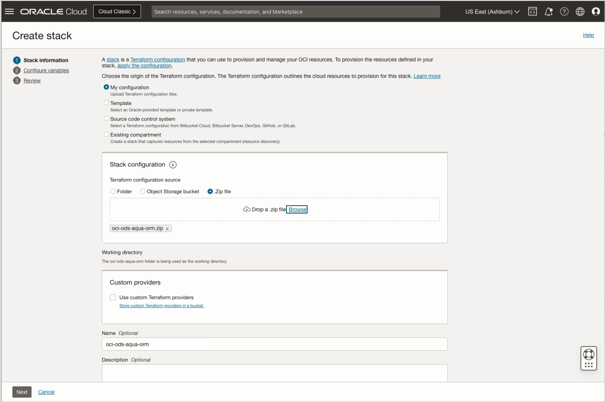

# ORM Policies

- [Home](../README.md)
- [CLI](../cli-tips.md)
- [Model Deployment](../model-deployment-tips.md)
- [Model Evaluation](../evaluation-tips.md)
- [Model Fine Tuning](../fine-tuning-tips.md)

To install required policies for AI Quick Actions you can use [Oracle Resource Manager](https://docs.oracle.com/en-us/iaas/Content/ResourceManager/Concepts/resourcemanager.htm) (ORM) stack. Download terraform configuration file [oci-ods-aqua-orm.zip](./oci-ods-aqua-orm.zip) with the infrastructure instructions for the dynamic groups and polices. For steps on creating stacks, see [Creating a Stack from a Zip File](https://docs.oracle.com/en-us/iaas/Content/ResourceManager/Tasks/create-stack-local.htm#top).

> **Note:** Even if you already have the policies to use Data Science service, you still need to use the terraform configuration file to set up the policies to use AI Quick Actions.

> **Note:** To save fine-tuned models, versioning has to be enabled in the selected Object Storage bucket. See [here](https://docs.oracle.com/iaas/data-science/using/ai-quick-actions-fine-tuning.htm) for more information.

After the stack is created and its Stack details page opens, click Plan from the Terraform Actions menu.  Wait for it to complete.  After it is completed, click Apply from the Terraform Actions menu.  These actions will add the needed policies.

- [Home](../README.md)
- [CLI](../cli-tips.md)
- [Model Deployment](../model-deployment-tips.md)
- [Model Evaluation](../evaluation-tips.md)
- [Model Fine Tuning](../fine-tuning-tips.md)
