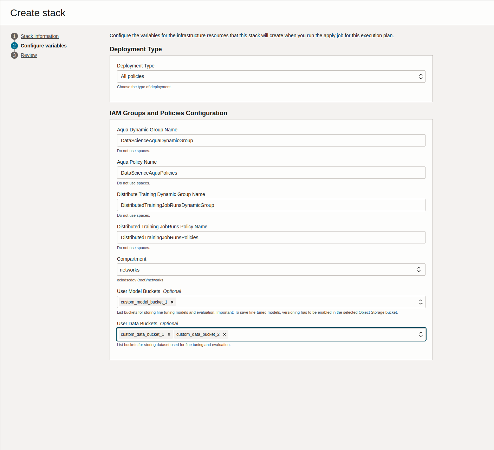

# Policies


- [Home](../README.md)
- [Policies](#policies)
  - [Setting Up Policies Using (ORM) stack](#setting-up-policies-using-orm-stack)
  - [Setting Up Policies Manually](#setting-up-policies-manually)
    - [Dynamic Groups](#dynamic-groups)
    - [Policies](#policies-1)
  - [Aqua Policy Verification Tool](#aqua-policy-verification-tool)


---
To get started with AI Quick Actions, a tenancy administrator must first install the required policies. These can be configured manually or deployed using an [Oracle Resource Manager (ORM)](https://docs.oracle.com/en-us/iaas/Content/ResourceManager/Concepts/resourcemanager.htm) stack.


## Setting Up Policies Using (ORM) stack

Even if you already have policies in place for using the Data Science service, you still need to use the provided Terraform configuration to set up the additional policies required for AI Quick Actions.

>>[!IMPORTANT] To run the Terraform script successfully, you must have administrator privileges. Policies can only be applied using an Oracle Resource Manager (ORM) stack if they are being created in the home region.

Before running the script, make sure you have the following permissions granted:


```bash
allow group <your_admin_group> to manage orm-stacks in TENANCY
allow group <your_admin_group> to manage orm-jobs in TENANCY
allow group <your_admin_group> to manage dynamic-groups in TENANCY
allow group <your_admin_group> to manage policies in TENANCY
allow group <your_admin_group> to read compartments in TENANCY
```

**To deploy the stack, click the button below:**

[![Deploy to Oracle Cloud][magic_button]][magic_stack]

Alternatively, you can [**download the Terraform configuration file** (oci-ods-aqua-orm.zip)](https://github.com/oracle-samples/oci-data-science-ai-samples/releases/latest/download/oci-ods-aqua.zip), which includes setup instructions for dynamic groups and policies.

For steps on creating stacks from the configuration file, see [Creating a Stack from a Zip File](https://docs.oracle.com/en-us/iaas/Content/ResourceManager/Tasks/create-stack-local.htm#top).

While deploying the stack you can select the kind of policies that need to be deployed for AQUA:
1. **All policies** - This will deploy all the policies needed for AQUA in one go.
2. **Only admin policies** - This will deploy only the minimal set of policies that are required to be defined at the root compartment by the tenancy administrator for AQUA.
3. **Only resource policies** - This will deploy the required policies that are needed to be defined at the compartment level provided that the tenancy administrator has already defined the admin policies for AQUA.


> **Note:** To save fine-tuned models, versioning has to be enabled in the selected Object Storage bucket. See [here](https://docs.oracle.com/iaas/data-science/using/ai-quick-actions-fine-tuning.htm) for more information.



After the stack is created and its Stack details page opens, click Plan from the Terraform Actions menu.  Wait for it to complete.  After it is completed, click Apply from the Terraform Actions menu.  These actions will add the needed policies.


## Setting Up Policies Manually
>[!NOTE] If you already have policies for the Data Science service, you will still need to implement additional policies to enable AI Quick Actions.

### Dynamic Groups
- ``aqua-dynamic-group``

  ```bash
  any {all {resource.type='datasciencenotebooksession', resource.compartment.id='<your_compartment_ocid>'}, all {resource.type='datasciencemodeldeployment',resource.compartment.id='<your_compartment_ocid>'}, all {resource.type='datasciencejobrun', resource.compartment.id='<your_compartment_ocid>'}}
  ```
- ``distributed_training_job_runs``
  ```bash
  any {all {resource.type='datasciencejobrun', resource.compartment.id='<your_compartment_ocid>'}}
  ```

### Policies

- ``aqua_policies``
  ```bash

  Allow dynamic-group aqua-dynamic-group to manage data-science-model-deployments in compartment <your-compartment-name>

  Allow dynamic-group aqua-dynamic-group to manage data-science-models in compartment <your-compartment-name>

  Allow dynamic-group aqua-dynamic-group to use logging-family in compartment <your-compartment-name>

  Allow dynamic-group aqua-dynamic-group to manage data-science-jobs in compartment <your-compartment-name>

  Allow dynamic-group aqua-dynamic-group to manage data-science-job-runs in compartment <your-compartment-name>

  Allow dynamic-group aqua-dynamic-group to use virtual-network-family in compartment <your-compartment-name>

  Allow dynamic-group aqua-dynamic-group to read resource-availability in compartment <your-compartment-name>

  Allow dynamic-group aqua-dynamic-group to manage data-science-projects in compartment <your-compartment-name>

  Allow dynamic-group aqua-dynamic-group to manage data-science-notebook-sessions in compartment <your-compartment-name>

  Allow dynamic-group aqua-dynamic-group to manage data-science-modelversionsets in compartment <your-compartment-name>

  Allow dynamic-group aqua-dynamic-group to read buckets in compartment <your-compartment-name>

  Allow dynamic-group aqua-dynamic-group to read objectstorage-namespaces in compartment <your-compartment-name>

  Allow dynamic-group aqua-dynamic-group to inspect compartments in tenancy

  Allow dynamic-group aqua-dynamic-group to manage object-family in compartment <your-compartment-name> where any {target.bucket.name='<your-bucket-name>'}

  Allow dynamic-group <dynamic-group-name> to read repos in compartment <your-compartment-name> where any {request.operation='ReadDockerRepositoryMetadata',request.operation='ReadDockerRepositoryManifest',request.operation='PullDockerLayer'}
  ```

- ``dt_jr_policies``

  ```bash
  Allow dynamic-group distributed_training_job_runs to use logging-family in compartment <your-compartment-name>

  Allow dynamic-group distributed_training_job_runs to manage data-science-models in compartment <your-compartment-name>

  Allow dynamic-group distributed_training_job_runs to read data-science-jobs in compartment <your-compartment-name>

  Allow dynamic-group distributed_training_job_runs to manage objects in compartment <your-compartment-name> where any {target.bucket.name='<your-bucket-name>'}

  Allow dynamic-group distributed_training_job_runs to read buckets in compartment <your-compartment-name> where any {target.bucket.name='<your-bucket-name>'}
  ```

These policies and dynamic groups set up the necessary permissions to enable AI Quick Actions within your OCI environment. Remember to replace placeholders like ``<your_compartment_ocid>`` and ``<your_compartment-name>`` with actual values from your OCI setup.

> **Note:** To save fine-tuned models, versioning has to be enabled in the selected Object Storage bucket. See [here](https://docs.oracle.com/iaas/data-science/using/ai-quick-actions-fine-tuning.htm) for more information.


## Aqua Policy Verification Tool

The **Aqua Policy Verification Tool** is a command-line utility designed to **validate IAM  policies** required to use key features of AI Quick action (AQUA) platform.

It simulates actual operations — like registering models, creating job runs, or accessing object storage — to determine whether the currently configured IAM user/group has sufficient permissions.

Before running real workloads (deploying, fine-tuning, etc.), users can verify they have the **right access privileges**. This tool provides:
- Immediate feedback on missing policies
- Policy hints to help fix permission issues


### How to Use

To run the policy-checks from Notebook terminal:

```bash
ads aqua verify_policies <operation> [OPTIONS]
```

Where `<operation>` is one of:
- `common_policies`
- `model_register`
- `model_deployment`
- `evaluation`
- `finetune`


### Description of Policy Verification Operations

Each operation simulates certain actions in AQUA and checks whether those succeed. Here’s what each one does:

####  1. `common_policies`

**Purpose**: Verifies basic **read-level permissions** across key Data Science resources.

**Simulated actions**:
- Listing compartments
- Listing models and model version sets
- Listing jobs and job runs
- Listing object storage buckets
- Listing logging groups
- Getting service limits

**Examples:**

```bash
ads aqua verify_policies common_policies
```


####  2. `model_register`

**Purpose**: Verifies ability to **register a model**, which includes writing artifacts to Object Storage.

**Simulated actions**:
- Managing a specified Object Storage bucket
- Registering a new model in the OCI Data Science platform
- Deleting the test model (cleanup)

>**Note**: This operation will create and delete the following temporary resources, which may incur charges. [[See pricing]](https://www.oracle.com/artificial-intelligence/data-science/pricing/)
>  - A model with name `AQUA Policy Verification - Model` in OCI Data Science 
>  - A test file with name  `AQUA Policy Verification - OBJECT STORAGE` to your specified bucket. The model and object will be deleted after verification.

**Examples:**

```bash
ads aqua verify_policies model_register
```
or
```bash
ads aqua verify_policies model_register --bucket my-model-artifacts-bucket
```


#### 3. `model_deployment`

**Purpose**: Verifies ability to **deploy a model** after registration.

**Simulated actions**:
- Registering a model (same as `model_register`)
- Creating a model deployment
- Deleting the deployment and the model (cleanup)

> **Note**: This operation will create and delete the following temporary resources, which may incur charges. [[See pricing]](https://www.oracle.com/artificial-intelligence/data-science/pricing/):
> - A model with name `AQUA Policy Verification - Model`
> - A test file with name  `AQUA Policy Verification - OBJECT STORAGE` to your specified bucket. 
> - A model deployment named `AQUA Policy Verification - Model Deployment`  
> 	   These will be deleted after verification is complete.     

**Examples:**

```bash
ads aqua verify_policies model_deployment
```
or
```bash
ads aqua verify_policies model_deployment --bucket my-model-bucket
```

#### 4. `evaluation`

**Purpose**: Verifies policies required for **evaluation workflows**, such as automated testing or validation.

**Simulated actions**:
- Creating and deleting a Model Version Set (MVS)
- Registering a model
- Running a job and job run
- Deleting all test resources

> **Note**: This operation will create and delete the following temporary resources, which may incur charges. [[See pricing]](https://www.oracle.com/artificial-intelligence/data-science/pricing/):
> - A **Model Version Set** named `AQUA Policy Verification - Model Version Set`
> - A model with name `AQUA Policy Verification - Model`
> - A test file with name  `AQUA Policy Verification - OBJECT STORAGE` to your specified bucket. 
> - A test model (as in `model_register`)
> - A **Job** and **Job Run** named `AQUA Policy Verification - Job` and `AQUA Policy Verification - Job Run`

**Examples:**

```bash
ads aqua verify_policies evaluation
```
or
```bash
ads aqua verify_policies evaluation --bucket eval-bucket
```


#### 5. `finetune`

**Purpose**: Verifies whether you can run a **fine-tuning workflow**, typically involving training jobs, storage, and networking.

**Simulated actions**:
- Validates bucket access (datasets, scripts, model output)
- Optionally verifies subnet access for job runs
- Creates and deletes MVS
- Runs finetune jobs

> **Note**: This operation will create and delete the following temporary resources, which may incur charges. [[See pricing]](https://www.oracle.com/artificial-intelligence/data-science/pricing/):
> - A **Model Version Set** named `AQUA Policy Verification - Model Version Set`
> - A test file with name  `AQUA Policy Verification - OBJECT STORAGE` to your specified bucket. 
> - A **Job** and **Job Run** named `AQUA Policy Verification - Job` and `AQUA Policy Verification - Job Run`

**Examples:**

```bash
ads aqua verify_policies finetune
```
or
```bash
ads aqua verify_policies finetune --bucket fine-tune-data --ignore_subnet
```
or
```bash
ads aqua verify_policies finetune --bucket fine-tune-data --subnet_id ocid1.subnet.oc1..examplesubnetID
```

- [Home](../README.md)
- [CLI](../cli-tips.md)
- [Model Deployment](../model-deployment-tips.md)
- [Model Evaluation](../evaluation-tips.md)
- [Model Fine Tuning](../fine-tuning-tips.md)

[magic_button]: https://oci-resourcemanager-plugin.plugins.oci.oraclecloud.com/latest/deploy-to-oracle-cloud.svg
[magic_stack]: https://cloud.oracle.com/resourcemanager/stacks/create?zipUrl=https://github.com/oracle-samples/oci-data-science-ai-samples/releases/latest/download/oci-ods-aqua.zip
