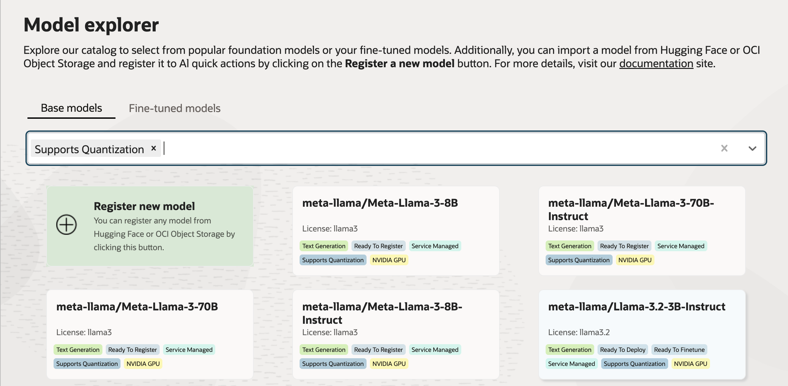
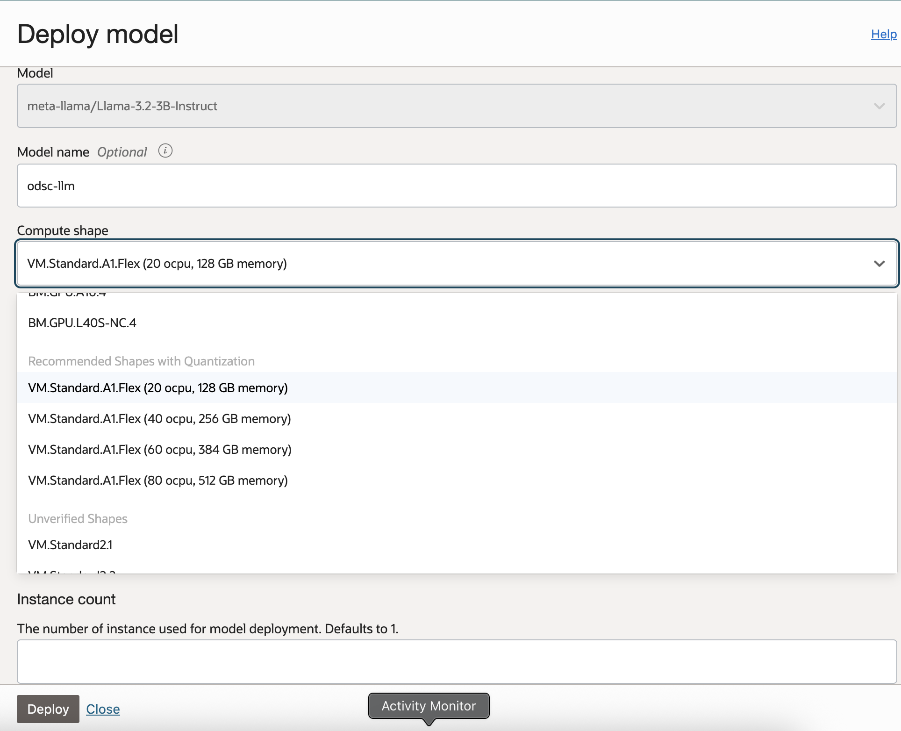
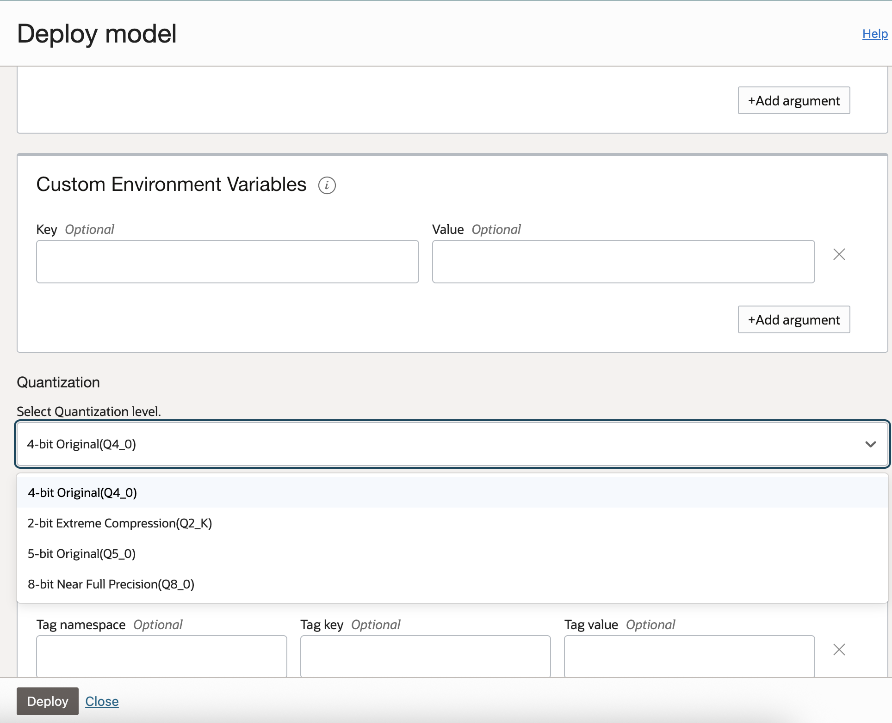

# **Using Quantization in AQUA**

Quantization helps optimize large language models by reducing their precision (e.g., from 16-bit to 4-bit) while maintaining accuracy. This allows faster inference and reduced compute costs.

This document guides you through **deploying a quantized model in AQUA**.

---

## **Step 1: Select a Model That Supports Quantization**

1. Navigate to the **Model Explorer** page in AQUA.
2. Use the **filter option** and select **“Supports Quantization”**.
3. From the filtered list, choose a model that supports quantization.
   Models that support this feature display the **“Supports Quantization”** label.

---

## **Step 2: Configure the Deployment**

Once you’ve selected a model, click **Deploy model**.
In the **Deploy model** panel:

1. Enter a **Deployment name** and optionally a **Model name**.
2. From the **Compute shape** dropdown, select one of the **recommended shapes with quantization**.
   These are recommended CPU shapes.

---

## **Step 3: Set the Quantization Level**

In the **Advanced options** section:

1. Locate the **Quantization** field.
2. Select a **Quantization level**, such as **4-bit Original (Q4_0)**.

### Supported quantization levels:
| **Quantization Level**               | **Description**                                                            | **Best For**                                              |
| ------------------------------------ | -------------------------------------------------------------------------- | --------------------------------------------------------- |
| **2-bit Extreme Compression (Q2_K)** | Highest compression with lowest precision. May impact model accuracy.      | Resource-constrained environments or experimentation.     |
| **4-bit Original (Q4_0)**            | Balanced compression and accuracy. Default recommended setting.            | Most general-purpose deployments.                         |
| **5-bit Original (Q5_0)**            | Slightly higher precision than 4-bit, with modest increase in memory use.  | Use cases requiring better response fidelity.             |
| **8-bit Near Full Precision (Q8_0)** | Nearly full precision, minimal accuracy loss, higher resource requirement. | High-quality output where performance is still a concern. |

This setting determines the bit precision used for quantizing your model.

---

## **Step 5: Deploy the Model**

Click **Deploy** to start deployment.

> **Note:** Deploying a model with quantization may take additional **conversion time**, as the model weights need to be converted to the selected quantization format.

Once the deployment is complete, your quantized model will be available for inference.

