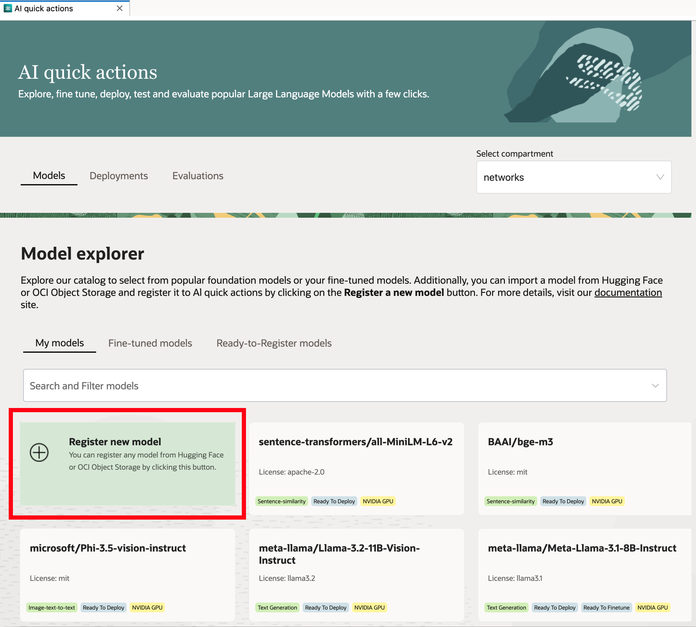
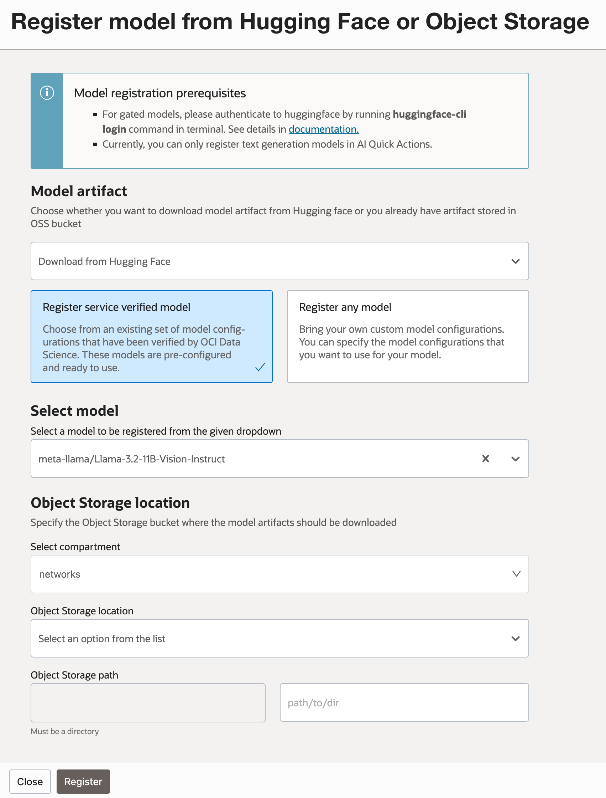
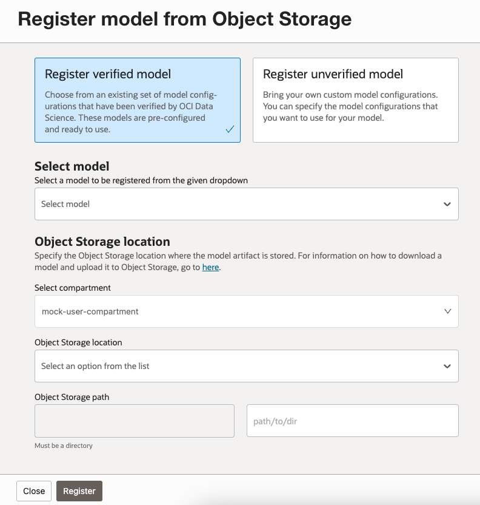
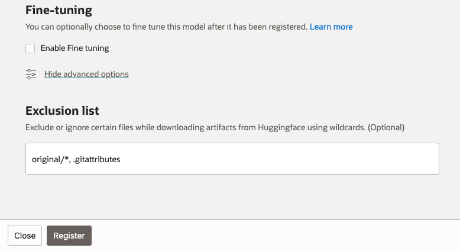

# Register a model

Table of Contents:

- [Home](README.md)
- [CLI](cli-tips.md)
- [Policies](policies/README.md)
- [Model Deployment](model-deployment-tips.md)
- [Model Evaluation](evaluation-tips.md)
- [Model Fine Tuning](fine-tuning-tips.md)


## Prerequisites

1. Ensure that the necessary [policies](policies/README.md) are enacted.
2. Create an OCI Object Storage Bucket with Object Versioning.


## Upload model artifact to Object Storage

The AI Quick Action model explorer allows you to register a model from Hugging Face or Object Storage with a few clicks.



## Register Model from Hugging Face

To register a model from Hugging Face, select "Download from Hugging Face" in the dropdown under model artifact. Then you may select a verified model from the "Select Model" dropdown, or you may "register any model" by entering the model name.

Note that for gated models, please authenticate to Hugging Face by running `huggingface-cli login` command in terminal. See details in [Hugging Face CLI documentation](https://huggingface.co/docs/huggingface_hub/en/guides/cli).



## Upload Model Artifact to Object Storage Manually

AI Quick Actions also supports user-provided models that can be deployed, fined-tuned and evaluated.

While registering the model in AI Quick Actions, you need to specify the Object Storage location where the model artifact is stored.
You may first prepare your model files locally and then upload it to object storage.
For example, you can download the model from the Hugging Face Hub using the download instructions [here](https://huggingface.co/docs/huggingface_hub/main/en/guides/download).

Once downloaded, use [oci-cli](https://github.com/oracle/oci-cli) to upload these artifacts to the correct object storage location. 
The object storage bucket needs to be versioned, run the following command to check whether versioning is set up. If the output of the below command is "Disabled", then you need
to turn on object storage versioning for this bucket. More details on how to do this is available [here](https://docs.oracle.com/en-us/iaas/Content/Object/Tasks/usingversioning.htm).

```bash
oci os bucket get -bn <bucket-name> -ns <namespace> --auth <auth_tpye> | jq ".data.versioning"
```

If the output of the above command is "Enabled", proceed to uploading the model artifacts to the object storage location using the following CLI command:
```bash
oci os object bulk-upload -bn <bucket-name> -ns <namespace> --auth <auth_tpye> --prefix <file prefix> --src-dir <local-dir-location> --no-overwrite
```

Once the upload is complete, provide the object storage location in the Register form in AI Quick Actions.



After registration, this model will be available in the "My Models" tab in the Model Explorer for further use.

## Filter model artifacts while registering

Some models on Hugging Face Hub may have very large artifacts that are not required for the model you wish to deploy. 
For example, [meta-llama/Llama-3.3-70B-Instruct](https://huggingface.co/meta-llama/Llama-3.3-70B-Instruct/tree/main) model
has an `original` folder that contains the model checkpoints which are not required if deploying this model using a vLLM container.
Similarly, most GGUF models on Hugging Face Hub like [bartowski/Llama-3.3-70B-Instruct-GGUF](https://huggingface.co/bartowski/Llama-3.3-70B-Instruct-GGUF/tree/main)
may have different large sized quantized models.

In that case, you may exclude certain folders and files using standard wildcards. In case of `meta-llama/Llama-3.3-70B-Instruct` model,
if we wish to exclude `original/` folder and `.gitattributes` file, we can simply add the following wildcard in the Exclusion List section in the Register screen, under Advanced Options.




## Register an Embedding Model

### Deploy using vLLM container 

With vLLM now supporting deployment of embedding models, you can register and deploy an embedding model using AI Quick Actions. The current vLLM Service Managed Container (SMC) offered by 
AI Quick Actions is backed by vLLM 0.6.2, hence only `intfloat/e5-mistral-7b-instruct` is supported. The subsequent 
update of the SMC will enable you to deploy the other supported models listed [here](https://docs.vllm.ai/en/latest/models/supported_models.html#text-embedding).


### Bring Your Own Container Approach

AI Quick Actions now supports deployment of embedding models from Hugging Face Hub that support [Text Embedding Inference (TEI)](https://github.com/huggingface/text-embeddings-inference) serving container. 
To find the eligible models supported by TEI, visit the HuggingFace model listing page [here](https://huggingface.co/models?other=text-embeddings-inference). 

The TEI repo has the [list of images](https://github.com/huggingface/text-embeddings-inference?tab=readme-ov-file#docker-images) you can deploy, 
and currently AI Quick Actions supports deployment using the following shapes:

* VM.GPU.A10.1
* VM.GPU.A10.2
* BM.GPU.A10.4
* BM.GPU4.8
* BM.GPU.L40S-NC.4
* VM.Standard.E3.Flex
* VM.Standard.E4.Flex
* VM.Standard3.Flex
* VM.Optimized3.Flex


#### Install Desktop Container Management
This example requires a desktop tool to build, run, launch and push the containers. We support:

* [Docker Desktop](https://docs.docker.com/get-docker)
* [Rancher Desktop](https://rancherdesktop.io/)

#### Prepare Inference Container

TEI ships with multiple docker images that we can use to deploy an embedding model using AI Quick Actions. 
Run the following in the desktop when docker is installed.

```bash
docker pull ghcr.io/huggingface/text-embeddings-inference:1.5.0
```

Currently, OCI Data Science Model Deployment only supports container images residing in the OCI Registry.
Before we can push the pulled TEI container, make sure you have created a repository in your tenancy.

* Go to your tenancy Container Registry
* Click on the Create repository button
* Select Private under Access types
* Set a name for Repository name. We are using "text-embeddings-inference" in the example.
* Click on Create button

You may need to docker login to the Oracle Cloud Container Registry (OCIR) first, if you haven't done so before in 
order to push the image. To login, you have to use your API Auth Token that can be created under your Oracle Cloud Account->Auth Token. 
You need to login only once. Replace with the OCI region you are using.

```bash
docker login -u '<tenant-namespace>/<username>' <region>.ocir.io
```

If your tenancy is federated with Oracle Identity Cloud Service, use the format /oracleidentitycloudservice/. 
You can then push the container image to the OCI Registry.

```bash
docker tag ghcr.io/huggingface/text-embeddings-inference:1.5.0 <region>.ocir.io/<tenancy>/text-embeddings-inference:1.5.0
docker push <region>.ocir.io/<tenancy>/text-embeddings-inference:1.5.0
```

If you wish to deploy the embedding model on a CPU shape, use the official CPU docker image named
`ghcr.io/huggingface/text-embeddings-inference:cpu-1.5`. Currently, deployment on ARM shapes is not supported.

#### BYOC policies

Check the [policies](policies/README.md) page to make sure that the  container specific policy is added so that 
custom container can be picked up by OCI Model Deployment. Specifically, you need to allow the dynamic group to read
the custom container or tenancy, if the repository is in the root compartment. Additional documentation is available
[here](https://docs.oracle.com/en-us/iaas/data-science/using/model-dep-policies-auth.htm#model_dep_policies_auth__access-custom-container).


Table of Contents:

- [Home](README.md)
- [Policies](policies/README.md)
- [CLI](cli-tips.md)
- [Model Deployment](model-deployment-tips.md)
- [Model Evaluation](evaluation-tips.md)
- [Model Fine Tuning](fine-tuning-tips.md)

