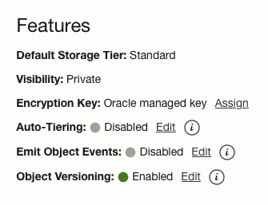

<!-- TOC -->
<!-- /TOC -->

- [Troubleshooting Model Deployment](#troubleshooting-model-deployment)
  - [Logs](#logs)
  - [Understanding GPU requirement for models](#understanding-gpu-requirement-for-models)
  - [Issues and Resolutions](#issues-and-resolutions)
    - [Service Timeout Error](#service-timeout-error)
      - [Out of Memory (OOM) Error](#out-of-memory-oom-error)
      - [Trusting Remote Code](#trusting-remote-code)
      - [Architecture Not Supported](#architecture-not-supported)
    - [Capacity Issues](#capacity-issues)
    - [Chat payload is Not Working](#chat-payload-is-not-working)
    - [Image Payload is Not Working](#image-payload-is-not-working)
    - [Prompt Completion Payload is Not Working](#prompt-completion-payload-is-not-working)
- [Authorization Issues](#authorization-issues)
  - [Types of Authorization Errors](#types-of-authorization-errors)
      - [Create Model](#create-model)
      - [List Models](#list-models)
      - [Create Model Deployment](#create-model-deployment)
      - [List Model Deployment](#list-model-deployment)
      - [Create Model Version Sets](#create-model-version-sets)
      - [List Model Version Sets](#list-model-version-sets)
      - [Create Job](#create-job)
      - [Create Job Run](#create-job-run)
      - [List Log Groups](#list-log-groups)
      - [List Data Science Private Endpoints](#list-data-science-private-endpoints)
      - [Get Namespace](#get-namespace)
      - [Put Object](#put-object)
      - [List Buckets](#list-buckets)
      - [Update Model](#update-model)
      - [Evaluation and Fine Tuning](#evaluation-and-fine-tuning)
# Troubleshooting Model Deployment

## Logs

To successfully debug an issue, always select logging while creating model deployment. 

Once the model deployment is intiated, you can monitor the logs by running on your notebook terminal- 

`ads opctl watch <your modeldepoyment ocid> --auth resource_principal`

To fetch the model deployment ocid - 
1. Go to model deployments tab on AI Quick Actions
2. Click on the model deployment for which you want to fetch the logs. This will open up details page.
3. **Confirm** that the log group and the log link is displayed on the details page.
3. For you see log group and log link is displayed, copy the OCID from the details page.

## Understanding GPU requirement for models

By default the models are deployed with 16 bit precision. For a model with 7 billion parameter model, you would need 14GB (2 * 7) GPU memory to load the model. Depending on the context length, you would need extra about 20% memory to serve the model.
If you are selecting a shape with A10 cards, each A10 card will give you about 23GB. 8B parameter model with large context length will perform better with 2 cards. You can run it on single card as well with reduced context length. This is a general guideline. Exact memory requirement will vary depending on the model architecture. You can learn more [here](https://blog.eleuther.ai/transformer-math/#inference).

## Issues and Resolutions


### Service Timeout Error
If you see service timeout error, it means the model deployment could not load the model and start the inference container within the stipulated time. To understand the reason behind service timeout, check your logs. Fetch logs using `ads watch` command as described in section [Logs](#logs). **If this returns empty, confirm that log groups and log links are displayed on the model deployment details page**.

If logs are attached, run the `ads watch` command to retrieve the logs. Once log is fetched, proceed below - 

Here are some frequently encountered issues. Please note it could fail for reasons not listed here, but these form most commonly encountered ones - 

#### Out of Memory (OOM) Error 

Check the error message in the logging to understand if you need to allocate more GPUs or need to limit the context length. Here are some tips


I. Model is requires more GPU memory 

The log message should look something like the following - 

```log
torch.OutOfMemoryError: CUDA out of memory. Tried to allocate 32.00 MiB. GPU 1 has a total capacity of 22.07 GiB of which 14.25 MiB is free. Process 241484 has 22.05 GiB memory in use. Of the allocated memory 21.68 GiB is allocated by PyTorch, and 24.24 MiB is reserved by PyTorch but unallocated. If reserved but unallocated memory is large try setting PYTORCH_CUDA_ALLOC_CONF=expandable_segments:True to avoid fragmentation.  See documentation for Memory Management  (https://pytorch.org/docs/stable/notes/cuda.html#environment-variables)
(VllmWorkerProcess pid=440) ERROR 03-25 21:01:39 multiproc_worker_utils.py:240] Exception in worker VllmWorkerProcess while processing method load_model.
(VllmWorkerProcess pid=440) ERROR 03-25 21:01:39 multiproc_worker_utils.py:240] Traceback (most recent call last):
(VllmWorkerProcess pid=440) ERROR 03-25 21:01:39 multiproc_worker_utils.py:240]   File "/opt/conda/envs/vllm/lib/python3.12/site-packages/vllm/executor/multiproc_worker_utils.py", line 234, in _run_worker_process
(VllmWorkerProcess pid=440) ERROR 03-25 21:01:39 multiproc_worker_utils.py:240]     output = run_method(worker, method, args, kwargs)
(VllmWorkerProcess pid=440) ERROR 03-25 21:01:39 multiproc_worker_utils.py:240]              ^^^^^^^^^^^^^^^^^^^^^^^^^^^^^^^^^^^^^^^^
(VllmWorkerProcess pid=440) ERROR 03-25 21:01:39 multiproc_worker_utils.py:240]   File "/opt/conda/envs/vllm/lib/python3.12/site-packages/vllm/utils.py", line 2208, in run_method
(VllmWorkerProcess pid=440) ERROR 03-25 21:01:39 multiproc_worker_utils.py:240]     return func(*args, **kwargs)
(VllmWorkerProcess pid=440) ERROR 03-25 21:01:39 multiproc_worker_utils.py:240]            ^^^^^^^^^^^^^^^^^^^^^
(VllmWorkerProcess pid=440) ERROR 03-25 21:01:39 multiproc_worker_utils.py:240]   File "/opt/conda/envs/vllm/lib/python3.12/site-packages/vllm/worker/worker.py", line 182, in load_model
(VllmWorkerProcess pid=440) ERROR 03-25 21:01:39 multiproc_worker_utils.py:240]     self.model_runner.load_model()
```
If your log message appears like the above, then you have two options - 

1) Try bigger shape. Refer to the memory calculation [discussion](#understanding-gpu-requirement-for-models)

2) Try quantization:

    You can set reduce the memory footprint of the model by enabling quantization. Here are the steps to enable quantization - 
    1. Go to create model deployment and select the model you want to deploy
    2. Click on advanced section 
    3. Input the quantization option as per the documentation of the inference container. Eg. If you are using vLLM, you can input `--quantization` for Name and `fp8` for value. This will load the model in 8bit reducing the memory requirement by half. You can try `--quantization bitsandbytes` and `--load-format bitsandbytes` to load in 4 bits. 

II. The model supports large context length and there is not enough room for creating KV cache. 

In this case the log message would look something like this - 
```log
INFO 03-25 21:32:47 model_runner.py:1116] Loading model weights took 14.9888 GB
INFO 03-25 21:32:48 worker.py:266] Memory profiling takes 0.71 seconds
INFO 03-25 21:32:48 worker.py:266] the current vLLM instance can use total_gpu_memory (22.07GiB) x gpu_memory_utilization (0.90) = 19.86GiB
INFO 03-25 21:32:48 worker.py:266] model weights take 14.99GiB; non_torch_memory takes 0.05GiB; PyTorch activation peak memory takes 0.22GiB; the rest of the memory reserved for KV Cache is 4.60GiB.
INFO 03-25 21:32:48 executor_base.py:108] # CUDA blocks: 2356, # CPU blocks: 2048
INFO 03-25 21:32:48 executor_base.py:113] Maximum concurrency for 131072 tokens per request: 0.29x
ERROR 03-25 21:32:48 engine.py:387] The model's max seq len (131072) is larger than the maximum number of tokens that can be stored in KV cache (37696). Try increasing `gpu_memory_utilization` or decreasing `max_model_len` when initializing the engine.
ERROR 03-25 21:32:48 engine.py:387] Traceback (most recent call last):
ERROR 03-25 21:32:48 engine.py:387]   File "/opt/conda/envs/vllm/lib/python3.12/site-packages/vllm/engine/multiprocessing/engine.py", line 378, in run_mp_engine
ERROR 03-25 21:32:48 engine.py:387]     engine = MQLLMEngine.from_engine_args(engine_args=engine_args,
ERROR 03-25 21:32:48 engine.py:387]              ^^^^^^^^^^^^^^^^^^^^^^^^^^^^^^^^^^^^^^^^^^^^^^^^^^^^^
ERROR 03-25 21:32:48 engine.py:387]   File "/opt/conda/envs/vllm/lib/python3.12/site-packages/vllm/engine/multiprocessing/engine.py", line 121, in from_engine_args
```
The key line in this log is **The model's max seq len (131072) is larger than the maximum number of tokens that can be stored in KV cache (37696). Try increasing `gpu_memory_utilization` or decreasing `max_model_len` when initializing the engine.**
If you see such a message, constrain the context length by - 

1. Go to create model deployment and select the model you want to deploy
2. Click on advanced section 
3. Add name as `--max-model-len` and for value, use the hint in the log. As per the above log we can set `37696`. Better to leave some room and go lower.

#### Trusting Remote Code

Sometimes, the inference container will not have native support for the model, but the model can still be side loaded using the code provided by the model provider. In such cases error message could look like below - 

```log
requires you to execute the configuration file in that repo on your local machine. Make sure you have read the code there to avoid malicious use, then set the option `trust_remote_code=True` to remove this error.
```
If you see such a message, - 
1. Go to create model deployment and select the model you want to deploy
2. Click on advanced section 
3. Add name as `--trust-remote-code` and leave value as blank.


#### Architecture Not Supported

vLLM container may not support the model that you are trying to load. Here is a sample log snippet in such cases - 

```log
ValueError: Model architectures ['<SOME NAME>'] are not supported for now. Supported architectures: dict_keys(['AquilaModel', 'AquilaForCausalLM', 'ArcticForCausalLM', 'BaiChuanForCausalLM', 'BaichuanForCausalLM', 'BloomForCausalLM', 'CohereForCausalLM', 'Cohere2ForCausalLM', 'DbrxForCausalLM', 'DeciLMForCausalLM', 'DeepseekForCausalLM', 'DeepseekV2ForCausalLM', 'DeepseekV3ForCausalLM', 'ExaoneForCausalLM', 'FalconForCausalLM', 'Fairseq2LlamaForCausalLM', 'GemmaForCausalLM', 'Gemma2ForCausalLM', 'GlmForCausalLM', 'GPT2LMHeadModel', 'GPTBigCodeForCausalLM', 'GPTJForCausalLM', 'GPTNeoXForCausalLM', 'GraniteForCausalLM', 'GraniteMoeForCausalLM', 'GritLM', 'InternLMForCausalLM', 'InternLM2ForCausalLM', 'InternLM2VEForCausalLM', 'InternLM3ForCausalLM', 'JAISLMHeadModel', 'JambaForCausalLM', 'LlamaForCausalLM', 'LLaMAForCausalLM', 'MambaForCausalLM', 'FalconMambaForCausalLM', 'MiniCPMForCausalLM', 'MiniCPM3ForCausalLM', 'MistralForCausalLM', 'MixtralForCausalLM', 'QuantMixtralForCausalLM', 'MptForCausalLM', 'MPTForCausalLM', 'NemotronForCausalLM', 'OlmoForCausalLM', 'Olmo2ForCausalLM', 'OlmoeForCausalLM', 'OPTForCausalLM', 'OrionForCausalLM', 'PersimmonForCausalLM', 'PhiForCausalLM', 'Phi3ForCausalLM', 'Phi3SmallForCausalLM', 'PhiMoEForCausalLM', 'Qwen2ForCausalLM', 'Qwen2MoeForCausalLM', 'RWForCausalLM', 'StableLMEpochForCausalLM', 'StableLmForCausalLM', 'Starcoder2ForCausalLM', 'SolarForCausalLM', 'TeleChat2ForCausalLM', 'XverseForCausalLM', 'BartModel', 'BartForConditionalGeneration', 'Florence2ForConditionalGeneration', 'BertModel', 'RobertaModel', 'RobertaForMaskedLM', 'XLMRobertaModel', 'Gemma2Model', 'InternLM2ForRewardModel', 'JambaForSequenceClassification', 'LlamaModel', 'MistralModel', 'Qwen2Model', 'Qwen2ForRewardModel', 'Qwen2ForProcessRewardModel', 'LlavaNextForConditionalGeneration', 'Phi3VForCausalLM', 'Qwen2VLForConditionalGeneration', 'Qwen2ForSequenceClassification', 'BertForSequenceClassification', 'RobertaForSequenceClassification', 'XLMRobertaForSequenceClassification', 'AriaForConditionalGeneration', 'Blip2ForConditionalGeneration', 'ChameleonForConditionalGeneration', 'ChatGLMModel', 'ChatGLMForConditionalGeneration', 'DeepseekVLV2ForCausalLM', 'FuyuForCausalLM', 'H2OVLChatModel', 'InternVLChatModel', 'Idefics3ForConditionalGeneration', 'LlavaForConditionalGeneration', 'LlavaNextVideoForConditionalGeneration', 'LlavaOnevisionForConditionalGeneration', 'MantisForConditionalGeneration', 'MiniCPMO', 'MiniCPMV', 'MolmoForCausalLM', 'NVLM_D', 'PaliGemmaForConditionalGeneration', 'PixtralForConditionalGeneration', 'QWenLMHeadModel', 'Qwen2AudioForConditionalGeneration', 'UltravoxModel', 'MllamaForConditionalGeneration', 'WhisperForConditionalGeneration', 'EAGLEModel', 'MedusaModel', 'MLPSpeculatorPreTrainedModel'])
Exiting vLLM. 
```
In such cases, you will have to follow [BYOC](https://github.com/oracle-samples/oci-data-science-ai-samples/blob/main/LLM/deploy-llm-byoc.md) approach. Check [here](https://github.com/oracle-samples/oci-data-science-ai-samples/blob/main/ai-quick-actions/ai-quick-actions-containers.md) for the supported containers by AI Quick Actions.

Visit [vLLM supported models](https://docs.vllm.ai/en/latest/models/supported_models.html) to know what models are supported.
If you are using Text Generation Inference, visit [TGI Support models page](https://huggingface.co/docs/text-generation-inference/en/supported_models)

### Capacity Issues

You see a message "There is currently no capacity for the specified shape. Choose a different shape or region". This happens because there currently all the instances of the selected shape are in use in that region. This is different from the limits.

The shapes are provisioned from a common pool by default. You could create a capacity reservation for more predictable availability of the shape. More information [here](https://docs.oracle.com/en-us/iaas/data-science/using/gpu-using.htm#gpu-use-reserve)

### Chat payload is Not Working
TODO

### Image Payload is Not Working
TODO

### Prompt Completion Payload is Not Working
TODO
# Authorization Issues

Authorization issues arise due to missing policy and/or using non-versioned OCI Object Storage Buckets with AQUA.
1. Set up policies for AQUA as seen [here](https://github.com/oracle-samples/oci-data-science-ai-samples/blob/main/ai-quick-actions/policies/README.md) 
   - We strongly encourage using ORM option (automated setup of policies, not manual) mentioned in the policy document.
2. Verify the policies by running AQUA verification tool as mention [here](../ai-quick-actions/policies/README.md#aqua-policy-verification-tool)
3. The notebook session has to be in the **same compartment** as the one defined by the dynamic group. 
   - The dynamic group definition used while setting up ORM stack identifies the notebook from where AI Quick Actions is being used. 
4. Ensure that the bucket used with AQUA has object versioning enabled
   
  


## Types of Authorization Errors
If you see authorization issues after setting up the policies, ensuring that the notebook is in the **same compartment** as the one defined by the dynamic group, and the bucket is versioned, here are the following cases:

#### Create Model
1. AI Quick Actions is not able to reach the object storage location specified when registering the model.
```
Allow dynamic-group <Your dynamic group> to manage object-family in compartment <your-compartment-name> where any {target.bucket.name='<your-bucket-name>'}
```
1. AI Quick Actions is not able to create model in model catalog, ensure that policy below is in place. 
```
Allow dynamic-group <Your dynamic group> to manage data-science-models in compartment <your-compartment-name>
```
1. The AQUA UI currently does not support adding freeform tags. Use the AQUA CLI to register a model with freeform tags. 

```
ads aqua model register --model <model-ocid> --os_path <oss-path> --download_from_hf True --compartment_id ocid1.compartment.xxx --defined_tags '{"key1":"value1", ...}' --freeform_tags '{"key1":"value1", ...}'
```
#### List Models
Authorization error related to listing, creating, or registering models, ensure that policy below is in place.
```
Allow dynamic-group <Your dynamic group> to manage data-science-models in compartment <your-compartment-name>
```

#### Create Model Deployment
#### List Model Deployment
Authorization error related to creating, listing, or managing model deployments, ensure that policy below is in place.
```
Allow dynamic-group <Your dynamic group> to manage data-science-model-deployments in compartment <your-compartment-name>
```

#### Create Model Version Sets
#### List Model Version Sets
Unable to create a model version set or not able to fetch model version set information during fine tuning or evaluation step, ensure the policy below is in place.
```
Allow dynamic-group <Your dynamic group> to manage data-science-modelversionsets in compartment <your-compartment-name>
```

#### Create Job
Unable to create a job during evaluation or fine tuning. Ensure the policy below is in place.
```
Allow dynamic-group <Your dynamic group> to manage data-science-job-runs in compartment <your-compartment-name>
```

#### Create Job Run
Unable to create a job run during fine tuning or evaluation. Ensure the policy below is in place.
```
Allow dynamic-group aqua-dynamic-group to manage data-science-job-runs in compartment <your-compartment-name>
```

#### List Log Groups
The dropdown for log group or log does not show anything and gives authorization error, ensure policy below is in place.
```
Allow dynamic-group <Your dynamic group> to use logging-family in compartment <your-compartment-name>
```
#### List Data Science Private Endpoints 
Authorization error does not list the private endpoints in the specified compartment on UI, ensure policy below is in place.
```
Allow dynamic-group <Your dynamic group> to use virtual-network-family in compartment <your-compartment-name>
```

#### Get Namespace
If the UI is unable to fetch namespace or list object storage buckets ensure policy below is in place.
```
Allow dynamic-group <Your dynamic group> to read buckets in compartment <your-compartment-name>
Allow dynamic-group <Your dynamic group> to read objectstorage-namespaces in compartment <your-compartment-name>
```

#### Put Object
If an object storage bucket (with Object Versioning enabled) is unable to be accessed, ensure these policies are in place.
```
Allow dynamic-group <Your dynamic group> to manage object-family in compartment <your-compartment-name> where any {target.bucket.name='<your-bucket-name>'}
Allow dynamic-group <Your dynamic group> to read buckets in compartment <your-compartment-name>
Allow dynamic-group <Your dynamic group> to read objectstorage-namespaces in compartment <your-compartment-name>
```

#### List Buckets
If the UI is unable to list buckets, ensure the following:
- If using custom networking, configure NAT gateway and SGW gateway
- ensure the policy below is in place
```
Allow dynamic-group <dynamic group> to read buckets in compartment <your-compartment-name>
```

#### Update Model
When creating a fine-tuned model deployment and an error occurs when submitting the UI form, add the following policy. 
```
Allow dynamic-group <Your dynamic group> to use tag-namespaces in tenancy
```

#### Evaluation and Fine Tuning
1. Unable to fetch model details for fine tuned models 
    ```
    Allow dynamic-group <Your dynamic group> to manage data-science-models in compartment <your-compartment-name>
    ```
2. Unable to fetch resource limits information when selecting instance shape - 
    ```
    Allow dynamic-group <Your dynamic group> to read resource-availability in compartment <your-compartment-name>
    ```
3. Unable to list any VCN or subnet while creating Fine Tuning job or Evaluation Job - 
    ```
    Allow dynamic-group <Your dynamic group> to use virtual-network-family in compartment <your-compartment-name>
    ```

