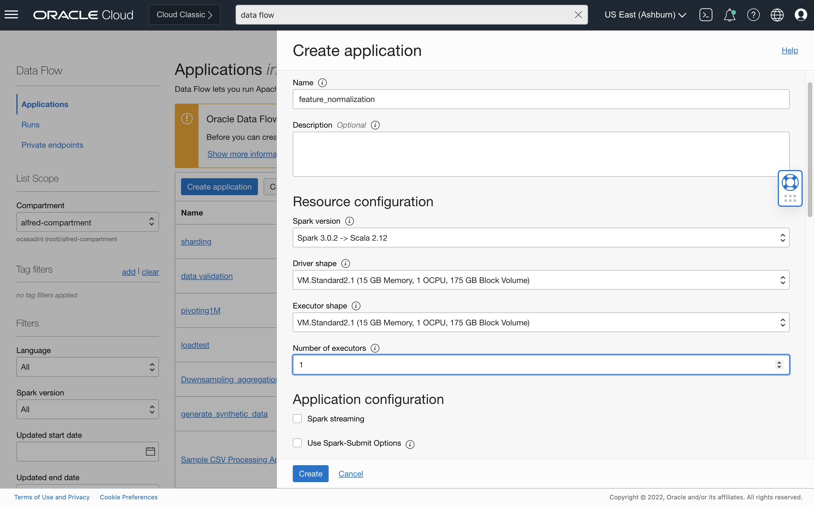
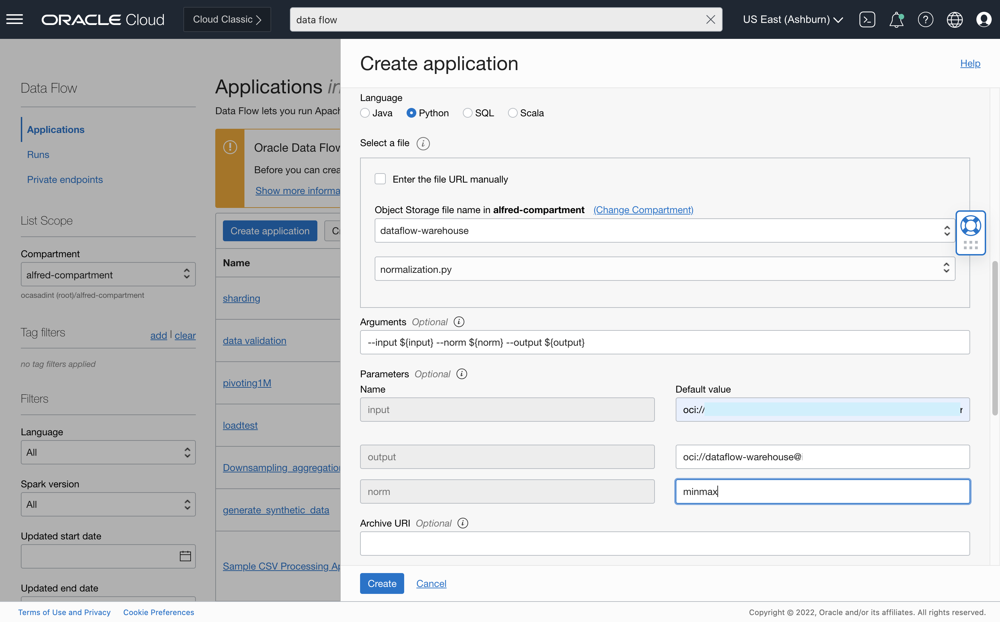
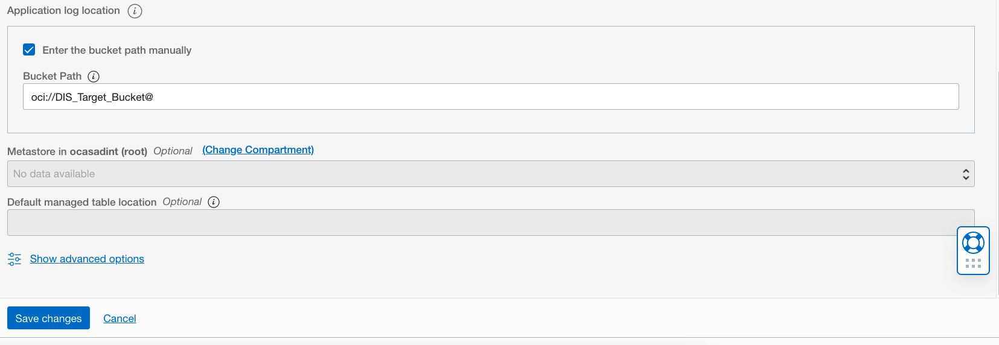

# DF: Feature Normalization

## Use case


The user wants to scale numeric features and normalize them into (0, 1) range for training ML/DL models. Two normalization methods are supported:

### Minmax scaling

! 
### Standard scaling

! 

## Preparation

All columns that need to be normalized should contain only numeric data.
You may find [Rename Column](column_rename.md), [Type Casting](./example_code/dtype_casting.py)
or [One Hot Encoding](one_hot_encoding.md) useful here.
See the sample datasets [scaling](../sample_datasets/scaling-example.csvgt) or [univariate_time_series](../sample_datasets/univariate_time_series.csv)

## Steps


Download the example Spark application: [normalization.py](./example_code/normalization.py)

```
Upload the code to OCI Object Storage(in case of Scala or Java, upload the compiled JAR file). Note the path to the code eg. bucket dataflow-
warehouse, root folder, file name normalization.py.
```

If there are multiple files, ensure they are all in the same folder


## Create an Application


```
Click "Create Application"
```





```
Select the number of Executors, logging location and path to the Spark application that we just created. If you are entering the path manually, it needs to
be specified in the following format: oci://dataflow-warehouse@<compartmentID>/normalization.py where <compartmentID> is the compartment name.
Otherwise, you can use the browser to choose an object
```

Add the following to the arguments:

```
--input ${input} --columns ${columns} --norm ${norm} --output ${output}
```

<b>input</b> points to the input data source. The resulting dataframe will have selected numeric <b>columns</b>/ features scaled based on user's choice of "minmax"
or "standard" normalizations given in <b>norm</b> argument.

Specify path in Object Storage to store logs. These may be useful later for troubleshooting.




```
Click "Save changes" to save the Application
```
