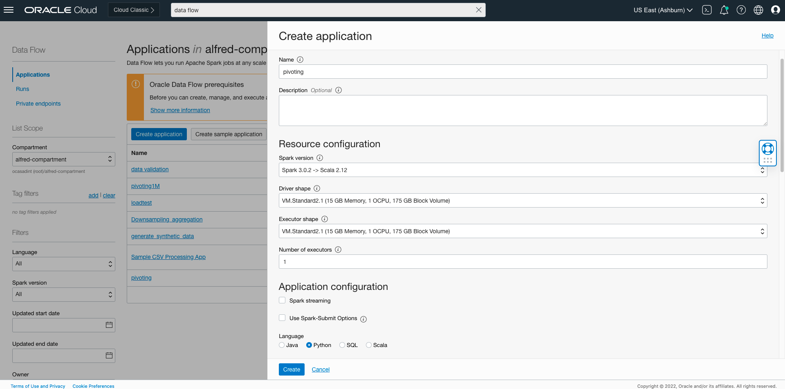
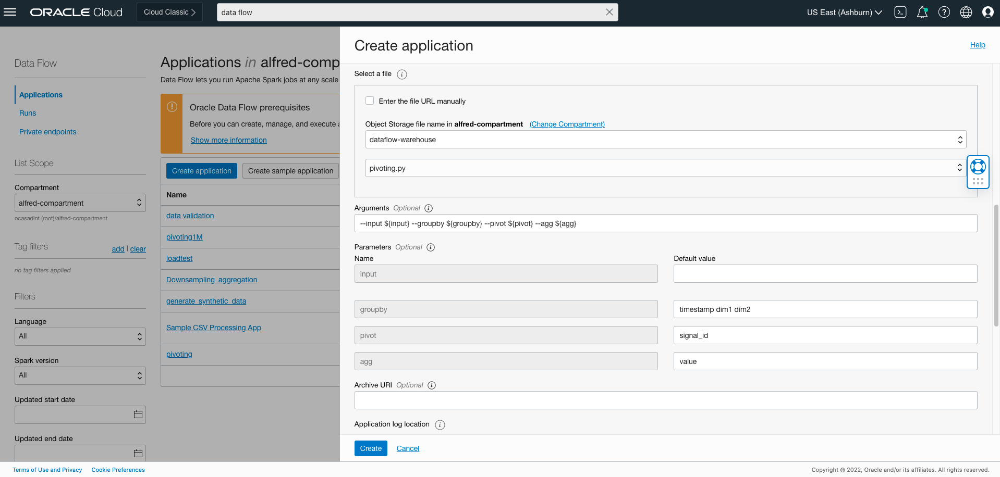
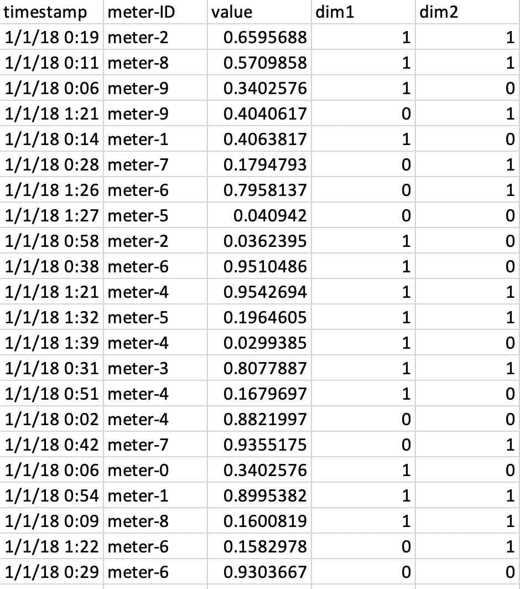
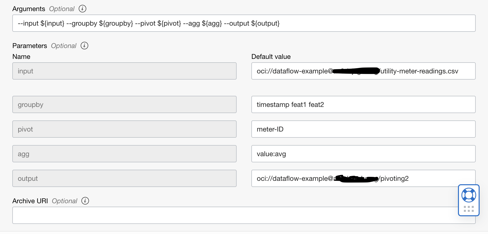

# DF: Pivoting

## Use case

The user wants to pivot on

1. A Single dimension column. Time series data to be partitioned based on distinct signal values stored in the dimension column into multiple single
dimensional (/Univariate) time series data sets.
2. Multiple dimension columns. Time series data to be partitioned based on unique combinations of signal values stored in all dimension columns.

## Steps

```
Download the example Spark application†
```
Upload the code to OCI Object Storage(in case of Scala or Java, upload the compiled JAR file). Note the path to the code eg. bucket dataflow-
warehouse, root folder, file name [pivoting.py](./example_code/pivoting.py).

If there are multiple files, ensure they are all in the same folder


## Create an Application

```
Click "Create Application"
```




```
Select the number of Executors, logging location and path to the Spark application that we just created. If you are entering the path manually, it needs to
be specified in the following format: oci://dataflow-warehouse@<compartmentID>/pivoting.py where <compartmentID> is the compartment name. Otherwise,
you can use the browser to choose an object
```

Add the following to the arguments:

```
--input ${input} --groupby ${groupby} --pivot ${pivot} --agg ${agg} --output ${output}
```
<b>input</b> points to the input data source. The resulting dataframe will have rows where each represent a unique combination of values in the columns
specified as <b>groupby</b>, e.g. "timestamp dim1 dim2". Each column is a unique value in the <b>pivot</b> column of the original dataframe. Finally <b>agg</b> represent
the column over which values are aggregated. `agg` should follow the pattern `<column>:<function>`. `function` here can be one of `min/max/sum/first/avg`.


## Example input table and generated pivot table :



```
Specify path in Object Storage to store logs. These may be useful later for troubleshooting.
```



```
Click "Save changes" to save the Application
```


