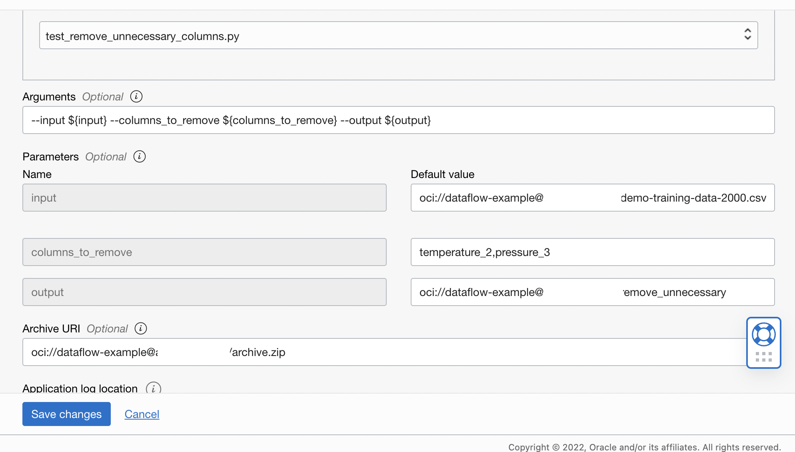

# Prepackaged DF: one way to hook up multiple components

## Use case
You might be aware that OCI Data Flow is a powerful service for running Spark applications, generated by uploading a single code application in Java, Python SQL and Scala. For better coding pattern, Data Flow supports modularization by reading from an archive file as an library in addition to the main application file. This helps customers to work with the development of mid- to large- sized applications.

## Reference
For a more general and comprehensive introduction on adding dependency to Data Flow in different languages under various OS, please check their [official doc](https://docs.oracle.com/en-us/iaas/data-flow/using/third-party-libraries.htm#example-requirements-packages). Here we are using **MacOS**, and we will use Python and code samples under `example_code` as demo.

## Steps
### Building up Python Wheel
Python .whl files, or wheels, is a popular tooling for building for Python packages. If you’ve installed a Python package using pip, then chances are that package is built with wheel.

Here we will wrap up everything inside `example_code` as our dependency package. Firstly go to the right path:
```
$ cd <path-to-your-workspace>/oci-data-science-ai-samples/ai_services/anomaly_detection/data_preprocessing_examples/oci_data_flow_based_examples
```

Create a `virtualenv` for creating lightweight virtual environments with their own site directories, optionally isolated from system site directories:
```
$ pip install virtualenv
$ virtualenv venv
$ . venv/bin/activate
```

Run the `setup-archive.sh` under the current folder:
```
(venv)$ chmod +x setup-archive.sh
(venv)$ ./setup-archive.sh
```

Notice: there is a file called `requirements.txt`, which includes the dependencies we need. Other than self made code package, we also put `oci` and `pandas` in the list, since these are the libraries mostly used according to our experience. Feel free to add or delete libraries based on your own requirement.  

Switch back and great! Now you should have your package `archive.zip` generated under `dist/` folder. You are ready to use your package for writing application. The following is an example of utilizing [remove_unnecessary_columns](./example_code/remove_unnecessary_columns.py):
```
import argparse
from pyspark.sql import SparkSession
from example_code import remove_unnecessary_columns

if __name__ == "__main__":
    parser = argparse.ArgumentParser()
    parser.add_argument("--input", required=True)
    parser.add_argument("--output", required=True)
    parser.add_argument("--columns_to_remove", required=True)
    parser.add_argument("--coalesce", required=False, action="store_true")

    args = parser.parse_args()
    spark = SparkSession.builder.appName("DataFlow").getOrCreate()
    df = spark.read.csv(args.input, header=True)
    df = remove_unnecessary_columns.remove_unnecessary_columns(df, args.columns_to_remove)

    if args.coalesce:
        df.coalesce(1).write.csv(args.output, header=True)
    else:
        df.write.csv(args.output, header=True)
```
Let's call it `test_remove_unnecessary_columns.py`. Now you have everything ready, and follow all the steps same to other DF applications. The only thing different is you need to upload the `archive.zip` to one of your object storage bucket and import it under `Archive URI`:



Once you've done everything, deactivate and cleanup the virtual environment:
```
(venv)$ deactivate
```