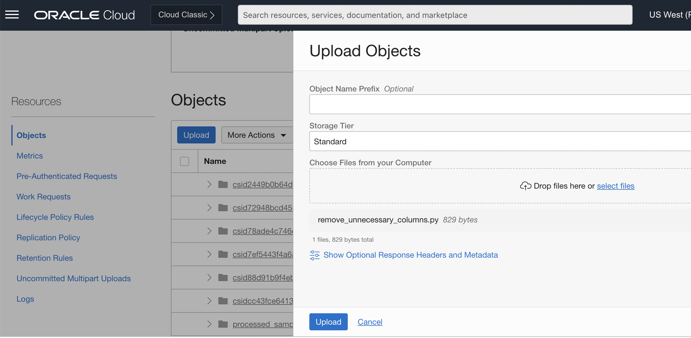
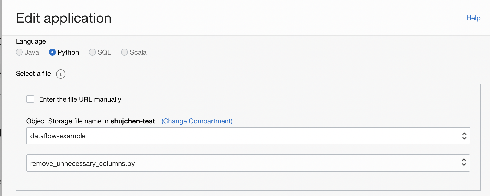
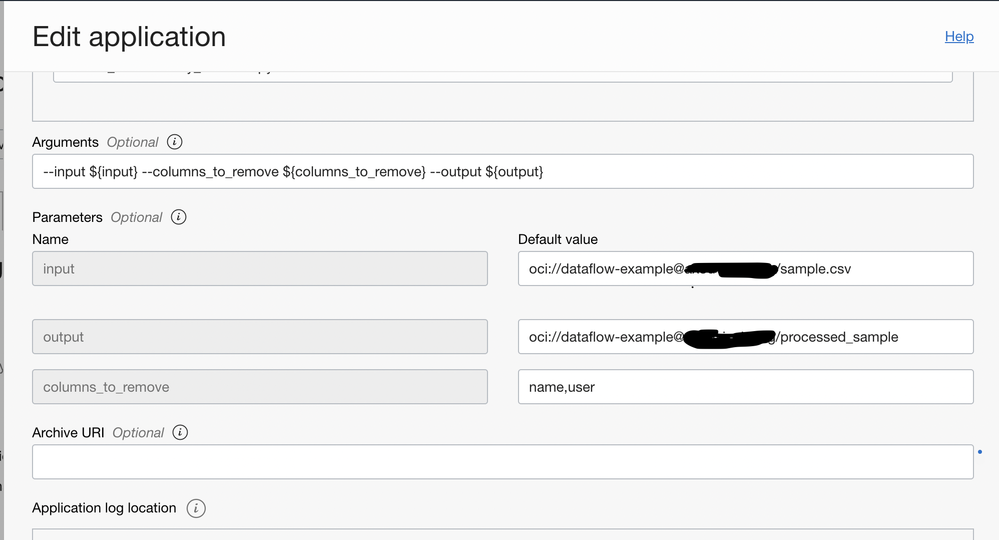
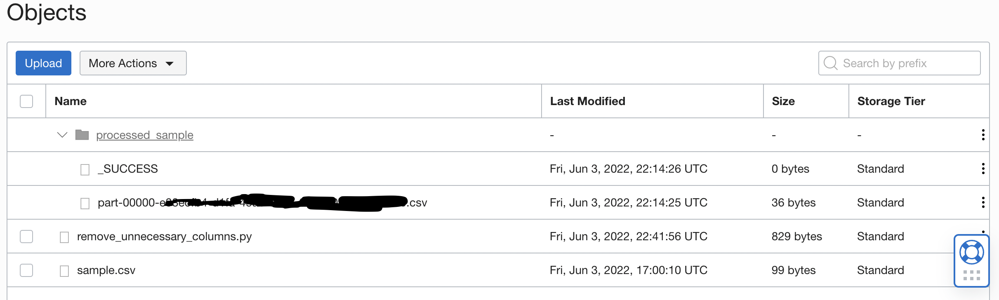

# DF: Remove Unnecessary Column(s)

## Use case

You can use it to remove specified column(s) in your csv.

## Prerequisites
Follow the [guide](../README) and setup your policies correctly.

Also, for csv, you can use [utility-meter-readings](../sample_datasets/utility-meter-readings.csv) as an example.

## Steps

Download the example Spark application: [remove_unnecessary_columns.py](./example_code/remove_unnecessary_columns.py)

Upload the code to OCI Object Storage(in case of Scala or Java, upload the compiled JAR file). 

Also, upload the csv file waiting to be processed to the OCI Object Storage. It can be either the same Object Storage as the code or a different one. 


## Start DataFlow


Go to **Analytics & AI** > **Data Flow** > click **Create application**.

Select the language and code file accordingly. Here we are using Python.




Add the following to the arguments:

```
--input ${input} --columns_to_remove ${columns_to_remove} --output ${output}
```

(unlikely) or, if you want to [coalesce](https://spark.apache.org/docs/latest/api/python/reference/api/pyspark.RDD.coalesce.html) your data frame, all a `--coalesce` flag to your argument list:
```
--input ${input} --columns_to_remove ${columns_to_remove} --output ${output} --coalesce
```

- <b>input</b> points to the input data source. Notice you will need to specify the full oci file path by following the format `oci://<bucket-name>@<namespace>/<path-to-file>`. `bucket-name` and `namespace` can be found at your bucket details under **Object Storage**.
- <b>output</b> is similar to <b>input</b>, except the `<path-to-file>` should be change to a `<folder-path>`, since the output file will be written to your specified folder.
- <b>columns_to_remove</b> is a list of all the columns you want to remove, splitted by commas ",". In my example, I have a csv with two columns `name` and `user`, which I want to remove.



Finally, choose the bucket to save the application log. In case there is failure during execution, you can check what's going on there.

Click "Save changes" to save the Application.


## Execution and result
Click **Run** on your application. Once the execution succeeds, go to your specified bucket and check result.




