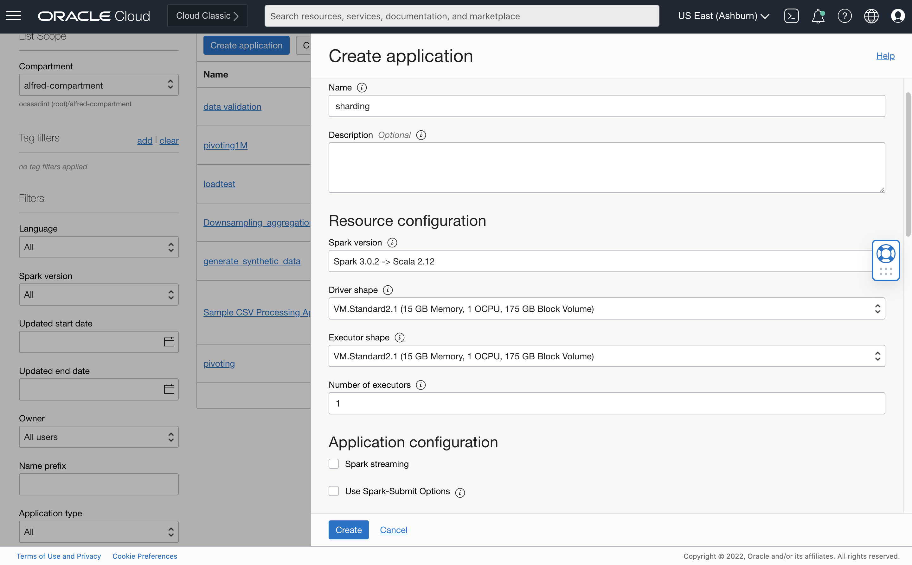
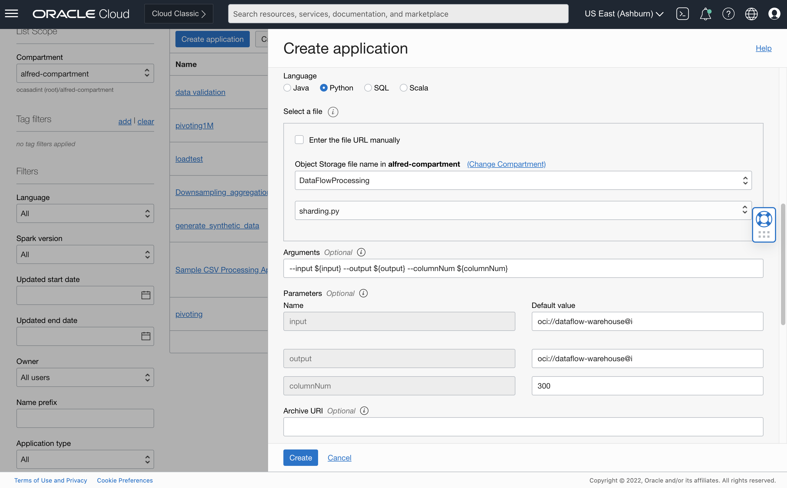

# DF: Sharding

## Use case


You want the system to automatically perform "Columnar Data Sharding" on input data.
For example, you have a large number of signals and you want to group 300 columns at a time to detect anomalies using OCI Anomaly Detection

## Preparation

If a timestamp column is present, it should be named 'timestamp'(all in lower case). 
This will ensure that the columns is present in all the shards.
You may find [Rename Column](column_rename.md) or [Remove Unnecessary Columns](../oci_data_integration_based_examples/Remove_unnecessary_columns.md) useful here.
See the sample dataset [univariate_time_series](../sample_datasets/univariate_time_series.csv) for a working example.

## Steps

Download the example Spark application: [sharding.py](./example_code/sharding.py)

Upload the code to OCI Object Storage(in case of Scala or Java, upload the compiled JAR file). Note the path to the code eg. bucket dataflow-
warehouse, root folder, file name sharding.py.


If there are multiple files, ensure they are all in the same folder


## Create an Application


```
Click "Create Application"
```






Select the number of Executors, logging location and path to the Spark application that we just created. If you are entering the path manually, it needs to
be specified in the following format: oci://dataflow-warehouse@<compartmentID>/pivoting.py where <compartmentID> is the compartment name. Otherwise,
you can use the browser to choose an object

Add the following to the arguments:

```
--input ${input} --columnNum ${columnNum} --output ${output}
```

<b>input</b> points to the input data source, and <b>columnNum</b> represents the max number of columns for sharding. The resulting dataframes, each with <b>columnNum</b> max number of columns are stored at output.


Specify path in Object Storage to store logs. These may be useful later for troubleshooting.


```
Click "Save changes" to save the Application
```


