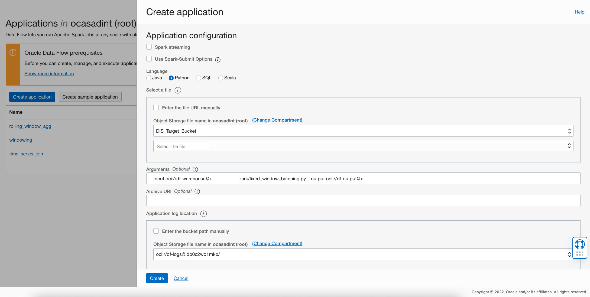
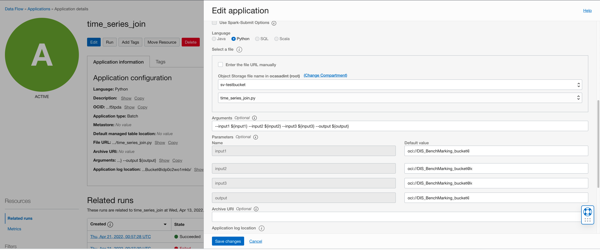

# DF: Sliding Window Aggregation

## Use case

1. You want to smooth your data points by replacing them with an average applied on a sliding window, or
2. You want to use the cumulative sum of a signal over a fixed interval eg. for meter readings at equally spaced intervals of 30s, calculate the 1 min
totals before using OCI Anomaly Detection service, or
3. You are interested in the minimum/maximum over a sliding window, or
4. You want to keep only a fraction of the samples at equally spaced intervals and drop the remaining

For an alternative which preserves the original data, see [Fixed window batching](Fixed_window_batching.md)

## Preparation

If the aggregation to be performed is sum/minimum/average, the input needs to contain a column named 'timestamp'(all in lower case).
All other columns needs to be numeric. You may find [Rename Column](column_rename.md), [Type Casting](./example_code/dtype_casting.py)
or [Remove Unnecessary Columns](../oci_data_integration_based_examples/Remove_unnecessary_columns.md) useful here.
For an example that works with min/max/sum aggregation, see the sample dataset [univariate_time_series](../sample_datasets/univariate_time_series.csv)
For an example where you just want to drop extra samples, see the sample dataset [utility-meter-readings-multivariate](../sample_datasets/utility-meter-readings-multivariate.csv)

## Steps

Download the example Spark application: [sliding_window_aggregation.py](./example_code/sliding_window_aggregation.py)

Upload the code to OCI Object Storage(in case of Scala or Java, upload the compiled JAR file). Note the path to the code eg. bucket dataflow-
warehouse, root folder, file name sliding_window_aggregation.py.


If there are multiple files, ensure they are all in the same folder


## Create an Application


```
Click "Create Application"
```



```
Select the number of Executors, logging location and path to the Spark application that we just created. If you are entering the path manually, it needs to
be specified in the following format: oci://dataflow-warehouse@<compartmentID>/fixed_window_batching.py where <compartmentID> is the compartment
id. Otherwise you can use the browser to choose an object
```


Add the following to arguments:

```
--input ${input} --output ${output} --batch_size ${batch_size} --step_size ${step_size} --aggregation_function ${agg}
```

Here batch size needs to be calculated based on the number of signals, if the purpose is to reduce the number of data points. For example, if each row in the data has 299 signals, AD can support a total of
300k/300 = 1000 rows per call. Set batch_size to 1000 and run the data flow. Step size can be used to control how much context to include in every frame.
A step size equal to the window size means that the data is partitioned into non-overlapping frames. This results in simple down-sampling of the data.

Aggregation function must be one of min/max/sum/first. Functions min/max/sum are calculated over the sliding window.
The function "first" is typically used with a step size equal to the window size, and results in reducing the data set to 1/N equally spaced rows, where N is the window size.

Specify path in Object Storage to store logs. These may be useful later for troubleshooting.


```
Click "Save changes" to save the Application
```

