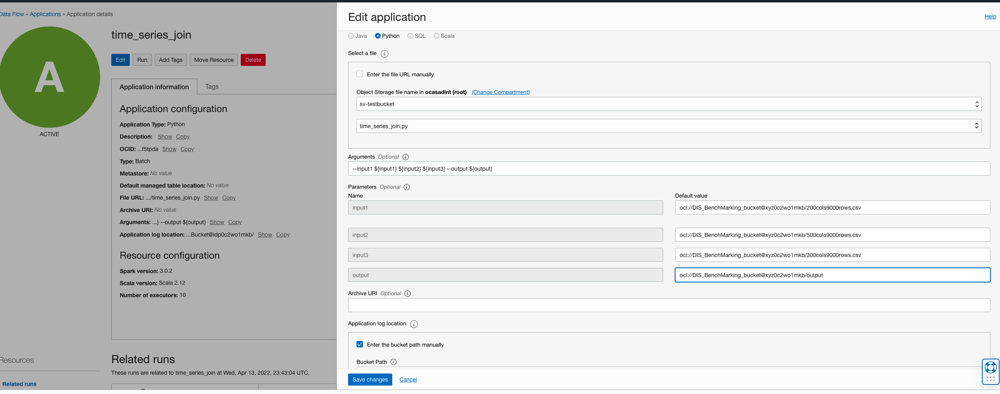
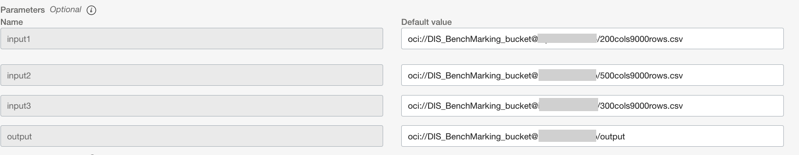
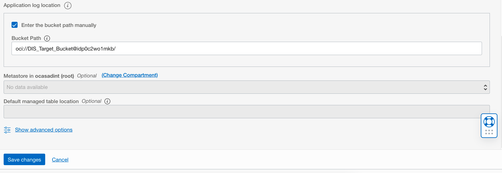

# DF: Time Series Join

## Use case

You have multiple time series with different signals corresponding to the same timestamps

## Preparation

Ensure all the series have a schema like (timestamp, signal1, signal2....).
Follow the instructions in DIS: Down Sampling to align the timestamps of the individual time series if necessary. For example, if one source contains
samples at a 1 min frequency and one contains samples at 30s frequency, down-sample the second one to select every alternate sample.


Ensure that all the series have distinct column names. If a column is exactly duplicated across 2 sources, follow the instructions in Remove Duplicate Columns to drop one of the duplicates.
If 2 columns have the same name but different values, follow the instructions in Rename Columns to change the name in one of the series.

## Steps

Download the example [Spark application](./example_code/time_series_join.py)

Upload the code to OCI Object Storage(in case of Scala or Java, upload the compiled JAR file). Note the path to the code eg. bucket dataflow-
warehouse, folder join, file name time_series_join.py.


## Create an Application

Click "Create Application"


Select the number of Executors, logging location and path to the Spark application that we just created. If you are entering the path manually, it needs to
be specified in the following format: oci://dataflow-warehouse@xyz0c2wo1mkb/fixed_window_batching.py where xyz0c2wo1mkb is the compartment
name. Otherwise you can use the browser to choose an object




Add the following to arguments. In the sample CSV file, there are 3 inputs. You may want to add more depending on the use case:

```
--input ${input1} ${input2} ${input3} --output ${output}
```

Add parameters for each of the expressions in curly braces above. You may assign a default value to each of the parameters. For input1/2/3 and
output., specify in the following format: oci://<bucket name>@<compartment name>/ <path to CSV>




Specify path in Object Storage to store logs. These may be useful later for troubleshooting.


Click "Save changes" to save the Application



Click "Save changes" to save the Application


