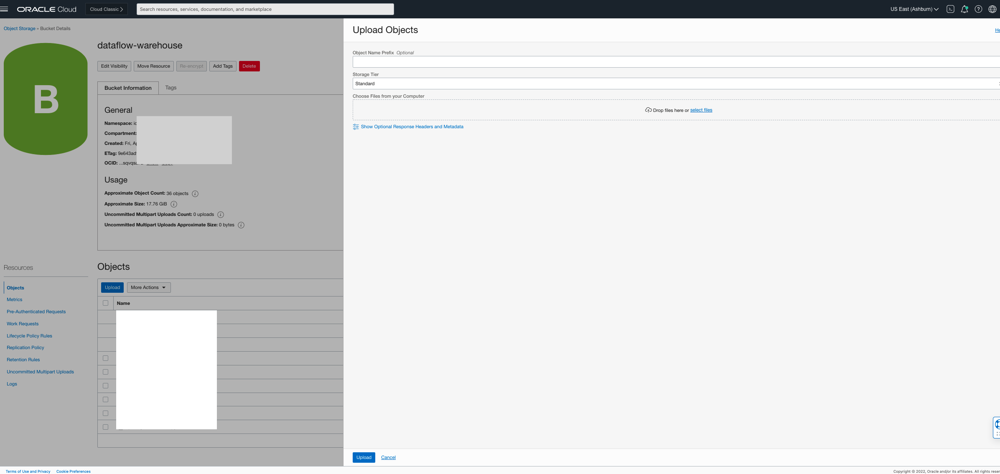
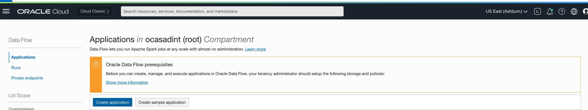
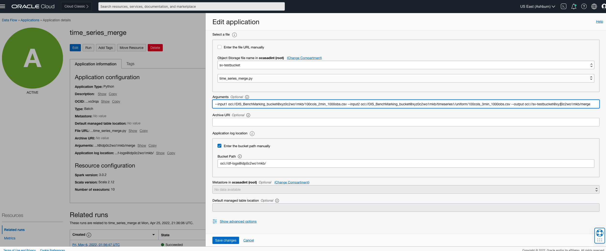
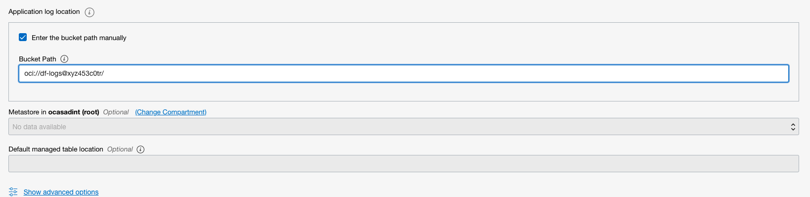

# DF: Time series merge

## Use case


You have multiple time series with the same set of signals but different timestamps.


## Preparation

Ensure all the series follow the same schema, which is of the form (timestamp, signal1, signal2....). The timestamp field must be in ISO format for all the
series. You might find some of the other transformations useful here, like Remove Unnecessary Columns and Date-time conversion.

## Steps


Download the example Spark application [time_series_merge.py](./example_code/time_series_merge.py)


Upload the code to OCI Object Storage(in case of Scala or Java, upload the compiled JAR file). Note the path to the code eg. bucket dataflow-
warehouse, folder join, file name time_series_merge.py.



## Create an Application


Click "Create Application"




Select the number of Executors, logging location and path to the Spark application that we just created. If you are entering the path manually, it needs to
be specified in the following format: oci://dataflow-warehouse@xyz0c2wo1mkb/time_series_merge.py where xyz0c2wo1mkb is the compartment name.
Otherwise you can use the browser to choose an object


Add the following to arguments:

```
--input1 {input1} --input2 {input2} --output {output}
```



Specify path in Object Storage to store logs. These may be useful later for troubleshooting.




Click "Save changes" to save the Application

## Expected Result

```
Under the output folder in Object Storage, you will find a CSV file conforming to the original schema of the source files, with timestamps in sorted order and no duplicates.
```
## Troubleshooting

```
Go to the log directory specified in Step 1 above and check for error messages
```

