# DIS: Multiple Input sources

## Use case

The user wants to get and combine data from multiple input sources.

## DIS Data Flow

For this example, we will demonstrate how to get input from 3 data sources, ATP, ADW and Object Store, and combine them into a single data file which
can be then used as in input for AD Service.
## Setting the Input Source


### Importing Object Store:

Add a source operator for the raw data. Refer to [Load Data in DIS Data Flow](./dataIO.md), Object Store Section.

Ensure the successful parsing of data through the attributes and data column.

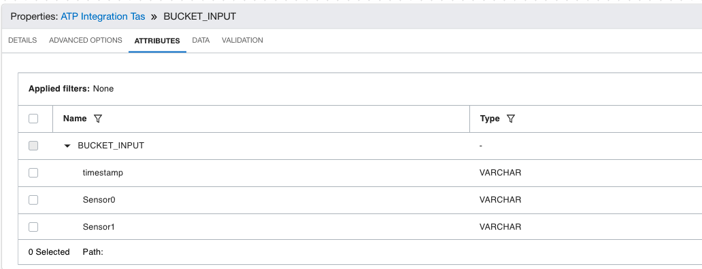

### Importing ATP:
```
Add a source operator for the raw data. Refer to Load Data in DIS Data Flow, ATP Section.
```

Ensure the successful parsing of data through the attributes and data column.

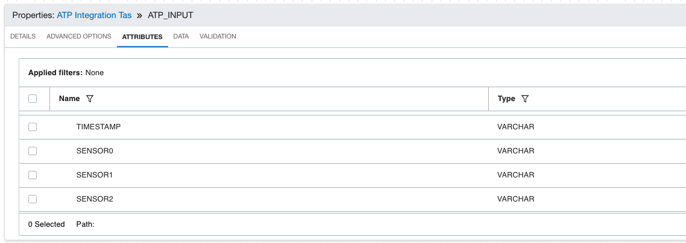

### Importing ADW:

```
Add a source operator for the raw data. Refer to Load Data in DIS Data Flow, ADW Section.
```
Ensure the successful parsing of data through the attributes and data column.

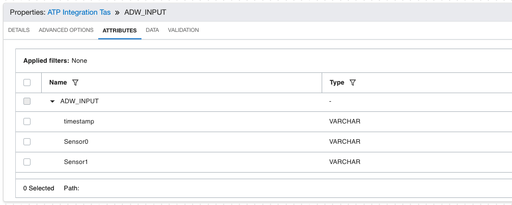

## Data Concurrency

```
Add an expression column to every input source such as shown in the image below.
```
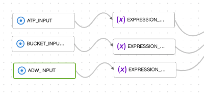

For this, enter the expression by drag and drop functions.

Goals for expression operator:

1. Ensure all respective columns are in the same DataType. You can use the cast expression as shown below:
Drag and drop the expression tab and click on add expression

    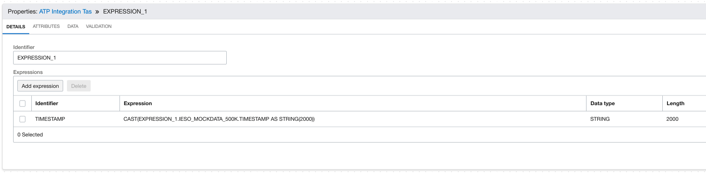
   
     After that, enter the Expression to cast into the desired datatype as below, along with selecting the same on the 'Data Type' field and setting a
length.

    Expression:
    ```
    CAST(EXPRESSION_2.BUCKET_INPUT.timestamp AS STRING(2000))
    ```
   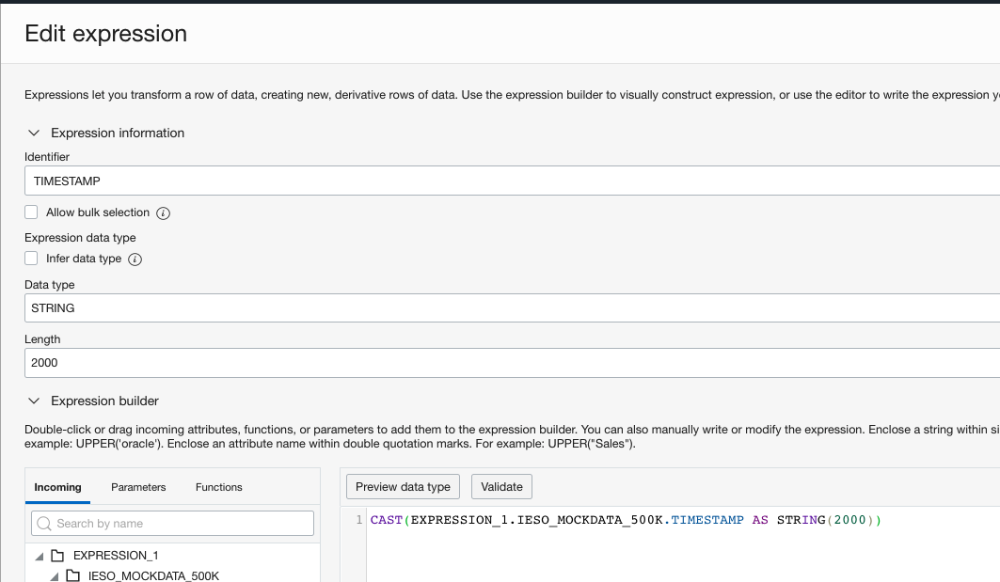


2. Exclude unnecessary columns/fields from the table.

    To do the same, go to Attributes on the expression tab, go to the field you want to exclude, click on the hamburger menu and click exclude(Eg,
Sensor 8 below).
   
      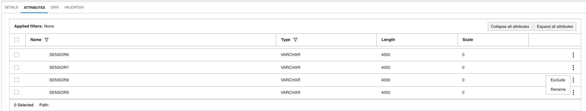
3. Applicable Date/Time Conversions - See here
## Joining Data-Sets

Once all the data is in the format we want, go to the Operators menu and drag and drop Union operator.
```
Select Match input attributes by name and a primary input type as shown below:
```
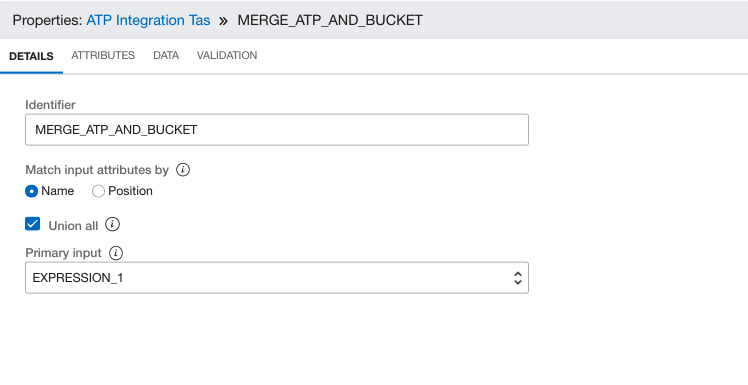

The operator should be able to automatically stitch the tables together and perform an outer join on its own. If it throws an error, check for the table
schema and datatypes.

## Sorting

Now, we need to sort the data in order to ensure that it's monotonically increasing Time-series data. For this, we can use the sort operator from the
operator's table.

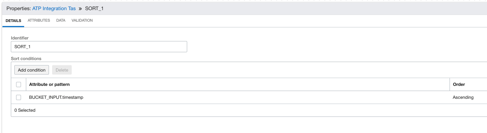

```
Here, add the sorting criterion by clicking on the add condition and selecting the TimeSeries field on the left had menu. Then, select Ascending on the
sorting order. You can refer to the images below for better clarity.
```

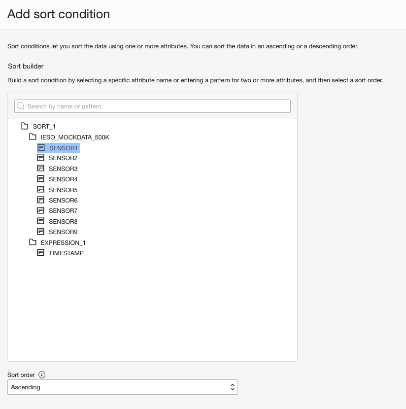

### Result Storage

Add a target operator for the preprocessed data. Refer to [Store Preprocessed Data to Object Storage](https://confluence.oci.oraclecorp.com/display/OCAS/DIS%3A+Multiple+Input+sources#:~:text=Store%20Preprocessed%20Data%20to%20Object%20Storage).

Connect the output of the filter operator to the input of the target operator. Your DF should be similar to something below.

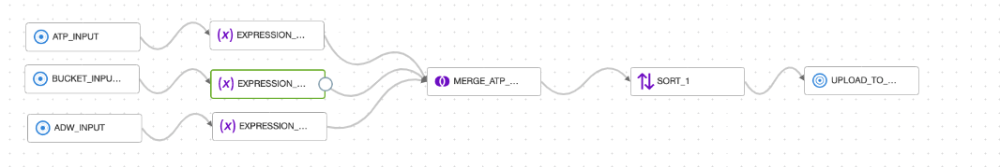

Go back to [DIS: Common Preprocessing Workflow](./Multiple_input_sources.md) to validate and execute the data flow.


