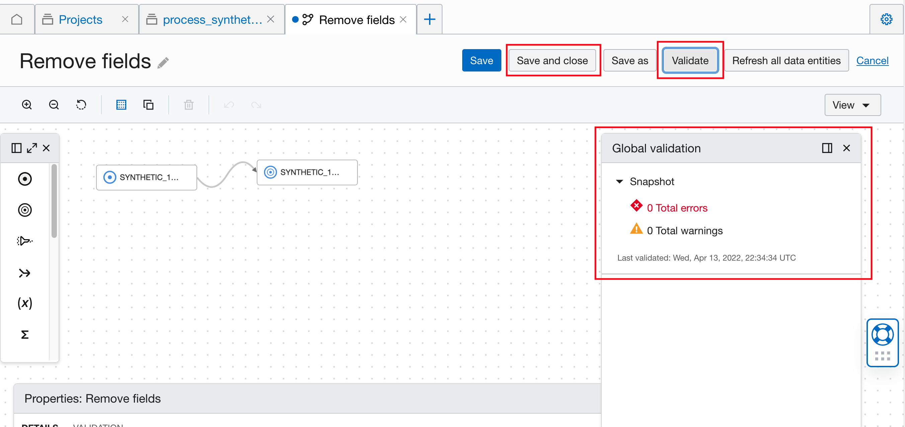

# DIS: Common Preprocessing Workflow

## Set up DIS


Refer to [this documentation](this documentation) to

```
Create resources (compartment, network and user group) for DIS.
Create policies to use DIS.
Create policies for DIS to access data sources.
```

Refer to [this documentation](https://docs.oracle.com/en-us/iaas/data-integration/using/workspaces.htm) to create a <b>DIS workspace</b>, and (optional) <b>create your own projects and folders</b>.

## Create a DIS Data Flow for Preprocessing


Navigate to your workspace, and follow [this documentation](https://docs.oracle.com/en-us/iaas/data-integration/using/data-flows.htm#creating-a-data-flow) to create a <b>DIS: Data Flow</b> in the default project or your own project/folder.

To load data and store data, follow [DIS data I/O](https://confluence.oci.oraclecorp.com/pages/viewpage.action?pageId=1594657765) to create <b>DIS data assets</b> and add <b>source & target operators</b> in the DIS data flow.

Follow the sub-pages to create DIS data flow for your preprocessing task.

1. [DIS: Date-time conversion](./date_time_conversion.md)
2. [DIS: Down-Sampling](downsampling.md)
3. [DIS: Time Series Merge](./time_series_merge.md) 
4. [DIS: Multiple Input sources](./Multiple_input_sources.md) 
5. [DIS: Remove Unnecessary Columns](./Remove_unnecessary_columns.md)
6. [DIS: String Replacement](string_replacement.md)
7. [DIS: Temporal Differencing](./Temporal_differencing.md) 
8. [DIS: Time Series Join](./time_series_join.md)


After designing the data flow, click <b>Validate</b>. on the data flow page. If there is no error, click <b>Save and close</b>. <br>


## Run the Preprocessing Task

```
1. Create an integration task
    a. On the project page, click "Tasks" - "Create task" - select "Integration".
    b. Select the data flow that we just created.
    c. Click "Save and close".
2. Publish task to DIS application
    a. Click the 3-dot menu icon for the new task - select "Publish to Applications" - choose "Default Application" - click "Publish".
    b. Click the plus sign to add a new tab - choose "Applications" - click "Default Application".
    c. Wait for the new task to show up in Tasks (check the status in Patches).
3. When the new task shows up in your application, click the 3-dot menu icon of the task - click "Run".
4. Track the status of the run in "Runs". After it finishes successfully, the output file is written to target location.
```

### Detailed documentation on

1. [Creating Integration Tasks](https://docs.oracle.com/en-us/iaas/data-integration/using/integration-tasks.htm) 
2. [Publishing Design Tasks](https://docs.oracle.com/en-us/iaas/data-integration/using/publish-design-tasks.htm) 
3. [Using Applications to Run Tasks](https://docs.oracle.com/en-us/iaas/data-integration/using/run.htm) 

