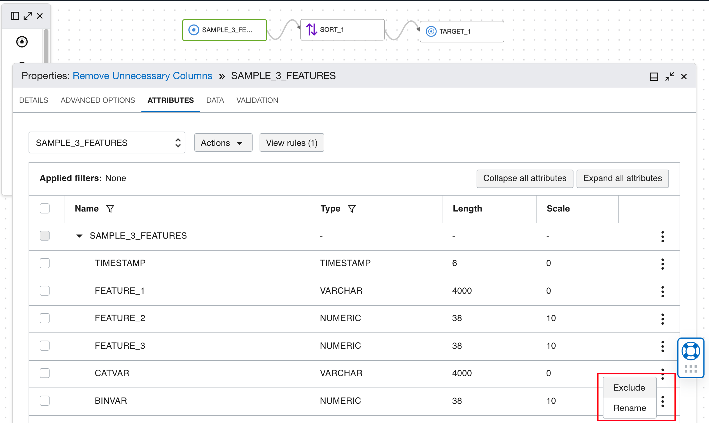
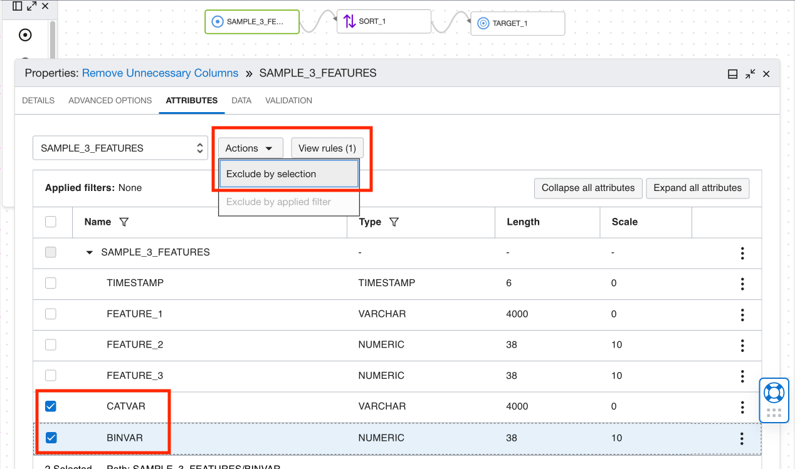
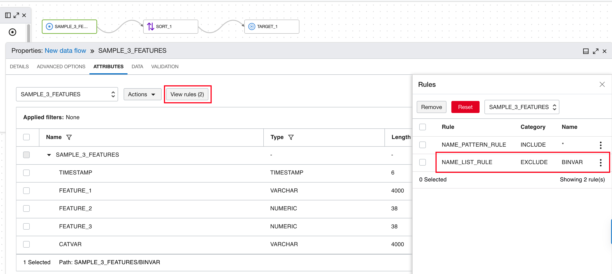
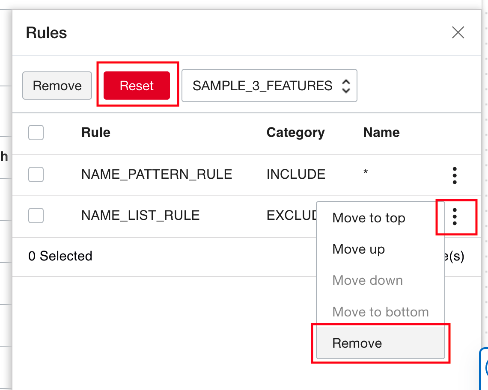

# DIS: Remove Unnecessary Columns

## Use case

1. User wants to remove unnecessary columns/fields in the input data.
2. User wants to remove columns that are already processed in the DIS data flow.
    a. Example: user uses the Expression operator to convert timestamps to a supported format. The old timestamp column can be excluded in the next step of the data flow.

## DIS Data Flow

Select an operator in the data flow where you want to remove columns from. If the <b>Properties</b> panel does not show up, right click the operator and select <b>Details</b>.

Click the <b>Attributes</b> tab in the Properties panel. Here you can see all the columns in the input data of this operator.

To exclude a single column, select the 3-dot menu icon of that column and click <b>Exclude</b>.

To exclude multiple columns, check the columns and select Actions - Exclude by <b>selection</b>.

The excluded columns will disappear from the table. You can see the excluded columns in <b>View rules</b>.

To undo the exclusion for one column, click the 3-dot menu icon for the corresponding rule, and click <b>Remove</b>.

To undo all the exclusions, click the red <b>Reset</b> button in Rules.

