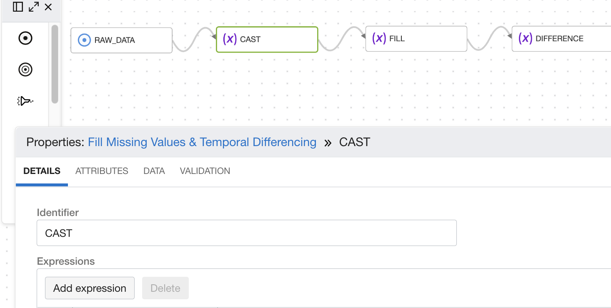
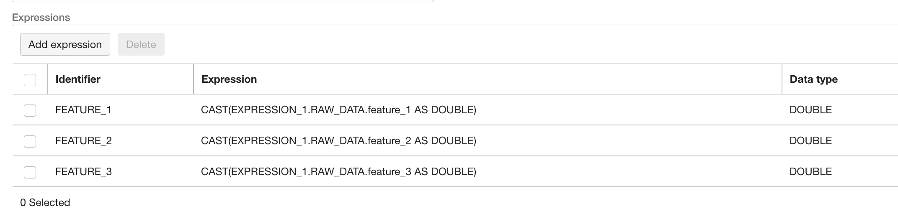
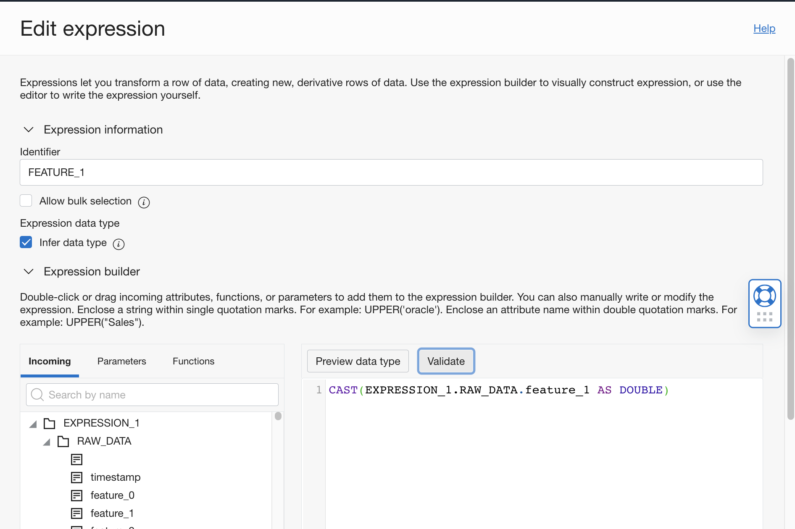
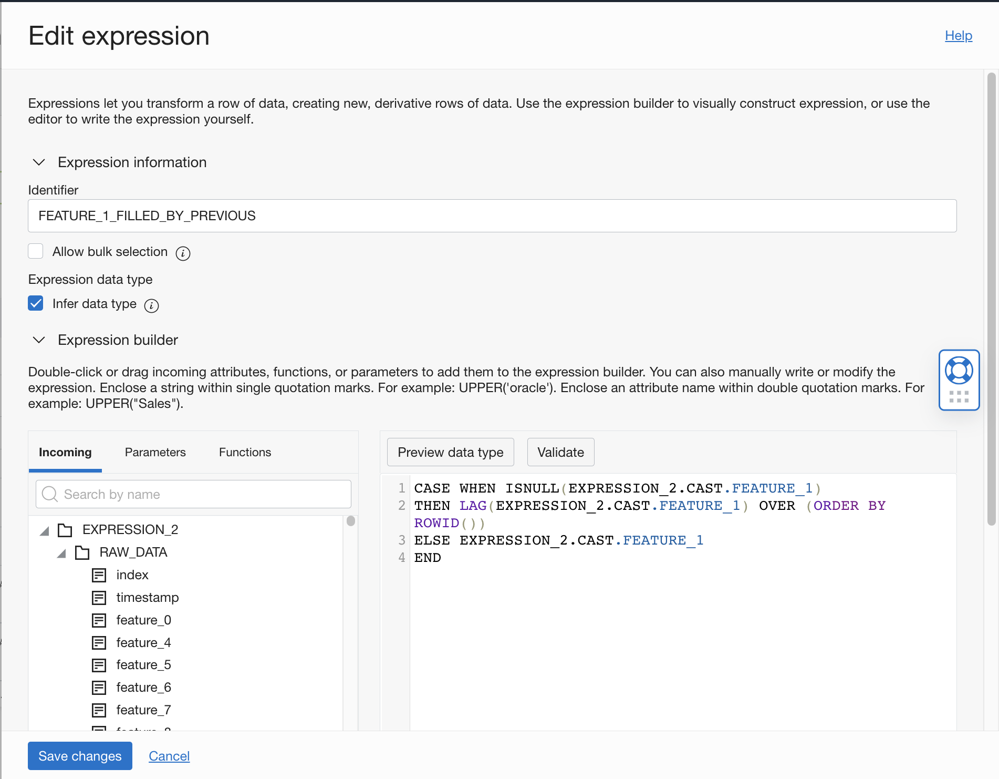
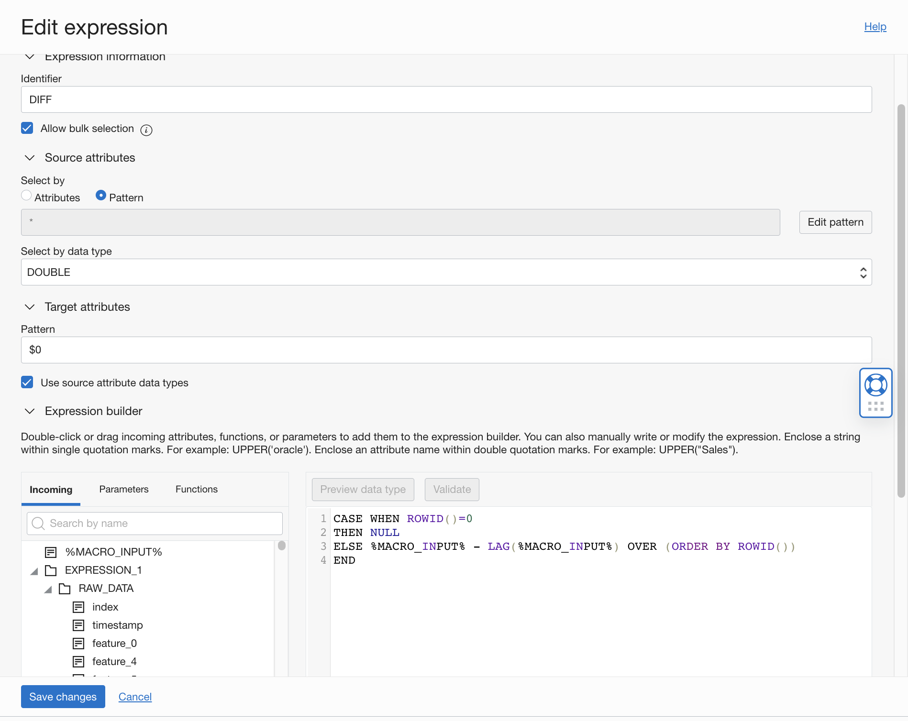

# DIS: Temporal Differencing

## Use case


The user wants to learn and understand trends after every step.

## DIS Data Flow

Add a source operator for the raw data. Refer to Load Data in [DIS Data Flow](./dataIO.md).


In this example data, all signals in the string format with missing(N/A) signals as well.
```
Drag and drop a Cast operator onto the canvas. Hover over the source operator until you see the connector (small circle) on the right side of the operator.
Then drag and drop the connector to the filter operator. Click the filter operator to open the properties panel, under the details tab, click "Add expression"
to create a filter condition.
```


Enter the expression by drag and drop functions, or directly type in the editor.



Expression:

```
CAST(Value AS DATATYPE)
```

Enter the Datatype as the second parameter for CAST().

Here, we want the dataType to be a numerical datatype, such as int, float or double.

Click the Validate button. If the expression is valid, a green toast notification will show up. Click "Save changes".




```
Now, we need to account for missing/null values(you can skip this step if your data doesn't have null values)
```


Like the previous step, create an expression wherein we fill the null value with a lag of the previous column expression. Also, ensure you get the datatype
as set in the previous step and use the same by clicking on the Infer Data Type checkbox.


You can scale up the expression to account for all columns you want in your difference.
```
CASE WHEN ISNULL(EXPRESSION_2.CAST.FEATURE_1) THEN LAG(EXPRESSION_2.CAST.FEATURE_1) OVER (ORDER BY ROWID()) ELSE EXPRESSION_2.CAST.FEATURE_1 END
```

Finally, we calculate the difference.

Drag and drop the expression operator and select the following fields. Mark the Identifier as DIFF, select Double as the data type and use "$0" as the
pattern to select the values. Next, get a difference between consecutive columns by the following command and click save.

```
CASE WHEN ROWID()=0
THEN NULL
ELSE %MACRO_INPUT% - LAG(%MACRO_INPUT%) OVER (ORDER BY ROWID())
END
```




Add a target operator for the preprocessed data. Refer to [Store Preprocessed Data to Object Storage](./Data_integration_basic_setup.md).

Connect the output of the filter operator to the input of the target operator.

Go back to [DIS: Common Preprocessing Workflow](./Data_integration_basic_setup.md) to validate and execute the data flow.


