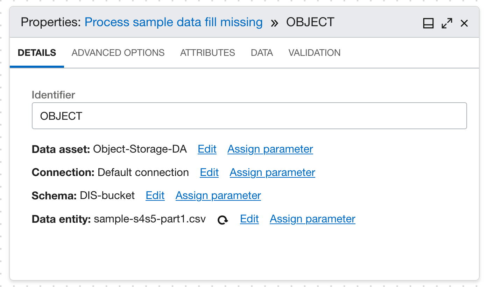
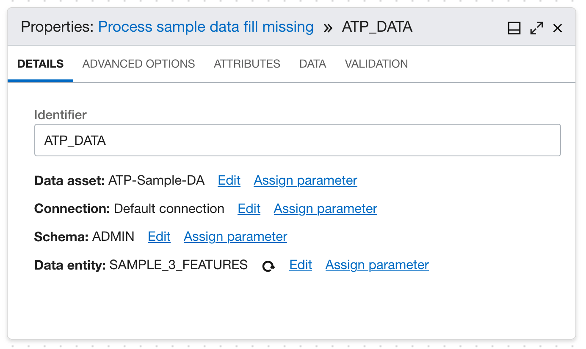
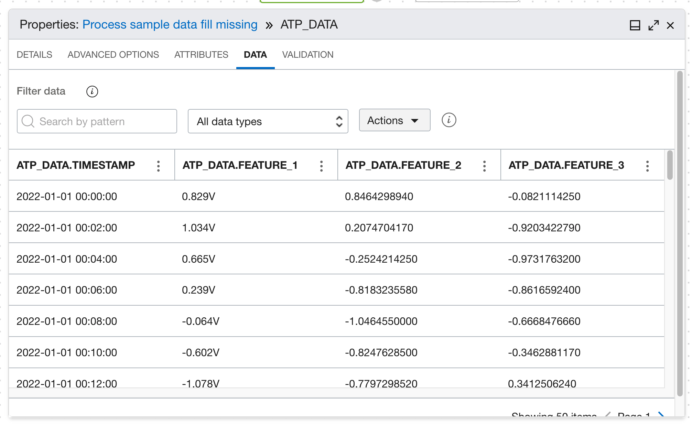
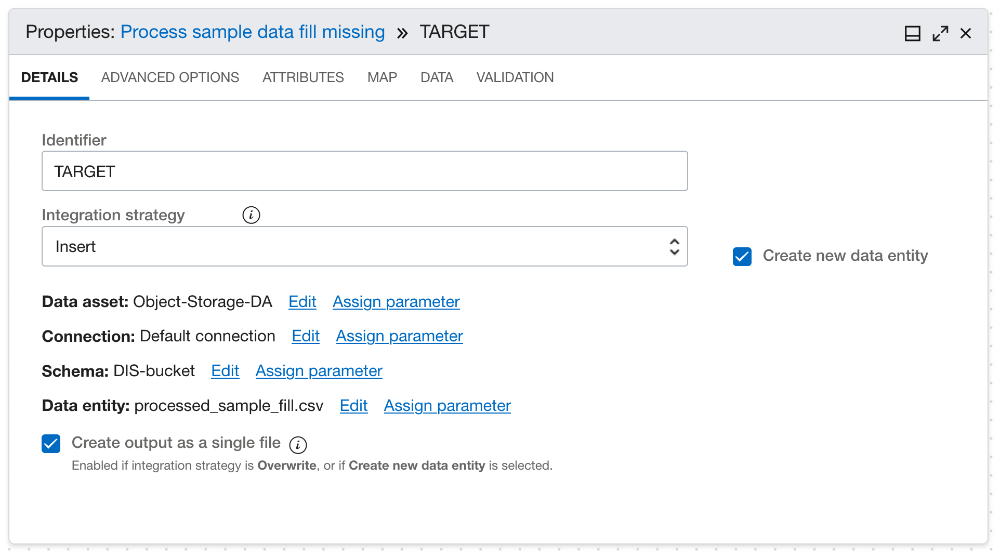

# DIS: Data I/O

## Create a DIS Data Asset

Refer to [OCI Data Sources](https://docs.oracle.com/en-us/iaas/data-integration/using/data-assets.htm#oci-source) to create a DIS Data Asset for your ATP, ADW or Object Storage Data.

## Load Data in DIS Data Flow

Refer to [Adding and configuring a source operator](https://docs.oracle.com/en-us/iaas/data-integration/using/using-operators.htm#add-source-operator).

Example properties for an Object Storage source. Schema is the bucket name. Data entity is the object name.

Example properties for an ATP/ADW source.

You can review the column metadata from the Attributes tab, and preview the data from the Data tab.

## Store Preprocessed Data to Object Storage

Refer to [Adding and configuring a target operator](https://confluence.oci.oraclecorp.com/pages/viewpage.action?pageId=1594657765#:~:text=Adding%20and%20configuring%20a%20target%20operator).

For AD training, the preprocessed data should be stored to a single table in ATP/ADW, or a single file in object storage.
    
     Example properties of a target that stores the preprocessed data to a single file in object storage.

For AD async inference, the processed data can be stored into multiple files in object storage.

      Example properties of a target that stores the preprocessed data to multiple files in a directory in object storage.

