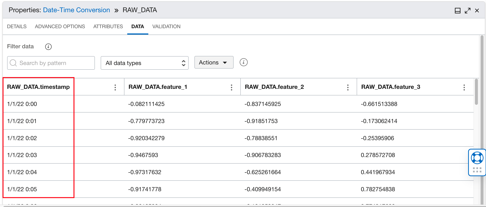
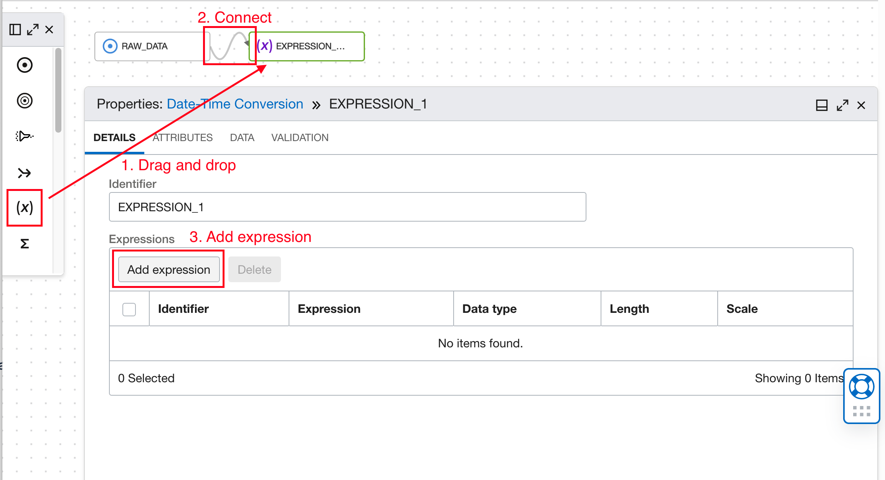
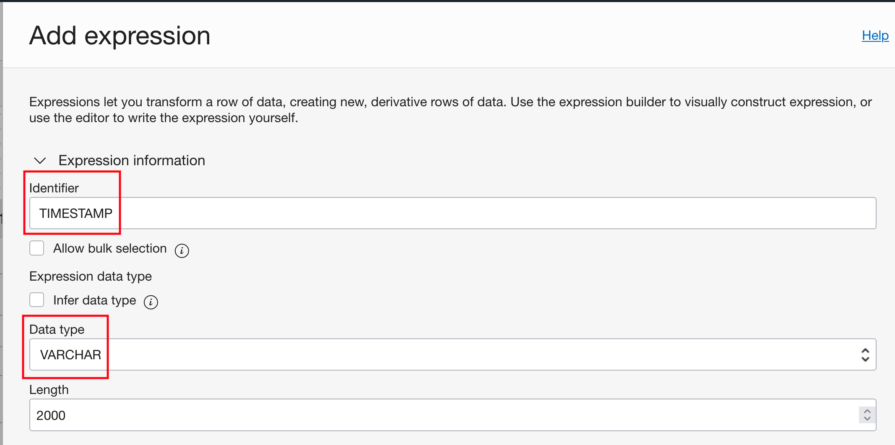
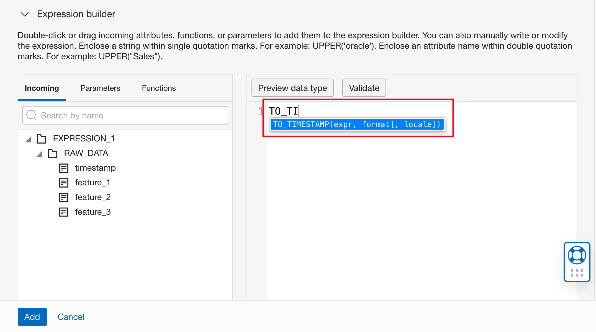
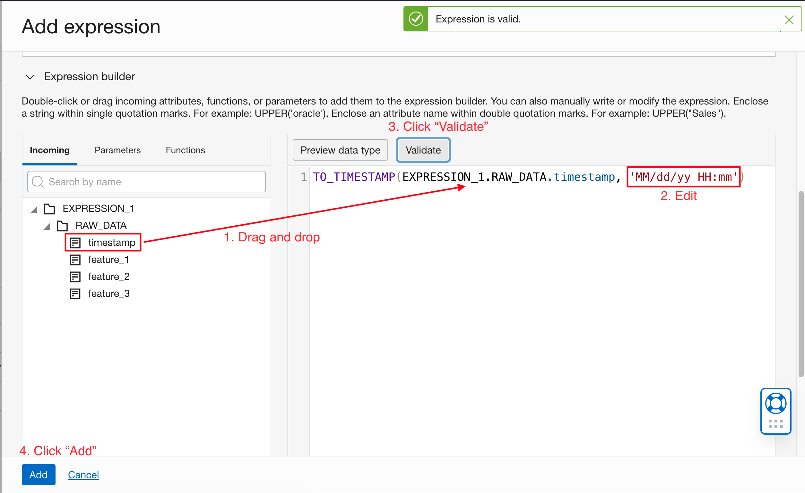
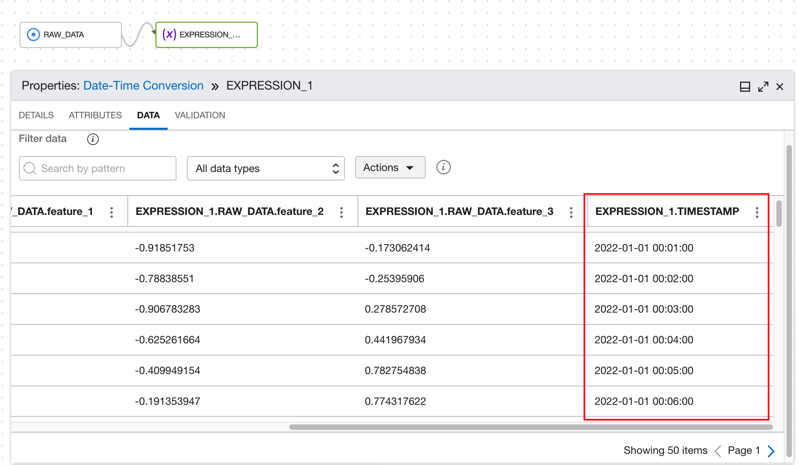
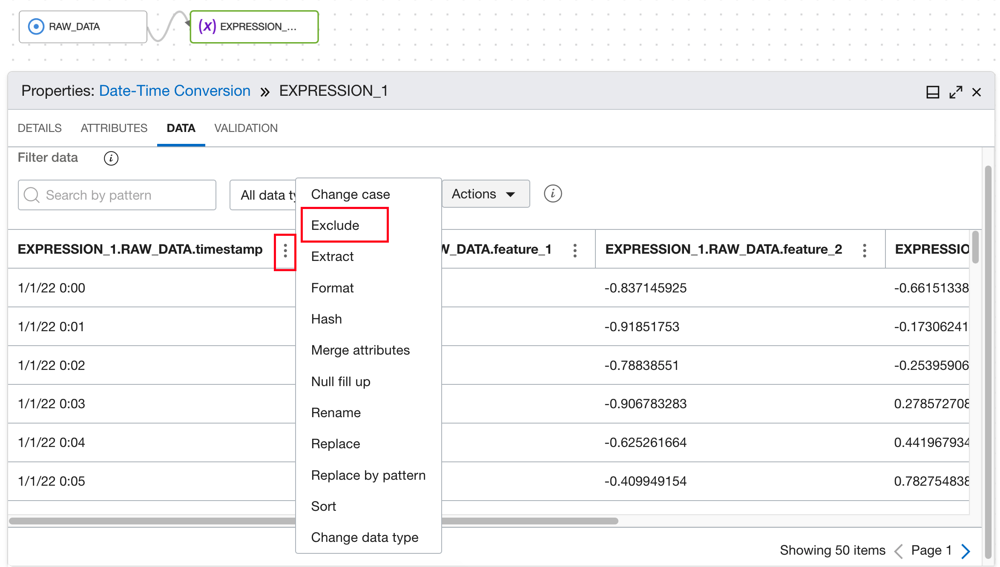
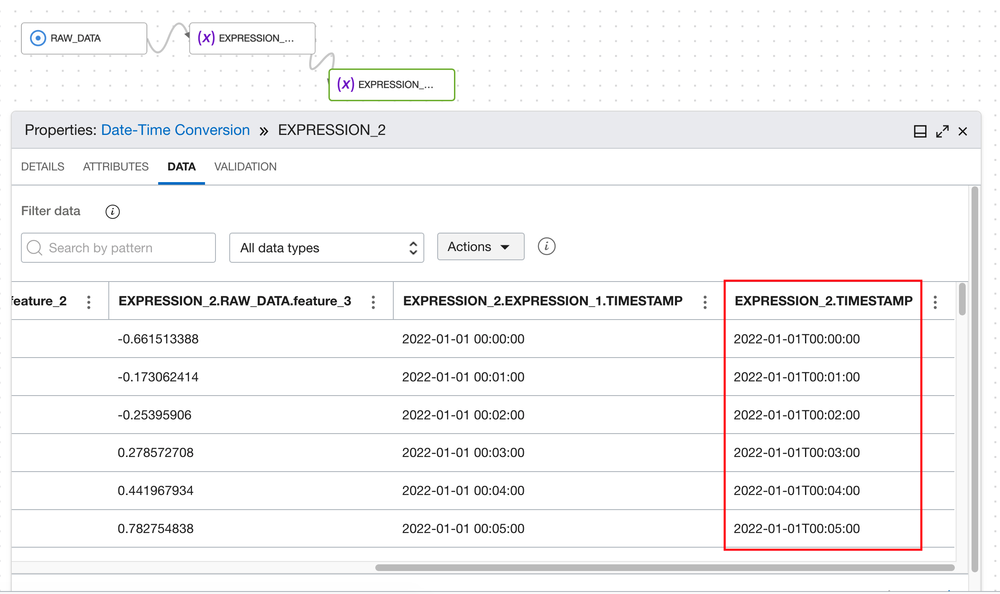

# DIS: Date-time conversion

## Use Case


User wants to convert timestamp to ISO format so it can be consumed by Anomaly Detection service.
```
"2020-07-13T18:55:46-08:00"
"2020-07-14T18:55:46+0800"
"2020-07-13T18:55:46Z"
"2020-07-13T18:55:46"
"2020-07-13T18:55Z"
"2020-07-13T18:55"
"2020-07-13"
"2018-02"
"02-03T16:11:35"
"16:11:35"
```
## DIS Data Flow

```
Add a source operator for the raw data. Refer to Load Data in DIS Data Flow.
In this example data, timestamps are in format "MM/dd/yy HH:mm".
```

```
Drag and drop an expression operator onto the canvas. Hover over the source operator until you see the connector (small circle) on the right side of the
operator. Then drag and drop the connector to the expression operator. Click the expression operator to open the properties panel, under DETAILS tab,
click "Add expression".
```


```
In the Expression information, change the Identifier to "TIMESTAMP", and make sure the Data type is VARCHAR.
```

```
Scroll down to the Expression builder. Type "TO_TIMESTAMP" in the editor and select the suggested function.
```



From the Incoming tab, drag and drop the timestamp column into the editor to replace "expr" for the TO_TIMESTAMP function.
Replace "format" with format of the existing timestamp with single quotes. Refer to [ Date and Time Functions ](https://docs.oracle.com/en-us/iaas/data-integration/using/using-operators.htm#unique_578180728) to figure out the syntax. In this case, we should put "MM/dd/yy HH:mm" (with single quotes). Date and Time Functions to figure out the syntax. In this case, we

If you need to provide the locale string, edit the optional parameter, otherwise just remove "[, locale]".
Click the Validate button. If the expression is valid, a green toast notification will show up. Click "Add".



```
The new expression is listed in the DETAILS tab of the expression operator.
Go to the DATA tab, and HH:mm:ss". scroll to the end. We can see a new column added with the name TIMESTAMP. It shows timestamps in format "yyyy-MM-dd
```


```
Now we want to remove the old timestamp column. Click the 3-dot icon and select "Exclude". Click "Apply" in the pop-up window to confirm.
```

```
This will exclude the old timestamp column from subsequent processing, and create another Expression operator.
```


In the second Expression operator, follow [DIS: String Replacement](./string_replacement.md) to replace the space between date and time with a letter "T". Use the expression
```
"REPLACE(EXPRESSION_2.EXPRESSION_1.TIMESTAMP, ' ', 'T')".
```
This will generate another new timestamp column with the ISO format we need.



Continue following the instructions in [DIS: String Replacement](./string_replacement.md) to create a target operator, connect it, configure it, and exclude the timestamp column
we created earlier, which we don't need in the result.

Go back to [DIS: Common Preprocessing Workflow](./Data_integration_basic_setup.md) to validate and execute the data flow.


