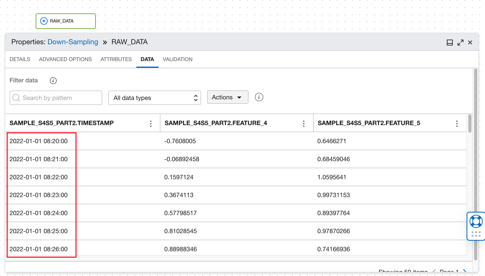
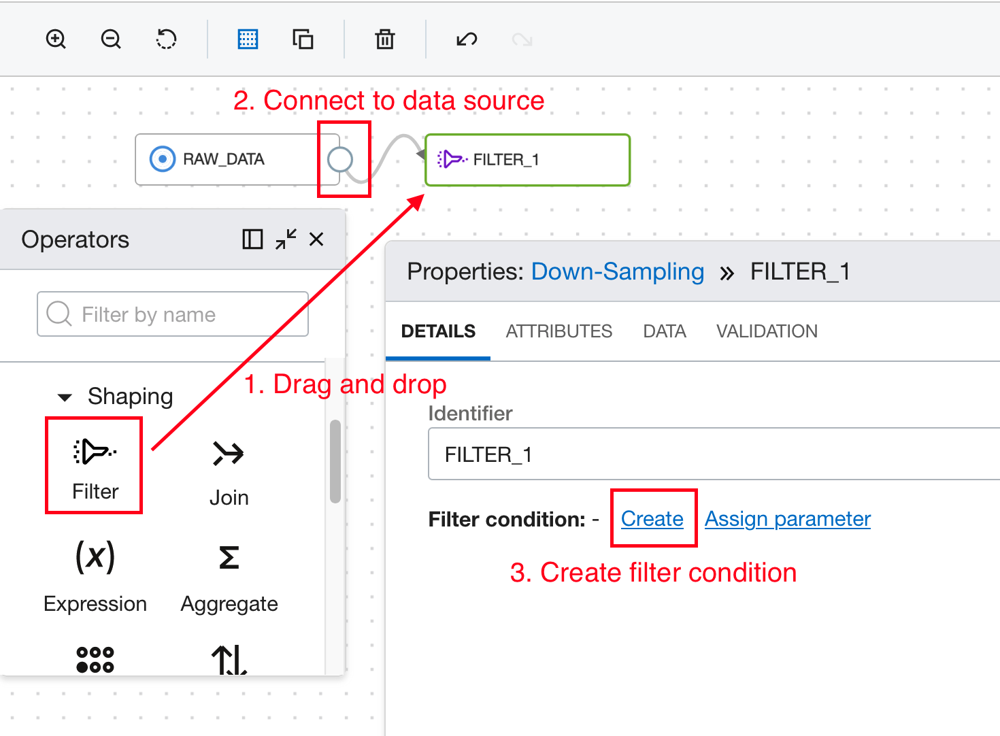
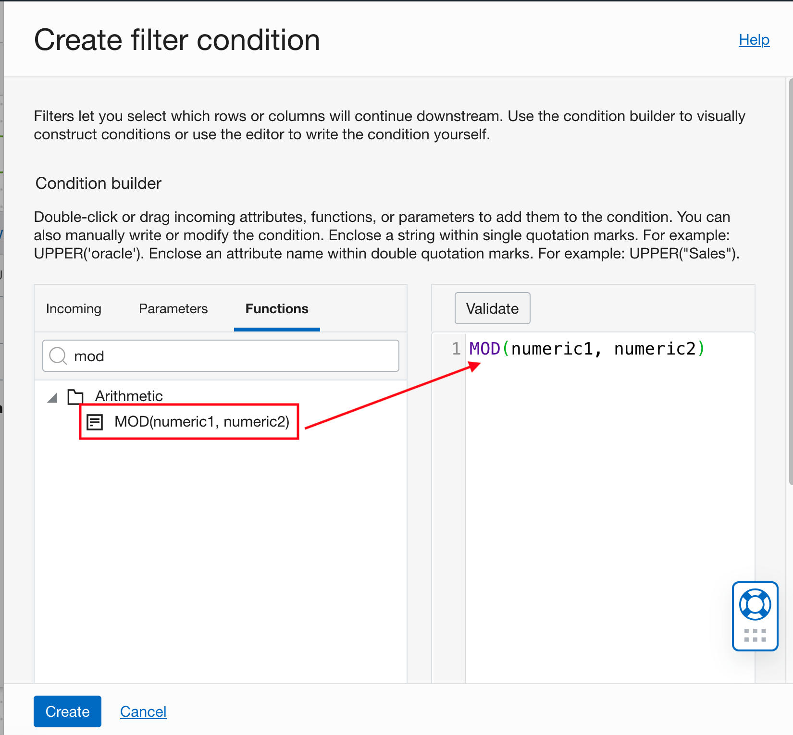
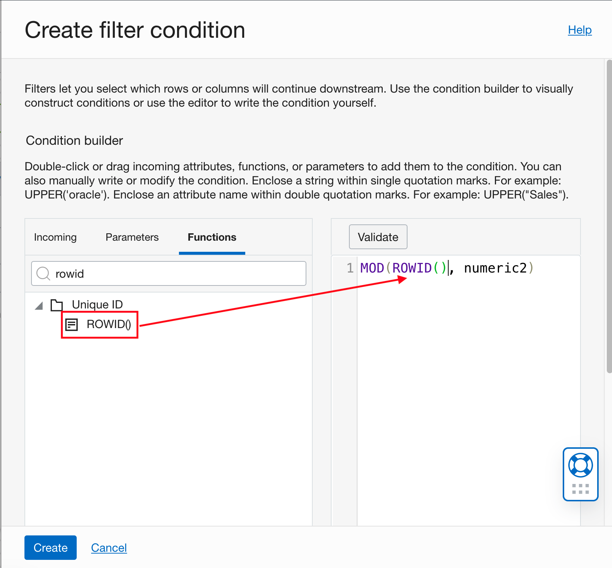
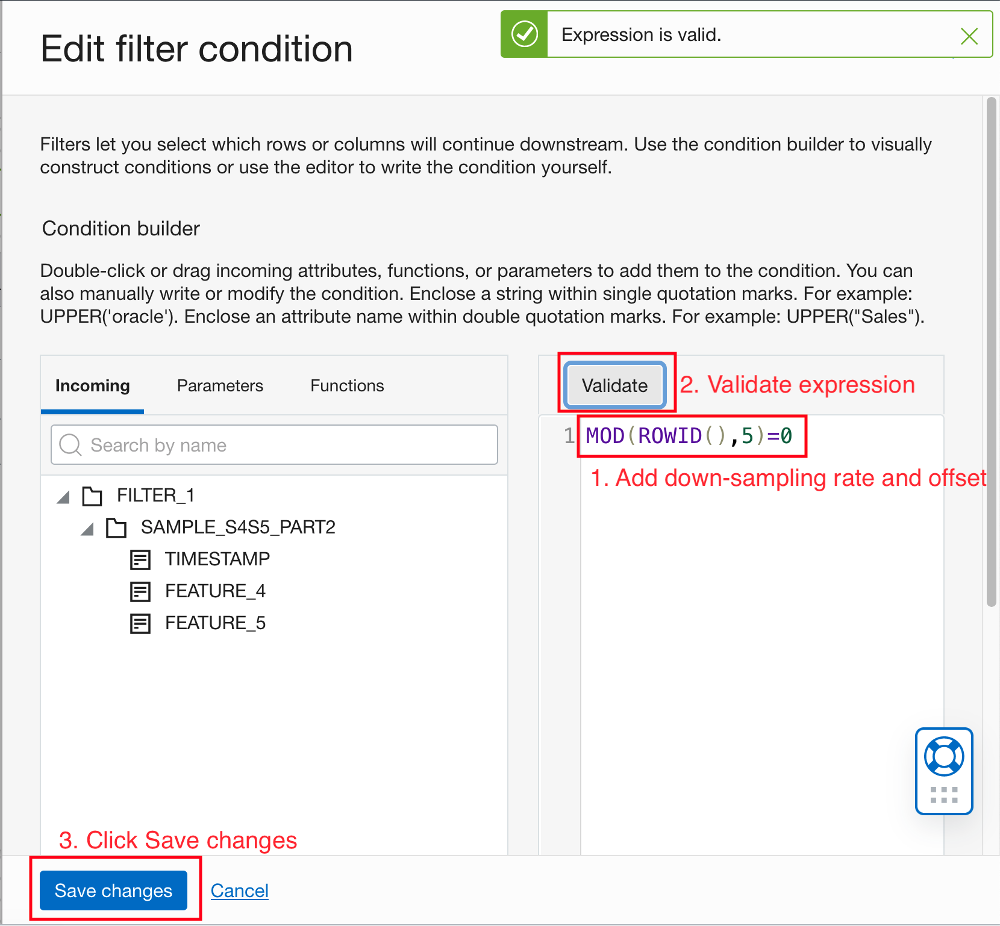
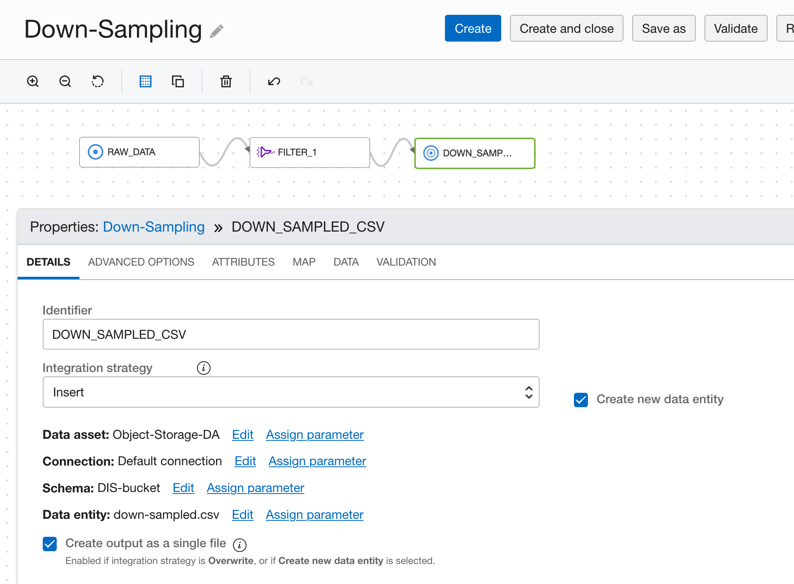

# DIS: Down-Sampling

## Use case


1. User wants to reduce data size to have faster training/inference.
2. User wants to down-sample some signals before joining them with other signals with lower sampling rate.

## DIS Data Flow

Add a source operator for the raw data. Refer to Load Data in [DIS Data Flow](./dataIO.md).

In this example data, two signals are sampled every 1 minute.


```
Drag and drop a filter operator onto the canvas. Hover over the source operator until you see the connector (small circle) on the right side of the operator.
Then drag and drop the connector to the filter operator. Click the filter operator to open the properties panel, under details tab, click "Create" to create a
filter condition.
```

```
Enter the expression by drag and drop functions, or directly type in the editor.

Click the Functions tab, and search for MOD. Drag and drop the function into the editor.
```

```
Search for ROWID in the Functions tab. Drag and drop the function into the editor and replace "numeric1".
```


Expression:

```
MOD(ROWID(),<down_sampling_rate>)
```

Enter the down-sampling rate as the second parameter for MOD().

```
Add "=0" at the end of the expression. This will take the first row every <down_sampling_rate> rows. You can change 0 to a different number to take other rows.
```

Click the Validate button. If the expression is valid, a green toast notification will show up. Click "Save changes".




In the data tab of the filter operator, we can see the output data are sampled every 5 minutes.


Add a target operator for the preprocessed data. Refer to [Store Preprocessed Data to Object Storage](./Data_integration_basic_setup.md).


Connect the output of the filter operator to the input of the target operator.



Go back to [DIS: Common Preprocessing Workflow](./Data_integration_basic_setup.md) to validate and execute the data flow.


