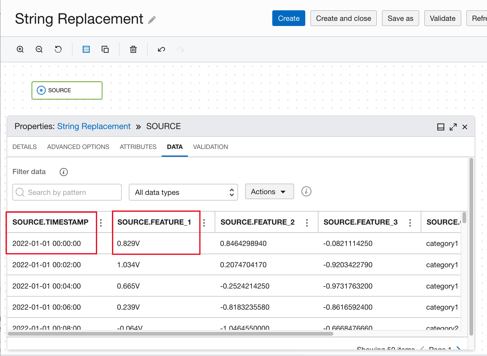
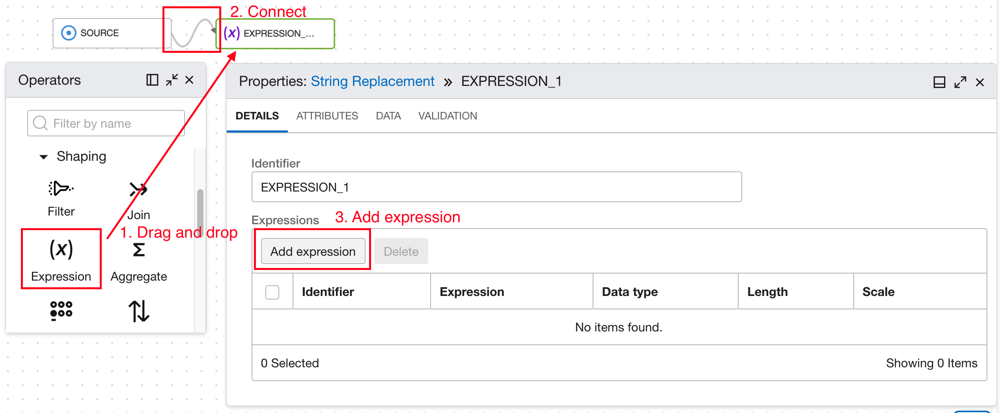
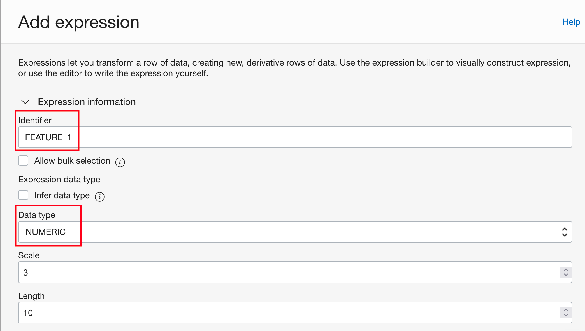
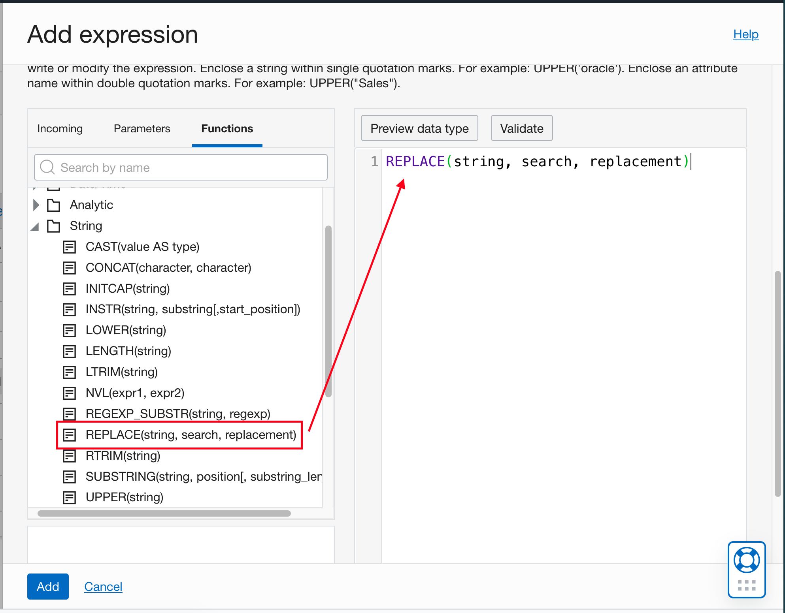
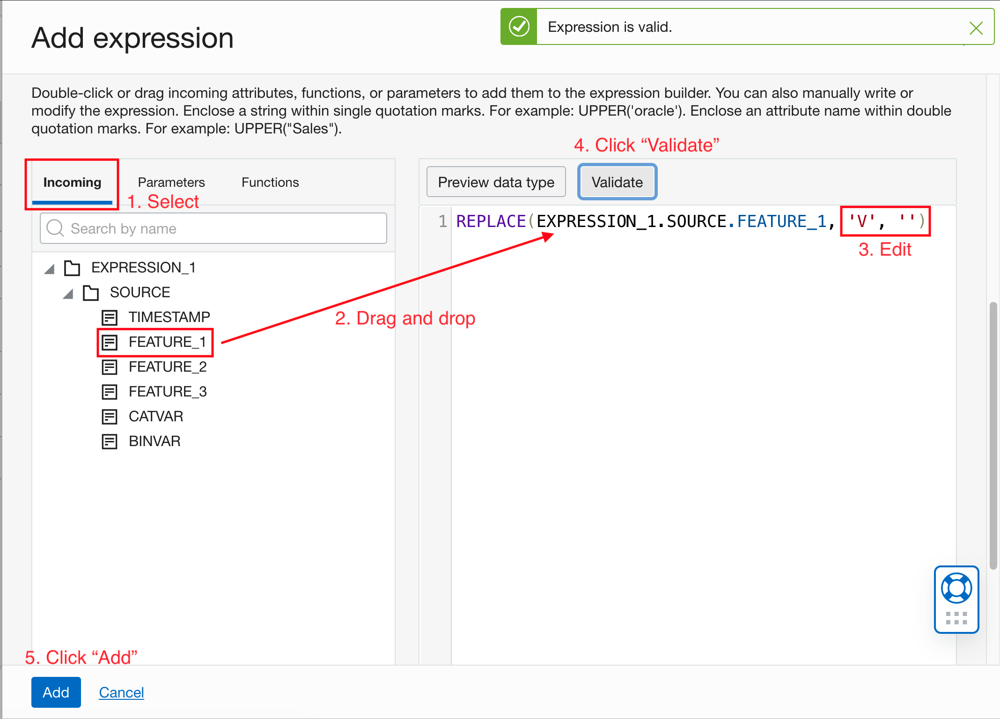
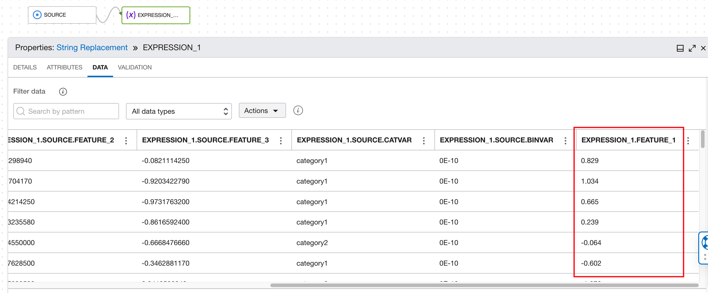
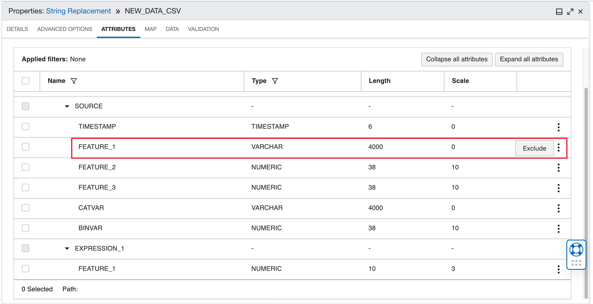

# DIS: String Replacement

## Use Case


1. User wants to remove units in data and keep only numeric values.
2. User wants to convert timestamp from RFC format with a space between date and time (e.g. "2022-01-01 16:00:00Z") to ISO format which requires a "T" between date and time (e.g. "2022-01-01T16:00:00Z").

## DIS Data Flow


Add a source operator for the raw data. Refer to Load Data in [DIS Data Flow](./dataIO.md).

```
In this example data, values of feature_1 contain a unit "V" that we want to remove.
```

```
Drag and drop an expression operator onto the canvas. Hover over the source operator until you see the connector (small circle) on the right side of the
operator. Then drag and drop the connector to the expression operator. Click the expression operator to open the properties panel, under DETAILS tab,
click "Add expression".
```


```
In the Expression information, we can change the identifier of this expression to FEATURE_1. We can also change the data type of the new column.
```

```
Scroll down to the Expression builder. Click the Functions tab and find the REPLACE function. Drag and drop function into the editor.
```



Click the Incoming tab. Drag and drop the feature_1 column into the editor to replace "string" for the REPLACE function.

```
Replace "search" with string "V" (with single quotes). Replace "replacement" with an empty string (with single quotes).
```

Click the Validate button. If the expression is valid, a green toast notification will show up. Click "Add".



The new expression is listed in the DETAILS tab of the expression operator.


```
Go to the DATA tab, and scroll to the end. We can see a new column added with the name FEATURE_1. It contains the same values in the original
feature_1 column, but without the unit "V".
```


Now we drag and drop a target operator, connect the output of the expression operator to it, and configure the target. Refer to [Store Preprocessed Data to Object Storage](./dataIO.md).

```
To exclude the original feature_1 column with the unit. Go to the ATTRIBUTES tab of the target operator. Click the 3-dot icon of the attribute and select
"Exclude". The attribute will disappear from the list.
```



Go back to [DIS: Common Preprocessing Workflow](./Data_integration_basic_setup.md) to validate and execute the data flow.


