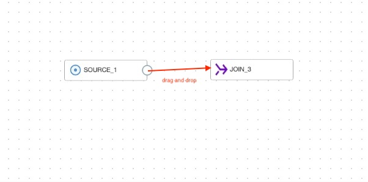
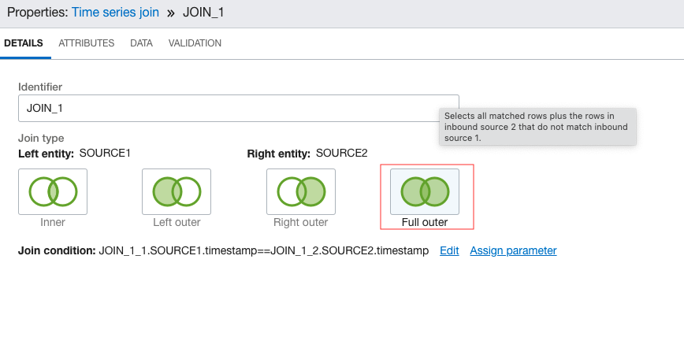
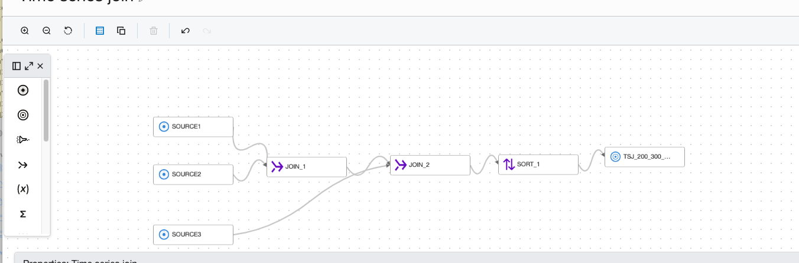

# DIS: Time Series Join

## Use case

The user wants to combine 2 sorted time series with different signals into one single series

## Preparation

Ensure all the series have a schema like (timestamp, signal1, signal2....).

Follow the instructions in [DIS: Down Sampling](./downsampling.md) to align the timestamps of the individual time series if necessary. For example, if one source contains
samples at a 1 min frequency and one contains samples at 30s frequency,  down-sample the second one to make them both 1 min.

Ensure that all the series have distinct column names. If a column is exactly duplicated across 2 sources, follow the instructions in Remove Duplicate Columns to drop one of the duplicates.
If 2 columns have the same name but different values, follow the instructions in Rename Columns to change the name in one of the series.

## DIS Data Flow

Add a source operator for each time series data source. Refer to Load Data in DIS Data Flow.

Drag and drop a Join operator from the Canvas. Enter an identifier if you want, a default value like JOIN_1 is populated for you. 


 
Connect 2 of the source operators to it. To connect a Source operator to the Join operator, hover over it
until a circle appears, then click and drag the arrow onto the Join operator



Click on the Join operator and select the join type as Full Outer, to avoid
losing data points(Other types can be used if use case calls for ignoring partial observations).
 

 
Click on edit next to the Join condition and enter the Join condition in the editor as
follows:

```
JOIN_1.SOURCE1.timestamp == JOIN_1.SOURCE2.timestamp
```

If there are more sources, choose one at a time and connect the output of a Join operator and the remaining source to another Join operator. Repeat this
until all sources are connected to a Join operator.



Right click the final Join operator and click on Insert After. Select the Sort operator. Select the timestamp attribute after clicking on the operator. Add an
Output operator and connect the Sort operator to it.


Configure the Output as per DIS IO instructions. Go back to DIS: Common Preprocessing Workflow to validate and execute the data flow.


