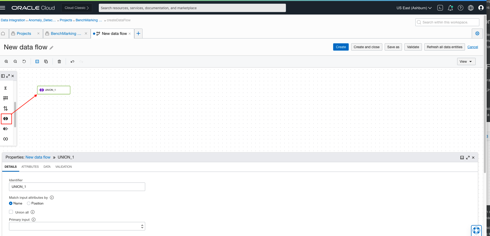
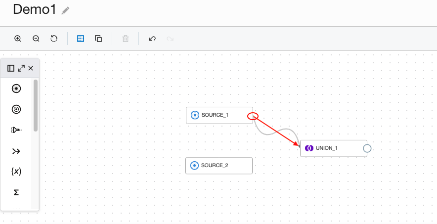
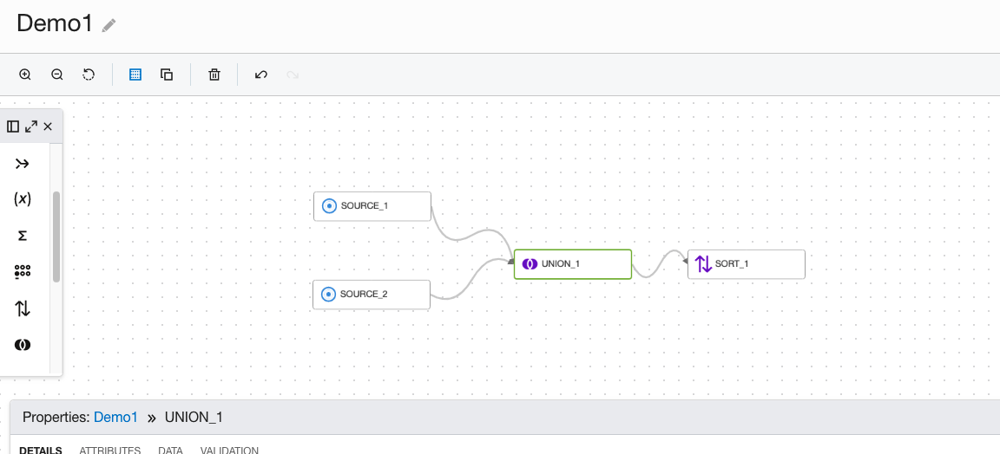
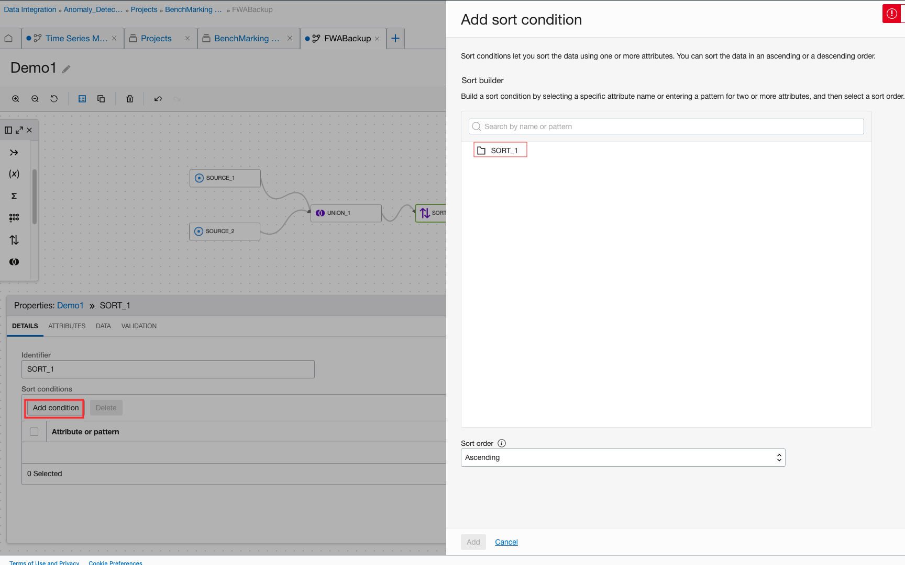
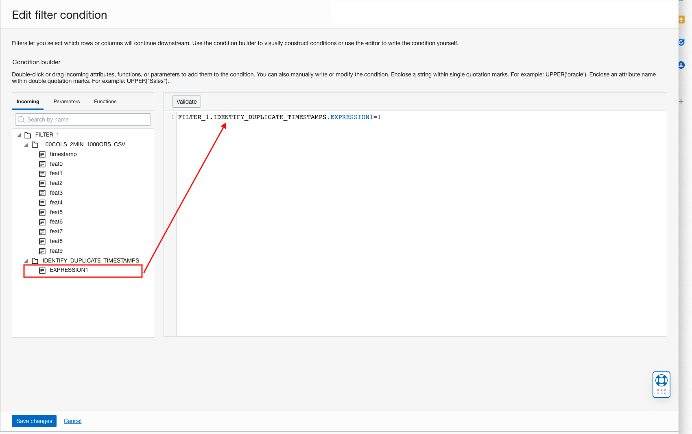
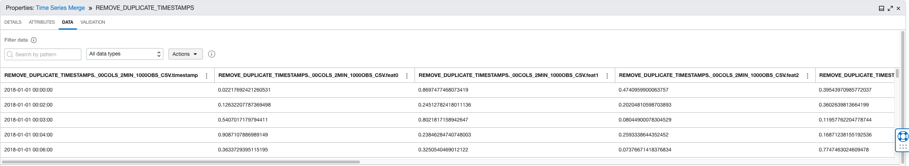
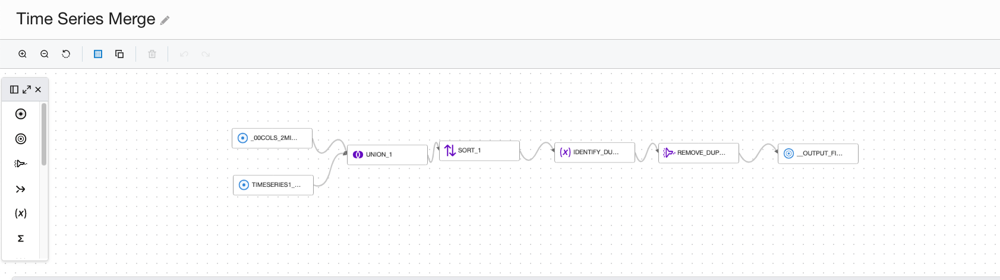

# DIS: Time Series Merge

## Use case

You have 2 or more time series with the same set of signals but different time ranges/frequencies

## Preparation

Ensure all the series follow the same schema, which is of the form (timestamp, signal1, signal2....). The timestamp field must be in ISO format for all the
series. You might find some of the other transformations useful here, like [DIS: Remove Unnecessary Columns](./Remove_unnecessary_columns.md) and [DIS: Date-time conversion](./date_time_conversion.md).

## DIS Data Flow


Add a source operator for each time series data source. Refer to Load Data in DIS Data Flow.

Drag and drop a Union operator.



Connect 2 of the source operators to it. To connect a Source operator to the Union operator, hover over it until a circle
appears, then click and drag the arrow onto the Join operator




Click on the Union operator in the canvas. Enter an identifier if you want - a default value like UNION_1 will already be populated for you.

If there are more sources, choose one at a time and connect the output of a Union operator and the remaining source to another Union operator. Repeat
this until all sources are connected to a Union operator.

Add a Sort operator after the final Union operator whose output is still unconnected




Click on the Sort operator and, in the editor, select the timestamp attribute to sort on, as well as the sort order(Ascending). This is a necessary step as
the Anomaly Detection service expects timestamps to be in Ascending order.



Next, drag and drop an Expression operator on to the canvas. Connect the output of the Sort operator to the Expression operator. Click on the
Expression operator to add the following expression in the editor:

```
ROW_NUMBER() OVER( PARTITION BY EXPRESSION_1.SOURCE_1.timestamp ORDER BY EXPRESSION_1.SOURCE_1.feat0)
```

replacing SOURCE_1 with any of the source identifiers in your data flow and feat0 with any of the signal names.

This step and the following step together will ensure that there are no duplicate timestamps present in the resulting dataset, since duplicate timestamps
will not be accepted by OCI Anomaly Detection service.

Next, drag and drop a Filter operator on to the canvas. Connect the output of the Expression operator to the Filter operator. As before, enter an identifier
if desired(in this tutorial we use the name REMOVE_DUPLICATE_TIMESTAMPS). Click on the Filter operator and add the following condition:
```
### FILTER_1.IDENTIFY_DUPLICATE_TIMESTAMPS.EXPRESSION1=1

```
Click on Validate to ensure correct syntax.



In the Attributes tab of the filter operator, preview the schema and exclude any unwanted columns.




Finally, connect the output of the Filter operator to an Output operator. Configure the Output operator as per DIS IO instructions. At this point, the data
flow should look similar to the image below:




Go back to DIS: Common Preprocessing Workflow to validate and execute the data flow.


