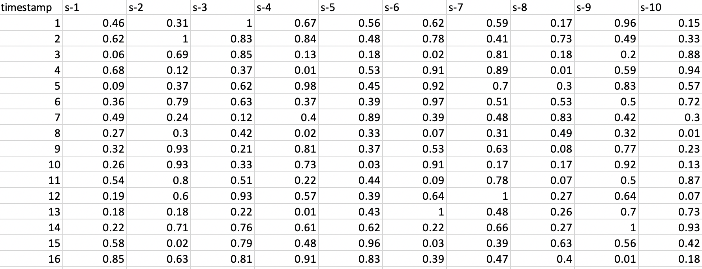
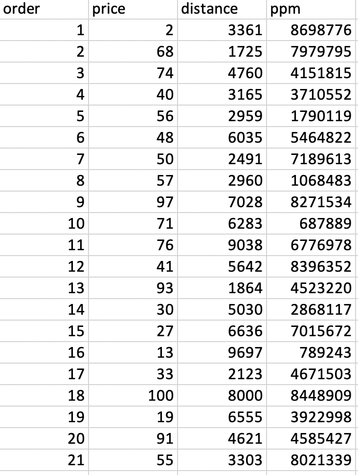

## utility-meter-readings.csv
Column Names:

timestamp: datetime \
meter-IDs: string \
value: float \
feat1, feat2, feat3: binary {0,1}\

This datasets can be grouped by multiple dimensions (e.g. timestamp, feat1 and feat2) with pivot column to be meter-ID. The result will be unique identifiers (timestamp, feat1 and feat2) as rows and meter-IDs as columns.

## utility-meter-readings-multivariate.csv
A multivariate datasets of 1000 meter IDs and their readings.

Column Names:

timestamp: datetime \
feat1, feat2: binary {0,1}\
Multiple meter-IDs: float \

## univariate_time_series.csv
A univariate time series.

Column Names:

timestamp: datetime \
feat0: float

## Sharding-example.csv

## scaling-example.csv

