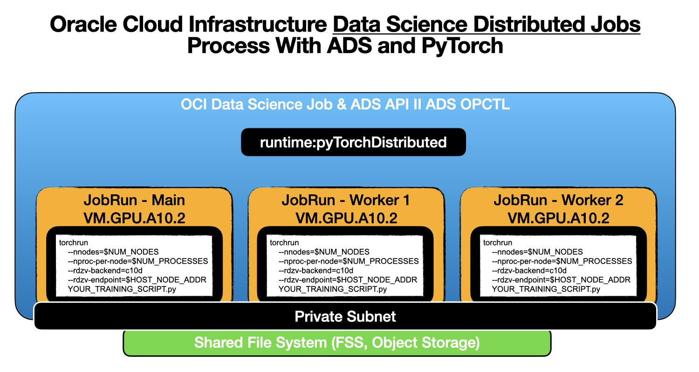
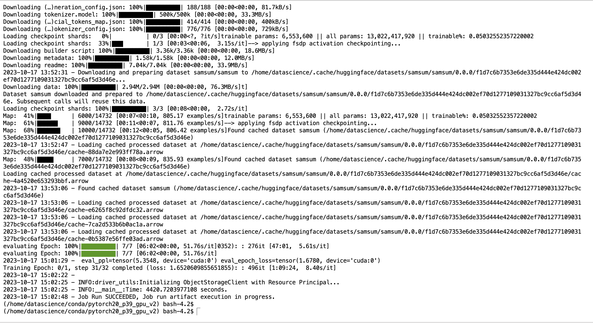
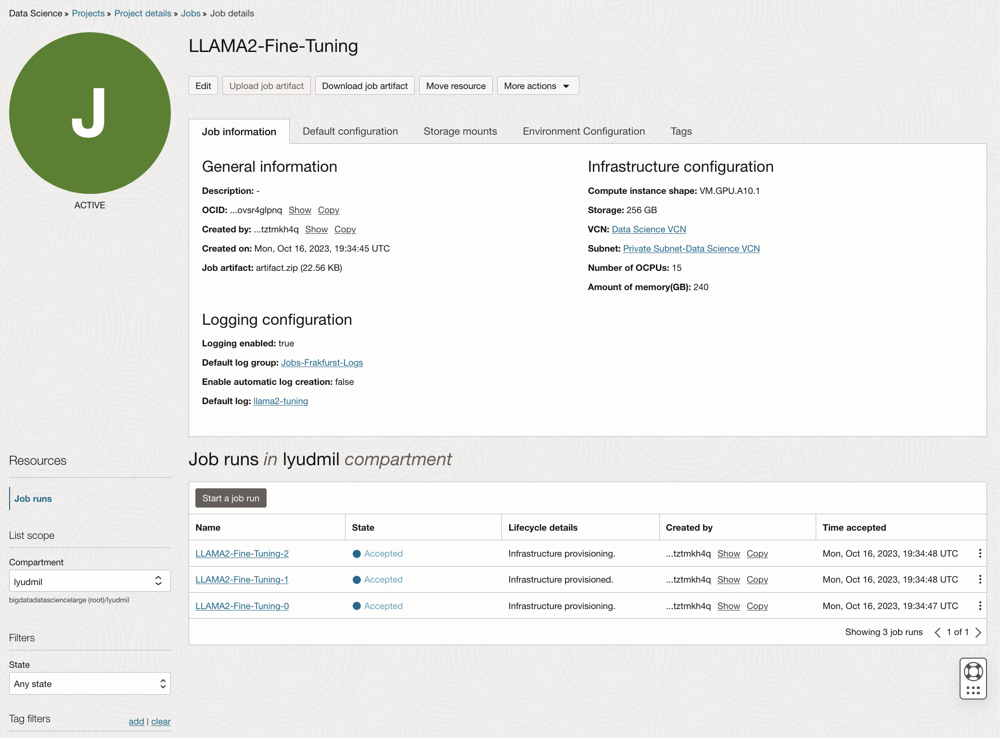
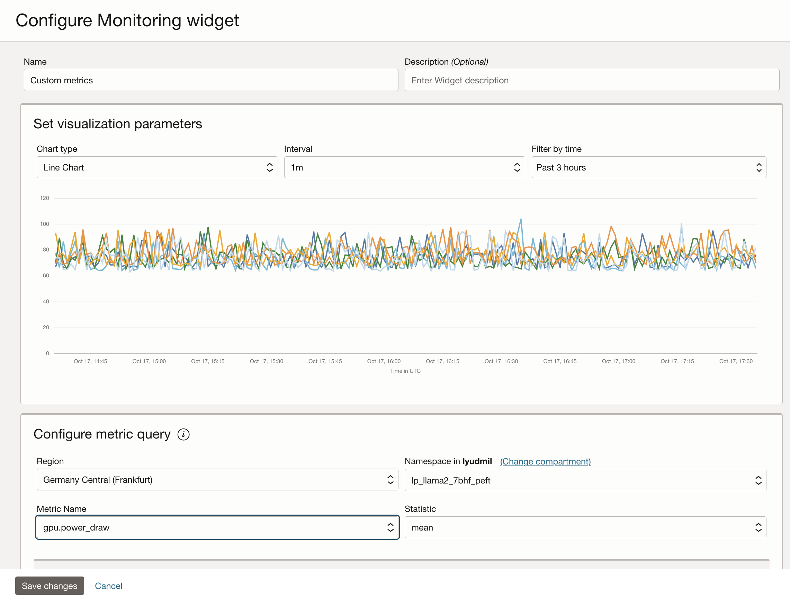
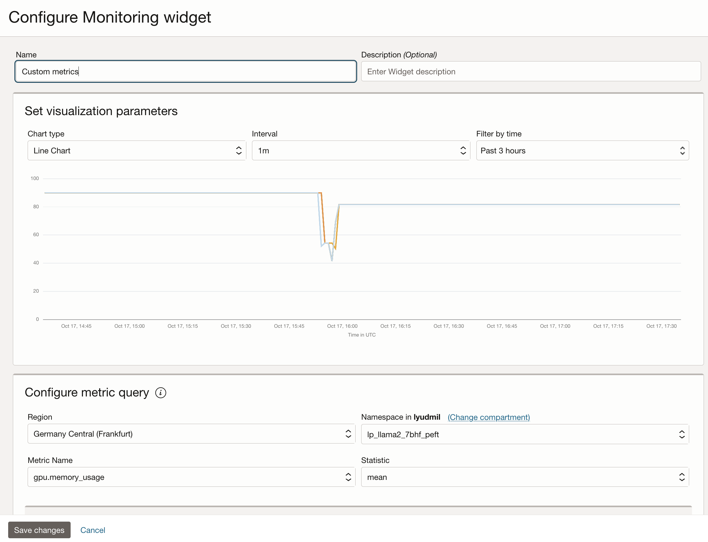

# Overview

In this tutorial you will learn how to run a multi-node multi-GPU distributed fine tuning of large language model and deploy the fine-tuned model using OCI Data Science service. We will use the Meta Llama2 [llama-recipe GitHub repo](https://github.com/facebookresearch/llama-recipes) for the distributed training code. 
You can select your preferred Llama2 model size in the setup configuration between the 7b or 13b parameters. The key objective of the fine tuning task is to summarize dialog/conversation.

## References

* [https://github.com/facebookresearch/llama-recipes](https://github.com/facebookresearch/llama-recipes)
* [https://accelerated-data-science.readthedocs.io/en/latest/user_guide/model_training/training_llm.html](https://accelerated-data-science.readthedocs.io/en/latest/user_guide/model_training/training_llm.html)
* [https://huggingface.co/datasets/samsum/viewer/samsum/test?row=11](https://huggingface.co/datasets/samsum/viewer/samsum/test?row=11)

## Prerequisite

The key prerequisites that you would need to setup before you can proceed to run the distributed fine-tuning process on Oracle Cloud Infrastructure Data Science Service.

* [Configure custom subnet](https://github.com/oracle-samples/oci-data-science-ai-samples/tree/main/distributed_training#1-networking) - with security list to allow ingress into any port from the IPs originating within the CIDR block of the subnet. This is to ensure that the hosts on the subnet can connect to each other during distributed training.
* [Create an object storage bucket](https://github.com/oracle-samples/oci-data-science-ai-samples/tree/main/distributed_training#2-object-storage) - to save the fine tuned weights
* [Set the policies](https://github.com/oracle-samples/oci-data-science-ai-samples/tree/main/distributed_training#3-oci-policies) - to allow the OCI Data Science Service resources to access object storage buckets, networking and others
* [Access token from HuggingFace](https://huggingface.co/docs/hub/security-tokens) to download Llama2 model. To fine-tune the model, you will first need to access the pre-trained model. The pre-trained model can be obtained from [Meta](https://ai.meta.com/resources/models-and-libraries/llama-downloads/) or [HuggingFace](https://huggingface.co/models?sort=trending&search=meta-llama%2Fllama-2). In this example, we will use the [HuggingFace access token](https://huggingface.co/docs/hub/security-tokens) to download the pre-trained model from HuggingFace (by setting the __HUGGING_FACE_HUB_TOKEN__ environment variable).
* Log group and log from logging service. This will be used to monitor the progress of the training
  * Go to the [OCI Logging Service](https://cloud.oracle.com/logging/log-groups) and select `Log Groups`
  * Either select one of the existing Log Groups or create a new one
  * In the log group create ***two*** `Log`, one predict log and one access log, like:
    * Click on the `Create custom log`
    * Specify a name (predict|access) and select the log group you want to use
    * Under `Create agent configuration` select `Add configuration later`
    * Then click `Create agent configuration`
* [Notebook session](https://docs.oracle.com/en-us/iaas/data-science/using/manage-notebook-sessions.htm) - used to initiate the distributed training and to access the fine-tuned model
* Install the latest version of [oracle-ads](https://accelerated-data-science.readthedocs.io/en/latest/index.html) - `pip install oracle-ads[opctl] -U`

## Fine-Tuning The Llama2 Model

We will be using Oracle Cloud VM.GPU.A10.2 instances for this example. Generally it is recommend to expect as GPU memory required for the fine-tuning at least 4x times the size of the model in full precision. Our experiments show that the actual memory consumption ends up to be more, as you have to account for the memory consumption by the optimizer states, gradients, forward activations and more. For this example we've ended up using for the 7b models 4xA10's or 2xVM.GPU.A10.2 instances, and for the 13b we utilized 12xA10's which makes for 6xVM.GPU.A10.2. Hugging Face provides a [Model Memory Calculator](https://huggingface.co/spaces/hf-accelerate/model-memory-usage) and there is a great blog post about the topic from [Eleuther explaining the basic math behind the memory usage for transformers](https://blog.eleuther.ai/transformer-math/). Notice that single A10 GPU has 24GB of memory.

There are two ways to proceed with the fine-tuning, either by using the ADS Python APIs directly or create an YAML file with the required configuration and run it with the ADS OPCTL CLI. Let's start with the YAML approach first.

### YAML

Prepare a YAML file that describes the infrastructure and the job parameters. Use the template below and add your resource IDs under infrastructure block. The shape name provided should be an instance with A10 or A100. 

You can configure the number of nodes by changing the `replicas` attribute under `runtime` spec.

#### Llama2-13b Fine-Tuning 

Following YAML is example for `meta-llama/Llama-2-13b-hf` fine-tuning. With 6xVM.GPU.A10.2 nodes the 13b Llama2 parameter model takes about 2.5 hours to complete for 3 epochs.

Save the YAML file as `llama2-13b-hf-ft-job.yaml`

```yaml
kind: job
apiVersion: v1.0
spec:
  name: LLAMA2-Fine-Tuning-v13b-hf-v1
  infrastructure:
    kind: infrastructure
    spec:
      blockStorageSize: 512
      logGroupId: ocid1.loggroup.<>
      logId: ocid1.log.<>
      subnetId: ocid1.subnet.<>
      shapeName: VM.GPU.A10.2
    type: dataScienceJob
  runtime:
    kind: runtime
    type: pyTorchDistributed
    spec:
      git:
        url: https://github.com/facebookresearch/llama-recipes.git
        commit: 1aecd00924738239f8d86f342b36bacad180d2b3
      command: >-
        torchrun examples/finetuning.py
        --enable_fsdp
        --use_peft
        --peft_method lora
        --pure_bf16
        --mixed_precision
        --batch_size_training 4
        --model_name $MODEL_NAME
        --output_dir /home/datascience/outputs
        --num_epochs 1
        --save_model
      replicas: 6
      conda:
        type: service
        slug: pytorch20_p39_gpu_v2
      dependencies:
        pipPackages: >-
          --extra-index-url https://download.pytorch.org/whl/cu118 torch==2.1.0
          'accelerate>=0.21.0'
          appdirs==1.4.4
          loralib==0.1.2
          bitsandbytes==0.39.1
          datasets==2.12.0
          fire==0.5.0
          'git+https://github.com/huggingface/peft.git@15a013af5ff5660b9377af24d3eee358213d72d4'
          'llama-recipes==0.0.1'
          'transformers>=4.31.0,<4.34'
          sentencepiece==0.1.99
          py7zr==0.20.6
          scipy==1.10.0
          optimum==1.13.1
      outputDir: /home/datascience/outputs
      outputUri: oci://<bucket-for-finetuned-model>@<namespace>/$JOB_OCID
      env:
        - name: MODEL_NAME
          value: meta-llama/Llama-2-13b-hf
        - name: HUGGING_FACE_HUB_TOKEN
          value: <your-hugging-face-token>
        - name: LD_LIBRARY_PATH
          value: /usr/local/nvidia/lib:/usr/local/nvidia/lib64:/opt/conda/lib
        - name: OCI__METRICS_NAMESPACE
          value: finetune_llama2_13b_hf_peft_lora
```

#### Llama2-7b Fine-Tuning

Following YAML is example for `meta-llama/Llama-2-7b-hf` fine-tuning.

Save the YAML file as `llama2-7b-hf-ft-job.yaml`

```yaml
kind: job
apiVersion: v1.0
spec:
  name: LLAMA2-Fine-Tuning-v7b-hf-v1
  infrastructure:
    kind: infrastructure
    spec:
      blockStorageSize: 256
      logGroupId: ocid1.loggroup.<>
      logId: ocid1.log.<>
      subnetId: ocid1.subnet.<>
      shapeName: VM.GPU.A10.2
    type: dataScienceJob
  runtime:
    kind: runtime
    type: pyTorchDistributed
    spec:
      git:
        url: https://github.com/facebookresearch/llama-recipes.git
        commit: 1aecd00924738239f8d86f342b36bacad180d2b3
      command: >-
        torchrun examples/finetuning.py
        --enable_fsdp
        --use_peft
        --peft_method lora
        --pure_bf16
        --mixed_precision
        --batch_size_training 1
        --model_name $MODEL_NAME
        --output_dir /home/datascience/outputs
        --num_epochs 1
        --save_model
      replicas: 3
      conda:
        type: service
        slug: pytorch20_p39_gpu_v2
      dependencies:
        pipPackages: >-
          --extra-index-url https://download.pytorch.org/whl/cu118 torch==2.1.0
          'accelerate>=0.21.0'
          appdirs==1.4.4
          loralib==0.1.2
          bitsandbytes==0.39.1
          datasets==2.12.0
          fire==0.5.0
          'git+https://github.com/huggingface/peft.git@15a013af5ff5660b9377af24d3eee358213d72d4'
          'llama-recipes==0.0.1'
          'transformers>=4.31.0,<4.34'
          sentencepiece==0.1.99
          py7zr==0.20.6
          scipy==1.10.0
          optimum==1.13.1
      outputDir: /home/datascience/outputs
      outputUri: oci://llama2@bigdatadatasciencelarge/outputs/lvp-7b/$JOB_OCID
      env:
        - name: MODEL_NAME
          value: meta-llama/Llama-2-7b-hf
        - name: HUGGING_FACE_HUB_TOKEN
          value: <your-hugging-face-token>
        - name: LD_LIBRARY_PATH
          value: /usr/local/nvidia/lib:/usr/local/nvidia/lib64:/opt/conda/lib
        - name: OCI__METRICS_NAMESPACE
          value: finetune_llama2_7b_hf_peft_lora
```

#### Launch the distributed fine-tuning

Replace the spec variables like `compartmentId`, `logGroupId`, `logId` etc. with the one from your Oracle Cloud Tenancy. Notice additionally the `outputUri` which should point to your object storage bucket where the fine-tuned model should be stored. Additionally you have to replace the `<your-hugging-face-token>` under the `HUGGING_FACE_HUB_TOKEN` environment variables with your token to access the Llama2 model from HuggingFace.

In these examples, we have set up the `OCI__METRICS_NAMESPACE` to monitor closely the GPU utilization with the OCI Monitoring Service. The `replicas` specifies the number of instance that should be used, in this case either `6` or `3` x `VM.GPU.A10.2` which would result in `6xA10` or `12xA10` GPUs.

Notice, we used directly the [finetuning.py](https://github.com/facebookresearch/llama-recipes/blob/main/examples/finetuning.py) example as provided from the Meta Llama2 repository without additional changes, all the Fine-Tuning examples in the repository should work without modifications required.

To launch the distributed fine-tuning, open a Terminal in your OCI Data Science Notebook, install and activate a Conda environment with the latest Oracle ADS Library and then run the ADS OPCTL CLI. For example to launch the 7b model fine-tuning:

```bash
odsc conda install -s pytorch20_p39_gpu_v2
activate /home/datascience/conda/pytorch20_p39_gpu_v2
ads opctl run -f llama2-7b-hf-ft-job.yaml
```

Once the job is submitted, you should see there are `3xJobRun's` created under Job named - `LLAMA2-Fine-Tuning-v7b-hf-v1`

Check the progress of the training by running in the Notebook Terminal:

```bash
ads opctl watch <job run ocid of job-run-ocid>
```

### ADS Python API

As we mention you could also run the distributed fine-tuning process directly via the ADS Python API. Here the examples for fine-tuning full parameters of the [7B model](https://huggingface.co/meta-llama/Llama-2-7b-hf) using [FSDP](https://engineering.fb.com/2021/07/15/open-source/fsdp/). Notice that in the following example we used `--dist_checkpoint_root_folder` and `--dist_checkpoint_folder` as those are required when only FSDP fine-tuning process is executed.

```python
from ads.jobs import Job, DataScienceJob, PyTorchDistributedRuntime

job = (
    Job(name="LLAMA2-Fine-Tuning")
    .with_infrastructure(
        DataScienceJob()
        .with_log_group_id("<log_group_ocid>")
        .with_log_id("<log_ocid>")
        .with_compartment_id("<compartment_ocid>")
        .with_project_id("<project_ocid>")
        .with_subnet_id("<subnet_ocid>")
        .with_shape_name("VM.GPU.A10.2")
        .with_block_storage_size(256)
    )
    .with_runtime(
        PyTorchDistributedRuntime()
        .with_service_conda("pytorch20_p39_gpu_v2")
        .with_git(
          url="https://github.com/facebookresearch/llama-recipes.git",
          commit: "1aecd00924738239f8d86f342b36bacad180d2b3"
        )
        .with_dependency(
          pip_pkg=" ".join([
            "--extra-index-url https://download.pytorch.org/whl/cu118 torch==2.1.0",
            "accelerate>=0.21.0",
            "appdirs==1.4.4",
            "loralib==0.1.2",
            "bitsandbytes==0.39.1",
            "datasets==2.12.0",
            "fire==0.5.0",
            "git+https://github.com/huggingface/peft.git@15a013af5ff5660b9377af24d3eee358213d72d4",
            "llama-recipes==0.0.1",
            "transformers>=4.31.0,<4.34",
            "sentencepiece==0.1.99",
            "py7zr==0.20.6",
            "scipy==1.10.0",
            "optimum==1.13.1"
          ])
        )
        .with_output("/home/datascience/outputs", "oci://bucket@namespace/outputs/")
        .with_command(" ".join([
          "torchrun examples/finetuning.py",
          "--enable_fsdp",
          "--pure_bf16",
          "--batch_size_training 1",
          "--model_name $MODEL_NAME",
          "--dist_checkpoint_root_folder /home/datascience/outputs",
          "--dist_checkpoint_folder fine-tuned"
        ]))
        .with_replica(3)
        .with_environment_variable(
          MODEL_NAME="meta-llama/Llama-2-7b-hf",
          HUGGING_FACE_HUB_TOKEN="<access_token>",
          LD_LIBRARY_PATH="/usr/local/nvidia/lib:/usr/local/nvidia/lib64:/opt/conda/lib",
          OCI__METRICS_NAMESPACE="finetune_llama2_7b_hf_fsdp"
        )
    )
)
```

To create a the job with the above code run:

```python
job.create()
```

To run the fine-tuning job:

```python
run = job.run()
```

To see the logs:

```python
run.watch()
```

## The Process

Regardless of whether you used the CLI or the Python API approach, the distributed job runs will:

* Setup the PyTorch conda environment and install additional dependencies.
* Fetch the source code from GitHub and checkout the specific commit.
* Run the training script with the specific arguments, which includes downloading the model and dataset.
* Save the outputs to OCI Object Storage once the training finishes.

Note that in the `torchrun` training command, there is no need to specify the number of nodes, the number of GPUs and the IP address of he main job. ADS will automatically configure those base on the `replica` and `shape` you specified, as shown on Figure 2 below.



## Monitoring

They are various monitoring tools and features in ADS and OCI that can be used to monitor the fine-tuning process. If you used to run the fine-tuning using the YAML approach, you can monitor the job logs with the `ads opctl watch` command:


... after awhile you will see the logs in the terminal:



You can also observe the fine-tuning process in the Oracle Cloud Console:



You could also observe the individual run metrics under the job run itself:


Additionally under the OCI Monitoring Service, if you enabled the `OCI__METRICS_NAMESPACE` you can observe the GPU power draw:



... or memory consumption



## Merging the fine-tuned weights and uploading the model to model catalog

After the fine-tuning process is complete, to test the new model, we have to merge the weights to the base model and upload to the OCI Data Science Model Catalog.

### PEFT Weights Merging

1. Create a notebook session with VM.GPU.A10.2 shape or higher. Specify the object storage location where the fine-tuned weights are saved in the mount path while creating the notebook session.
2. Upload `lora-model-merge.ipynb` notebook to the notebook session
3. Run the notebook for verifying the fine-tuned weights.
4. The notebook also has code to upload the fine tuned model to model catalog.

### FSDP Weights Merging

1. Create a notebook session with VM.GPU.A10.2 shape or higher. Specify the object storage location where the fine-tuned weights are saved in the mount path while creating the notebook session.
2. Upload `load-back-FSDP-checkpoints` notebook to the notebook session and follow the instructions.

## Deployment

We recommend to use vLLM based inference container for serving the fine-tuned model. vLLM offers various optimizations for efficient usage of GPU and offers good throughput out of the box. For the deployment, use the model that was saved to the model catalog after fine tuning job.

Refer to our [github llama2 deployment samples](https://github.com/oracle-samples/oci-data-science-ai-samples/tree/main/model-deployment/containers/llama2) to build and publish the vLLM based inference container and deploy the fine-tuned model.
