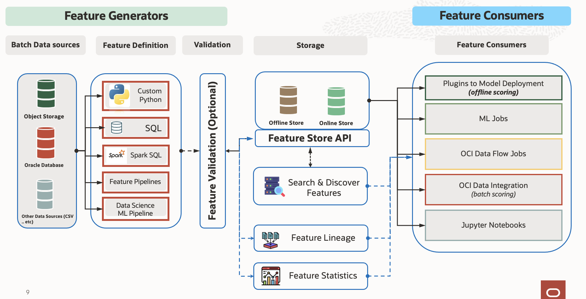

# Oracle Feature Store (ADS)

       

Managing many datasets, data sources, and transformations for machine learning is complex and costly. Poorly cleaned data, data issues, bugs in transformations, data drift, and training serving skew all lead to increased model development time and poor model performance. Feature store solves many of the problems because it is a centralized way to transform and access data for training and serving time, Feature stores help define a standardised pipeline for ingestion of data and querying of data.

ADS feature store is a stack-based solution that is deployed in your tenancy using OCI Resource Manager.

Following are brief descriptions of key concepts and the main components of ADS feature store.

- ``Feature Vector``:  Set of feature values for any one primary and identifier key. For example, all and a subset of features of customer ID 2536 can be called as one feature vector .
- ``Feature``: A feature is an individual measurable property or characteristic of an event being observed.
- ``Entity``: An entity is a group of semantically related features. The first step a consumer of features would typically do when accessing the feature store service is to list the entities and the entities associated with features. Another way to look at it is that an entity is an object or concept that's described by its features. Examples of entities are customer, product, transaction, review, image, document, and so on.
- ``Feature Group``: A feature group in a feature store is a collection of related features that are often used together in ML models. It serves as an organizational unit within the feature store for users to manage, version, and share features across different ML projects. By organizing features into groups, data scientists and ML engineers can efficiently discover, reuse, and collaborate on features reducing the redundant work and ensuring consistency in feature engineering.
- ``Feature Group Job``: Feature group jobs are the processing instance of a feature group. Each feature group job includes validation results and statistics results.
- ``Dataset``: 	A dataset is a collection of features that are used together to either train a model or perform model inference.
- ``Dataset Job``: A dataset job is the processing instance of a dataset. Each dataset job includes validation results and statistics results.

## Documentation

  - [Oracle Feature Store SDK (ADS) Documentation](https://feature-store-accelerated-data-science.readthedocs.io/en/latest/)
  - [OCI Data Science and AI services Examples](https://github.com/oracle/oci-data-science-ai-samples)
  - [Oracle AI & Data Science Blog](https://blogs.oracle.com/ai-and-datascience/)
  - [OCI Documentation](https://docs.oracle.com/en-us/iaas/data-science/using/data-science.htm)

## Examples

### Quick start examples

| Jupyter Notebook                                                                                     | Description                                                                                                                                                                                                                                                                                                 |
|------------------------------------------------------------------------------------------------------|-------------------------------------------------------------------------------------------------------------------------------------------------------------------------------------------------------------------------------------------------------------------------------------------------------------|
| [Feature store querying](../notebook_examples/feature_store_querying.ipynb)                          | - Ingestion, querying and exploration of data.                                                                                                                                                                                                                                                              |
| [Feature store quickstart](../notebook_examples/feature_store_quickstart.ipynb)                      | - Ingestion, querying and exploration of data.                                                                                                                                                                                                                                                              |
| [Schema enforcement and schema evolution](../notebook_examples/feature_store_schema_evolution.ipynb) | - `Schema evolution` allows you to easily change a table's current schema to accommodate data that is changing over time. `Schema enforcement`, also known as schema validation, is a safeguard in Delta Lake that ensures data quality by rejecting writes to a table that don't match the table's schema. |
| [Storage of medical records in feature store](../notebook_examples/feature_store_ehr_data.ipynb)     | Example to demonstrate storage of medical records in feature store                                                                                                                                                                                                                                          |

### Big data operations using OCI DataFlow

| Jupyter Notebook                                                                               | Description                                                                                |
|------------------------------------------------------------------------------------------------|--------------------------------------------------------------------------------------------|
| [Big data operations with feature store](../notebook_examples/feature_store_spark_magic.ipynb) | - Ingestion of data using Spark Magic, querying and exploration of data using Spark Magic. |

### LLM Use cases

| Jupyter Notebook                                                                                                                                                   | Description                                                                                                                                                                                                                                                                                                              |
|--------------------------------------------------------------------------------------------------------------------------------------------------------------------|--------------------------------------------------------------------------------------------------------------------------------------------------------------------------------------------------------------------------------------------------------------------------------------------------------------------------|
| [Embeddings in Feature Store](../notebook_examples/feature_store_embeddings.ipynb)                                                                                 | - `Embedding feature stores` are optimized for fast and efficient retrieval of embeddings. This is important because embeddings can be high-dimensional and computationally expensive to calculate. By storing them in a dedicated store, you can avoid the need to recalculate embeddings for the same data repeatedly. |
| [Synthetic data generation in feature store using OpenAI and FewShotPromptTemplate](../notebook_examples/feature_store_medical_synthetic_data_openai.ipynb)        | - `Synthetic data` is artificially generated data, rather than data collected from real-world events. It's used to simulate real data without compromising privacy or encountering real-world limitations.                                                                                                               |
| [PII Data redaction, Summarise Content and Translate content using doctran and open AI](../notebook_examples/feature_store_pii_redaction_and_transformation.ipynb) | - One way to think of Doctran is a LLM-powered black box where messy strings go in and nice, clean, labelled strings come out. Another way to think about it is a modular, declarative wrapper over OpenAI's functional calling feature that significantly improves the developer experience.                            |
| [OpenAI embeddings in feature store](../notebook_examples/feature_store_embeddings_openai.ipynb)                                                                   | - `Embedding feature stores` are optimized for fast and efficient retrieval of embeddings. This is important because embeddings can be high-dimensional and computationally expensive to calculate. By storing them in a dedicated store, you can avoid the need to recalculate embeddings for the same data repeatedly. |

### Streaming operations using OCI DataFlow

| Notebook Title                                                                                            | Description                                                                                                                                                                       | Updated    |
|-----------------------------------------------------------------------------------------------------------|-----------------------------------------------------------------------------------------------------------------------------------------------------------------------------------|------------|
| [Streaming Operations Using Feature Store](../notebook_examples/feature_store_streaming_data_frame.ipynb) | Explore streaming operations within a feature store using Spark. Demonstrates leveraging Spark Streaming for efficient data handling and analysis in a feature store environment. | 11/13/2023 |

## Contributing

This project welcomes contributions from the community. Before submitting a pull request, please [review our contribution guide](./../../CONTRIBUTING.md)

Find Getting Started instructions for developers in [README-development.md](https://github.com/oracle/accelerated-data-science/blob/main/README-development.md)

## Security

Consult the security guide [SECURITY.md](https://github.com/oracle/accelerated-data-science/blob/main/SECURITY.md) for our responsible security vulnerability disclosure process.

## License

Copyright (c) 2020, 2022 Oracle and/or its affiliates. Licensed under the [Universal Permissive License v1.0](https://oss.oracle.com/licenses/upl/)