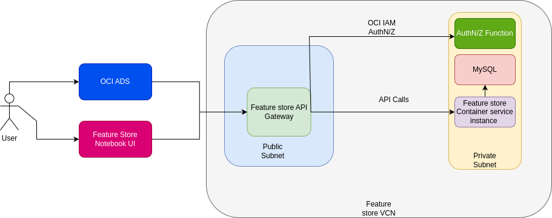

This module handles opinionated [Feature Store][feature_store_docs] setup using container service on Oracle Cloud Infrastructure ([OCI][oci]). This stack is designed to be used with the [OCI Resource Manager][oci_rm] to provision Feature store in a single step. The stack can also be used with the [OCI Terraform Provider][oci_tf_provider] to deploy using local or CloudShell Terraform cli.



## Deploy Using Oracle Resource Manager

> ___NOTE:___ If you aren't already signed in, when prompted, enter the tenancy and user credentials. Review and accept the terms and conditions.

1. Export [Feature Store Marketplace Listing][listing]

1. Click to download the [terraform bundle][stack]

1. Create a stack in [OCI resource manager][oci_rm] with the downloaded bundle

1. Follow the on-screen prompts and instructions to create the stack.

1. After creating the stack, click Terraform Actions, and select Plan.

1. Wait for the job to be completed, and review the plan.

1. To make any changes, return to the Stack Details page, click Edit Stack, and make the required changes. Then, run the Plan action again.

1. If no further changes are necessary, return to the Stack Details page, click Terraform Actions, and select Apply.


### Prerequisites
#### Required permissions:
```
allow group <user_group> to manage read repos in compartment <compartment_name>
allow group <user_group> to manage orm-stacks in compartment <compartment_name>
allow group <user_group> to manage orm-jobs in compartment <compartment_name>
allow group <user_group> to manage groups in compartment <compartment_name>
allow group <user_group> to manage dynamic-groups in compartment <compartment_name>
allow group <user_group> to manage functions-family in compartment <compartment_name>
allow group <user_group> to manage virtual-network-family in compartment <compartment_name>
allow group <user_group> to manage policies in tenancy
allow group <user_group> to manage compute-container-family in compartment <compartment_name>
allow group <user_group> to manage database-family in compartment <compartment_name>

```


### Running Terraform

After specifying the required variables you can run the stack using the following commands:

```bash
terraform init
```

```bash
terraform plan -var-file=<path-to-variable-file>
```

```bash
terraform apply -var-file=<path-to-variable-file>
```

```bash
terraform destroy -refresh=false
```


## License

Copyright (c) 2021, 2024 Oracle and/or its affiliates.
Released under the Universal Permissive License (UPL), Version 1.0.
See [LICENSE](./LICENSE) for more details.

[oci]: https://cloud.oracle.com/en_US/cloud-infrastructure
[oci_rm]: https://docs.cloud.oracle.com/iaas/Content/ResourceManager/Concepts/resourcemanager.htm
[stack]: https://raw.githubusercontent.com/oracle-samples/oci-data-science-ai-samples/main/feature_store/container_terraform/releases/container-terraform-1.1.1.zip
[feature_store_docs]: https://feature-store-accelerated-data-science.readthedocs.io
[oci_tf_provider]: https://www.terraform.io/docs/providers/oci/index.html
[listing]: https://cloud.oracle.com/marketplace/application/ocid1.mktpublisting.oc1.iad.amaaaaaabiudgxya26lzh2dsyvg7cfzgllvdl6xo5phz4mnsoktxeutecrvq
