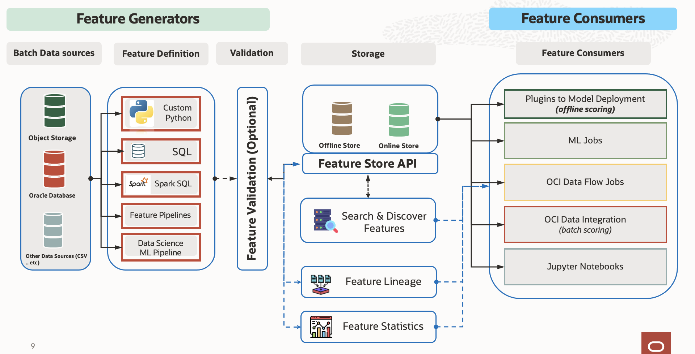

# Feature Store Tutorials

This repository contains tutorials and notebooks demonstrating the utilization of a feature store along with various operations within the Spark environment.

## Contents

### Ci/Cd for feature store using ml jobs and dataflow
- [Feature Store with ML Jobs](#feature-store-with-ml-jobs)
- [Feature Store with Data Flow](#feature-store-with-data-flow)

### Basic examples using feature store
- [Quickstart for feature store](#feature_store_quickstart.ipynb)
- [Schema evolution and schema enforcement using feature store](#feature_store_schema_evolution.ipynb)
- [Big data operations using feature store](#feature_store_spark_magic.ipynb)
- [Querying operations using feature store](#feature_store_querying.ipynb)

### Text embeddings using feature store
- [Storage of open ai embeddings using feature store](#feature_store_embeddings_openai.ipynb)
- [Synthetic data generation using feature store](#feature_store_medical_synthetic_data_openai.ipynb)
- [PII redaction using feature store](#feature_store_pii_redaction_and_transformation.ipynb)

### Streaming operations using feature store
- [Streaming operations using feature store](#feature_store_streaming_data_frame.ipynb)

---

## Feature Store with ML Jobs

Last Updated: 12/26/2023

### [feature_store_creation_ingestion_with_jobs](feature_store_creation_ingestion_with_jobs/)

Explore feature store operations using ML Job. This notebook demonstrates leveraging the power of Spark for efficient data handling and analysis in a feature store environment, focusing on ML job integration.

Tags: `feature store`, `ML jobs`, `Spark`

License: Universal Permissive License v1.0

---

## Feature Store with Data Flow

Last Updated: 12/26/2023

### [feature_store_creation_ingestion_with_dataflow](feature_store_creation_ingestion_with_dataflow/)

Explore feature store operations using Data Flow. This notebook showcases leveraging the power of Spark for efficient data handling and analysis in a feature store environment, emphasizing data flow operations.

Tags: `feature store`, `data flow`, `Spark`

License: Universal Permissive License v1.0

---

###  - Medical Data Management Using Feature Store

Updated: 11/13/2023
#### [`feature_store_ehr_data.ipynb`](../../notebook_examples/feature_store_ehr_data.ipynb)

Manage and utilize medical data efficiently using a feature store. This notebook demonstrates the storage, retrieval, and manipulation of Electronic Health Record (EHR) data within a feature store framework.

`feature store` `medical data` `data management` 

License: Universal Permissive License v 1.0

---

###  - Storage of Hugging Face Embeddings Using Feature Store

Updated: 11/13/2023
#### [`feature_store_embeddings.ipynb`](../../notebook_examples/feature_store_embeddings.ipynb)

Explore the storage and retrieval of Hugging Face embeddings within a feature store setup. This notebook provides insights into storing and utilizing pre-trained embeddings for various natural language processing tasks using the feature store infrastructure.

`feature store` `Hugging Face embeddings` `storage`

License: Universal Permissive License v 1.0

---

###  - Storage of OpenAI Embeddings Using Feature Store

Updated: 11/13/2023
#### [`feature_store_embeddings_openai.ipynb`](../../notebook_examples/feature_store_embeddings_openai.ipynb)

Learn how to store and leverage OpenAI embeddings effectively within a feature store environment. This notebook guides users through the process of managing and utilizing OpenAI-generated embeddings for diverse machine learning applications within a feature store framework.

`feature store` `OpenAI embeddings` `storage`

License: Universal Permissive License v 1.0

---

###  - Synthetic Data Generation Using Feature Store

Updated: 11/13/2023
#### [`feature_store_medical_synthetic_data_openai.ipynb`](../../notebook_examples/feature_store_medical_synthetic_data_openai.ipynb)

Generate synthetic medical data leveraging OpenAI tools within a feature store. This notebook illustrates the process of creating synthetic medical data for various research and analysis purposes using the capabilities of a feature store.

`feature store` `synthetic data generation` `medical data` 

License: Universal Permissive License v 1.0

---

###  - PII Redaction Using Feature Store

Updated: 11/13/2023
#### [`feature_store_pii_redaction_and_transformation.ipynb`](../../notebook_examples/feature_store_pii_redaction_and_transformation.ipynb)

Explore techniques and methods for Personally Identifiable Information (PII) redaction and transformation within a feature store environment. This notebook demonstrates how to manage sensitive data securely by implementing PII masking and transformation techniques using a feature store.

`feature store` `PII redaction` `data security`

License: Universal Permissive License v 1.0

---

###  - Querying Operations Using Feature Store

Updated: 11/13/2023
#### [`feature_store_querying.ipynb`](../../notebook_examples/feature_store_querying.ipynb)

Understand and perform querying operations within a feature store setup. This notebook covers querying techniques, data retrieval, and manipulation strategies to efficiently access and utilize stored features in a feature store environment.

`feature store` `querying` `data operations`

License: Universal Permissive License v 1.0

---

###  - Quickstart for Feature Store

Updated: 11/13/2023
#### [`feature_store_quickstart.ipynb`](../../notebook_examples/feature_store_quickstart.ipynb)

Get started quickly with a feature store setup using this introductory notebook. It provides step-by-step guidance and essential information for setting up and utilizing a feature store environment for efficient data management and analysis.

`feature store` `quickstart` `data management`

License: Universal Permissive License v 1.0

---

###  - Schema Evolution and Schema Enforcement Using Feature Store

Updated: 11/13/2023
#### [`feature_store_schema_evolution.ipynb`](../../notebook_examples/feature_store_schema_evolution.ipynb)

Learn about schema evolution and enforcement techniques within a feature store. This notebook explores methods to handle schema changes, enforce data integrity, and manage evolving data structures effectively in a feature store environment.

`feature store` `schema evolution` `data integrity`

License: Universal Permissive License v 1.0

---

###  - Big Data Operations Using Feature Store

Updated: 11/13/2023
#### [`feature_store_spark_magic.ipynb`](../../notebook_examples/feature_store_spark_magic.ipynb)

Explore big data operations within a feature store using Spark magic commands. This notebook demonstrates how to leverage the power of Spark for efficient data handling and analysis in a feature store environment.

`feature store` `big data operations` `Spark`

License: Universal Permissive License v 1.0

---

###  - Streaming Operations Using Feature Store

Updated: 11/13/2023
#### [`feature_store_streaming_data_frame.ipynb`](../../notebook_examples/feature_store_streaming_data_frame.ipynb)

Explore streaming operations within a feature store using Spark. This notebook demonstrates how to leverage the power of Spark Streaming for efficient data handling and analysis in a feature store environment.

`feature store` `big data operations` `Spark` `Spark Streaming`

License: Universal Permissive License v 1.0

---

