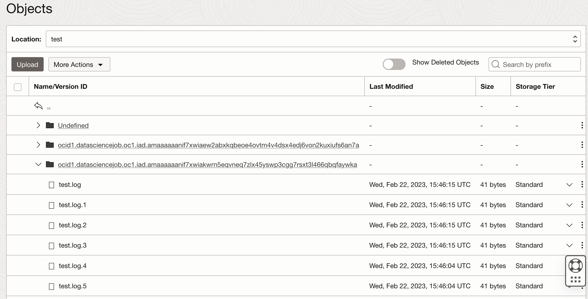

# Sync With Object Storage

In some use cases it could beneficial to sync a job local folder with the object storage. This example shows how this could be achieved using the OCI CLI. This code shows how this could be achieved with the [Object Storage Sync CLI](https://docs.oracle.com/en-us/iaas/tools/oci-cli/3.0.2/oci_cli_docs/cmdref/os/object/sync.html) ... or the [rclone for OCI](https://rclone.org/oracleobjectstorage/)

## Prerequisites

- Configure your [API Auth Token](https://docs.oracle.com/en-us/iaas/Content/Registry/Tasks/registrygettingauthtoken.htm) to be able to run and test your code locally
- Install [Docker](<https://docs.docker.com/get-docker>) **or** [Rancher Desktop](<https://rancherdesktop.io/>) as docker alternative
- Create an `Object Storage` bucket in our Oracle Cloud Tenancy and take a note of the name

## Introduction

In this example a local folder call `logs/` will be created and a python code will start generating random logs inside. If you created OCI Object Storage bucket and the job has access to it, and you configure it via the environment variables shown below, all the logs created in the job in the `logs/` folder will be incrementally copied into the bucket. Notice that only new or changed files will be copied.

## Build and Run

The sample can be tested locally on your machine before you run it as a job.

### Run local test

Examine the sample code, it includes following files:

```ini
.
├── logs
│   ├── test.log
│   ├── test1.log
│   ├── ....
│   ├── test5.log
├── export.sh
├── produce-logs.py
├── rclone-sync.sh
├── README.md
├── sync.sh
├── ...
```

The 'logs/' folder will be created upon running the script.

To use this example, you have to export the environment variables in your local environment or set the as environment variables on your job. The sample uses following environment variables:

```bash
export SYNC_DIR=logs/
export BUCKET=logs
export OB_PREFIX=test
export JOB_OCID=
```

- `SYNC_DIR` = the local folder which content should be synced with the object storage
- `BUCKET` = object storage bucket
- `OB_PREFIX` = object storage prefix/path
- `JOB_OCID` = set to empty for local run, in the job it will be automatically populated!

> To run the example locally, make sure that you've setup your OCI SDK API Auth Key, as shown in the jobs [README](../../README.md)

You can run the script locally with:

```bash
bash run.sh
```

... which will execute the sync script and immediatly afterwards the python code that produces the logs to be uploaded to the object storage, specified by the environment variables.

If the execution was successful, you should see response similar to this:

```bash
bash run.sh                                              

Settings...
.
logs/
logs
test

set the local sync director
./logs/
start sync process...
Sync Settings...
./logs/
logs
test

Auth Method: api_key
Creating sync directory: ./logs/
Sync directory created
sync not running. sleeping*!
Start creating rotating logs
Directory and data present, syncing...
Uploaded test/Undefined/test.log  [####################################]  100%
Uploaded test/Undefined/test.log.1  [####################################]  100%
Uploaded test/Undefined/test.log.4  [####################################]  100%
Uploaded test/Undefined/test.log.3  [####################################]  100%
Uploaded test/Undefined/test.log.2  [####################################]  100%
Uploaded test/Undefined/test.log.5  [####################################]  100%

{
  "skipped-objects": [],
  "upload-failures": {},
  "uploaded-objects": {
    "test/Undefined/test.log": {
      "etag": "74905932-9c3d-4593-b6c8-0d6a1f120627",
      "last-modified": "Wed, 22 Feb 2023 14:53:38 GMT",
      "opc-content-md5": "UZSOM7oaOlXG3Zjex5Cx4Q=="
    },
    "test/Undefined/test.log.1": {
      "etag": "a5942c0f-c844-43f7-a1d3-5f6e16e8f109",
      "last-modified": "Wed, 22 Feb 2023 14:53:38 GMT",
      "opc-content-md5": "UZSOM7oaOlXG3Zjex5Cx4Q=="
    },
    "test/Undefined/test.log.2": {
      "etag": "4432a37f-9997-4cee-a532-19038a368a1a",
      "last-modified": "Wed, 22 Feb 2023 14:53:38 GMT",
      "opc-content-md5": "UZSOM7oaOlXG3Zjex5Cx4Q=="
    },
    "test/Undefined/test.log.3": {
      "etag": "5326c848-e25c-46f5-9a7c-c102d93bba62",
      "last-modified": "Wed, 22 Feb 2023 14:53:38 GMT",
      "opc-content-md5": "UZSOM7oaOlXG3Zjex5Cx4Q=="
    },
    "test/Undefined/test.log.4": {
      "etag": "4517571d-464e-4c1d-a48e-c3b6e62e14af",
      "last-modified": "Wed, 22 Feb 2023 14:53:38 GMT",
      "opc-content-md5": "UZSOM7oaOlXG3Zjex5Cx4Q=="
    },
    "test/Undefined/test.log.5": {
      "etag": "01b46724-d968-4863-8560-1eeead43ffff",
      "last-modified": "Wed, 22 Feb 2023 14:53:38 GMT",
      "opc-content-md5": "UZSOM7oaOlXG3Zjex5Cx4Q=="
    }
  }
}
Directory and data present, syncing...
Uploaded test/Undefined/test.log.1  [####################################]  100%
Uploaded test/Undefined/test.log  [####################################]  100%  
Uploaded test/Undefined/test.log.2  [####################################]  100%

{
  "skipped-objects": [
    "test/Undefined/test.log.3",
    "test/Undefined/test.log.4",
    "test/Undefined/test.log.5"
  ],
  "upload-failures": {},
  "uploaded-objects": {
    "test/Undefined/test.log": {
      "etag": "5edb6c65-8e26-43bd-a6ae-ccc73c599841",
      "last-modified": "Wed, 22 Feb 2023 14:53:51 GMT",
      "opc-content-md5": "UZSOM7oaOlXG3Zjex5Cx4Q=="
    },
    "test/Undefined/test.log.1": {
      "etag": "e7c5c160-81ae-4b54-af5e-e5094349dba1",
      "last-modified": "Wed, 22 Feb 2023 14:53:51 GMT",
      "opc-content-md5": "UZSOM7oaOlXG3Zjex5Cx4Q=="
    },
    "test/Undefined/test.log.2": {
      "etag": "186e01fd-9ca4-4fcc-ad0c-6d0f39a863d2",
      "last-modified": "Wed, 22 Feb 2023 14:53:51 GMT",
      "opc-content-md5": "UZSOM7oaOlXG3Zjex5Cx4Q=="
    }
  }
}
Directory and data present, syncing...

{
  "skipped-objects": [
    "test/Undefined/test.log.1",
    "test/Undefined/test.log",
    "test/Undefined/test.log.3",
    "test/Undefined/test.log.4",
    "test/Undefined/test.log.5",
    "test/Undefined/test.log.2"
  ],
  "upload-failures": {},
  "uploaded-objects": {}
}
```

If you add new content to the `/log` folder manually you will notice how the files would be detected and uploaded to the object storage.

### Run as a job

Package the code into a zip file to run as a Job.

```bash
cd job-background-sync-with-objectstorage/
zip -r job-background-sync-with-objectstorage.zip *.* -x ".*" -x "__MACOSX"
```

Create a new Job in the Oracle Cloud Console, upload the zip artifact and set the following parameters:

```ini
JOB_RUN_ENTRYPOINT=run.sh
SYNC_DIR=logs/
BUCKET=logs
OB_PREFIX=test
```

Go to your job `BUCKET` and look into the `OB_PREFIX` folder you should see a sub-folder create with the Job Run OCID as I name and the logs will be stored inside. 


