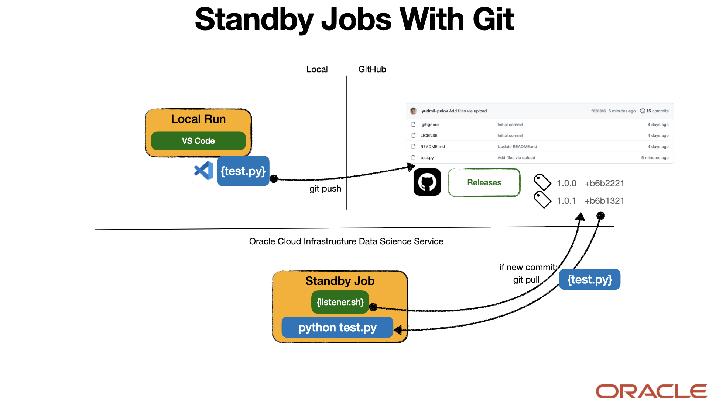

# Standby Job with GitHub - Recurring Code Running

Often during the development process it is more practicle to instead of start a new job on every code change, to regulary pull the code on a change.

This example shows how you could start a job that we call `Standby Job` which runs a script in a loop that monitors a pre-defined GitHub repository for code changes (check-in). If code change is avaiable it will pull it and execute it.



## Prerequisites

No specific pre-requirements, however we recommend you for local testing to install and run Conda environment.

## Build and Run

The code can be executed and tested locally before running as a Job on OCI Data Science Service.

### Setup Conda (optional, but recommended)

### Run locally

After successful conda setup and activate, you can run the example directly:

```bash
bash listener.sh
```

You should see output similar to this, if you run the code for the first time locally:

```bash
set default git repo: https://github.com/lyudmil-pelov/standbyjob.git
set default entrypoint: test.py
set default pull interval of 10 seconds
Creating sync directory: /Users/lypelov/development/oci-data-science-ai-samples/jobs/tutorials/standbyjob-with-git/code
Sync directory created
check the local directory has the git repository already...
repository does not exist, clone it!
Cloning into '/Users/lypelov/development/oci-data-science-ai-samples/jobs/tutorials/standbyjob-with-git/code'...
remote: Enumerating objects: 47, done.
remote: Counting objects: 100% (47/47), done.
remote: Compressing objects: 100% (47/47), done.
remote: Total 47 (delta 26), reused 0 (delta 0), pack-reused 0
Receiving objects: 100% (47/47), 11.10 KiB | 811.00 KiB/s, done.
Resolving deltas: 100% (26/26), done.
enter the directory
/Users/lypelov/development/oci-data-science-ai-samples/jobs/tutorials/standbyjob-with-git/code
check latest commit...
f828086f497f5964a4a3a4157635a9f6de4c5add HEAD
remote repositori has a change
pull the latest version
From https://github.com/lyudmil-pelov/standbyjob
 * branch            HEAD       -> FETCH_HEAD
Already up to date.
Starting hello.py
do something else here - modify me v6! ...
Hello (Job)
Job Done.
check latest commit...
f828086f497f5964a4a3a4157635a9f6de4c5add HEAD
Already up to date
```

After the first run, if you run the script again the output would change, because the code is already locally avai;able:

```bash
set default git repo: https://github.com/lyudmil-pelov/standbyjob.git
set default entrypoint: test.py
set default pull interval of 10 seconds
Sync Directory: /Users/lypelov/development/oci-data-science-ai-samples/jobs/tutorials/standbyjob-with-git/code
check the local directory has the git repository already...
repository exist!
enter the directory
/Users/lypelov/development/oci-data-science-ai-samples/jobs/tutorials/standbyjob-with-git/code
check latest commit...
f828086f497f5964a4a3a4157635a9f6de4c5add HEAD
remote repositori has a change
pull the latest version
From https://github.com/lyudmil-pelov/standbyjob
 * branch            HEAD       -> FETCH_HEAD
Already up to date.
Starting hello.py
do something else here - modify me v6! ...
Hello (Job)
Job Done.
```

... after which you will see regular pulls every `PULL_INTERVAL` (default 10) time in seconds:

```bash
check latest commit...
f828086f497f5964a4a3a4157635a9f6de4c5add HEAD
Already up to date
```

### Run as a job

Zip the code from withing the folder:

```bash
cd standbyjob-with-git
zip -r standbyjob-with-git.zip *.* -x ".*" -x "__MACOSX"
```

Create a job with the zip file.

On Job Run specify:

`JOB_RUN_ENTRYPOINT=listener.sh`

The script takes following env. variables, with default values, which you can change on the Job or Job Run creation, in case you would like to pull from a different repository. The default values are:

```ini
GIT_REPO=https://github.com/lyudmil-pelov/standbyjob.git
ENTRYPOINT=test.py
PULL_INTERVAL=10
```

Change those environment variables to point to your repository, main file of execution and pull interval.

`Notice` that you have to CANCEL the job to exit, this job won't exit alone. You could also setup max runtime!

Monitoring with the `ads opctl watch <job-run-ocid>` should show something like:

```bash
2023-02-27 15:19:35 - Job Run ACCEPTED, Infrastructure provisioning.
2023-02-27 15:20:00 - Job Run ACCEPTED, Infrastructure provisioned.
2023-02-27 15:20:28 - Job Run ACCEPTED, Job run bootstrap starting.
2023-02-27 15:20:41 - Job Run ACCEPTED, Job run bootstrap complete. Artifact execution starting.
2023-02-27 15:21:02 - Job Run IN_PROGRESS, Job run artifact execution in progress.
2023-02-27 15:20:36 - git version 1.8.3.1
2023-02-27 15:20:36 - set default entrypoint: test.py
2023-02-27 15:20:36 - set default git repo: https://github.com/lyudmil-pelov/standbyjob.git
2023-02-27 15:20:36 - set default pull interval of 10 seconds
2023-02-27 15:20:36 - Creating sync directory: /home/datascience/decompressed_artifact/code
2023-02-27 15:20:36 - check the local directory has the git repository already...
2023-02-27 15:20:36 - Sync directory created
2023-02-27 15:20:36 - repository does not exist, clone it!
2023-02-27 15:20:36 - Cloning into '/home/datascience/decompressed_artifact/code'...
2023-02-27 15:20:37 - remote: Enumerating objects: 44, done.        
remote: Compressing objects: 100% (44/44), done.        (1/44)        
remote: Counting objects: 100% (44/44), done.        (1/44)        
2023-02-27 15:20:37 - remote: Total 44 (delta 24), reused 0 (delta 0), pack-reused 0        
Unpacking objects: 100% (44/44), done.s:   2% (1/44)   
2023-02-27 15:20:37 - enter the directory
2023-02-27 15:20:37 - check latest commit...
2023-02-27 15:20:37 - /home/datascience/decompressed_artifact/code
2023-02-27 15:20:37 - remote repositori has a change
2023-02-27 15:20:37 - 86def307933d92957a333ed2042bb040444827e3 HEAD
2023-02-27 15:20:37 - pull the latest version
2023-02-27 15:20:37 -  * branch            HEAD       -> FETCH_HEAD
2023-02-27 15:20:37 - From https://github.com/lyudmil-pelov/standbyjob
2023-02-27 15:20:38 - Already up-to-date.
2023-02-27 15:20:38 - Starting hello.py
2023-02-27 15:20:38 - do something else here - modify me 5! ...
2023-02-27 15:20:38 - Job Done.
2023-02-27 15:20:38 - Hello (Job)
2023-02-27 15:20:48 - check latest commit...
2023-02-27 15:20:48 - 86def307933d92957a333ed2042bb040444827e3 HEAD
2023-02-27 15:20:48 - Already up to date
2023-02-27 15:20:58 - check latest commit...
2023-02-27 15:20:58 - 86def307933d92957a333ed2042bb040444827e3 HEAD
2023-02-27 15:20:58 - Already up to date
2023-02-27 15:21:08 - check latest commit...
```
