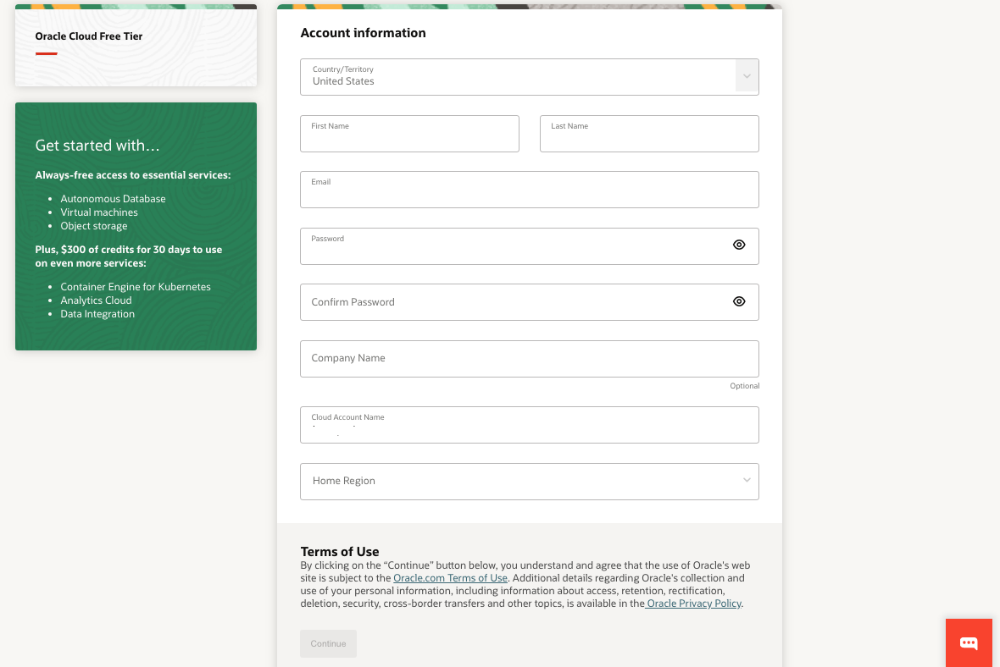
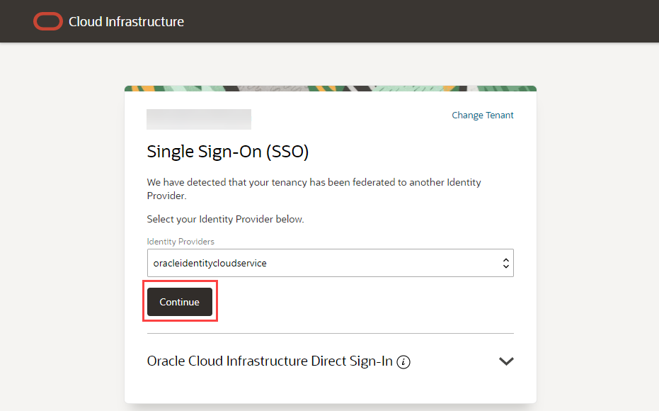
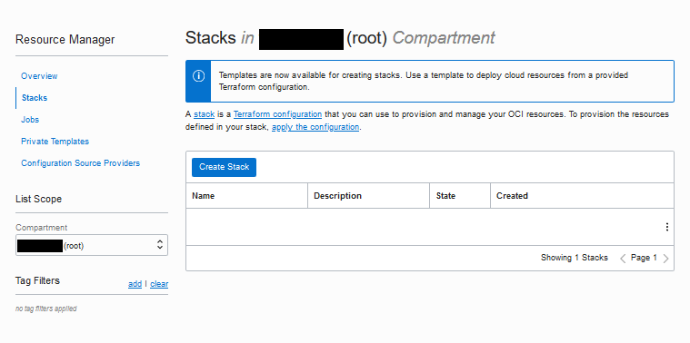
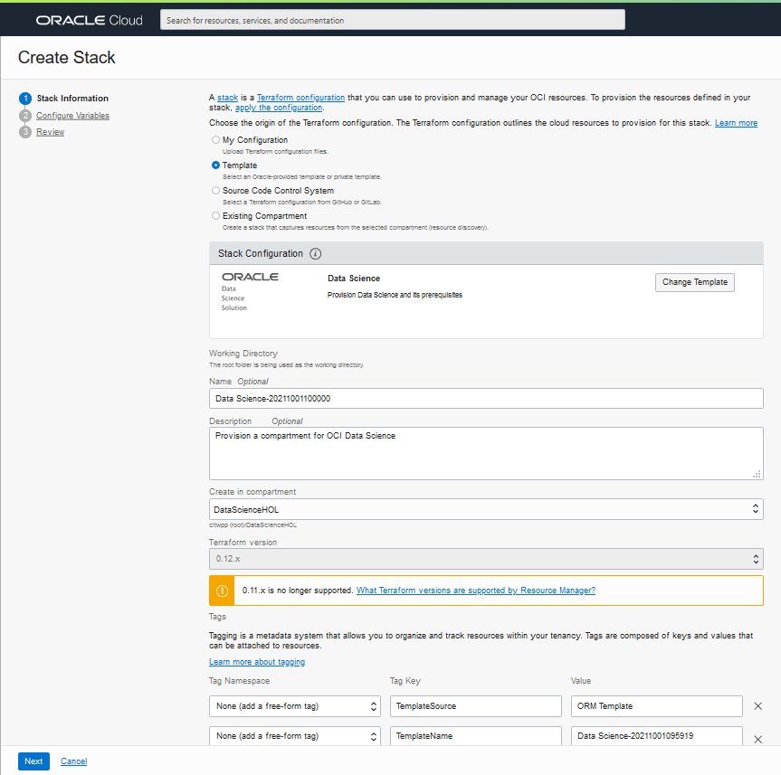
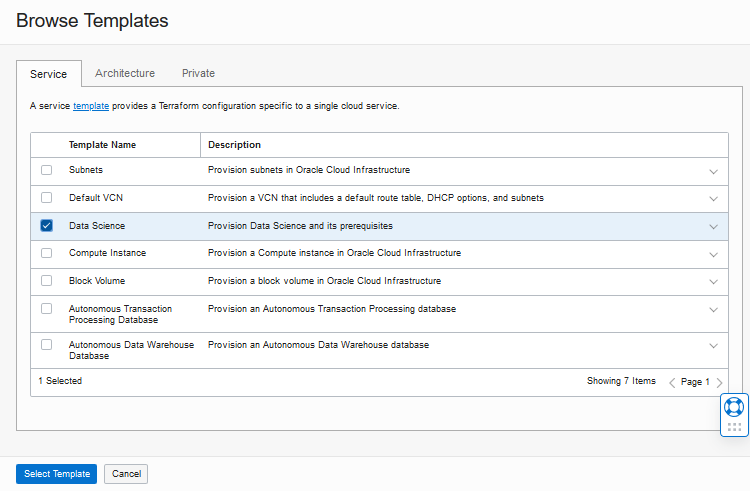
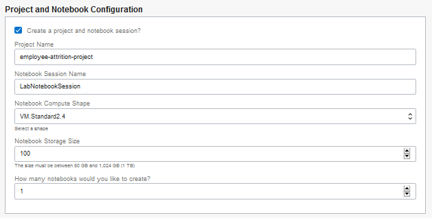
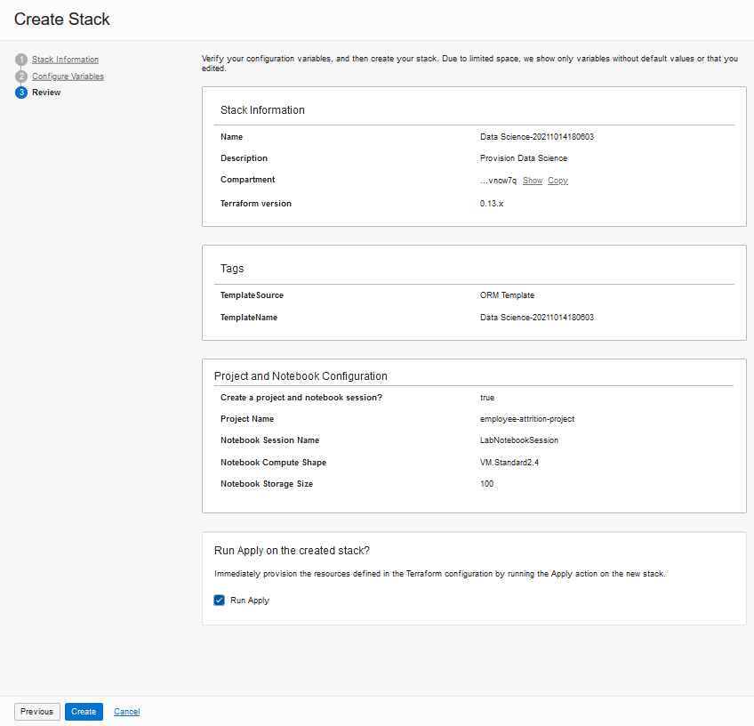

# Setup a tenancy for OCI Data Science

## Introduction
To do the Data Science lab, you will need an Oracle Cloud account. This procedure will guide you through the steps of getting an Oracle Cloud Free Tier account and signing in. Then you will prepare a new OCI tenancy to use OCI Data Science.

### Existing Cloud Accounts
If you already have access to an Oracle Cloud account, including an Oracle Cloud account using [Oracle Universal Credits](https://docs.oracle.com/en/cloud/get-started/subscriptions-cloud/csgsg/universal-credits.html), skip to **Task 2** to sign in to your cloud tenancy.

Estimated time: 20 minutes

### Objectives
* Sign-up for a free Oracle cloud account
* Configure networking
* Set access policies

### What you will need
* A valid email address (the same one you used for the DSGo conference)
* Ability to receive SMS text verification (only if your email isn't recognized)

## **TASK 1:** Create Your Free Trial Account
> **Note**: Interfaces in the following screenshots might look different from the interfaces you will see.

If you already have a cloud account with unused cloud credits, skip to **Task 2**.

1. Open up a web browser to access the Oracle Cloud account registration form at [signup.cloud.oracle.com](https://signup.cloud.oracle.com).

   You will be presented with a registration page.
    
1.  Enter the following information to create your Oracle Cloud Free Tier account.
    * Choose your **Country**
    * Enter your **Name** and **Email**.
    * Check the box to indicate you are human and complete the captcha

1. Once you have entered a valid email address, select the **Verify my email** button.

1. As a participant in this DSGo event, you are being offered an Oracle Cloud Trial with $500 in free cloud credits for 30 days. You will see a popup for this offer. Click the **Select Offer** button.

    

1. The Account information form appears. Enter the following information to create your Oracle Cloud Free Tier account.
    - Choose a **Password**. Remember what you entered. You'll need this later to sign in.
    - Enter your **Company Name**
    - Your **Cloud Account Name** will be generated automatically based on your inputs, but you can change that name by entering a new value. Remember what you entered. You'll need this name later to sign in.
    - Choose a **Home Region**. Your Home Region cannot be changed once you sign-up. **Important** - Select ***US East (Ashburn)***
    - Click **Continue**

    

1.  Enter your Address information.  Click **Continue**.

  

1. **Check the box** under Agreement then click **Start my free trial**.

  

  > **Note** - if you selected the offer for the free Cloud Trial above, you will not be asked for a payment verification method.

1. You will have to wait briefly (<1 minute) while your account is setup.

  

  > Note - After provisioning is complete, you may be asked for information about your role. You can choose to skip or provide your role.

1. Then you will be redirected to the OCI Console. We'll use the console in the next task.

1. You'll also receive an email from Oracle and it will list **important information** you will need in this workshop:
   - Cloud account
   - Username
   - Link (button) to access your account

1. You'll receive another email when provisioning is complete, but you don't need to wait for it.

## **TASK 2:** Sign in to Your Account
When you sign up for an Oracle Cloud account, a user is created for you in Oracle Identity Cloud Service with the username and password you selected at sign up. You can use this single sign-on option to sign in to Oracle Cloud Infrastructure and then navigate to other Oracle Cloud services without reauthenticating. This user has administrator privileges for all the Oracle Cloud services included with your account.

1. If you are already viewing the OCI console from the sign-in process, you can proceed to the next task. However, if you need to sign-in, continue with these steps.

1. Use the account access **link in your confirmation email** (this provides a shortcut to the sign-in for your account and region).  Enter your user name and password and click **Sign In**. Your username is your email address. The password is what you chose when you signed up for an account.

  

  Alternatively, go to [cloud.oracle.com](https://cloud.oracle.com) . Enter your **Cloud Account Name** and click **Next**. This is the name you chose while creating your account in the previous section. It's NOT your email address. If you've forgotten the name, see the confirmation email.
    
    - Click **Continue** to sign in using the *oraclecloudidentityservice*.

   

   - Enter your Cloud Account credentials and click **Sign In**. Your username is your email address. The password is what you chose when you signed up for an account.

     

1. You are now signed in to Oracle Cloud!

    

## **TASK 3:** Configure Compartment using a Stack
A stack is a blueprint for a collection of cloud resources that can be automatically provisioned using Terraform in the OCI console. OCI contains a stack template for Data Science that we will use to quickly configure the environment.

1. In the OCI console, use the three-bar icon in the upper left corner of the page to open the menu. Go to **Developer Services** and under *Resource Manager* select **Stacks**.

  

1. Select compartment **cloud account (root)**, then click **Create Stack**.

  

1. In the *Create Stack* dialog, select the **Template** radio button.

  

1. Click **Select Template**

1. In the *Browse Templates* dialog, on the *Service* tab, check **Data Science**, the click **Select Template**.

  

1. Back in the *Create Stack* dialog, change the **Description** to *Provision Data Science*.

  

1. Ensure **Compartment** is set to **root**

1. Click **Next**.

1. On the *Configure Variables* page, under **Project and Notebook Configuration**, check **Create a project and notebook session?**

  - Change the *Project Name* to **employee-attrition-project**
  - Change the *Notebook Session Name* to **LabNotebookSession**
  - Change *Notebook Compute Shape* to **VM.Standard2.4**
  - Change *Notebook Storage Size* to **100**
  - Leave *How many notebooks would you like to create?* at **1**
  - leave the other defaults, and click **Next**

    

1. On the Review page, check **Run Apply**, then click **Create**.

  

1. This starts a Resource Manager job that takes less than a minute to run. When the job is complete, the status will change from *Accepted* to *In Progress* to **Succeeded**.

  

This stack template configured the following resources in the **root** compartment:
* Virtual Cloud Network (VCN) named *Data Science VCN*
* Public and private subnets named *Data Science - Public* and *Data Science - Private*
* User group named *DataScienceGroup*
* Dynamic group named *DataScienceDynamicGroup*
* A set of policies named *DataSciencePolicies*
* A Data Science project named *employee-attrition-project*
* A Data Science notebook session named *LabNotebookSession*

You are now ready to begin the Data Science workshop. **You may proceed to the next lab.**
