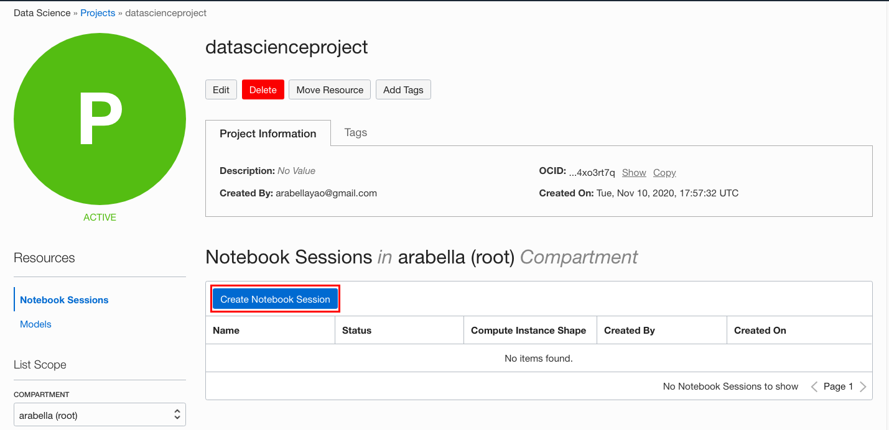

# Lab 2 - Create a Notebook Session

## Introduction

Data Science notebook sessions are interactive coding environments for building and training models. Notebook sessions provide access to a JupyterLab environment that is managed by the Data Science service.

A notebook session is associated with a compute instance, VCN, subnet, and block storage. To provide users control over how compute and storage are consumed, the compute shape and the amount of storage are selectable and a notebook session can be deactivated to stop compute usage and reactivated later. A notebook session can be terminated when it is no longer needed.

There are two block storage drives associated with a notebook session. There is a boot volume that is initialized each time the notebook session is activated. Any data on the boot volume is lost when the notebook session is deactivated or terminated. There is an additional block storage unit that is preserved when a notebook session is deactivated, but it is destroyed when a notebook session is terminated. This block volume is represented by the ``/home/datascience`` directory and it is where the JupyterLab notebooks, data files, installed custom software, and other files should be stored.

When a notebook session is created or activated, the compute instance, block storage, VCN, and subnet are provisioned and configured. These resources can be changed by deactivating a notebook session, then selecting different configuration when activating the notebook session again. The size of the block storage can only be increased.

Estimated Lab Time: 5 minutes

### Objectives
In this lab, you will:
* Use the OCI Console to create a Data Science notebook session

### Prerequisites

* You are signed-in to Oracle Cloud
* You have navigated to Data Science
* You have selected the *DataScienceHOL* compartment
* You have opened the project you created in Lab 1

## **STEP 1** Create a Notebook Session

1. Confirm you have completed all the prerequisites and are viewing your Data Science project.
  

1. Click **Create Notebook Session**.
  

1. The Create Notebook Session dialog opens. In the next steps, you will enter all the fields.
  

  - Select the **DataScienceHOL** for **Compartment**, to contain the notebook session.
  - Enter **LabNotebookSession** as the **Name** for the notebook session. (If you do not provide a name, a name is automatically generated for you.)
  - Click the **Select** button to select a VM shape. Select the **Intel SKYLAKE** radio button, check **VM.Standard2.4**, then click the **Select** button. The [Compute Shapes](https://docs.cloud.oracle.com/en-us/iaas/Content/Compute/References/computeshapes.htm) documentation page has more details on all OCI compute shapes.
  

  >**Note** - even though we are using CPUs in this lab, OCI Data Science also supports GPU shapes and it also provides Conda environments for GPUs and sample notebooks.

  - Enter the **Block Storage Size** of **100** GB.
  - Select the VCN configured in your tenancy -**Data Science VCN**
  - Select the private subnet configured in your tenancy - **Data Science - Private**. (Using a private subnet is generally recommended.)
  - Check **View detail page on clicking create**.
  - Click **Create**.

1. While the notebook session is being created, you will be taken to the detail page. The notebook session will take about 4-7 minutes to provision. When it is ready, the **Open** button will be enabled. Wait for the **Open** button to be enabled.
    

 You may [proceed to the next lab](#next).
